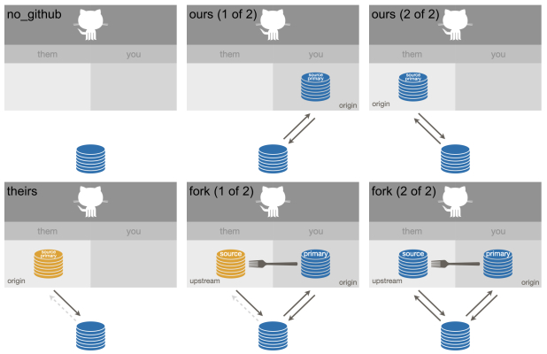

Technically, Git has no official concept of the default branch.
But in practice, most Git repos have an *effective default branch*.
If there's only one branch, this is it!
It is the branch that most bug fixes and features get merged in to.
It is the branch you see when you first visit a repo on a site such as GitHub.
On a Git remote, it is the branch that `HEAD` points to.
The default branch may not be precisely defined in Git itself, but most of us know it when we see it.

Historically, `master` has been the most common name for the default branch,
but `main` is an increasingly popular choice.
There is coordinated change across the Git ecosystem that is making it easier for users to make this switch, for example:

* [Regarding Git and Branch Naming](https://sfconservancy.org/news/2020/jun/23/gitbranchname/), statement from the Git project and the Software Freedom Conservancy regarding the new `init.defaultBranch` configuration option
* [Renaming the default branch from` master`](https://github.com/github/renaming#readme), GitHub's roadmap for supporting the shift away from `master`
* [The new Git default branch name](https://about.gitlab.com/blog/2021/03/10/new-git-default-branch-name/), same, but for GitLab

Folks at RStudio maintain hundreds of public repositories on GitHub, spread out over various organizations and user accounts.
Some individual repos had already moved away from `master` in the past year, but many of us had not made the change, just due to inertia.
We've decided it tackle this switch proactively and in bulk, for any interested individual or team, hopefully reducing the pain for everyone.

The purpose of this blog post is to:

* Give our community a heads-up about this change.
* Explain how this affects people who have cloned or forked our repositories.
* Explain how you can make the `master` to `main` switch in your own Git life.
* Advertise new functions in the usethis package that help with the above.

## TL;DR

These are the key bits of code shown below.

**NOTE: you will need to update to usethis 2.1.0 to get this functionality!**

| Function                                   | Purpose                                                                                                     |
|--------------------------------------------|---------------------------------------------------------------------------------------------------------|
| `usethis::git_default_branch()`            | Reveals the default branch of the current project.                                                      |
| `usethis::git_default_branch_rediscover()` | Helps a contributor detect when a project's default branch has changed and makes the necessary updates. |
| `usethis::git_default_branch_rename()`     | Helps a maintainer change the default branch in a repo they administer.                                 |
| `usethis::git_default_branch_configure()`  | Changes the default name of the initial branch in new Git repos, going forward.                         |  
Read on for more context.

## Which repositories are affected?

The transition from `master` to `main` is happening organization-wide for specific GitHub organizations (e.g. [tidyverse](https://github.com/tidyverse), [r-lib](https://github.com/r-lib), [tidymodels](https://github.com/tidymodels), and [sol-eng](https://github.com/sol-eng)).
However, several teams maintain repos across multiple organizations and several organizations host repos for multiple teams and purposes.
The organization-wide approach doesn't work well for these cases.
Therefore, several hundred additional "one-off" repos are also part of this effort.

In total, we're coordinating the `master` to `main` switch for around 350 repositories.

In each case, we opened a GitHub issue announcing the coming change, several weeks in advance.
These issues all look something like this: <https://github.com/tidyverse/dplyr/issues/6006>.

## When are things changing?

"Around now."

Ideally, we would publish this post at the very same moment we rename our branches.
But that's not possible for a variety of reasons, chiefly because no single person has the necessary permissions for all of the affected repos.

Is there a repo you care about, that has an open issue about branch renaming, and yet the change doesn't seem to be happening?
Feel free to give us a gentle nudge by commenting in the issue thread.

## usethis 2.1.0 has functions to help

The recently released 2.1.0 version of usethis has some new functions to support changes in the default branch.
To be clear, you don't _need_ usethis to adapt to change in the default branch.
On a small scale, the work can be done through some combination of command line Git and actions in a web browser, if that's how you roll.

But the new `git_default_branch*()` family of functions can make this process more pleasant, for those who enjoy using devtools/usethis, especially for Git and GitHub tasks.
These functions also help us do this work programmatically for hundreds of repositories at once.

You can install the newest version of usethis from CRAN with:

```{r, eval = FALSE}
install.packages("usethis")
```

You can make usethis available in your R session with either of these commands:

```{r setup}
library(usethis)

# or possibly even better:
library(devtools)
# devtools Depends on usethis, so attaching devtools also attaches usethis
```

If you'd like usethis to help with you with Git/GitHub, please read the article [Managing Git(Hub) Credentials](https://usethis.r-lib.org/articles/articles/git-credentials.html).

usethis is very opinionated and conservative about which GitHub setups it's willing to manage, because we don't want to barge in and mess with something we don't understand.
These standard setups and what we mean by, e.g., **source repo** are all described at <https://happygitwithr.com/common-remote-setups.html>.

```{r echo = FALSE, out.width = '100%', fig.cap = "Six common GitHub setups"}

```

## How to update your clones and forks

As mentioned above, our bulk renaming involves around 350 GitHub repos, which are associated with approximately 88K watchers, 34K forks, 9.5K open issues, and 1K open pull requests.
It's impossible to say how many non-fork clones are out there.
One thing that's clear: our branch renaming potentially affects lots of people.

### How will I know I have a problem?

Here's what it looks like when you try to pull from a remote repo in a project that used to use `master`, but now uses `main`, but you haven't updated your local repo yet.

* Example with `usethis::pr_merge_main()` **with usethis 2.1.0**:

    ```
    pr_merge_main()
    #> Error: Default branch mismatch between local repo and remote.
    #> The default branch of the "origin" remote is "main".
    #> But the default branch of the local repo appears to be "master".
    #> Call `git_default_branch_rediscover()` to resolve this.
    ```

* Example with command line `git pull` (which is what RStudio's blue "down" arrow does):

    ```
    Your configuration specifies to merge with the ref 'refs/heads/master'
    from the remote, but no such ref was fetched.
    ```

Both messages are telling you the same thing:

> We're trying to pull changes from the remote `master` branch, but the remote does not have a `master` branch.

You need to tell your local repo about the switch from `master` to `main`.

TODO: Say something about what this looks like with usethis < 2.1.0?

### Can I just burn it all down?

Yes, yes you can!

If there's nothing precious in your local clone of our repo or in your fork, it's perfectly reasonable to delete them and just start over.
Locally, you delete the folder corresponding to the repo.
On GitHub, in your fork, go to *Settings* and scroll down to the *Danger Zone* to *Delete this repository*.

Then you can do a fresh fork-and-clone of, for example, dplyr:

```{r eval = FALSE}
create_from_github("tidyverse/dplyr")
```

### How do I update my stuff to reflect the new default branch?

If you don't want to burn it all down, you can call `usethis::git_default_branch_rediscover()` to _rediscover_ the default branch from the **source repo**.

```{r eval = FALSE}
git_default_branch_rediscover()
#> ✓ Rediscovering the default branch from source repo.
#> ℹ GitHub remote configuration type: 'ours'
#> ℹ Read more about GitHub remote configurations at:
#>   'https://happygitwithr.com/common-remote-setups.html'
#> ℹ Source repo is 'jennybc/qwerty' and its current default branch is 'main'.
#> ✓ Local branch 'master' appears to play the role of the default branch.
#> ✓ Moving local 'master' branch to 'main'.
#> ✓ Setting remote tracking branch for local 'main' branch to 'origin/main'.
```

Above, you see usethis updating the local repository to match the source repo.
If we detect that you also have a fork of this repo, usethis will rename its default branch as well.

GitHub provides official instructions for [updating a local clone after a branch name changes](https://docs.github.com/en/github/administering-a-repository/managing-branches-in-your-repository/renaming-a-branch#updating-a-local-clone-after-a-branch-name-changes), using only command line Git:

```{sh, eval = FALSE}
git branch -m OLD-BRANCH-NAME NEW-BRANCH-NAME
git fetch origin
git branch -u origin/NEW-BRANCH-NAME NEW-BRANCH-NAME
git remote set-head origin -a
```

Depending on your setup, above you might need to substitute `upstream` for `origin`.
`OLD-BRANCH-NAME` is probably `master` and `NEW-BRANCH-NAME` is probably `main`.

## How to rename default branch in your own existing repos

You can rename the default branch for repos that you effectively own.
This is a straightforward task for a repo that only exists on your computer. [^1]
We're more concerned about the trickier case where the project is also on GitHub.

[^1]: `usethis::git_default_branch_rename()` **does** handle the special case of `"no_github"`. Internally, it calls `gert::git_branch_move()`. With command line Git, use `git branch -m OLD-BRANCH-NAME NEW-BRANCH-NAME`.

You can call `usethis::git_default_branch_rename()` to _rename_ (or move) the default branch in the **source repo**.
For this to work, you must either own the source repo personally or, if it's organization-owned, you must have `admin` permission.
This is a higher level of permission than `write`, which is what's needed to push.
`git_default_branch_rename()` checks this pre-requisite and exits early, without doing anything, if you are not going to be successful.

```{r, eval = FALSE}
git_default_branch_rename()
#> ✓ Renaming (a.k.a. "moving") the default branch for 'qwerty'.
#> ℹ GitHub remote configuration type: 'ours'
#> ℹ Read more about GitHub remote configurations at:
#>   'https://happygitwithr.com/common-remote-setups.html'
#> ℹ Source repo is 'jennybc/qwerty' and its current default branch is 'master'.
#> ✓ Local branch 'master' appears to play the role of the default branch.
#> ✓ Renaming 'master' branch to 'main' in the source repo 'jennybc/qwerty'.
#> • Be sure to update files that refer to the default branch by name.
#>   Consider searching within your project for 'master'.
#>   We might call out some obvious candidates below.
#> x Some badges may refer to the old default branch 'master':
#>   - 'README.md'
#> ✓ Rediscovering the default branch from source repo.
#> ℹ Source repo is 'jennybc/qwerty' and its current default branch is 'main'.
#> ✓ Moving local 'master' branch to 'main'.
#> ✓ Setting remote tracking branch for local 'main' branch to 'origin/main'.
```

Once the default branch is successfully renamed in the source repo on GitHub, `git_default_branch_rename()` makes an internal call to `git_default_branch_rediscover()` to finish the job.
This makes any necessary local changes or, more rarely, changes in a personal fork.

Note also that we check for specific files that often include the name of the default branch, such as GitHub Actions workflows and the badges section of README.
These references should be updated.
It's probably a good idea to do a project-wide search for both the old and the new name and take a hard look at the "hits".

If you don't want to use usethis, you can rename the default branch from a web browser.
On GitHub, in your repo, go to *Settings*, then *Branches*, and edit the *Default branch*.
Then follow the command line instructions from the previous section, emulating what we do in `git_default_branch_rename()`.

## How to change the default name of your default branch, for the future

The way most repos end up with `master` as their default branch is that Git itself defaults to `master` when it creates the very first branch, with the very first commit, in a new repo.
As of Git 2.28 (released 2020-07-27), this became configurable, so it's one of those things you can customize in your global, i.e. user-level, Git config file.
usethis does all of its Git work via the [gert package](https://docs.ropensci.org/gert/) and the underlying library libgit2 library gained similar support in version 1.1 (released 2020-10-12).

The new configuration option is `init.defaultBranch`.

There are various ways to set your preferred initial branch name to, e.g., `main`:

* With usethis 2.1.0, using a special-purpose function:
    ```{r eval = FALSE}
    git_default_branch_configure()
    #> ✓ Configuring init.defaultBranch as 'main'.
    #> ℹ Remember: this only affects repos you create in the future.
    ```
* With usethis, using the general function to modify your Git configuration:
    ```{r eval = FALSE}
    use_git_config(init.defaultBranch = "main")
    ```
* With command line Git:
    ```{sh eval = FALSE}
    git config --global init.defaultBranch main
    ```

Although it is more rare to first create repos on a host like GitHub or GitLab, this certainly comes up from time to time.
All the major providers now support configuration of the initial branch name and, in the absence of user or organization preferences, all default to `main`.

## Acknowledgements

Thanks to Jeroen Ooms ([&#x0040;jeroen](https://github.com/jeroen)), maintainer of gert, for adding `gert::git_branch_move()`. And thanks to everyone at RStudio helping with this effort, especially the champions from other teams: Barret Schloerke ([&#x0040;schloerke](https://github.com/schloerke), Shiny), Ian Flores Siaca ([&#x0040;ian-flores](https://github.com/ian-flores), Solutions Engineering), Julia Silge ([&#x0040;juliasilge](https://github.com/juliasilge), tidymodels), Mine Çetinkaya-Rundel ([&#x0040;mine-cetinkaya-rundel](https://github.com/mine-cetinkaya-rundel), Education), Sigrid Keydana ([&#x0040;skeydan](https://github.com/skeydan), Machine Learning), Alison Presmanes Hill ([&#x0040;apreshill](https://github.com/apreshill), Data Science Communication).
