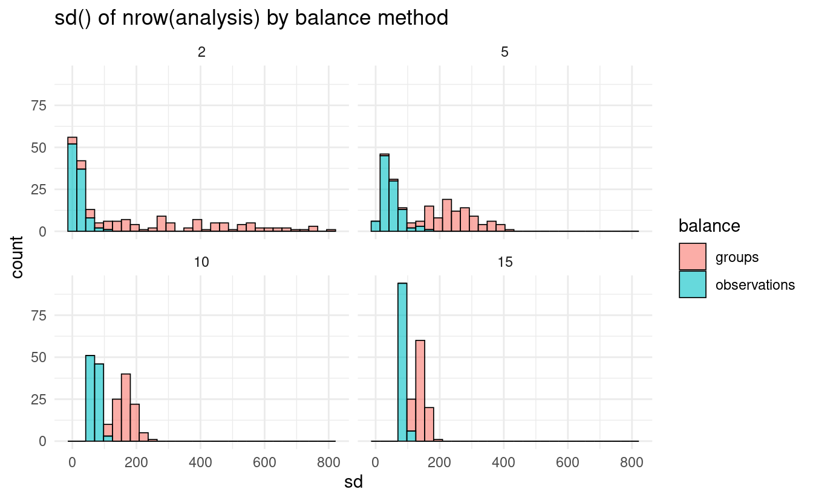

<!--
TODO:
* [x] Look over / edit the post's title in the yaml
* [x] Edit (or delete) the description; note this appears in the Twitter card
* [x] Pick category and tags (see existing with [`hugodown::tidy_show_meta()`](https://rdrr.io/pkg/hugodown/man/use_tidy_post.html))
* [x] Find photo & update yaml metadata
* [x] Create `thumbnail-sq.jpg`; height and width should be equal
* [x] Create `thumbnail-wd.jpg`; width should be >5x height
* [x] [`hugodown::use_tidy_thumbnails()`](https://rdrr.io/pkg/hugodown/man/use_tidy_post.html)
* [x] Add intro sentence, e.g. the standard tagline for the package
* [x] [`usethis::use_tidy_thanks()`](https://usethis.r-lib.org/reference/use_tidy_thanks.html)
-->

We're downright exhilarated to announce the release of [rsample](https://rsample.tidymodels.org/) 1.1.0. The rsample package makes it easy to create resamples for estimating distributions and assessing model performance.

You can install it from CRAN with:

<pre class='chroma'><code class='language-r' data-lang='r'><a href='https://rdrr.io/r/utils/install.packages.html'>install.packages</a>("rsample")</code></pre>

This blog post will walk through some of the highlights from this newest release. You can see a full list of changes in the [release notes](https://rsample.tidymodels.org/news/index.html#rsample-110).

## Grouped Resampling

By far and away the biggest addition in this version of rsample is the set of new functions for grouped resampling. Grouped resampling is a form of resampling where observations need to be assigned to the analysis or assessment sets as a "group", not split between the two. This is a common need when some of your data is more closely related than would be expected under random chance: for instance, when taking multiple measurements of a single patient over time, or when your data is geographically clustered into distinct "locations" like different neighborhoods.

The rsample package has supported grouped v-fold cross-validation for a few years, through the [`group_vfold_cv()`](https://rsample.tidymodels.org/reference/group_vfold_cv.html) function:

<pre class='chroma'><code class='language-r' data-lang='r'><a href='https://rdrr.io/r/base/library.html'>library</a>(<a href='http://purrr.tidyverse.org'>purrr</a>)
<a href='https://rdrr.io/r/base/library.html'>library</a>(<a href='https://rsample.tidymodels.org'>rsample</a>)
<a href='https://rdrr.io/r/utils/data.html'>data</a>(ames, package = "modeldata")

resample &lt;- <a href='https://rsample.tidymodels.org/reference/group_vfold_cv.html'>group_vfold_cv</a>(ames, group = Neighborhood, v = 2)

resample$splits %&gt;%
  <a href='https://purrr.tidyverse.org/reference/map.html'>map_lgl</a>(function(x) &#123;
    <a href='https://rdrr.io/r/base/any.html'>any</a>(<a href='https://rsample.tidymodels.org/reference/as.data.frame.rsplit.html'>assessment</a>(x)$Neighborhood %in% <a href='https://rsample.tidymodels.org/reference/as.data.frame.rsplit.html'>analysis</a>(x)$Neighborhood)
  &#125;
)
#&gt; [1] FALSE FALSE</code></pre>

rsample 1.1.0 extends this support by adding four new functions for grouped resampling. The new functions [`group_bootstraps()`](https://rsample.tidymodels.org/reference/group_bootstraps.html), [`group_mc_cv()`](https://rsample.tidymodels.org/reference/group_mc_cv.html), [`group_validation_split()`](https://rsample.tidymodels.org/reference/validation_split.html), and [`group_initial_split()`](https://rsample.tidymodels.org/reference/initial_split.html) all work like their ungrouped versions, but let you specify a grouping column to make sure related observations are all assigned to the same sets:

<pre class='chroma'><code class='language-r' data-lang='r'># Bootstrap resampling with replacement:
<a href='https://rsample.tidymodels.org/reference/group_bootstraps.html'>group_bootstraps</a>(ames, Neighborhood, times = 1)
#&gt; # Group bootstrap sampling 
#&gt; # A tibble: 1 × 2
#&gt;   splits              id        
#&gt;   &lt;list&gt;              &lt;chr&gt;     
#&gt; 1 &lt;split [3045/1151]&gt; Bootstrap1

# Random resampling without replacement:
<a href='https://rsample.tidymodels.org/reference/group_mc_cv.html'>group_mc_cv</a>(ames, Neighborhood, times = 1)
#&gt; # Group Monte Carlo cross-validation (0.75/0.25) with 1 resamples  
#&gt; # A tibble: 1 × 2
#&gt;   splits             id       
#&gt;   &lt;list&gt;             &lt;chr&gt;    
#&gt; 1 &lt;split [2205/725]&gt; Resample1

# Data splitting to create a validation set:
<a href='https://rsample.tidymodels.org/reference/validation_split.html'>group_validation_split</a>(ames, Neighborhood)
#&gt; # Group Validation Set Split (0.75/0.25)  
#&gt; # A tibble: 1 × 2
#&gt;   splits             id        
#&gt;   &lt;list&gt;             &lt;chr&gt;     
#&gt; 1 &lt;split [2188/742]&gt; validation

# Data splitting to create an initial training/testing split:
<a href='https://rsample.tidymodels.org/reference/initial_split.html'>group_initial_split</a>(ames, Neighborhood)
#&gt; &lt;Training/Testing/Total&gt;
#&gt; &lt;2218/712/2930&gt;</code></pre>

These functions all target assigning a certain proportion of your data to the assessment fold. Hitting that target can be tricky when your groups aren't all the same size, however. To work around this, these new functions create a list of all the groups in your data, randomly reshuffle it, and then select the first *n* groups in the list that results in splitting the data as close to that proportion as possible. The net effect of this on users is that your analysis and assessment folds won't always be precisely the size you're targeting (particularly if you have a few large groups), but all data in a single group will always be entirely assigned to the same set and the splits will be entirely randomly created.

The other big change to grouped resampling comes as a new argument to [`group_vfold_cv()`](https://rsample.tidymodels.org/reference/group_vfold_cv.html). By default, [`group_vfold_cv()`](https://rsample.tidymodels.org/reference/group_vfold_cv.html) assigns roughly the same number of groups to each of your folds, so you wind up with the same number of patients, or neighborhoods, or whatever else you're grouping by in each assessment set. The new `balance` argument lets you instead assign roughly the same number of rows to each fold instead, if you set `balance = observations`:

<pre class='chroma'><code class='language-r' data-lang='r'><a href='https://rsample.tidymodels.org/reference/group_vfold_cv.html'>group_vfold_cv</a>(ames, Neighborhood, balance = "observations")
#&gt; # Group 28-fold cross-validation 
#&gt; # A tibble: 28 × 2
#&gt;    splits             id        
#&gt;    &lt;list&gt;             &lt;chr&gt;     
#&gt;  1 &lt;split [2663/267]&gt; Resample01
#&gt;  2 &lt;split [2859/71]&gt;  Resample02
#&gt;  3 &lt;split [2882/48]&gt;  Resample03
#&gt;  4 &lt;split [2487/443]&gt; Resample04
#&gt;  5 &lt;split [2902/28]&gt;  Resample05
#&gt;  6 &lt;split [2928/2]&gt;   Resample06
#&gt;  7 &lt;split [2837/93]&gt;  Resample07
#&gt;  8 &lt;split [2691/239]&gt; Resample08
#&gt;  9 &lt;split [2748/182]&gt; Resample09
#&gt; 10 &lt;split [2799/131]&gt; Resample10
#&gt; # … with 18 more rows
#&gt; # ℹ Use `print(n = ...)` to see more rows</code></pre>

This approach works in a similar way to the new grouped resampling functions, attempting to assign roughly `1 / v` of your data to each fold. When working with unbalanced groups, this can result in much more even assignments of data to each fold:

<pre class='chroma'><code class='language-r' data-lang='r'><a href='https://rdrr.io/r/base/library.html'>library</a>(<a href='https://ggplot2.tidyverse.org'>ggplot2</a>)
<a href='https://rdrr.io/r/base/library.html'>library</a>(<a href='https://dplyr.tidyverse.org'>dplyr</a>)

analysis_sd &lt;- function(v, balance) &#123;
  <a href='https://rsample.tidymodels.org/reference/group_vfold_cv.html'>group_vfold_cv</a>(
    ames, 
    Neighborhood, 
    v, 
    balance = balance
  )$splits %&gt;% 
    purrr::<a href='https://purrr.tidyverse.org/reference/map.html'>map_dbl</a>(~ <a href='https://rdrr.io/r/base/nrow.html'>nrow</a>(<a href='https://rsample.tidymodels.org/reference/as.data.frame.rsplit.html'>analysis</a>(.x))) %&gt;% 
    <a href='https://rdrr.io/r/stats/sd.html'>sd</a>()
&#125;

resample &lt;- tidyr::<a href='https://tidyr.tidyverse.org/reference/expand.html'>crossing</a>(
  idx = <a href='https://rdrr.io/r/base/seq.html'>seq_len</a>(100),
  v = <a href='https://rdrr.io/r/base/c.html'>c</a>(2, 5, 10, 15),
  balance = <a href='https://rdrr.io/r/base/c.html'>c</a>("groups", "observations")
)

resample %&gt;%
  <a href='https://dplyr.tidyverse.org/reference/mutate.html'>mutate</a>(sd = purrr::<a href='https://purrr.tidyverse.org/reference/map2.html'>pmap_dbl</a>(
    <a href='https://rdrr.io/r/base/list.html'>list</a>(v, balance),
    analysis_sd
  )) %&gt;%
  <a href='https://ggplot2.tidyverse.org/reference/ggplot.html'>ggplot</a>(<a href='https://ggplot2.tidyverse.org/reference/aes.html'>aes</a>(sd, fill = balance)) + 
  <a href='https://ggplot2.tidyverse.org/reference/geom_histogram.html'>geom_histogram</a>(alpha = 0.6, color = "black", size = 0.3) + 
  <a href='https://ggplot2.tidyverse.org/reference/facet_wrap.html'>facet_wrap</a>(~ v) + 
  <a href='https://ggplot2.tidyverse.org/reference/ggtheme.html'>theme_minimal</a>() + 
  <a href='https://ggplot2.tidyverse.org/reference/labs.html'>labs</a>(title = "sd() of nrow(analysis) by balance method")
</code></pre>

Right now, these grouping functions don't support stratification. If you have thoughts on how you'd expect stratification to work with grouping, or have an example of how another implementation has handled it, [let us know on GitHub](https://github.com/tidymodels/rsample/issues/317)!

## Other improvements

This release also adds a few new utility functions to make it easier to work with the rsets produced by rsample functions.

For instance, the new [`reshuffle_rset()`](https://rsample.tidymodels.org/reference/reshuffle_rset.html) will re-generate an rset, using the same arguments as were used to originally create it, but with the current random seed:

<pre class='chroma'><code class='language-r' data-lang='r'><a href='https://rdrr.io/r/base/Random.html'>set.seed</a>(123)
resample &lt;- <a href='https://rsample.tidymodels.org/reference/vfold_cv.html'>vfold_cv</a>(mtcars)

resample$splits[[1]] %&gt;%
  <a href='https://rsample.tidymodels.org/reference/as.data.frame.rsplit.html'>analysis</a>() %&gt;%
  <a href='https://rdrr.io/r/utils/head.html'>head</a>()
#&gt;                    mpg cyl disp  hp drat    wt  qsec vs am gear carb
#&gt; Mazda RX4 Wag     21.0   6  160 110 3.90 2.875 17.02  0  1    4    4
#&gt; Datsun 710        22.8   4  108  93 3.85 2.320 18.61  1  1    4    1
#&gt; Hornet 4 Drive    21.4   6  258 110 3.08 3.215 19.44  1  0    3    1
#&gt; Hornet Sportabout 18.7   8  360 175 3.15 3.440 17.02  0  0    3    2
#&gt; Valiant           18.1   6  225 105 2.76 3.460 20.22  1  0    3    1
#&gt; Duster 360        14.3   8  360 245 3.21 3.570 15.84  0  0    3    4

resample &lt;- <a href='https://rsample.tidymodels.org/reference/reshuffle_rset.html'>reshuffle_rset</a>(resample)

resample$splits[[1]] %&gt;%
  <a href='https://rsample.tidymodels.org/reference/as.data.frame.rsplit.html'>analysis</a>() %&gt;%
  <a href='https://rdrr.io/r/utils/head.html'>head</a>()
#&gt;                    mpg cyl disp  hp drat    wt  qsec vs am gear carb
#&gt; Mazda RX4         21.0   6  160 110 3.90 2.620 16.46  0  1    4    4
#&gt; Mazda RX4 Wag     21.0   6  160 110 3.90 2.875 17.02  0  1    4    4
#&gt; Datsun 710        22.8   4  108  93 3.85 2.320 18.61  1  1    4    1
#&gt; Hornet 4 Drive    21.4   6  258 110 3.08 3.215 19.44  1  0    3    1
#&gt; Hornet Sportabout 18.7   8  360 175 3.15 3.440 17.02  0  0    3    2
#&gt; Duster 360        14.3   8  360 245 3.21 3.570 15.84  0  0    3    4</code></pre>

This works with repeated cross-validation, stratification, grouping -- anything you did originally should be preserved when reshuffling the rset.

Additionally, the new [`reverse_splits()`](https://rsample.tidymodels.org/reference/reverse_splits.html) function will "swap" the assessment and analysis folds of any rsplit or rset object:

<pre class='chroma'><code class='language-r' data-lang='r'>resample &lt;- <a href='https://rsample.tidymodels.org/reference/initial_split.html'>initial_split</a>(mtcars)
resample
#&gt; &lt;Training/Testing/Total&gt;
#&gt; &lt;24/8/32&gt;

<a href='https://rsample.tidymodels.org/reference/reverse_splits.html'>reverse_splits</a>(resample)
#&gt; &lt;Training/Testing/Total&gt;
#&gt; &lt;8/24/32&gt;</code></pre>

This is just scratching the surface of the new features and improvements in this release of rsample! You can see a full list of changes in the the [release notes](https://rsample.tidymodels.org/news/index.html#rsample-110).

## Acknowledgements

We'd like to thank everyone that has contributed since the last release: [@DavisVaughan](https://github.com/DavisVaughan), [@juliasilge](https://github.com/juliasilge), [@mattwarkentin](https://github.com/mattwarkentin), [@mikemahoney218](https://github.com/mikemahoney218), and [@sametsoekel](https://github.com/sametsoekel).

