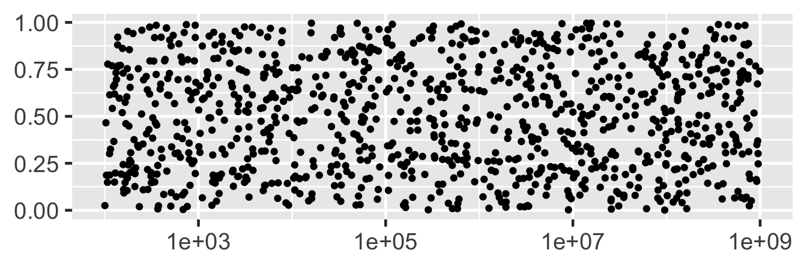
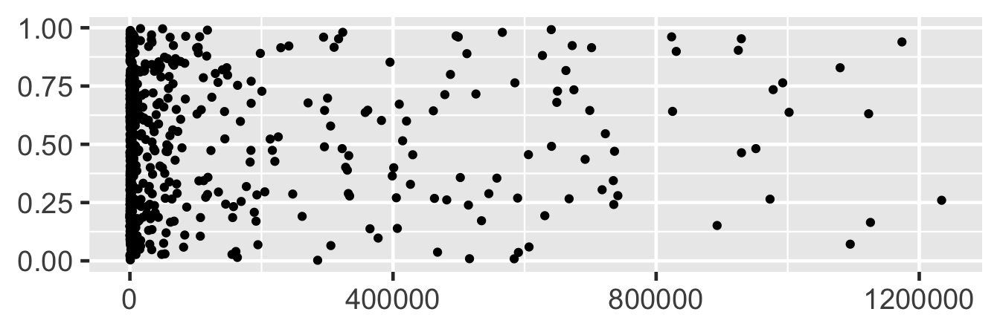
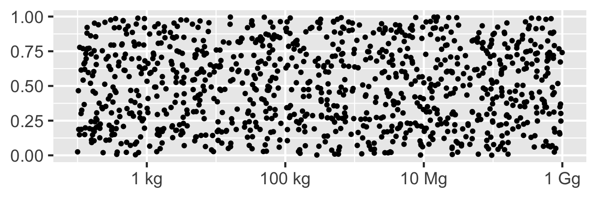
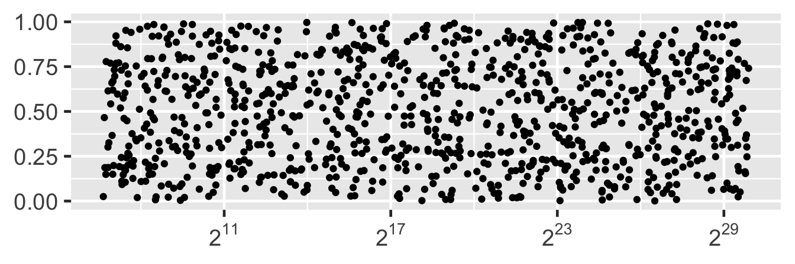
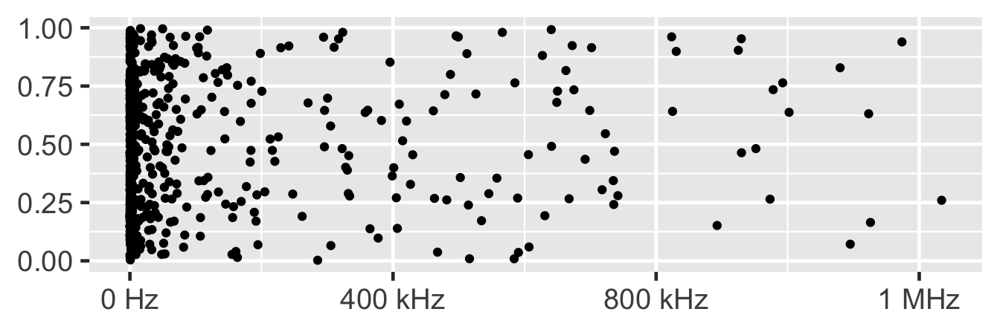
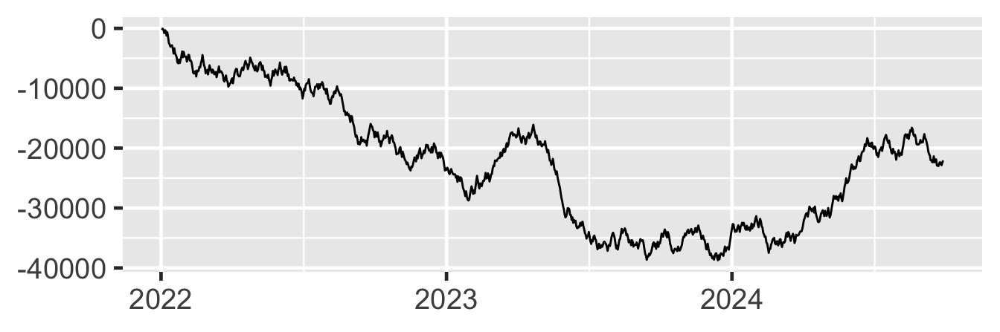
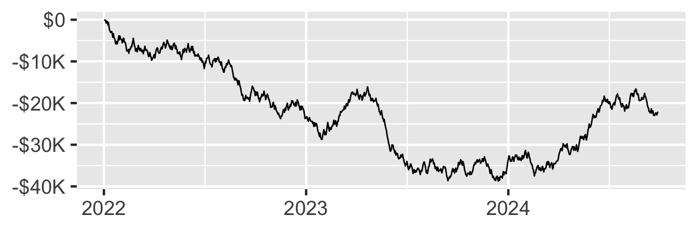
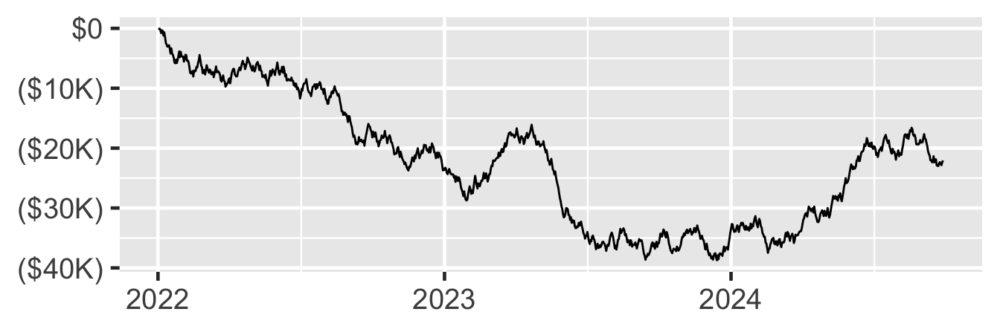

<!--
TODO:
* [x] Look over / edit the post's title in the yaml
* [x] Edit (or delete) the description; note this appears in the Twitter card
* [x] Pick category and tags (see existing with [`hugodown::tidy_show_meta()`](https://rdrr.io/pkg/hugodown/man/use_tidy_post.html))
* [x] Find photo & update yaml metadata
* [x] Create `thumbnail-sq.jpg`; height and width should be equal
* [x] Create `thumbnail-wd.jpg`; width should be >5x height
* [x] [`hugodown::use_tidy_thumbnails()`](https://rdrr.io/pkg/hugodown/man/use_tidy_post.html)
* [x] Add intro sentence, e.g. the standard tagline for the package
* [x] [`usethis::use_tidy_thanks()`](https://usethis.r-lib.org/reference/use_tidy_thanks.html)
-->

We're very pleased to announce the release of [scales](https://scales.r-lib.org) 1.2.0. The scales package provides much of the infrastructure that underlies ggplot2's scales, and using it allow you to customize the transformations, breaks, and labels used by ggplot2. You can install it from CRAN with:

<pre class='chroma'><code class='language-r' data-lang='r'><a href='https://rdrr.io/r/utils/install.packages.html'>install.packages</a>("scales")</code></pre>

This blog post will show off a few new features for labeling numbers, log scales, and currencies. You can see a full list of changes in the [release notes](https://github.com/r-lib/scales/blob/main/NEWS.md).

<pre class='chroma'><code class='language-r' data-lang='r'><a href='https://rdrr.io/r/base/library.html'>library</a>(<a href='https://ggplot2.tidyverse.org'>ggplot2</a>)
<a href='https://rdrr.io/r/base/library.html'>library</a>(<a href='https://scales.r-lib.org'>scales</a>)</code></pre>

## Numbers

[`label_number()`](https://scales.r-lib.org/reference/label_number.html) is the workhorse that powers ggplot2's formatting of numbers, including [`label_dollar()`](https://scales.r-lib.org/reference/label_dollar.html) and [`label_comma()`](https://scales.r-lib.org/reference/label_number.html). This release added a number of useful new features.

The most important is a new `scale_cut` argument that makes it possible to independently scales different parts of the range. This is useful for scales which span multiple orders of magnitude. Take the following two examples which don't get great labels by default:

<pre class='chroma'><code class='language-r' data-lang='r'>df1 &lt;- <a href='https://rdrr.io/r/base/data.frame.html'>data.frame</a>(
  x = 10 ^ <a href='https://rdrr.io/r/stats/Uniform.html'>runif</a>(1000, 2, 9),
  y = <a href='https://rdrr.io/r/stats/Uniform.html'>runif</a>(1000)
)
df2 &lt;- df1 |&gt; dplyr::<a href='https://dplyr.tidyverse.org/reference/filter.html'>filter</a>(x &lt;= 1.25 * 10^6)

plot1 &lt;- <a href='https://ggplot2.tidyverse.org/reference/ggplot.html'>ggplot</a>(df1, <a href='https://ggplot2.tidyverse.org/reference/aes.html'>aes</a>(x, y)) + 
  <a href='https://ggplot2.tidyverse.org/reference/geom_point.html'>geom_point</a>() +
  <a href='https://ggplot2.tidyverse.org/reference/labs.html'>labs</a>(x = NULL, y = NULL)
plot1 + <a href='https://ggplot2.tidyverse.org/reference/scale_continuous.html'>scale_x_log10</a>()
</code></pre>

<pre class='chroma'><code class='language-r' data-lang='r'>plot2 &lt;- <a href='https://ggplot2.tidyverse.org/reference/ggplot.html'>ggplot</a>(df2, <a href='https://ggplot2.tidyverse.org/reference/aes.html'>aes</a>(x, y)) + 
  <a href='https://ggplot2.tidyverse.org/reference/geom_point.html'>geom_point</a>()+
  <a href='https://ggplot2.tidyverse.org/reference/labs.html'>labs</a>(x = NULL, y = NULL)
plot2
</code></pre>

You can use [`cut_short_scale()`](https://scales.r-lib.org/reference/number.html) to show thousands with a K suffix, millions with a M suffix, and billions with a B suffix:

<pre class='chroma'><code class='language-r' data-lang='r'>plot1 +
  <a href='https://ggplot2.tidyverse.org/reference/scale_continuous.html'>scale_x_log10</a>(
    labels = <a href='https://scales.r-lib.org/reference/label_number.html'>label_number</a>(scale_cut = <a href='https://scales.r-lib.org/reference/number.html'>cut_short_scale</a>())
  )
</code></pre>

<pre class='chroma'><code class='language-r' data-lang='r'>plot2 +
  <a href='https://ggplot2.tidyverse.org/reference/scale_continuous.html'>scale_x_continuous</a>(
    labels = <a href='https://scales.r-lib.org/reference/label_number.html'>label_number</a>(scale_cut = <a href='https://scales.r-lib.org/reference/number.html'>cut_short_scale</a>())
  )
</code></pre>

(If your country uses 1 billion to mean 1 million million, then you can use [`cut_long_scale()`](https://scales.r-lib.org/reference/number.html) instead of [`cut_short_scale()`](https://scales.r-lib.org/reference/number.html).)

You can use [`cut_si()`](https://scales.r-lib.org/reference/number.html) for SI labels:

<pre class='chroma'><code class='language-r' data-lang='r'>plot1 + 
  <a href='https://ggplot2.tidyverse.org/reference/scale_continuous.html'>scale_x_log10</a>(
    labels = <a href='https://scales.r-lib.org/reference/label_number.html'>label_number</a>(scale_cut = <a href='https://scales.r-lib.org/reference/number.html'>cut_si</a>("g"))
  )
</code></pre>

<pre class='chroma'><code class='language-r' data-lang='r'>plot2 + 
  <a href='https://ggplot2.tidyverse.org/reference/scale_continuous.html'>scale_x_continuous</a>(
    labels = <a href='https://scales.r-lib.org/reference/label_number.html'>label_number</a>(scale_cut = <a href='https://scales.r-lib.org/reference/number.html'>cut_si</a>("Hz"))
  )
</code></pre>

This replaces [`label_number_si()`](https://scales.r-lib.org/reference/label_number_si.html) because it incorrectly used the [short-scale abbreviations](https://en.wikipedia.org/wiki/Long_and_short_scales) instead of the correct [SI prefixes](https://en.wikipedia.org/wiki/Metric_prefix).

## Log labels

Another way to label logs scales, thanks to [David C Hall](https://github.com/davidchall), you can now use `scales::label_log()` to display

<pre class='chroma'><code class='language-r' data-lang='r'>plot1 +
  <a href='https://ggplot2.tidyverse.org/reference/scale_continuous.html'>scale_x_log10</a>(
    labels = scales::<a href='https://scales.r-lib.org/reference/label_log.html'>label_log</a>()
  )
</code></pre>

You can use the `base` argument if you need a different base for the a logarithm:

<pre class='chroma'><code class='language-r' data-lang='r'>plot1 + 
  <a href='https://ggplot2.tidyverse.org/reference/scale_continuous.html'>scale_x_continuous</a>(
    trans = scales::<a href='https://scales.r-lib.org/reference/log_trans.html'>log_trans</a>(2), 
    labels = scales::<a href='https://scales.r-lib.org/reference/label_log.html'>label_log</a>(2)
  )
</code></pre>

## Currency

Finally, [`label_dollar()`](https://scales.r-lib.org/reference/label_dollar.html) recieves a couple of small improvements. The `prefix` is now placed before the negative sign, rather than before it, yielding (e.g) the correct `-$1` instead of `$-1`:

<pre class='chroma'><code class='language-r' data-lang='r'>df3 &lt;- <a href='https://rdrr.io/r/base/data.frame.html'>data.frame</a>(
  date = <a href='https://rdrr.io/r/base/as.Date.html'>as.Date</a>("2022-01-01") + 1:1e3,
  balance = <a href='https://rdrr.io/r/base/cumsum.html'>cumsum</a>(<a href='https://rdrr.io/r/stats/Uniform.html'>runif</a>(1e3, -1e3, 1e3))
)

plot3 &lt;- <a href='https://ggplot2.tidyverse.org/reference/ggplot.html'>ggplot</a>(df3, <a href='https://ggplot2.tidyverse.org/reference/aes.html'>aes</a>(date, balance)) + 
  <a href='https://ggplot2.tidyverse.org/reference/geom_path.html'>geom_line</a>() +
  <a href='https://ggplot2.tidyverse.org/reference/labs.html'>labs</a>(x = NULL, y = NULL)
plot3
</code></pre>

<pre class='chroma'><code class='language-r' data-lang='r'>plot3 + 
  <a href='https://ggplot2.tidyverse.org/reference/scale_continuous.html'>scale_y_continuous</a>(
    labels = <a href='https://scales.r-lib.org/reference/label_dollar.html'>label_dollar</a>(scale_cut = <a href='https://scales.r-lib.org/reference/number.html'>cut_short_scale</a>())
  )
</code></pre>

It also no longer uses its own `negative_parens` argument, but instead inherits the new `style_negative` argument from [`label_number()`](https://scales.r-lib.org/reference/label_number.html):

<pre class='chroma'><code class='language-r' data-lang='r'>plot3 + 
  <a href='https://ggplot2.tidyverse.org/reference/scale_continuous.html'>scale_y_continuous</a>(
    labels = <a href='https://scales.r-lib.org/reference/label_dollar.html'>label_dollar</a>(
      scale_cut = <a href='https://scales.r-lib.org/reference/number.html'>cut_short_scale</a>(), 
      style_negative = "parens"
    )
  )
</code></pre>

## Acknowledgements

A big thanks goes to [David C Hall](https://github.com/davidchall), who contributed to the majority of new features in this version. 40 others contributed by asking questions, identifying bugs, and suggesting patches: [@aalucaci](https://github.com/aalucaci), [@adamkemberling](https://github.com/adamkemberling), [@akonkel-aek](https://github.com/akonkel-aek), [@billdenney](https://github.com/billdenney), [@brunocarlin](https://github.com/brunocarlin), [@campbead](https://github.com/campbead), [@cawthm](https://github.com/cawthm), [@DanChaltiel](https://github.com/DanChaltiel), [@davidhodge931](https://github.com/davidhodge931), [@davidski](https://github.com/davidski), [@dkahle](https://github.com/dkahle), [@donboyd5](https://github.com/donboyd5), [@dpseidel](https://github.com/dpseidel), [@ds-jim](https://github.com/ds-jim), [@EBukin](https://github.com/EBukin), [@elong0527](https://github.com/elong0527), [@eutwt](https://github.com/eutwt), [@ewenme](https://github.com/ewenme), [@fontikar](https://github.com/fontikar), [@frederikziebell](https://github.com/frederikziebell), [@hadley](https://github.com/hadley), [@IndrajeetPatil](https://github.com/IndrajeetPatil), [@jennybc](https://github.com/jennybc), [@karawoo](https://github.com/karawoo), [@mfherman](https://github.com/mfherman), [@mikmart](https://github.com/mikmart), [@mine-cetinkaya-rundel](https://github.com/mine-cetinkaya-rundel), [@mjskay](https://github.com/mjskay), [@nicolaspayette](https://github.com/nicolaspayette), [@NunoSempere](https://github.com/NunoSempere), [@SimonDedman](https://github.com/SimonDedman), [@sjackman](https://github.com/sjackman), [@stragu](https://github.com/stragu), [@teunbrand](https://github.com/teunbrand), [@thomasp85](https://github.com/thomasp85), [@TonyLadson](https://github.com/TonyLadson), [@tuoheyd](https://github.com/tuoheyd), [@vinhtantran](https://github.com/vinhtantran), [@vsocrates](https://github.com/vsocrates), and [@yutannihilation](https://github.com/yutannihilation).

