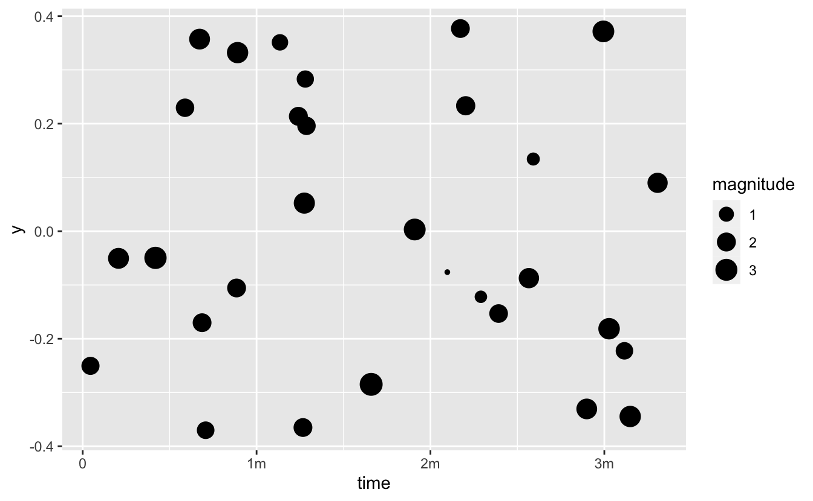
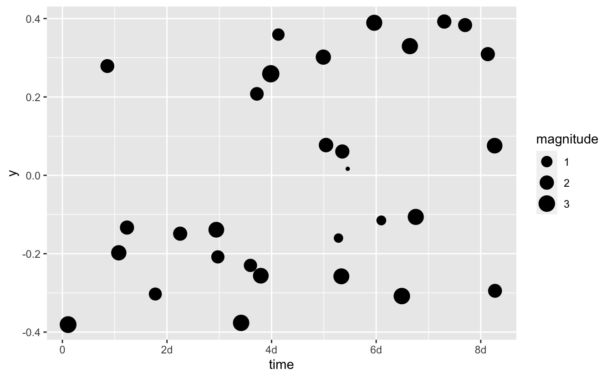
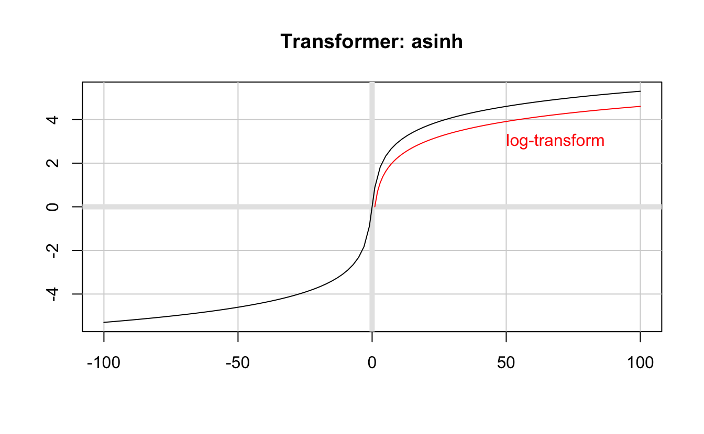

<!--
TODO:
* [x] Look over / edit the post's title in the yaml
* [x] Edit (or delete) the description; note this appears in the Twitter card
* [x] Pick category and tags (see existing with [`hugodown::tidy_show_meta()`](https://rdrr.io/pkg/hugodown/man/use_tidy_post.html))
* [x] Find photo & update yaml metadata
* [x] Create `thumbnail-sq.jpg`; height and width should be equal
* [x] Create `thumbnail-wd.jpg`; width should be >5x height
* [x] [`hugodown::use_tidy_thumbnails()`](https://rdrr.io/pkg/hugodown/man/use_tidy_post.html)
* [x] Add intro sentence, e.g. the standard tagline for the package
* [x] [`usethis::use_tidy_thanks()`](https://usethis.r-lib.org/reference/use_tidy_thanks.html)
-->

We're delighted to announce the release of [scales](https://scales.r-lib.org) 1.3.0. scales is a packages that extracts much of the scaling logic that is used in ggplot2 to a general framework, along with utility functions for e.g. formatting labels or creating color palettes.

You can install it from CRAN with:

<pre class='chroma'><code class='language-r' data-lang='r'><a href='https://rdrr.io/r/utils/install.packages.html'>install.packages</a>("scales")
</code></pre>

This blog post will give a quick overview of the 1.3.0 release, which is mainly an upkeep release but does contain a few interesting tidbits.

You can see a full list of changes in the [release notes](https://scales.r-lib.org/news/index.html)

<pre class='chroma'><code class='language-r' data-lang='r'><a href='https://rdrr.io/r/base/library.html'>library</a>(<a href='https://scales.r-lib.org'>scales</a>)
<a href='https://rdrr.io/r/base/Random.html'>set.seed</a>(1)
</code></pre>

## Proper support for difftime objects

While scales had rudimentary support for objects from the hms package, I did not support the more common base R difftime objects. This is now rectified with the introduction of [`label_timespan()`](https://scales.r-lib.org/reference/label_date.html), [`breaks_timespan()`](https://scales.r-lib.org/reference/breaks_timespan.html), and [`transform_timespan()`](https://scales.r-lib.org/reference/transform_timespan.html). While the labels and breaks function can be used on their own, all the behavior is encapsulated in the timespan transform object which is kin to [`transform_hms()`](https://scales.r-lib.org/reference/transform_timespan.html).

<pre class='chroma'><code class='language-r' data-lang='r'><a href='https://rdrr.io/r/base/library.html'>library</a>(<a href='https://ggplot2.tidyverse.org'>ggplot2</a>)

events &lt;- <a href='https://rdrr.io/r/base/data.frame.html'>data.frame</a>(
  time = <a href='https://rdrr.io/r/base/difftime.html'>as.difftime</a>(<a href='https://rdrr.io/r/stats/Uniform.html'>runif</a>(30, max = 200), units = "secs"),
  magnitude = <a href='https://rdrr.io/r/stats/Normal.html'>rnorm</a>(30) + 2
)

<a href='https://ggplot2.tidyverse.org/reference/ggplot.html'>ggplot</a>(events) + 
  <a href='https://ggplot2.tidyverse.org/reference/geom_point.html'>geom_point</a>(
    <a href='https://ggplot2.tidyverse.org/reference/aes.html'>aes</a>(time, y = 0, size = magnitude), 
    position = <a href='https://ggplot2.tidyverse.org/reference/position_jitter.html'>position_jitter</a>(width = 0)
  ) + 
  <a href='https://ggplot2.tidyverse.org/reference/scale_continuous.html'>scale_x_continuous</a>(trans = <a href='https://scales.r-lib.org/reference/transform_timespan.html'>transform_timespan</a>())

</code></pre>

As we can see the timespan transform automatically picks the unit of the difftime object. Further it identifies that for this range, adding breaks for minutes makes most sense.

If we had recorded time as hours rather than seconds, we can see how that affects the labelling:

<pre class='chroma'><code class='language-r' data-lang='r'>events$time &lt;- <a href='https://rdrr.io/r/base/difftime.html'>as.difftime</a>(<a href='https://rdrr.io/r/stats/Uniform.html'>runif</a>(30, max = 200), units = "hours")
<a href='https://ggplot2.tidyverse.org/reference/ggplot.html'>ggplot</a>(events) + 
  <a href='https://ggplot2.tidyverse.org/reference/geom_point.html'>geom_point</a>(
    <a href='https://ggplot2.tidyverse.org/reference/aes.html'>aes</a>(time, y = 0, size = magnitude), 
    position = <a href='https://ggplot2.tidyverse.org/reference/position_jitter.html'>position_jitter</a>(width = 0)
  ) + 
  <a href='https://ggplot2.tidyverse.org/reference/scale_continuous.html'>scale_x_continuous</a>(trans = <a href='https://scales.r-lib.org/reference/transform_timespan.html'>transform_timespan</a>())

</code></pre>

## API brush-up

scales has gone through a number of touch-ups on its API, such as revamping the labels functions to all start with `label_`. This release we continue (and hopefully conclude) the touch-ups by using a common prefix for the transformation utilities (`transform_`) and palettes (`pal_`). We have also renamed [`label_dollar()`](https://scales.r-lib.org/reference/dollar_format.html) to [`label_currency()`](https://scales.r-lib.org/reference/label_currency.html) to make it clear that this can be used for any type of currency, not just dollars (US or otherwise). All the old functions have been kept around with no plan of deprecation but we advise you to update your code to use the new names.

## More transformation power

This release also includes some other updates to the transformations. They have received a fair amount of bug fixes and a new built-in transformation type has joined the group: [`transform_asinh()`](https://scales.r-lib.org/reference/transform_asinh.html), the inverse hyperbolic sine transformation, can be used much like log transformations, but it also supports negative values.

<pre class='chroma'><code class='language-r' data-lang='r'><a href='https://rdrr.io/r/graphics/plot.default.html'>plot</a>(<a href='https://scales.r-lib.org/reference/transform_asinh.html'>transform_asinh</a>(), xlim = <a href='https://rdrr.io/r/base/c.html'>c</a>(-100, 100))
<a href='https://rdrr.io/r/graphics/lines.html'>lines</a>(<a href='https://rdrr.io/r/base/seq.html'>seq</a>(-100, 100), <a href='https://scales.r-lib.org/reference/transform_log.html'>transform_log</a>()$transform(<a href='https://rdrr.io/r/base/seq.html'>seq</a>(-100, 100)), col = "red")
<a href='https://rdrr.io/r/graphics/text.html'>text</a>(50, 3, label = "log-transform", col = "red", adj = 0)

</code></pre>

Transformation objects can now also (optionally) record the derivatives and inverse derivative which makes it possible to properly correct density estimations of transformed values.

## Fixes to range training in discrete scales

The training of discrete ranges has seen a few changes that hopefully makes it more predictable what happens when you train a range based on factors or character vectors. When training based on factors the ordering of the range will follow the order of the levels in the factor as they are encountered. New values will be appended to the end of the range. For character vectors the range will always stay sorted alphanumerically. Mixing of character and factors during training will lead to undefined ordering. This has always been the advertised behavior but it was not applied consistently up until now. As a result you may see the occational reordering of e.g. legends in ggplot2 after upgrading scales.

## Acknowledgements

[@alexpghayes](https://github.com/alexpghayes), [@angela-li](https://github.com/angela-li), [@apreshill](https://github.com/apreshill), [@arneschillert](https://github.com/arneschillert), [@ateucher](https://github.com/ateucher), [@batpigandme](https://github.com/batpigandme), [@behrman](https://github.com/behrman), [@bensoltoff](https://github.com/bensoltoff), [@BikramHalder](https://github.com/BikramHalder), [@braceandbracket](https://github.com/braceandbracket), [@brshallo](https://github.com/brshallo), [@bwalsh5](https://github.com/bwalsh5), [@carneybill](https://github.com/carneybill), [@ChrisDunleavy](https://github.com/ChrisDunleavy), [@ColinFay](https://github.com/ColinFay), [@courtiol](https://github.com/courtiol), [@csgillespie](https://github.com/csgillespie), [@DavisVaughan](https://github.com/DavisVaughan), [@dgrtwo](https://github.com/dgrtwo), [@DivadNojnarg](https://github.com/DivadNojnarg), [@dpprdan](https://github.com/dpprdan), [@dpseidel](https://github.com/dpseidel), [@drmowinckels](https://github.com/drmowinckels), [@dylan-cooper](https://github.com/dylan-cooper), [@EconomiCurtis](https://github.com/EconomiCurtis), [@edgararuiz](https://github.com/edgararuiz), [@edgararuiz-zz](https://github.com/edgararuiz-zz), [@EdwinTh](https://github.com/EdwinTh), [@elben10](https://github.com/elben10), [@EmilHvitfeldt](https://github.com/EmilHvitfeldt), [@espinielli](https://github.com/espinielli), [@fenguoerbian](https://github.com/fenguoerbian), [@gaborcsardi](https://github.com/gaborcsardi), [@georgestagg](https://github.com/georgestagg), [@giocomai](https://github.com/giocomai), [@gregrs-uk](https://github.com/gregrs-uk), [@gregswinehart](https://github.com/gregswinehart), [@gvelasq](https://github.com/gvelasq), [@hadley](https://github.com/hadley), [@hfrick](https://github.com/hfrick), [@hplieninger](https://github.com/hplieninger), [@ismayc](https://github.com/ismayc), [@jameslairdsmith](https://github.com/jameslairdsmith), [@jayhesselberth](https://github.com/jayhesselberth), [@jemus42](https://github.com/jemus42), [@jennybc](https://github.com/jennybc), [@jimhester](https://github.com/jimhester), [@juliasilge](https://github.com/juliasilge), [@justmytwospence](https://github.com/justmytwospence), [@karawoo](https://github.com/karawoo), [@krlmlr](https://github.com/krlmlr), [@leafyoung](https://github.com/leafyoung), [@lionel-](https://github.com/lionel-), [@lorenzwalthert](https://github.com/lorenzwalthert), [@LucyMcGowan](https://github.com/LucyMcGowan), [@maelle](https://github.com/maelle), [@markdly](https://github.com/markdly), [@martin-ueding](https://github.com/martin-ueding), [@matanhakim](https://github.com/matanhakim), [@maurolepore](https://github.com/maurolepore), [@mgirlich](https://github.com/mgirlich), [@MichaelChirico](https://github.com/MichaelChirico), [@miguelyogui](https://github.com/miguelyogui), [@mikemahoney218](https://github.com/mikemahoney218), [@mine-cetinkaya-rundel](https://github.com/mine-cetinkaya-rundel), [@mitchelloharawild](https://github.com/mitchelloharawild), [@pkq](https://github.com/pkq), [@PursuitOfDataScience](https://github.com/PursuitOfDataScience), [@rgerecke](https://github.com/rgerecke), [@richierocks](https://github.com/richierocks), [@Robinlovelace](https://github.com/Robinlovelace), [@robinsones](https://github.com/robinsones), [@romainfrancois](https://github.com/romainfrancois), [@rosseji](https://github.com/rosseji), [@rudeboybert](https://github.com/rudeboybert), [@saghirb](https://github.com/saghirb), [@sbearrows](https://github.com/sbearrows), [@sharlagelfand](https://github.com/sharlagelfand), [@simonpcouch](https://github.com/simonpcouch), [@stedy](https://github.com/stedy), [@stephlocke](https://github.com/stephlocke), [@stragu](https://github.com/stragu), [@sysilviakim](https://github.com/sysilviakim), [@thisisdaryn](https://github.com/thisisdaryn), [@thomasp85](https://github.com/thomasp85), [@thuettel](https://github.com/thuettel), [@tmstauss](https://github.com/tmstauss), [@topepo](https://github.com/topepo), [@tracykteal](https://github.com/tracykteal), [@tylerlittlefield](https://github.com/tylerlittlefield), [@vspinu](https://github.com/vspinu), [@warint](https://github.com/warint), [@wibeasley](https://github.com/wibeasley), [@yitao-li](https://github.com/yitao-li), [@yutannihilation](https://github.com/yutannihilation), and [@zekiakyol](https://github.com/zekiakyol).

