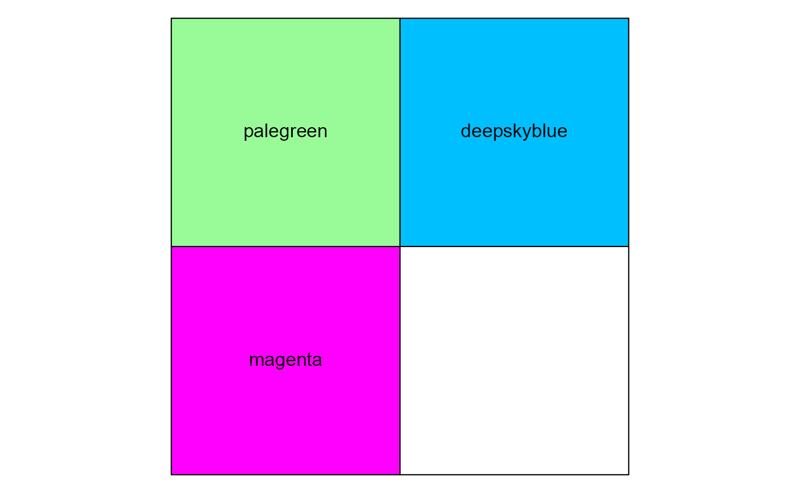

<!--
TODO:
* [x] Look over / edit the post's title in the yaml
* [x] Edit (or delete) the description; note this appears in the Twitter card
* [x] Pick category and tags (see existing with [`hugodown::tidy_show_meta()`](https://rdrr.io/pkg/hugodown/man/use_tidy_post.html))
* [ ] Find photo & update yaml metadata
* [ ] Create `thumbnail-sq.jpg`; height and width should be equal
* [ ] Create `thumbnail-wd.jpg`; width should be >5x height
* [ ] [`hugodown::use_tidy_thumbnails()`](https://rdrr.io/pkg/hugodown/man/use_tidy_post.html)
* [x] Add intro sentence, e.g. the standard tagline for the package
* [x] [`usethis::use_tidy_thanks()`](https://usethis.r-lib.org/reference/use_tidy_thanks.html)
-->

We're stoked to announce the release of [scales](%7Bhttps://scales.r-lib.org/%7D) 1.4.0. scales is a package that provides much of the scaling logic that is used in ggplot2 to a general framework, along with utility functions for e.g. formatting labels or creating colour palettes.

You can install it from CRAN with:

<pre class='chroma'><code class='language-r' data-lang='r'><a href='https://rdrr.io/r/utils/install.packages.html'>install.packages</a>("scales")</code></pre>

This blog post will give an overview of the 1.4.0 release, which has some nifty upgrades for working with colours.

You can see a full list of changes in the [release notes](https://scales.r-lib.org/news/index.html)

<pre class='chroma'><code class='language-r' data-lang='r'><a href='https://rdrr.io/r/base/library.html'>library</a>(<a href='https://scales.r-lib.org'>scales</a>)</code></pre>

## Colour manipulation

The [`alpha()`](https://scales.r-lib.org/reference/alpha.html) and [`muted()`](https://scales.r-lib.org/reference/muted.html) functions have been part of scales for a long time. Back in the 1.1.0 release we swapped to [farver](https://farver.data-imaginist.com/) to power these functions. We felt it was appropriate to use this package for other common colour tasks, and so [`col_shift()`](https://scales.r-lib.org/reference/colour_manip.html), [`col_lighter()`](https://scales.r-lib.org/reference/colour_manip.html), [`col_darker()`](https://scales.r-lib.org/reference/colour_manip.html), [`col_saturate()`](https://scales.r-lib.org/reference/colour_manip.html) and [`col_mix()`](https://scales.r-lib.org/reference/col_mix.html) were born.

<pre class='chroma'><code class='language-r' data-lang='r'>my_colours &lt;- <a href='https://rdrr.io/r/base/c.html'>c</a>("red", "green", "blue")

m &lt;- <a href='https://rdrr.io/r/base/cbind.html'>rbind</a>(
  original = my_colours,
  shift    = <a href='https://scales.r-lib.org/reference/colour_manip.html'>col_shift</a>(my_colours, 90),
  lighter  = <a href='https://scales.r-lib.org/reference/colour_manip.html'>col_lighter</a>(my_colours, 20),
  darker   = <a href='https://scales.r-lib.org/reference/colour_manip.html'>col_darker</a>(my_colours, 20),
  duller   = <a href='https://scales.r-lib.org/reference/colour_manip.html'>col_saturate</a>(my_colours, -50),
  mixed    = <a href='https://scales.r-lib.org/reference/col_mix.html'>col_mix</a>(my_colours, "orchid")
)

<a href='https://scales.r-lib.org/reference/show_col.html'>show_col</a>(<a href='https://rdrr.io/r/base/t.html'>t</a>(m), ncol = <a href='https://rdrr.io/r/base/nrow.html'>ncol</a>(m))
<a href='https://rdrr.io/r/graphics/text.html'>text</a>(x = <a href='https://rdrr.io/r/base/nrow.html'>ncol</a>(m) + 0.25, y = -(1:<a href='https://rdrr.io/r/base/nrow.html'>nrow</a>(m)) + 0.5, <a href='https://rdrr.io/r/base/colnames.html'>rownames</a>(m), adj = 0)
</code></pre>

## Palettes

Also palettes have been reworked this release to reflect more useful properties. Palettes now come in one of two classes: 'pal_discrete' or 'pal_continuous'.

<pre class='chroma'><code class='language-r' data-lang='r'>my_palette &lt;- <a href='https://scales.r-lib.org/reference/pal_manual.html'>manual_pal</a>(<a href='https://rdrr.io/r/base/c.html'>c</a>("palegreen", "deepskyblue", "magenta"))
<a href='https://rdrr.io/r/base/class.html'>class</a>(my_palette)
#&gt; [1] "pal_discrete" "scales_pal"   "function"
</code></pre>

Having palettes as a class rather than plain functions, allows us to store useful metadata about the palette. In addition, most colour palette functions also allow the aforementioned colour manipulation functions to work on the palette output.

<pre class='chroma'><code class='language-r' data-lang='r'><a href='https://scales.r-lib.org/reference/new_continuous_palette.html'>palette_type</a>(my_palette)
#&gt; [1] "colour"
<a href='https://scales.r-lib.org/reference/new_continuous_palette.html'>palette_nlevels</a>(my_palette)
#&gt; [1] 3
<a href='https://scales.r-lib.org/reference/colour_manip.html'>col_shift</a>(my_palette, 180)(3)
#&gt; [1] "#FFC3FF" "#E4A735" "#00B100"
</code></pre>

This metadata can then be used to expand discrete palettes to continuous palettes with [`as_continuous_pal()`](https://scales.r-lib.org/reference/new_continuous_palette.html) or vise versa to chop up a continuous palette into discrete palettes with [`as_discrete_pal()`](https://scales.r-lib.org/reference/new_continuous_palette.html).

<pre class='chroma'><code class='language-r' data-lang='r'><a href='https://rdrr.io/r/graphics/plot.default.html'>plot</a>(<a href='https://scales.r-lib.org/reference/new_continuous_palette.html'>as_continuous_pal</a>(my_palette))
</code></pre>

Another thing to make working with palettes easier, is that the 'scales' package now keeps track of named palettes. By default, the collection of 'known' palettes is pre-populated with colour palettes from the grDevices, RColorBrewer and viridisLite packages.

<pre class='chroma'><code class='language-r' data-lang='r'><a href='https://rdrr.io/r/utils/head.html'>head</a>(<a href='https://scales.r-lib.org/reference/get_palette.html'>palette_names</a>())
#&gt; [1] "greens 2"   "r4"         "greens 3"   "blues"      "terrain"   
#&gt; [6] "tableau 10"
<a href='https://scales.r-lib.org/reference/get_palette.html'>get_palette</a>("Okabe-Ito")(8)
#&gt; [1] "#000000" "#E69F00" "#56B4E9" "#009E73" "#F0E442" "#0072B2" "#D55E00"
#&gt; [8] "#CC79A7"
</code></pre>

If you're a developer of a palette package, you can use [`set_palette()`](https://scales.r-lib.org/reference/get_palette.html) to register your palette. This has the advantage that your palette is now available to users by name, which at times might be more convenient than having to call the palette generator function.

<pre class='chroma'><code class='language-r' data-lang='r'><a href='https://scales.r-lib.org/reference/get_palette.html'>get_palette</a>("aurora")
#&gt; Error in `get_palette()`:
#&gt; ! Unknown palette: aurora

<a href='https://scales.r-lib.org/reference/get_palette.html'>set_palette</a>("aurora", my_palette)
<a href='https://rdrr.io/r/graphics/plot.default.html'>plot</a>(<a href='https://scales.r-lib.org/reference/get_palette.html'>get_palette</a>("aurora"))
</code></pre>

## Labels

Lastly, please let us introduce you to our two new labelling functions and two new convenience functions for labels. In contrast to most of scales' label functions, these label functions are great for discrete input. First up is [`label_glue()`](https://scales.r-lib.org/reference/label_glue.html), which uses the string interpolation from the glue package to format your labels.

<pre class='chroma'><code class='language-r' data-lang='r'><a href='https://scales.r-lib.org/reference/label_glue.html'>label_glue</a>("The &#123;x&#125; penguin")(<a href='https://rdrr.io/r/base/c.html'>c</a>("Gentoo", "Chinstrap", "Adelie"))
#&gt; The Gentoo penguin
#&gt; The Chinstrap penguin
#&gt; The Adelie penguin
</code></pre>

The next labeling function is convenient when some variable you use consists of shortcodes or abbreviations. You can provide [`label_dictionary()`](https://scales.r-lib.org/reference/label_dictionary.html) with a named vector that translates the values to prettier labels. If you value didn't exist in the dictionary, these stay as-is by default.

<pre class='chroma'><code class='language-r' data-lang='r'>dict &lt;- <a href='https://rdrr.io/r/base/c.html'>c</a>(
  diy = "Do it yourself", eta = "Estimated time of arrival",
  asap = "As soon as possible", tldr = "Too long; didn't read"
)
<a href='https://scales.r-lib.org/reference/label_dictionary.html'>label_dictionary</a>(dict)(<a href='https://rdrr.io/r/base/c.html'>c</a>("diy", "tldr", "bff"))
#&gt; [1] "Do it yourself"        "Too long; didn't read" "bff"
</code></pre>

The first label convenience function we'd like to tell you about is the [`compose_label()`](https://scales.r-lib.org/reference/compose_label.html) function. Similar to [`compose_trans()`](https://scales.r-lib.org/reference/transform_compose.html), it allows you to chain together different labelling functions.

<pre class='chroma'><code class='language-r' data-lang='r'>screaming_flowers &lt;- <a href='https://scales.r-lib.org/reference/compose_label.html'>compose_label</a>(<a href='https://scales.r-lib.org/reference/label_glue.html'>label_glue</a>("The &#123;x&#125; flower"), toupper)
screaming_flowers(<a href='https://rdrr.io/r/base/c.html'>c</a>("daffodil", "orchid", "tulip"))
#&gt; THE DAFFODIL FLOWER
#&gt; THE ORCHID FLOWER
#&gt; THE TULIP FLOWER
</code></pre>

Lastly, we haven't completely forgotton about numeric labels either. We have introduced the [`number_options()`](https://scales.r-lib.org/reference/number_options.html) functions to globally populate defaults for functions such as [`label_number()`](https://scales.r-lib.org/reference/label_number.html) and [`label_currency()`](https://scales.r-lib.org/reference/label_currency.html). This can be convenient if you produce statistical reports in non-English languages.

<pre class='chroma'><code class='language-r' data-lang='r'><a href='https://scales.r-lib.org/reference/number_options.html'>number_options</a>(
  decimal.mark = ",",
  big.mark = ".",
  style_negative = "minus",
  currency.prefix = "",
  currency.suffix = "€",
  currency.decimal.mark = ",",
  currency.big.mark = " ",
  ordinal.rules = <a href='https://scales.r-lib.org/reference/label_ordinal.html'>ordinal_french</a>()
)

<a href='https://scales.r-lib.org/reference/label_currency.html'>label_currency</a>(accuracy = 0.01)(<a href='https://rdrr.io/r/base/c.html'>c</a>(0.1, 10, 1000000, -1000))
#&gt; [1] "0,10€"         "10,00€"        "1 000 000,00€" "-1 000,00€"
<a href='https://scales.r-lib.org/reference/label_ordinal.html'>label_ordinal</a>()(1:4)
#&gt; [1] "1er" "2e"  "3e"  "4e"
</code></pre>

## Acknowledgements

We'd like to thank all people who have contributed in some way, whether it was filing issues, participating in discussion or contributing to code and documentation:

[@Aariq](https://github.com/Aariq), [@Aehmlo](https://github.com/Aehmlo), [@Ali-Hudson](https://github.com/Ali-Hudson), [@cb12991](https://github.com/cb12991), [@colindouglas](https://github.com/colindouglas), [@d-morrison](https://github.com/d-morrison), [@davidhodge931](https://github.com/davidhodge931), [@EricMarcon](https://github.com/EricMarcon), [@kellijohnson-NOAA](https://github.com/kellijohnson-NOAA), [@kmcd39](https://github.com/kmcd39), [@lz1nwm](https://github.com/lz1nwm), [@mine-cetinkaya-rundel](https://github.com/mine-cetinkaya-rundel), [@mjskay](https://github.com/mjskay), [@Moohan](https://github.com/Moohan), [@muschellij2](https://github.com/muschellij2), [@ppreshant](https://github.com/ppreshant), [@rawktheuniversemon](https://github.com/rawktheuniversemon), [@rogiersbart](https://github.com/rogiersbart), [@SchmidtPaul](https://github.com/SchmidtPaul), [@teunbrand](https://github.com/teunbrand), and [@thomasp85](https://github.com/thomasp85).

