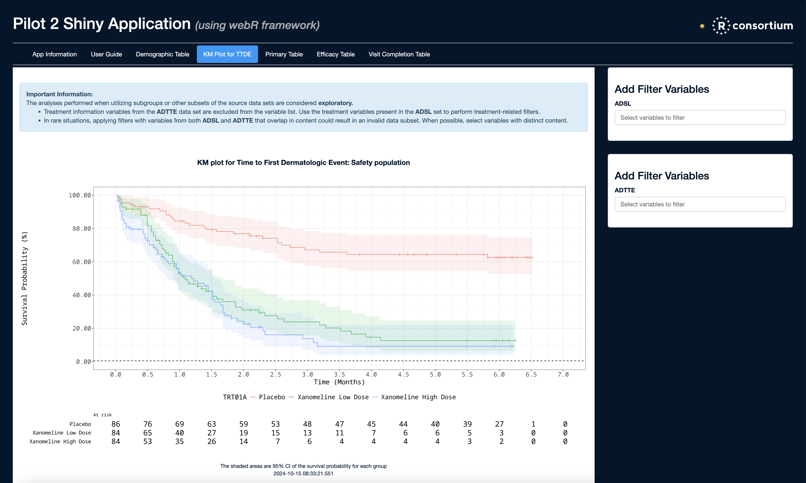

```{=html}
<!--
TODO:
* [x] Look over / edit the post's title in the yaml
* [x] Edit (or delete) the description; note this appears in the Twitter card
* [x] Pick category and tags (see existing with `hugodown::tidy_show_meta()`)
* [x] Find photo & update yaml metadata
* [x] Create `thumbnail-sq.jpg`; height and width should be equal
* [x] Create `thumbnail-wd.jpg`; width should be >5x height
* [x] `hugodown::use_tidy_thumbnails()`
* [x] Add intro sentence, e.g. the standard tagline for the package
* [x] `usethis::use_tidy_thanks()`
-->
```
One of the most popular uses of webR in a wider project is [Shinylive](https://shinylive.io/r/examples), a system for deploying Shiny for R or Python apps that run completely in a web browser, without the need for a dedicated Shiny server. Shinylive works by running both the server and client components in the viewer's browser, and the support for running R Shiny apps in this way is provided by webR.

Since Shinylive works with both R and Python Shiny apps, the project is released as multiple independent but interconnecting software. The core [Shinylive](https://github.com/posit-dev/shinylive) assets, the [R shinylive](https://github.com/posit-dev/r-shinylive) package, the [Python Shinylive](https://github.com/posit-dev/py-shinylive) package, and the [Shinylive Quarto extension](https://github.com/quarto-ext/shinylive/). This post will describe some the latest changes in the context of running the R Shinylive package and Quarto extension.

## Shinylive assets

The latest release of the Shinylive assets upgrades the version of webR included to 0.4.2, bringing in the improved packaging and loading performance of R binaries discussed in [part 1 of this series](../webr-0-4-2/). Shinylive now defaults to downloading R packages in the improved `.tgz` archive format served by the [webR default repository](repo.r-wasm.org) and [R-Universe](https://r-universe.dev/), resulting in a more efficient R package installation and faster start up process.

These changes are already making a tangible difference to applications. In a recent meeting of the [R Consortium Submissions Working Group](https://rconsortium.github.io/submissions-wg/), it was reported that for a complex Shinylive app the overall load time decreased from over a minute to just 15 seconds! [^3]

[^3]: <https://rconsortium.github.io/submissions-wg/minutes/2024-08-02/#webassembly>

The working group is championing improved practices for R-based submissions of clinical trial data to regulatory bodies for review. With their great work and our steady improvements to Shinylive over time, the group now report that they have reached a new milestone in [successfully submitting a pilot R Shiny app](https://r-consortium.org/posts/using-r-to-submit-research-to-the-fda-pilot-4-successfully-submitted/), featuring a WebAssembly component with Shinylive, to the FDA for review.

<a href="images/pilot-2.png">
  
</a>

## R shinylive package

### Reproducible data science with binary bundles

A benefit of WebAssembly is that the same binary instructions can be executed on a whole range of machine architectures, from high performance desktop workstations to low-power devices such as mobile phones or tablets. WebAssembly provides a common environment ensuring that each device can reproduce the exact same results, both now and potentially for many years into the future.

However, those with experience of building software and documents with long-term reproducibility in mind will know that not only must the exact version of your own software be available, but also packages and system dependencies too. Accurate versioning matters; newer editions of R packages are always being released with modified functionality or features deprecated and perhaps even removed.

Previously Shinylive downloaded R packages at runtime from the webR default repository. However, that repository follows CRAN and upgrades packages to the latest version reasonably often. So, to help provide long-lived reproducibility, the latest version of Shinylive now not only deploys your application source but also downloads and bundles as many R package binaries as possible in the exported app.

By including WebAssembly R package binaries, a self-contained bundle is created that will never change over time, even as new R package versions are released. Once deployed to a static web service such as GitHub Pages or Netlify you can be confident that your results will be exactly the same now or in many years time -- at least as long as browsers continue to support the WebAssembly standard!

With this, it is now also possible to load a complex R Shinylive app from a local web server without any external internet connection. This isn't likely to be that useful for most users, but there are some highly regulated industries and restricted network environments where it becomes a key feature.

### Bundling WebAssembly binaries

By default, R packages installed from CRAN, [R-Universe](https://r-universe.dev/), or [Bioconductor](https://bioconductor.org) will be downloaded and distributed with your Shinylive application. For CRAN packages, the packages are sourced from the webR default repository. For R-Universe or Bioconductor packages, they are sourced from the WebAssembly binaries provided by R-Universe.

Here's an example of what this looks like for a sample Shiny app depending on the dplyr package. Shinylive assets and R package binaries are downloaded and bundled at export time, and the status of each is shown in the output.

```r
shinylive::export("app", "site")
#> ℹ Exporting Shiny app from: app
#> → Destination: site
#> [======================================================================] 100%
#> ✔ Copying base Shinylive files [289ms]
#> ✔ Loading metadata database ... done
#> 
#> Finding R package dependencies ... Done!
#> [=======>--------------------------------------------------------------]  11%
#> trying URL 'http://repo.r-wasm.org/bin/emscripten/contrib/4.4/dplyr_1.1.4.tgz'
#> Content type 'application/x-tar' length 1063948 bytes (1.0 MB)
#> ==================================================
#> downloaded 1.0 MB
#> [...]
#> 
#> ✔ Downloading WebAssembly R package binaries to site/shinylive/webr/packages [3.2s]
#> ✔ Writing app metadata to site/shinylive/webr/packages/metadata.rds [14ms]
#> ℹ Wrote site/shinylive/webr/packages/metadata.rds (694 bytes)
#> ✔ Writing site/app.json [17ms]
#> ℹ Wrote site/app.json (1.64K bytes)
#> ✔ Shinylive app export complete.
#> ℹ Run the following in an R session to serve the app:
#> `httpuv::runStaticServer("site")`
```

The shinylive R package will query the currently installed versions of packages on your machine and attempt to download and bundle the same version for WebAssembly. Binaries are considered acceptable if the major and minor version numbers match, and a warning is issued otherwise. This check ensures the resulting behaviour of the exported Shinylive app is as close as possible to the behaviour when running the app in the usual way.

```r
shinylive::export("app", "site")
#> [...]
#> Warning message:
#> Package version mismatch for dplyr, ensure the versions below are compatible.
#> ! Installed version: 1.0.9, WebAssembly version: 1.1.4.
#> ℹ Install a package version matching the WebAssembly version to silence this error. 
```

### Bundling custom R packages

Using your own custom R packages with webR or Shinylive is also possible, but requires a little extra work. R packages, particularly those that include compiled code, must be processed specially for WebAssembly. This requires an environment with a WebAssembly compiler toolchain such as Emscripten and some set up to organise the cross-compiling of packages using R.

The easiest way to get up and running is to [create a personal R-Universe repository](https://ropensci.org/blog/2021/06/22/setup-runiverse/) for your packages. The system will automatically build R package binaries for multiple targets, including WebAssembly, and Shinylive will download these resulting binaries when exporting your app.

It's also possible to automatically cross-compile and deploy WebAssembly R package binaries using GitHub Actions. The [r-wasm/actions](https://github.com/r-wasm/actions) repository provides reusable workflows for GitHub Actions, one of which can be used to automatically build WebAssembly R package when a GitHub release is created, attaching the resulting binary to the release. If an R package has been installed directly from GitHub, using a tool such as [pak](https://pak.r-lib.org), Shinylive will look for binaries attached to a GitHub release for bundling.

Finally, building an R package for WebAssembly can be done manually using the [rwasm](https://r-wasm.github.io/rwasm/) package. This is a little more involved, using a combination of the [Emscripten SDK](https://github.com/emscripten-core/emsdk) and the [webR Docker container](https://github.com/r-wasm/webr/pkgs/container/webr) to organise cross-compiling packages with R and manage custom CRAN-like repositories. Shinylive will also bundle WebAssembly binaries for R packages installed from such a custom repository.

## Shinylive Quarto Extension

Shinylive applications may be embedded in a Quarto document using the Shinylive Quarto extension. With the extension active, a Shinylive app can be added by directly including its source code in the document markdown. Under the hood, the extension works by calling out to the export functionality provided by the Shinylive R and Python packages, and so improvements to the exporting process also applies to Shiny apps included in Quarto projects.


````
Lorem ipsum dolor sit amet, consectetur adipiscing elit.

```{shinylive-r}
#| standalone: true
library(shiny)

ui <- [...]
server <- [...]
shinyApp(ui = ui, server = server)
```

Duis aute irure dolor in reprehenderit in voluptate velit esse cillum dolore eu
fugiat nulla pariatur.
````

### Embedding data files in subdirectories

When a Shiny app has been deployed with Shinylive it does not have direct access to the filesystem on the client device. This is enforced by WebAssembly and the browser for security reasons. As such, additional data must either by downloaded or pre-loaded to a virtual filesystem before the app starts.

There are a few ways to do this with a Shinylive app, but when working in a Quarto document things are more constrained. One supported way is to define the content of additional data files inline.

````
```{shinylive-r}
#| standalone: true
ui <- [...]
server <- [...]
shinyApp(ui = ui, server = server)

## file: data/example.csv
foo,bar,baz
1,2,3
2,4,6
3,6,9
5,10,15
8,16,24
```
````

The system has been improved to support adding content to subdirectories, along with the ability to define binary content that has been base64 encoded. Combining this with Garrick Aden-Buie's [quarto-base64](https://github.com/gadenbuie/quarto-base64) extension is a great way to easily include arbitrary data in your Quarto embedded Shinylive apps.

### Quarto project-wide shared assets

The latest version of the R shinylive package now checks if the export process is currently running as part of a Quarto render. If so, it uses the `QUARTO_PROJECT_DIR` environment variable as a hint for where to deploy Shinylive assets and bundled WebAssembly R binaries.

With this change it's possible to include multiple Shinylive applications in different documents, sharing their WebAssembly assets across the entire project. This avoids an undesirable situation where the exact same set of fundamental R packages are downloaded and deployed many times to different paths in a Quarto website.

## Using the latest Shinylive asssets

The Shinylive 0.8.0 assets have been [released on GitHub](https://github.com/posit-dev/shinylive/releases/tag/v0.8.0). They will automatically be downloaded and used once the latest version of the shinylive R package makes it to CRAN and the package has been updated on your machine.

If you'd like to get a head start on the latest R shinylive features, you can install the current development version of shinylive directly from GitHub:

```{r, eval = FALSE}
pak::pak("posit-dev/r-shinylive")
```

Or, if you prefer, you can stick with the current release version of the shinylive R package and orchestrate it to use the latest version of the assets by setting the environment variable:

```         
SHINYLIVE_ASSETS_VERSION=0.8.0
```

## Acknowledgements

[&#x0040;chaehni](https://github.com/chaehni), [&#x0040;cpsievert](https://github.com/cpsievert), [&#x0040;darrida](https://github.com/darrida), [&#x0040;erikhall6373](https://github.com/erikhall6373),
[&#x0040;gadenbuie](https://github.com/gadenbuie),
[&#x0040;gschivley](https://github.com/gschivley),
[&#x0040;helgasoft](https://github.com/helgasoft),
[&#x0040;jeroen](https://github.com/jeroen),
[&#x0040;JoaoGarcezAurelio](https://github.com/JoaoGarcezAurelio), [&#x0040;jvcasillas](https://github.com/jvcasillas), [&#x0040;kv9898](https://github.com/kv9898),
[&#x0040;next-game-solutions](https://github.com/next-game-solutions),
[&#x0040;Luke-Symes-Tsy](https://github.com/Luke-Symes-Tsy), [&#x0040;maek-ies](https://github.com/maek-ies),
[&#x0040;pawelru](https://github.com/pawelru), [&#x0040;quincountychsmn](https://github.com/quincountychsmn),
[&#x0040;rmcminds](https://github.com/rmcminds),
[&#x0040;rbcavanaugh](https://github.com/rbcavanaugh), [&#x0040;schloerke](https://github.com/schloerke), [&#x0040;StefKirsch](https://github.com/StefKirsch), [&#x0040;virtualinertia](https://github.com/virtualinertia), and
[&#x0040;wch](https://github.com/wch).
