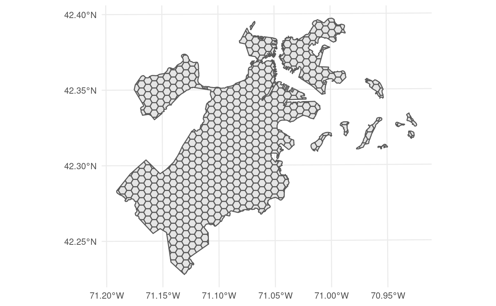
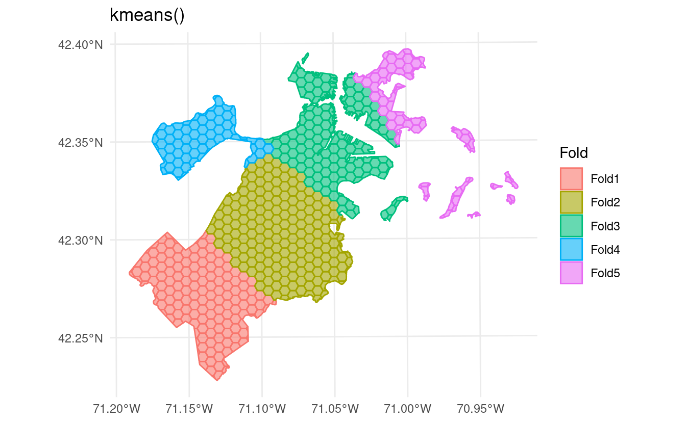

<!--
TODO:
* [x] Look over / edit the post's title in the yaml
* [x] Edit (or delete) the description; note this appears in the Twitter card
* [x] Pick category and tags (see existing with [`hugodown::tidy_show_meta()`](https://rdrr.io/pkg/hugodown/man/use_tidy_post.html))
* [x] Find photo & update yaml metadata
* [x] Create `thumbnail-sq.jpg`; height and width should be equal
* [x] Create `thumbnail-wd.jpg`; width should be >5x height
* [x] [`hugodown::use_tidy_thumbnails()`](https://rdrr.io/pkg/hugodown/man/use_tidy_post.html)
* [x] Add intro sentence, e.g. the standard tagline for the package
* [x] [`usethis::use_tidy_thanks()`](https://usethis.r-lib.org/reference/use_tidy_thanks.html)
-->

We're positively electrified to announce the release of [spatialsample](https://spatialsample.tidymodels.org/) 0.2.0. spatialsample is a package for spatial resampling, extending the rsample framework for resampling to help create spatial extrapolation between your analysis and assessment data sets.

You can install it from CRAN with:

<pre class='chroma'><code class='language-r' data-lang='r'><a href='https://rdrr.io/r/utils/install.packages.html'>install.packages</a>("spatialsample")</code></pre>

This blog post will describe the highlights of what's new. You can see a full list of changes in the [release notes](https://github.com/tidymodels/spatialsample/blob/main/NEWS.md).

## New Features

This version of spatialsample includes a new data set, made up of 682 hexagons containing data about tree canopy cover change in Boston, Massachusetts:

<pre class='chroma'><code class='language-r' data-lang='r'><a href='https://rdrr.io/r/base/library.html'>library</a>(<a href='https://github.com/tidymodels/spatialsample'>spatialsample</a>)
<a href='https://rdrr.io/r/base/library.html'>library</a>(<a href='https://ggplot2.tidyverse.org'>ggplot2</a>)

<a href='https://ggplot2.tidyverse.org/reference/ggplot.html'>ggplot</a>(boston_canopy) + 
  <a href='https://ggplot2.tidyverse.org/reference/ggsf.html'>geom_sf</a>()
</code></pre>

This data is stored as an sf object, and as such contains information about the proper coordinate reference system and units of measurement associated with the data.

And that brings us to the first new feature in this release of spatialsample: [`spatial_clustering_cv()`](https://spatialsample.tidymodels.org/reference/spatial_clustering_cv.html) now supports sf objects, and will calculate distances in a way that respects coordinate reference systems (including using the s2 geometry library for geographic coordinate reference systems):

<pre class='chroma'><code class='language-r' data-lang='r'><a href='https://rdrr.io/r/base/Random.html'>set.seed</a>(123)
kmeans_clustering &lt;- <a href='https://spatialsample.tidymodels.org/reference/spatial_clustering_cv.html'>spatial_clustering_cv</a>(boston_canopy, v = 5)
kmeans_clustering
#&gt; #  5-fold spatial cross-validation 
#&gt; # A tibble: 5 × 2
#&gt;   splits            id   
#&gt;   &lt;list&gt;            &lt;chr&gt;
#&gt; 1 &lt;split [524/158]&gt; Fold1
#&gt; 2 &lt;split [493/189]&gt; Fold2
#&gt; 3 &lt;split [517/165]&gt; Fold3
#&gt; 4 &lt;split [605/77]&gt;  Fold4
#&gt; 5 &lt;split [589/93]&gt;  Fold5</code></pre>

This release also provides [`autoplot()`](https://ggplot2.tidyverse.org/reference/autoplot.html) methods to visualize resamples via ggplot2, making it easy to see how exactly your data is being divided. Just call [`autoplot()`](https://ggplot2.tidyverse.org/reference/autoplot.html) on the outputs from any spatial clustering function:

<pre class='chroma'><code class='language-r' data-lang='r'><a href='https://ggplot2.tidyverse.org/reference/autoplot.html'>autoplot</a>(kmeans_clustering) + <a href='https://ggplot2.tidyverse.org/reference/labs.html'>labs</a>(title = "kmeans()")
</code></pre>

In addition to supporting more types of data, [`spatial_clustering_cv()`](https://spatialsample.tidymodels.org/reference/spatial_clustering_cv.html) has also been extended to support more types of clustering. Use the `cluster_function` argument to use hierarchical clustering via [`hclust()`](https://rdrr.io/r/stats/hclust.html) instead of the default [`kmeans()`](https://rdrr.io/r/stats/kmeans.html)-based clusters:

<pre class='chroma'><code class='language-r' data-lang='r'><a href='https://rdrr.io/r/base/Random.html'>set.seed</a>(123)
<a href='https://spatialsample.tidymodels.org/reference/spatial_clustering_cv.html'>spatial_clustering_cv</a>(
  boston_canopy, 
  v = 5, 
  cluster_function = "hclust"
) |&gt; 
  <a href='https://ggplot2.tidyverse.org/reference/autoplot.html'>autoplot</a>() + 
  <a href='https://ggplot2.tidyverse.org/reference/labs.html'>labs</a>(title = "hclust()")
</code></pre>

This argument can also accept functions, letting you plug in clustering methodologies from other packages or that you've written yourself:

<pre class='chroma'><code class='language-r' data-lang='r'><a href='https://rdrr.io/r/base/Random.html'>set.seed</a>(123)

custom_clusters &lt;- function(dists, v, ...) &#123;
  <a href='https://rdrr.io/r/base/rep.html'>rep</a>(letters[1:v], length.out = <a href='https://rdrr.io/r/base/nrow.html'>nrow</a>(boston_canopy))
&#125;

<a href='https://spatialsample.tidymodels.org/reference/spatial_clustering_cv.html'>spatial_clustering_cv</a>(
  boston_canopy, 
  v = 5, 
  cluster_function = custom_clusters
) |&gt; 
  <a href='https://ggplot2.tidyverse.org/reference/autoplot.html'>autoplot</a>() + 
  <a href='https://ggplot2.tidyverse.org/reference/labs.html'>labs</a>(title = "custom_clusters()")
</code></pre>

In addition to the clustering extensions, this version of spatialsample introduces a few functions for other popular spatial resampling methods. For instance, the new function [`spatial_block_cv()`](https://spatialsample.tidymodels.org/reference/spatial_block_cv.html) helps you perform [block cross-validation](https://doi.org/10.1111/ecog.02881), splitting your data into folds based on a grid of regular polygons. You can assign these polygons to folds at random:

<pre class='chroma'><code class='language-r' data-lang='r'><a href='https://rdrr.io/r/base/Random.html'>set.seed</a>(123)
<a href='https://spatialsample.tidymodels.org/reference/spatial_block_cv.html'>spatial_block_cv</a>(boston_canopy, v = 5) |&gt; 
  <a href='https://ggplot2.tidyverse.org/reference/autoplot.html'>autoplot</a>()
</code></pre>

Or systematically, either by assigning folds in order from the bottom-left and proceeding from left to right along each row by setting `method = "continuous"`:

<pre class='chroma'><code class='language-r' data-lang='r'><a href='https://spatialsample.tidymodels.org/reference/spatial_block_cv.html'>spatial_block_cv</a>(boston_canopy, v = 5, method = "continuous") |&gt; 
  <a href='https://ggplot2.tidyverse.org/reference/autoplot.html'>autoplot</a>()
</code></pre>

Or by "snaking" back and forth up the grid by setting `method = "snake"`:

<pre class='chroma'><code class='language-r' data-lang='r'><a href='https://spatialsample.tidymodels.org/reference/spatial_block_cv.html'>spatial_block_cv</a>(boston_canopy, v = 5, method = "snake") |&gt; 
  <a href='https://ggplot2.tidyverse.org/reference/autoplot.html'>autoplot</a>()
</code></pre>

This release of spatialsample also adds support for [leave-location-out cross-validation](https://doi.org/10.1111/geb.12161) through the new function [`spatial_leave_location_out_cv()`](https://spatialsample.tidymodels.org/reference/spatial_vfold.html). You can use this to create resamples when you already have a good idea of what data might be spatially correlated together -- for instance, we can use it to split the Ames housing data from modeldata by neighborhood:

<pre class='chroma'><code class='language-r' data-lang='r'><a href='https://rdrr.io/r/utils/data.html'>data</a>(ames, package = "modeldata")

ames_sf &lt;- sf::<a href='https://r-spatial.github.io/sf/reference/st_as_sf.html'>st_as_sf</a>(ames, coords = <a href='https://rdrr.io/r/base/c.html'>c</a>("Longitude", "Latitude"), crs = 4326)

<a href='https://rdrr.io/r/base/Random.html'>set.seed</a>(123)
<a href='https://spatialsample.tidymodels.org/reference/spatial_vfold.html'>spatial_leave_location_out_cv</a>(ames_sf, Neighborhood) |&gt; 
  <a href='https://ggplot2.tidyverse.org/reference/autoplot.html'>autoplot</a>()
</code></pre>

## Buffering

The last major feature in this release is the introduction of spatial buffering. Spatial buffering enforces a certain minimum distance between your analysis and assessment sets, making sure that you're spatially extrapolating when making predictions with a model.

While all spatial resampling functions in spatialsample can use spatial buffers, particularly interesting is the new [`spatial_buffer_vfold_cv()`](https://spatialsample.tidymodels.org/reference/spatial_vfold.html) function. This function makes it easy to add spatial buffers around a standard V-fold cross-validation procedure. When we plot the object returned by this function, it just looks like a standard V-fold cross-validation setup:

<pre class='chroma'><code class='language-r' data-lang='r'><a href='https://rdrr.io/r/base/Random.html'>set.seed</a>(123)
blocks &lt;- <a href='https://spatialsample.tidymodels.org/reference/spatial_vfold.html'>spatial_buffer_vfold_cv</a>(
  boston_canopy, 
  v = 15,
  buffer = 100,
  radius = NULL
)

<a href='https://ggplot2.tidyverse.org/reference/autoplot.html'>autoplot</a>(blocks)
</code></pre>

However, if we use [`autoplot()`](https://ggplot2.tidyverse.org/reference/autoplot.html) to visualize the splits themselves, we can see that we've created an exclusion buffer around each of our assessment sets. Data inside this buffer is assigned to neither the assessment or analysis set, so you can be sure your data is spatially separated:

<pre class='chroma'><code class='language-r' data-lang='r'>blocks$splits |&gt; 
  purrr::<a href='https://purrr.tidyverse.org/reference/map.html'>walk</a>(function(x) <a href='https://rdrr.io/r/base/print.html'>print</a>(<a href='https://ggplot2.tidyverse.org/reference/autoplot.html'>autoplot</a>(x)))
</code></pre>

In addition to exclusion buffers, spatialsample now lets you add inclusion radii to any spatial resampling. This will add any points within a certain distance of the original assessment set to the assessment set, letting you create clumped "discs" of data to assess your models against:

<pre class='chroma'><code class='language-r' data-lang='r'><a href='https://rdrr.io/r/base/Random.html'>set.seed</a>(123)
blocks &lt;- <a href='https://spatialsample.tidymodels.org/reference/spatial_vfold.html'>spatial_buffer_vfold_cv</a>(
  boston_canopy, 
  v = 20,
  buffer = 100,
  radius = 100
)

blocks$splits |&gt; 
  purrr::<a href='https://purrr.tidyverse.org/reference/map.html'>walk</a>(function(x) <a href='https://rdrr.io/r/base/print.html'>print</a>(<a href='https://ggplot2.tidyverse.org/reference/autoplot.html'>autoplot</a>(x)))
</code></pre>

## ...and more!

This is just scratching the surface of the new features and improvements in this release of spatialsample. You can see a full list of changes in the the [release notes](https://github.com/tidymodels/spatialsample/blob/main/NEWS.md).

## Acknowledgments

We'd like to thank everyone that has contributed since the last release: [@jennybc](https://github.com/jennybc), [@juliasilge](https://github.com/juliasilge), [@mikemahoney218](https://github.com/mikemahoney218), [@MxNl](https://github.com/MxNl), [@nipnipj](https://github.com/nipnipj), and [@PathosEthosLogos](https://github.com/PathosEthosLogos).

