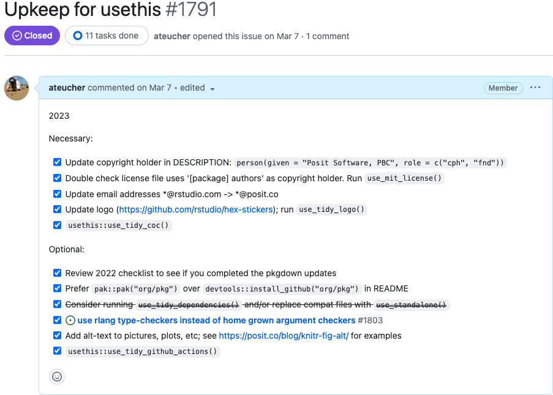
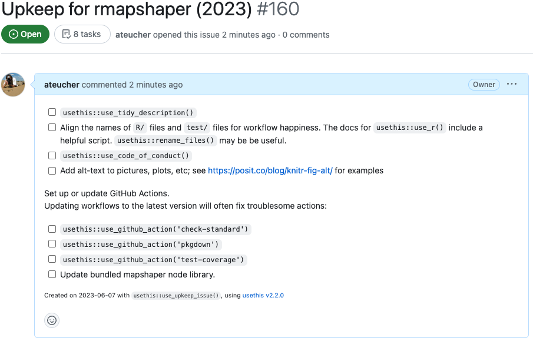

```{=html}
<!--
TODO:
* [x] Look over / edit the post's title in the yaml
* [x] Edit (or delete) the description; note this appears in the Twitter card
* [x] Pick category and tags (see existing with `hugodown::tidy_show_meta()`)
* [x] Find photo & update yaml metadata
* [x] Create `thumbnail-sq.jpg`; height and width should be equal
* [x] Create `thumbnail-wd.jpg`; width should be >5x height
* [x] `hugodown::use_tidy_thumbnails()`
* [ ] `Add intro sentence, e.g. the standard tagline for the package
* [ ] `usethis::use_tidy_thanks()`
-->
```

<style>
p.caption {
  color:#696969; 
  font-style: italic;
}
</style>

As Spring arrives in the Northern hemisphere, the sun's rays reach into the dark corners and illuminate the dust that has been gathering over the winter. This is when our thoughts start to turn to Spring cleaning - a time to clear out the clutter that has accumulated over the past year. It represents a fresh start and a new beginning, and leaves us feeling rejuvenated and ready to take on the rest of the year. This applies not only to our homes, but also to the code that we maintain - there are often bits and pieces that we know need attention but never seem to make it to the top of the priority list.

Doing this kind of work isn't necessarily only about adopting good practices or increasing the quality of your code --- it can also be about adding value through standardization. Most developers only work sporadically on a particular package. For some it's because they work on a lot of packages, while for many it's because package development is not their main job. When you return to a package after a long gap, there is potential for a lot of friction (and dread/procrastination) as you get re-oriented to its idiosyncrasies. Making the occasional pass through your packages and looking for opportunities to adopt current, shared practices can make it easier to dip in and out of different packages.

The tidyverse team at Posit has a practice of tackling Spring Cleaning together - we set aside a week every year to work in a semi-structured way to efficiently take care of a common list of package maintenance tasks. We find that setting a time for them and doing them all together during one week is an effective, and more fun, way to get them done. We recently completed our 2023 Spring Cleaning and thought it might be fun to share our process.

## Preparation

Early in the new year, we set aside the time in our calendars for Spring Cleaning - this way everyone knows that it's coming up and can make sure they have cleared the space in their schedules (and their minds) to focus on it.

We prepare for the week by creating a list of things we want to take care of in our packages. Rather than adding features or fixing bugs, these tasks are usually about bringing things up to current standards or best practices, and include things like updating tests to the latest testthat version, updating pkgdown templates, and adding alt-text to images in pkgdown sites. Not surprisingly, this year a lot of the upkeep was related to our recent rebrand from RStudio to Posit -- things like updating the copyright holder and author email addresses, and using updated logos without the old rstudio.com website on them.

We start off the week with a kickoff meeting on Monday morning. We go through the checklist with everybody and refine what's in it, making sure everybody has had input. Because we maintain so many packages, we have a spreadsheet where we keep track of the packages that are undergoing spring cleaning, and people can assign themselves to packages and mark them as completed when they're done.

## Checklists, checklists, checklists

We formalize these tasks into a checklist ([who doesn't love checklists](https://atulgawande.com/book/the-checklist-manifesto/)) via a function in usethis called `use_tidy_upkeep_issue()`. If you're a package developer and you use `use_release_issue()`, this will look familiar: it opens an issue in the package's GitHub repository with a checklist of tasks to guide you through what needs to be done. We update the function with the current year's checklist just prior to starting (and sometimes during) Spring Cleaning.

Package maintainers then install the development version of usethis to get the current checklist, and call `usethis::use_tidy_upkeep_issue()` in their package to create the issue. If there are any tasks that aren't relevant to that particular repo it's easy to just edit the issue and remove it. To be really meta, here is the 2023 Spring Cleaning [upkeep issue for usethis](https://github.com/r-lib/usethis/issues/1791), created by usethis:

```{r}
#| echo: false
#| fig-cap: 2023 Upkeep Issue for usethis
#| fig-link: https://github.com/r-lib/usethis/issues/1791


```

We separated the tasks into "Necessary" and "Optional". The necessary tasks were those we needed to complete for all of our packages, and also were simple enough that we could be sure we would able to complete them. The optional items were those that were nice to have, and/or would take longer to complete. We try to complete the work, including reviewing and merging any related [pull requests](https://github.com/tidymodels/dials/pull/275), all within the week, with the intention of closing the upkeep issue by Friday.

## Wrapup

Finally, we end the week with a wrapup meeting - we do a retrospective on what worked, what didn't, and what we would change for next time. For example, we found that a couple of items on this year's checklist that were too complex to complete within the week, especially across many repos. So we decided to start a practice of converting those "too big" tasks into issues of their own --- you can see an example in the [testthat upkeep issue](https://github.com/r-lib/testthat/issues/1749). This makes it more likely that we can cleanly complete the checklist but still flag those lingering things we would like to finish. 

We also try to have a little fun during the wrapup meeting! I made a small R package called [chatrbox](https://github.com/ateucher/chatrbox) that uses [ChatGPT](https://openai.com/blog/chatgpt) to generate R-themed Spring Cleaning text snippets. And Tracy Teal used [quarto](https://quarto.org/) to make certificates of achievement for each of us, complete with inspirational messages made with chatrbox!

```{r}
#| echo: false
#| fig-alt: >
#|  A certificate of excellence in Spring Cleaning for George Stagg, with
#|  AI-generated text in the form of a tweet about software licensing in
#|  the style of Shakespeare. The generated text says:
#|  "Of software fair, be wary and take heed,
#|  For licensing terms doth often mislead.
#|  Choose wisely, lest thou shouldst freely bruise."
#|  #SoftwareLicensing #ShakespeareanTweets


```

## Spring cleaning and you!

In the most recent version of usethis, we have created a general purpose `use_upkeep_issue()` function for package authors to use if they wish to do a Spring Cleaning of their own. It is a fairly opinionated list of tasks but we believe taking care of them will generally make your package better, easier to maintain, and more enjoyable for your users. Some of the tasks are meant to be performed only once (and once completed shouldn't show up in subsequent lists), and some should be reviewed periodically. If you want to include additional tasks, you can add an (unexported) function named `upkeep_bullets()` to your own package that returns a character vector of tasks. These will be added to your upkeep checklist. 

Here is an example of an upkeep issue I created for my package rmapshaper. I created an internal function `upkeep_bullets()` in the package, with an extra bullet I wanted to add to the upkeep issue: 

```{r, eval=FALSE}
upkeep_bullets <- function() "Update bundled mapshaper node library."
```

And then called `use_upkeep_issue()` in my rmapshaper package directory:

```{r, eval=FALSE}
devtools::load_all()
#> ℹ Loading rmapshaper
usethis::use_upkeep_issue()
#> ✔ Setting active project to '/Users/andyteucher/dev/ateucher/rmapshaper'
#> • Open URL 'https://github.com/ateucher/rmapshaper/issues/154'
```

```{r, echo=FALSE}
#| fig-link: https://github.com/ateucher/rmapshaper/issues/154
#| fig-cap: Upkeep issue for rmapshaper

```

We hope that this might inspire you to take care of those nagging maintenance issues, whether it be in the Spring (whenever that is in your part of the world), or any other time. We'd love to hear if you find this helpful, or if there's a way that it could be better, please [let us know](https://github.com/r-lib/usethis/issues).
