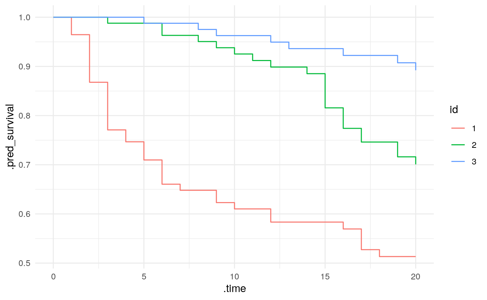
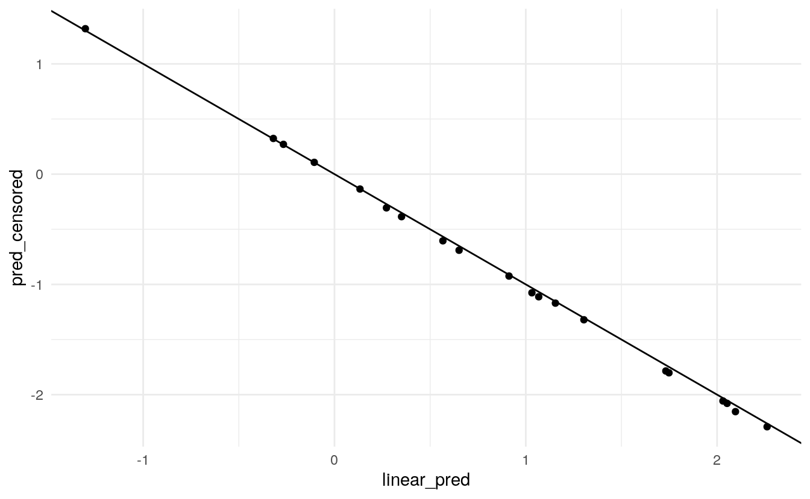

Survival analysis is an important field in modeling and there are many R packages available which implement various models, from "classic" parametric models to boosted trees. While they cover a great variety of model types, they also come with considerable amounts of heterogeneity in syntax and levels of documentation. The [tidymodels](https://www.tidymodels.org/) framework is a collection of R packages for modeling and machine learning using tidyverse principles. It provides a consistent interface to a variety of modelling functions along with tools for resampling, assessing performance, and hyperparameter tuning.

In terms of survival analysis, however, tidymodels so far hasn't been as feature-rich as we'd like it to be, e.g., the available models only covered parametric survival models. With this post we'd like to provide an update on recent work to extend the tooling for survival analysis in tidymodels and gather feedback on future plans.

Making survival analysis a first-class citizen in tidymodels requires touching several aspects across the collection of packages:

-   Pre-processing to accommodate the data structure of censored data.
-   A bigger selection of models which can be specified, fitted, and used for prediction.
-   Additional performance metrics tailored to survival data.

The new [censored](https://censored.tidymodels.org/) package along with [parsnip](https://parsnip.tidymodels.org/) offers several new models, engines, and prediction types. The censored package is not on CRAN yet but we are looking for early adopters to try it out and give us feedback! You can install it via

<pre class='chroma'><code class='language-r' data-lang='r'>devtools::<a href='https://devtools.r-lib.org//reference/remote-reexports.html'>install_github</a>("tidymodels/censored")</code></pre>

### A new mode for parsnip

Some model types can be used for multiple purposes with the same computation engine, e.g. a [`decision_tree()`](https://parsnip.tidymodels.org/reference/decision_tree.html) model can be used for either classification or regression with the `rpart` engine. This distinction is made in parsnip by [specifying the mode of a model](https://parsnip.tidymodels.org/articles/parsnip_Intro.html#motivation). We have now introduced a new `"censored regression"` mode in parsnip for models which can be used for survival analysis. The aforementioned [`decision_tree()`](https://parsnip.tidymodels.org/reference/decision_tree.html) with the `rpart` engine can also be used to fit a survival decision tree:

<pre class='chroma'><code class='language-r' data-lang='r'><a href='https://rdrr.io/r/base/library.html'>library</a>(<a href='https://github.com/tidymodels/censored'>censored</a>)

<a href='https://parsnip.tidymodels.org/reference/decision_tree.html'>decision_tree</a>() <a href='https://magrittr.tidyverse.org/reference/pipe.html'>%&gt;%</a> 
  <a href='https://parsnip.tidymodels.org/reference/set_engine.html'>set_engine</a>("rpart") <a href='https://magrittr.tidyverse.org/reference/pipe.html'>%&gt;%</a> 
  <a href='https://parsnip.tidymodels.org/reference/set_args.html'>set_mode</a>("censored regression")
#&gt; Decision Tree Model Specification (censored regression)
#&gt; 
#&gt; Computational engine: rpart</code></pre>

### Model fitting

For fitting a model, parsnip typically supports a formula and a matrix interface, regardless of the interface of the engine. For censored regression models, we are currently only supporting a formula interface. Most engines already support this type of interface, and a formula allows us to specify the outcome via the standard [`survival::Surv()`](https://rdrr.io/pkg/survival/man/Surv.html) function, tying together event time and status.

A formula also let's us specify stratification for a proportional hazards model. For the [`survival::coxph()`](https://rdrr.io/pkg/survival/man/coxph.html) function, which powers the `survival` engine for [`proportional_hazards()`](https://parsnip.tidymodels.org/reference/proportional_hazards.html), this may look like

`Surv(time, event) ~ x + z + strata(s)`

Some other packages can fit this model, let's use the glmnet package. However, [`glmnet::glmnet()`](https://glmnet.stanford.edu/reference/glmnet.html), does not have a formula interface and it requires us to specify the strata by stratifying the response via `stratifySurv(y, s)`. The response is typically a `Surv` object, so you could end up with a formula like this:

`stratifySurv(Surv(time, event), strata) ~ x + z`

This works for fitting the model but the syntax is rather convoluted on the left-hand side of the formula. The specification of the stratification is inconsistent with the approach taken by the survival package. Additionally, without further modification, prediction fails because variables on the left-hand side of the formula are treated as response variables by parsnip and are not available at prediction time.

We already need to translate from formula interface to matrix interface for this engine, and we like interfaces to be as consistent as possible here in tidymodels so we decided to go with the specification of stratification through a [`strata()`](https://rdrr.io/pkg/survival/man/strata.html) term on the right-hand side of the formula for proportional hazards models, regardless of the engine.

<pre class='chroma'><code class='language-r' data-lang='r'><a href='https://rdrr.io/r/base/library.html'>library</a>(<a href='https://github.com/therneau/survival'>survival</a>)

bladder_train &lt;- bladder[-<a href='https://rdrr.io/r/base/c.html'>c</a>(1:3),]
bladder_test &lt;- bladder[1:3,]

cox_spec &lt;- <a href='https://parsnip.tidymodels.org/reference/proportional_hazards.html'>proportional_hazards</a>(penalty = 0.123) <a href='https://magrittr.tidyverse.org/reference/pipe.html'>%&gt;%</a>
    <a href='https://parsnip.tidymodels.org/reference/set_engine.html'>set_engine</a>("glmnet")

f_fit &lt;- <a href='https://generics.r-lib.org/reference/fit.html'>fit</a>(cox_spec,
             <a href='https://rdrr.io/pkg/survival/man/Surv.html'>Surv</a>(stop, event) ~ rx + size + number + <a href='https://rdrr.io/pkg/survival/man/strata.html'>strata</a>(enum),
             data = bladder_train)</code></pre>

### Prediction

We have introduced several new prediction types: time to event (`time`), linear predictor (`linear_pred`), survival probability (`survival`), and hazard (`hazard`). Some of these types are time-dependent, e.g., the survival probability is the probability to survive beyond a certain time point. In keeping with the tidymodels design principle that each row of the data set you're predicting on should give you exactly one row in the dataset of predictions, `predict(type = "survival", time)` returns a nested tibble if `time` contains multiple time points. This can be used to approximate survival curves.

<pre class='chroma'><code class='language-r' data-lang='r'>f_pred &lt;- <a href='https://rdrr.io/r/stats/predict.html'>predict</a>(f_fit, new_data = bladder_test,
                  type = "survival", time = <a href='https://rdrr.io/r/base/seq.html'>seq</a>(0, 20, 0.5))

f_pred &lt;- f_pred <a href='https://magrittr.tidyverse.org/reference/pipe.html'>%&gt;%</a> 
  mutate(id = <a href='https://rdrr.io/r/base/factor.html'>factor</a>(1:3)) <a href='https://magrittr.tidyverse.org/reference/pipe.html'>%&gt;%</a> 
  unnest(cols = .pred)

f_pred <a href='https://magrittr.tidyverse.org/reference/pipe.html'>%&gt;%</a> 
  ggplot(aes(x = .time, y = .pred_survival, col = id)) +
  geom_line()
</code></pre>

Usually, the linear predictor is the linear combination of the predictors, weighted with the coefficients, often denoted as $x^{T} \beta$. This is what is being returned by the `glmnet` engine for [`proportional_hazards()`](https://parsnip.tidymodels.org/reference/proportional_hazards.html) models and by the `mboost` engine for [`boost_tree()`](https://parsnip.tidymodels.org/reference/boost_tree.html) models (e.g., with mode `"censored regression"`). For proportional hazards models, the linear predictor describes *relative* risk, i.e., it refers to a pair of observations: the observation $x$ and a reference observation of predictors with value 0.

The survival package implements different choices for the reference observation. As a default it uses the mean predictor, i.e., the observation $x$ is centered with the mean predictor before the usual weighted linear combination is calculated. What makes a useful reference observation is context-dependent and can be more complex than just 0 or the average. In a medical setting with predictors age and drug concentration, one might be interested in the effect relative to mean age but a drug concentration of 0 (the control group). While we think through a more general approach to specifying such a reference observation or baseline hazard, we ensure that all engines in censored use the same approach: a reference observation of 0.

Let's illustrate the difference in (default) predictions derived from the survival and censored packages and their relationship with the linear predictor. The prodlim package lets us simulate survival data with two predictors `X1` (binary) and `X2` (numeric) which both have an effect of $exp(1)$ on the hazard of the unobserved event time.

<pre class='chroma'><code class='language-r' data-lang='r'><a href='https://rdrr.io/r/base/library.html'>library</a>(<a href='https://tidymodels.tidymodels.org'>tidymodels</a>)
<a href='https://rdrr.io/r/base/library.html'>library</a>(<a href='https://ggplot2.tidyverse.org'>ggplot2</a>)
<a href='https://rdrr.io/r/base/library.html'>library</a>(prodlim)
<a href='https://rdrr.io/r/base/Random.html'>set.seed</a>(43500)

# add 0.5 to X2 (with mean 0) to demonstrate the effect of centering
train_dat &lt;- <a href='https://rdrr.io/pkg/prodlim/man/SimSurv.html'>SimSurv</a>(2000) <a href='https://magrittr.tidyverse.org/reference/pipe.html'>%&gt;%</a> mutate(X2 = X2 + 0.5)
test_dat &lt;- <a href='https://rdrr.io/pkg/prodlim/man/SimSurv.html'>SimSurv</a>(20) <a href='https://magrittr.tidyverse.org/reference/pipe.html'>%&gt;%</a> mutate(X2 = X2 + 0.5)
test_pred &lt;- test_dat[, 5:6]</code></pre>

We can compare the value of the linear predictor using the true coefficients of 1 with the predictions from the survival package. Plotting them against each other shows the offset of the mean of `X2`.

<pre class='chroma'><code class='language-r' data-lang='r'>fit_survival &lt;- <a href='https://rdrr.io/pkg/survival/man/coxph.html'>coxph</a>(<a href='https://rdrr.io/pkg/survival/man/Surv.html'>Surv</a>(time, status) ~ X1 + X2, data = train_dat)
pred_survival &lt;- <a href='https://rdrr.io/r/stats/predict.html'>predict</a>(fit_survival, newdata = test_pred)

pred &lt;- bind_cols(
  test_pred <a href='https://magrittr.tidyverse.org/reference/pipe.html'>%&gt;%</a> mutate(linear_pred = X1 * 1 + X2 * 1),
  tibble(pred_survival = pred_survival)
)

<a href='https://rdrr.io/r/base/mean.html'>mean</a>(train_dat$X2)
#&gt; [1] 0.4683339</code></pre>

<pre class='chroma'><code class='language-r' data-lang='r'>pred <a href='https://magrittr.tidyverse.org/reference/pipe.html'>%&gt;%</a> 
  <a href='https://ggplot2.tidyverse.org/reference/ggplot.html'>ggplot</a>(<a href='https://ggplot2.tidyverse.org/reference/aes.html'>aes</a>(linear_pred, pred_survival)) + 
  <a href='https://ggplot2.tidyverse.org/reference/geom_point.html'>geom_point</a>() +
  <a href='https://ggplot2.tidyverse.org/reference/geom_abline.html'>geom_abline</a>(slope = 1, intercept = 0)
</code></pre>

Measuring performance is a key element of predictive modelling. Our design philosophy in tidymodels is that the calculation of performance metrics should be agnostic to ancillary information such as the model type or the training set. Essentially all you need are the observations and the predictions. For proportional hazards models, the observation and the prediction actually describe different aspects of survival: the observation is the survival time while the prediction describes the risk; the two have an inverse relationship. To help us standardize the assessment modules, we change the sign of the linear predictor. This may be opposite to the sign of predictions obtained using the underlying engine directly. You can opt out of this by setting the `increasing` argument of [`predict()`](https://rdrr.io/r/stats/predict.html) to `FALSE`.

<pre class='chroma'><code class='language-r' data-lang='r'>fit_censored &lt;- <a href='https://parsnip.tidymodels.org/reference/proportional_hazards.html'>proportional_hazards</a>() <a href='https://magrittr.tidyverse.org/reference/pipe.html'>%&gt;%</a> 
  <a href='https://parsnip.tidymodels.org/reference/set_engine.html'>set_engine</a>("survival") <a href='https://magrittr.tidyverse.org/reference/pipe.html'>%&gt;%</a> 
  <a href='https://generics.r-lib.org/reference/fit.html'>fit</a>(<a href='https://rdrr.io/pkg/survival/man/Surv.html'>Surv</a>(time, status) ~ X1 + X2, data = train_dat)
pred_censored &lt;- <a href='https://rdrr.io/r/stats/predict.html'>predict</a>(fit_censored, type = "linear_pred", new_data = test_pred)

pred &lt;- bind_cols(
  pred,
  pred_censored <a href='https://magrittr.tidyverse.org/reference/pipe.html'>%&gt;%</a> rename(pred_censored = .pred_linear_pred)
)

pred <a href='https://magrittr.tidyverse.org/reference/pipe.html'>%&gt;%</a> 
  <a href='https://ggplot2.tidyverse.org/reference/ggplot.html'>ggplot</a>(<a href='https://ggplot2.tidyverse.org/reference/aes.html'>aes</a>(linear_pred, pred_censored)) + 
  <a href='https://ggplot2.tidyverse.org/reference/geom_point.html'>geom_point</a>() +
  <a href='https://ggplot2.tidyverse.org/reference/geom_abline.html'>geom_abline</a>(slope = -1, intercept = 0)
</code></pre>

### Model and prediction types available in censored

Currently, censored contains the following models, engine, and prediction types with ✔ indicating "available", ✖ indicating "unavailable", and ◯ indicating "to do".

| model                | engine          | time | survival | linear_pred | raw | quantile | hazard |
|:---------------------|:----------------|:-----|:---------|:------------|:----|:---------|:-------|
| bag_tree             | rpart           | ✔    | ✔        | ✖           | ✖   | ✖        | ✖      |
| boost_tree           | mboost          | ◯    | ✔        | ✔           | ✖   | ✖        | ✖      |
| decision_tree        | party           | ✔    | ✔        | ✖           | ✖   | ✖        | ✖      |
| decision_tree        | rpart           | ✔    | ✔        | ✖           | ✖   | ✖        | ✖      |
| proportional_hazards | glmnet          | ◯    | ✔        | ✔           | ✔   | ✖        | ✖      |
| proportional_hazards | survival        | ✔    | ✔        | ✔           | ✖   | ✖        | ✖      |
| rand_forest          | party           | ✔    | ✔        | ✖           | ✖   | ✖        | ✖      |
| rand_forest          | randomForestSRC | ◯    | ◯        | ✖           | ✖   | ✖        | ✖      |
| rand_forest          | ranger          | ◯    | ◯        | ✖           | ✖   | ✖        | ✖      |
| survival_reg         | flexsurv        | ✔    | ✔        | ◯           | ✖   | ✔        | ✔      |
| survival_reg         | survival        | ✔    | ✔        | ◯           | ✖   | ✔        | ✔      |

### What's next?

We want survival analysis to be a first-class citizen in tidymodels which means having access to preprocessing, resampling, models, metrics, and tuning. The next steps on that path are:

-   A role for censoring indicator columns and a step `step_surv()` in recipes.
-   A new ROC metric for survival models in yardstick.
-   An adaption of workflows and tune is to follow after that.

Additionally, we are in the process of figuring out how different types of censoring and time-dependent effects fit into our API.

We'd love to hear from you! Some questions we have include: Would you find this useful? Are there particular models/methods you'd like to see? Do you use time-dependent effects? Do you use interactions? Which types of censoring do you use?

We'd greatly appreciate feedback, ideally in the replies to the [corresponding post on RStudio Community](https://community.rstudio.com/t/feedback-on-the-censored-package-for-survival-analysis-with-tidymodels/119674)!

