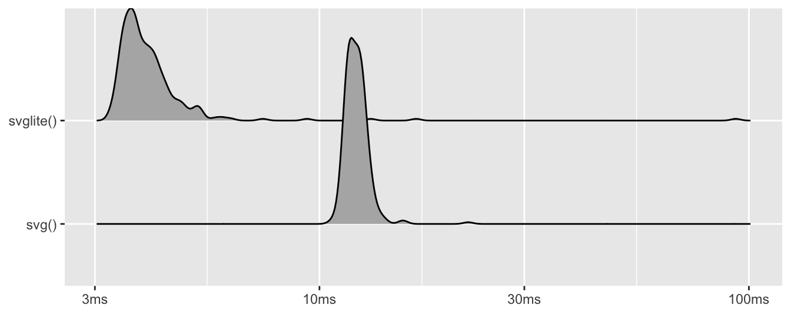
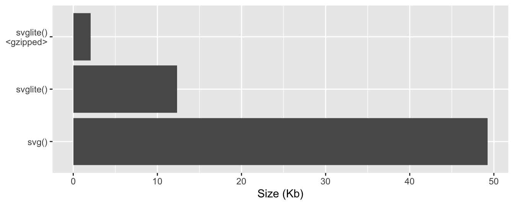

<!--
TODO:
* [x] Pick category and tags (see existing with `post_tags()`)
* [x] Find photo & update yaml metadata
* [x] Create `thumbnail-sq.jpg`; height and width should be equal
* [x] Create `thumbnail-wd.jpg`; width should be >5x height
* [x] `hugodown::tidy_thumbnail()`
* [ ] Add intro sentence
* [ ] `use_tidy_thanks()`
-->

We're extremely happy to announce the release of [svglite](https://svglite.r-lib.org) 2.0.0. svglite is a graphic device that is capable of creating SVG files from R graphics. SVG is a vector graphic format which means that it encodes the instructions for recreating a graphic in a scale-independent way. This is in contrast with raster graphics, such as PNG (as can be produced with the graphic devices in [ragg](https://ragg.r-lib.org)), which encode actual pixel values and will get pixelated as you zoom in.

You can install the latest release of svglite from CRAN with:

<div class="highlight">

<pre class='chroma'><code class='language-r' data-lang='r'><span class='nf'><a href='https://rdrr.io/r/utils/install.packages.html'>install.packages</a></span><span class='o'>(</span><span class='s'>"svglite"</span><span class='o'>)</span></code></pre>

</div>

Much time has passed since svglite had a major release and this blog post will go into detail with all the major changes. You can see a full list of changes in the [release notes](%7B%20github_release%20%7D).

Motivation for svglite
----------------------

As part of this release, we have sharpened our motivation for creating and maintaining svglite given the pre-existing [`svg()`](https://rdrr.io/r/grDevices/cairo.html) device provided by R. All of the changes that are part of this release somehow plays into these motivations and are thus grouped by them below.

### Editability

The main difference between the output of [`svg()`](https://rdrr.io/r/grDevices/cairo.html) and [`svglite()`](https://svglite.r-lib.org/reference/svglite.html) is that the former encodes text as polygons, whereas the later simply encodes it as text and relies on the svg renderer (usually a browser or a vector drawing program) to figure out the look of the text. There are upsides and downsides to this:

**Pros**

-   Encoding text as text means that you can open up the resulting SVG in a vector drawing program (e.g. Inkscape or Illustrator) and do further modifications on the text, etc. While R graphics is capable of producing amazing visualizations by itself, it is not uncommon that some amount of post-processing is required, and maximum editability of the file is a huge boon there.

-   Encoding text as text means that the resulting file is more accessible. Screen readers will be able to understand and read the text and the text is selectable and copyable.

-   File size will be dramatically smaller (more on that \[below\]).

**Cons**

-   Encoding text as polygons will mean that the file does not require the used fonts to be present on the system it is viewed on.

-   Encoding text as text means that the final look depend on the implementation of the svg renderer as well as the fonts available on the system where it is rendered. This might sound more ominous than it really is. The vast majority of interactive data visualizations on the web are now based on D3.js which often renders to SVG and it all seems to behave. Still, this is something to be mindful of, and a reason to use [`svg()`](https://rdrr.io/r/grDevices/cairo.html) if exactness of the rendered text is of prime importance.

With this release we further improve upon the editability of the output on key points:

1.  The horizontal alignment of the text is now encoded in the CSS, rather than being pre-computed and offsetted. This is only possible for *left*, *center*, and *right* alignment as these are the only recognized alignment types in SVG, so setting it to something different will still give you the old offsetting behavior. This change means that you can more easily modify center and right aligned text in post processing without messing up the alignment of the text block.

2.  Fixing of the text width is now optional. Since the text is not rendered before the SVG is opened the final width of text is unknown while it is being generated. The text width is used in key places by the R graphics engine, partly for alignment offsetting (which we don't need anymore), but also by e.g. ggplot2's `geom_label()` to figure out the size of the background box. svglite solves this by making a good guess at the width and using the `textLength` attribute of the `<text>` tag to force the renderer to make the text fit into that space. While this works, it also means that if you modify the text in post processing the text will remain at the same width no matter what you do. Since there's no single right way to handle this, we have made the fixing of text width optional using the `fix_text_size` argument. It defaults to `TRUE` which is the old behavior, but if you know you are going to edit some aspect of the text in post processing you can set it to `FALSE`.

### Speed

When first created, svglite was much faster than [`svg()`](https://rdrr.io/r/grDevices/cairo.html), but at some point this regressed quite considerably so the previous release of svglite was rather slow. This release not only brings svglite back to its past glory, but improves further upon it: this release is \~13x faster than the previous and is \~3x faster than using [`svg()`](https://rdrr.io/r/grDevices/cairo.html) (based on admittedly simple benchmark in the [readme](https://svglite.r-lib.org/index.html#speed)).

<div class="highlight">

<pre class='chroma'><code class='language-r' data-lang='r'><span class='kr'><a href='https://rdrr.io/r/base/library.html'>library</a></span><span class='o'>(</span><span class='nv'><a href='http://tidyverse.tidyverse.org'>tidyverse</a></span><span class='o'>)</span>
<span class='kr'><a href='https://rdrr.io/r/base/library.html'>library</a></span><span class='o'>(</span><span class='nv'><a href='https://svglite.r-lib.org'>svglite</a></span><span class='o'>)</span>

<span class='nv'>x</span> <span class='o'>&lt;-</span> <span class='nf'><a href='https://rdrr.io/r/stats/Uniform.html'>runif</a></span><span class='o'>(</span><span class='m'>1e3</span><span class='o'>)</span>
<span class='nv'>y</span> <span class='o'>&lt;-</span> <span class='nf'><a href='https://rdrr.io/r/stats/Uniform.html'>runif</a></span><span class='o'>(</span><span class='m'>1e3</span><span class='o'>)</span>
<span class='nv'>tmp1</span> <span class='o'>&lt;-</span> <span class='nf'><a href='https://rdrr.io/r/base/tempfile.html'>tempfile</a></span><span class='o'>(</span><span class='o'>)</span>
<span class='nv'>tmp2</span> <span class='o'>&lt;-</span> <span class='nf'><a href='https://rdrr.io/r/base/tempfile.html'>tempfile</a></span><span class='o'>(</span><span class='o'>)</span>

<span class='nv'>svglite_test</span> <span class='o'>&lt;-</span> <span class='kr'>function</span><span class='o'>(</span><span class='o'>)</span> <span class='o'>&#123;</span>
  <span class='nf'><a href='https://svglite.r-lib.org/reference/svglite.html'>svglite</a></span><span class='o'>(</span><span class='nv'>tmp1</span><span class='o'>)</span>
  <span class='nf'><a href='https://rdrr.io/r/graphics/plot.default.html'>plot</a></span><span class='o'>(</span><span class='nv'>x</span>, <span class='nv'>y</span><span class='o'>)</span>
  <span class='nf'><a href='https://rdrr.io/r/grDevices/dev.html'>dev.off</a></span><span class='o'>(</span><span class='o'>)</span>
<span class='o'>&#125;</span>
<span class='nv'>svg_test</span> <span class='o'>&lt;-</span> <span class='kr'>function</span><span class='o'>(</span><span class='o'>)</span> <span class='o'>&#123;</span>
  <span class='nf'><a href='https://rdrr.io/r/grDevices/cairo.html'>svg</a></span><span class='o'>(</span><span class='nv'>tmp2</span>, onefile <span class='o'>=</span> <span class='kc'>TRUE</span><span class='o'>)</span>
  <span class='nf'><a href='https://rdrr.io/r/graphics/plot.default.html'>plot</a></span><span class='o'>(</span><span class='nv'>x</span>, <span class='nv'>y</span><span class='o'>)</span>
  <span class='nf'><a href='https://rdrr.io/r/grDevices/dev.html'>dev.off</a></span><span class='o'>(</span><span class='o'>)</span>
<span class='o'>&#125;</span>

<span class='nf'>bench</span><span class='nf'>::</span><span class='nf'><a href='https://rdrr.io/pkg/bench/man/mark.html'>mark</a></span><span class='o'>(</span>
  <span class='s'>"svglite()"</span> <span class='o'>=</span> <span class='nf'>svglite_test</span><span class='o'>(</span><span class='o'>)</span>, 
  <span class='s'>"svg()"</span> <span class='o'>=</span> <span class='nf'>svg_test</span><span class='o'>(</span><span class='o'>)</span>, 
  min_iterations <span class='o'>=</span> <span class='m'>250</span>
<span class='o'>)</span> <span class='o'>%&gt;%</span> 
  <span class='nf'><a href='https://rdrr.io/r/graphics/plot.default.html'>plot</a></span><span class='o'>(</span>type <span class='o'>=</span> <span class='s'>"ridge"</span><span class='o'>)</span> <span class='o'>+</span> 
  <span class='nf'>labs</span><span class='o'>(</span>x <span class='o'>=</span> <span class='kc'>NULL</span>, y <span class='o'>=</span> <span class='kc'>NULL</span><span class='o'>)</span>
</code></pre>


</div>

The additional speed is mainly achieved by no longer ensuring that the file is valid svg *while* it is being rendered. If you need this, you can get the old behavior (and speed) back by setting `always_valid = TRUE` when opening the device. You should however consider using [`svgstring()`](https://svglite.r-lib.org/reference/svgstring.html) instead of [`svglite()`](https://svglite.r-lib.org/reference/svglite.html) if you need to continuously access the svg while it is being rendered.

### File size

svglite has always produced smaller files than the [`svg()`](https://rdrr.io/r/grDevices/cairo.html) device because of the difference in how text is encoded, but this has been improved on further with this release, mainly by being smarter about how to handle clipping regions in the plot. Another file-size-related feature in the new release is built-in support for SVGZ (gzipped SVG), simply by providing a file name with an `.svgz` extension:

<div class="highlight">

<pre class='chroma'><code class='language-r' data-lang='r'><span class='nv'>p</span> <span class='o'>&lt;-</span> <span class='nf'>ggplot</span><span class='o'>(</span><span class='nv'>mtcars</span><span class='o'>)</span> <span class='o'>+</span> 
  <span class='nf'>geom_point</span><span class='o'>(</span><span class='nf'>aes</span><span class='o'>(</span>x <span class='o'>=</span> <span class='nv'>disp</span>, y <span class='o'>=</span> <span class='nv'>mpg</span>, color <span class='o'>=</span> <span class='nv'>gear</span><span class='o'>)</span><span class='o'>)</span>

<span class='nv'>svglite_file</span> <span class='o'>&lt;-</span> <span class='nf'><a href='https://rdrr.io/r/base/tempfile.html'>tempfile</a></span><span class='o'>(</span><span class='o'>)</span>
<span class='nv'>svglite_file_gz</span> <span class='o'>&lt;-</span> <span class='nf'><a href='https://rdrr.io/r/base/tempfile.html'>tempfile</a></span><span class='o'>(</span>fileext <span class='o'>=</span> <span class='s'>".svgz"</span><span class='o'>)</span>
<span class='nv'>svg_file</span> <span class='o'>&lt;-</span> <span class='nf'><a href='https://rdrr.io/r/base/tempfile.html'>tempfile</a></span><span class='o'>(</span><span class='o'>)</span>

<span class='nf'><a href='https://svglite.r-lib.org/reference/svglite.html'>svglite</a></span><span class='o'>(</span><span class='nv'>svglite_file</span><span class='o'>)</span>
<span class='nf'><a href='https://rdrr.io/r/graphics/plot.default.html'>plot</a></span><span class='o'>(</span><span class='nv'>p</span><span class='o'>)</span>
<span class='nf'><a href='https://rdrr.io/r/base/invisible.html'>invisible</a></span><span class='o'>(</span><span class='nf'><a href='https://rdrr.io/r/grDevices/dev.html'>dev.off</a></span><span class='o'>(</span><span class='o'>)</span><span class='o'>)</span>

<span class='nf'><a href='https://svglite.r-lib.org/reference/svglite.html'>svglite</a></span><span class='o'>(</span><span class='nv'>svglite_file_gz</span><span class='o'>)</span>
<span class='nf'><a href='https://rdrr.io/r/graphics/plot.default.html'>plot</a></span><span class='o'>(</span><span class='nv'>p</span><span class='o'>)</span>
<span class='nf'><a href='https://rdrr.io/r/base/invisible.html'>invisible</a></span><span class='o'>(</span><span class='nf'><a href='https://rdrr.io/r/grDevices/dev.html'>dev.off</a></span><span class='o'>(</span><span class='o'>)</span><span class='o'>)</span>

<span class='nf'><a href='https://rdrr.io/r/grDevices/cairo.html'>svg</a></span><span class='o'>(</span><span class='nv'>svg_file</span><span class='o'>)</span>
<span class='nf'><a href='https://rdrr.io/r/graphics/plot.default.html'>plot</a></span><span class='o'>(</span><span class='nv'>p</span><span class='o'>)</span>
<span class='nf'><a href='https://rdrr.io/r/base/invisible.html'>invisible</a></span><span class='o'>(</span><span class='nf'><a href='https://rdrr.io/r/grDevices/dev.html'>dev.off</a></span><span class='o'>(</span><span class='o'>)</span><span class='o'>)</span>

<span class='nv'>sizes</span> <span class='o'>&lt;-</span> <span class='nf'><a href='https://rdrr.io/r/base/data.frame.html'>data.frame</a></span><span class='o'>(</span>
  device <span class='o'>=</span> <span class='nf'><a href='https://rdrr.io/r/base/c.html'>c</a></span><span class='o'>(</span><span class='s'>"svglite()"</span>, <span class='s'>"svglite()\n&lt;gzipped&gt;"</span>, <span class='s'>"svg()"</span><span class='o'>)</span>,
  size <span class='o'>=</span> <span class='nf'>fs</span><span class='nf'>::</span><span class='nf'><a href='http://fs.r-lib.org/reference/file_info.html'>file_size</a></span><span class='o'>(</span><span class='nf'><a href='https://rdrr.io/r/base/c.html'>c</a></span><span class='o'>(</span><span class='nv'>svglite_file</span>, <span class='nv'>svglite_file_gz</span>, <span class='nv'>svg_file</span><span class='o'>)</span><span class='o'>)</span>
<span class='o'>)</span>

<span class='nf'>ggplot</span><span class='o'>(</span><span class='nv'>sizes</span><span class='o'>)</span> <span class='o'>+</span> 
  <span class='nf'>geom_col</span><span class='o'>(</span><span class='nf'>aes</span><span class='o'>(</span>x <span class='o'>=</span> <span class='nv'>size</span> <span class='o'>/</span> <span class='m'>1024</span>, y <span class='o'>=</span> <span class='nv'>device</span><span class='o'>)</span><span class='o'>)</span> <span class='o'>+</span> 
  <span class='nf'>labs</span><span class='o'>(</span>x <span class='o'>=</span> <span class='s'>"Size (Kb)"</span>, y <span class='o'>=</span> <span class='kc'>NULL</span><span class='o'>)</span>
</code></pre>


</div>

### Font support

You may remember a few days ago when we [announced some major improvements to ragg and its rendering of text](https://www.tidyverse.org/blog/2021/02/modern-text-features/). What about svglite? For the most part svglite has delegated its rendering of text to the svg renderer so by and large it has always supported advanced text features such as right-to-left text, font fallback, and color fonts. Some changes have spilled over though, as svglite is now also based on systemfonts and uses that for doing font lookup and text width calculations. This change means that svglite now have direct access to all your installed fonts along with whatever you have registered with [`register_font()`](https://rdrr.io/pkg/systemfonts/man/register_font.html) and [`register_variant()`](https://rdrr.io/pkg/systemfonts/man/register_variant.html). If you have registered any OpenType features or alternative weights with a font you use, these will now be encoded into the CSS of the text block:

<div class="highlight">

<pre class='chroma'><code class='language-r' data-lang='r'><span class='kr'><a href='https://rdrr.io/r/base/library.html'>library</a></span><span class='o'>(</span><span class='nv'><a href='https://github.com/r-lib/systemfonts'>systemfonts</a></span><span class='o'>)</span>
<span class='nf'><a href='https://rdrr.io/pkg/systemfonts/man/register_variant.html'>register_variant</a></span><span class='o'>(</span>
  name <span class='o'>=</span> <span class='s'>"Montserrat Extreme"</span>, 
  family <span class='o'>=</span> <span class='s'>"Montserrat"</span>, 
  weight <span class='o'>=</span> <span class='s'>"semibold"</span>,
  features <span class='o'>=</span> <span class='nf'><a href='https://rdrr.io/pkg/systemfonts/man/font_feature.html'>font_feature</a></span><span class='o'>(</span>ligatures <span class='o'>=</span> <span class='s'>"discretionary"</span>, letters <span class='o'>=</span> <span class='s'>"stylistic"</span><span class='o'>)</span>
<span class='o'>)</span>

<span class='nv'>p</span> <span class='o'>&lt;-</span> <span class='nf'>ggplot</span><span class='o'>(</span><span class='o'>)</span> <span class='o'>+</span> 
  <span class='nf'>geom_text</span><span class='o'>(</span>
    <span class='nf'>aes</span><span class='o'>(</span>x <span class='o'>=</span> <span class='m'>0</span>, y <span class='o'>=</span> <span class='m'>1</span>, label <span class='o'>=</span> <span class='s'>"This text should definitely differ"</span><span class='o'>)</span>,
    family <span class='o'>=</span> <span class='s'>"Montserrat"</span>,
    size <span class='o'>=</span> <span class='m'>6</span>
  <span class='o'>)</span> <span class='o'>+</span> 
  <span class='nf'>geom_text</span><span class='o'>(</span>
    <span class='nf'>aes</span><span class='o'>(</span>x <span class='o'>=</span> <span class='m'>0</span>, y <span class='o'>=</span> <span class='m'>0</span>, label <span class='o'>=</span> <span class='s'>"This text should definitely differ"</span><span class='o'>)</span>,
    family <span class='o'>=</span> <span class='s'>"Montserrat Extreme"</span>,
    size <span class='o'>=</span> <span class='m'>6</span>
  <span class='o'>)</span> <span class='o'>+</span> 
  <span class='nf'>theme_void</span><span class='o'>(</span><span class='o'>)</span> <span class='o'>+</span> 
  <span class='nf'>expand_limits</span><span class='o'>(</span>y <span class='o'>=</span> <span class='nf'><a href='https://rdrr.io/r/base/c.html'>c</a></span><span class='o'>(</span><span class='o'>-</span><span class='m'>1</span>, <span class='m'>2</span><span class='o'>)</span><span class='o'>)</span>

<span class='nv'>svg</span> <span class='o'>&lt;-</span> <span class='nf'><a href='https://svglite.r-lib.org/reference/svgstring.html'>svgstring</a></span><span class='o'>(</span>fix_text_size <span class='o'>=</span> <span class='kc'>FALSE</span>, standalone <span class='o'>=</span> <span class='kc'>FALSE</span><span class='o'>)</span>
<span class='nf'><a href='https://rdrr.io/r/graphics/plot.default.html'>plot</a></span><span class='o'>(</span><span class='nv'>p</span><span class='o'>)</span>
<span class='nf'><a href='https://rdrr.io/r/base/invisible.html'>invisible</a></span><span class='o'>(</span><span class='nf'><a href='https://rdrr.io/r/grDevices/dev.html'>dev.off</a></span><span class='o'>(</span><span class='o'>)</span><span class='o'>)</span>

<span class='nf'><a href='https://rdrr.io/r/grDevices/cairo.html'>svg</a></span><span class='o'>(</span><span class='o'>)</span></code></pre>

</div>

``` svg
<svg class='svglite' width='720.00pt' height='576.00pt' viewBox='0 0 720.00 576.00'>
<defs>
  <style type='text/css'><![CDATA[
    .svglite line, .svglite polyline, .svglite polygon, .svglite path, .svglite rect, .svglite circle {
      fill: none;
      stroke: #000000;
      stroke-linecap: round;
      stroke-linejoin: round;
      stroke-miterlimit: 10.00;
    }
  ]]></style>
</defs>
<rect width='100%' height='100%' style='stroke: none; fill: #FFFFFF;'/>
<defs>
  <clipPath id='cpMC4wMHw3MjAuMDB8MC4wMHw1NzYuMDA='>
    <rect x='0.00' y='0.00' width='720.00' height='576.00' />
  </clipPath>
</defs>
<g clip-path='url(#cpMC4wMHw3MjAuMDB8MC4wMHw1NzYuMDA=)'>
<text x='360.00' y='206.70' text-anchor='middle' style='font-size: 17.07px; font-family: Montserrat;'>This text should definitely differ</text>
<text x='360.00' y='381.25' text-anchor='middle' style='font-size: 17.07px; font-weight: 600; font-family: Montserrat; font-feature-settings: "dlig" 1,"salt" 1;'>This text should definitely differ</text>
</g>
</svg>
```

If you compare the two `<text>` tags in the end, you can see that the last one has the equivalent of *semibold* (600) encoded as the weight, along with the registered font feature settings (*dlig* is the tag for discretionary ligatures and *salt* is the tag for stylistic alternatives).

The switch to using systemfonts means that two old arguments to svglite: `system_fonts` and `user_fonts` have become superseded by the font registration in systemfonts. While they work for now they will likely become deprecated in the future as we streamline the text handling among our graphics devices.

The last addition to font handling in svglite is the support for embedding web font imports in the output. As we discussed in the [editability](#editability) section, the output from svglite will only render correctly if the used fonts are available. This is not a given when using non-standard fonts, but CSS provides a safety net by allowing the viewer to download fonts on the fly if required. You can specify a web font in two ways:

1.  As a URL (e.g. from Google Fonts) which will be used in an `@import` directive.

2.  Using [`font_face()`](https://svglite.r-lib.org/reference/font_face.html) which allows you to manually set the location of different font files and local backup fonts along with a identification name and potential styles to use. This will all be collected into a `@font-face` directive.

We can use this with the example above to make sure that the SVG renders correctly even on computers that doesn't have the Montserrat font installed.

<div class="highlight">

<pre class='chroma'><code class='language-r' data-lang='r'><span class='nv'>svg</span> <span class='o'>&lt;-</span> <span class='nf'><a href='https://svglite.r-lib.org/reference/svgstring.html'>svgstring</a></span><span class='o'>(</span>
  width <span class='o'>=</span> <span class='m'>6</span>, height <span class='o'>=</span> <span class='m'>2</span>,
  web_fonts <span class='o'>=</span> <span class='nf'><a href='https://rdrr.io/r/base/list.html'>list</a></span><span class='o'>(</span>
    <span class='s'>"https://brick.freetls.fastly.net/Montserrat:400,600"</span>
  <span class='o'>)</span>,
  fix_text_size <span class='o'>=</span> <span class='kc'>FALSE</span>, 
  standalone <span class='o'>=</span> <span class='kc'>FALSE</span>
<span class='o'>)</span>
<span class='nf'><a href='https://rdrr.io/r/graphics/plot.default.html'>plot</a></span><span class='o'>(</span><span class='nv'>p</span><span class='o'>)</span>
<span class='nf'><a href='https://rdrr.io/r/base/invisible.html'>invisible</a></span><span class='o'>(</span><span class='nf'><a href='https://rdrr.io/r/grDevices/dev.html'>dev.off</a></span><span class='o'>(</span><span class='o'>)</span><span class='o'>)</span>

<span class='nf'><a href='https://rdrr.io/r/grDevices/cairo.html'>svg</a></span><span class='o'>(</span><span class='o'>)</span>
</code></pre>
<svg class="svglite" width="432.00pt" height="144.00pt" viewBox="0 0 432.00 144.00">
<defs>
<style type='text/css'><![CDATA[
    @import url("https://brick.freetls.fastly.net/Montserrat:400,600");
    .svglite line, .svglite polyline, .svglite polygon, .svglite path, .svglite rect, .svglite circle {
      fill: none;
      stroke: #000000;
      stroke-linecap: round;
      stroke-linejoin: round;
      stroke-miterlimit: 10.00;
    }
  ]]></style>
</defs> <rect width='100%' height='100%' style='stroke: none; fill: #FFFFFF;'/> <defs> <clipPath id='cpMC4wMHw0MzIuMDB8MC4wMHwxNDQuMDA='> <rect x='0.00' y='0.00' width='432.00' height='144.00' /> </clipPath> </defs> <g clip-path='url(#cpMC4wMHw0MzIuMDB8MC4wMHwxNDQuMDA=)'> <text x='216.00' y='56.15' text-anchor='middle' style='font-size: 17.07px; font-family: Montserrat;'>This text should definitely differ</text> <text x='216.00' y='99.79' text-anchor='middle' style='font-size: 17.07px; font-weight: 600; font-family: Montserrat; font-feature-settings: "dlig" 1,"salt" 1;'>This text should definitely differ</text> </g>
</svg>

</div>

I'm using [Brick](https://brick.im) as a web font host since they include all OpenType features in their served font (which we need here), but the mechanism is the same for using e.g. [Google Font](https://fonts.google.com).

All the rest
------------

These are just some of the many new features in this release. Depending on your temperament these other features may also get you excited:

-   Support for generating multiple SVG files in one go using the standard file naming pattern (e.g. `"Rplot%03d.svg"`).

-   Direct encoding of raster data instead of rendering it through Cairo (this avoids downscaling any raster data).

-   Addition of a top-level `.svglite` class and possibility of adding a custom top-level id.

-   Addition of `scaling` argument in line with the ragg devices.

Acknowledgments
---------------

This release comprises the work of 15 different contributors. Thank you all for your thoughtful comments, patience, and hard work!

[@barrel0luck](https://github.com/barrel0luck), [@CameronNemo](https://github.com/CameronNemo), [@cpsievert](https://github.com/cpsievert), [@hadley](https://github.com/hadley), [@jeroen](https://github.com/jeroen), [@jimhester](https://github.com/jimhester), [@jplecavalier](https://github.com/jplecavalier), [@kurpav00](https://github.com/kurpav00), [@kuzmenkov111](https://github.com/kuzmenkov111), [@nx10](https://github.com/nx10), [@paessens](https://github.com/paessens), [@pmur002](https://github.com/pmur002), [@sqjin](https://github.com/sqjin), [@svenyos](https://github.com/svenyos), and [@thomasp85](https://github.com/thomasp85).

