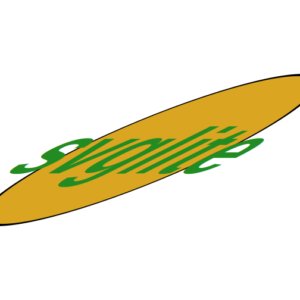

<style type='text/css'>
pre {
  text-wrap: nowrap;
  overflow-x: scroll;
}
</style>

<!--
TODO:
* [x] Look over / edit the post's title in the yaml
* [x] Edit (or delete) the description; note this appears in the Twitter card
* [x] Pick category and tags (see existing with `hugodown::tidy_show_meta()`)
* [x] Find photo & update yaml metadata
* [x] Create `thumbnail-sq.jpg`; height and width should be equal
* [x] Create `thumbnail-wd.jpg`; width should be >5x height
* [x] `hugodown::use_tidy_thumbnails()`
* [x] Add intro sentence, e.g. the standard tagline for the package
* [x] `usethis::use_tidy_thanks()`
-->

We're pleased to announce the release of [svglite](https://svglite.r-lib.org) 2.2.0. svglite is a graphic device that is capable of creating SVG files from R graphics. SVG is a vector graphic format which means that it encodes the instructions for recreating a graphic in a scale-independent way. This is in contrast with raster graphics, such as PNG (as can be produced with the graphic devices in [ragg](https://ragg.r-lib.org)), which encode actual pixel values and will get pixelated as you zoom in.

You can install it from CRAN with:


``` r
install.packages("svglite")
```

This blog post will describe the news features available the release, with a special focus on text rendering and font handling.

You can see a full list of changes in the [release notes](https://svglite.r-lib.org/news/index.html)


``` r
library(svglite)
library(grid)
```

## Graphics engine support

With this release svglite now supports all the latest features offered by the R graphics engine. The graphics engine is the part of R that communicate plotting instructions from the user to the graphics device, and the last couple of years Paul Murrell has made a huge amount of working adding to what is possible with R graphics. svglite already supported a bunch of these with the 2.0.0 release, but with 2.2.0 the support is complete (for now).

### Stroking and filling complex paths

[In 4.2.0 R gained the ability to create complex path objects](https://www.stat.auckland.ac.nz/~paul/Reports/GraphicsEngine/paths/paths.html) out of (almost) any grob or collection of grobs. Now, svglite supports this, even allowing text to be used. First, let's see how a compound grob looks when it is rendered normally:


``` r
circle <- circleGrob(
  r = .25,
  gp = gpar(col = "black", lwd = 5, fill = "goldenrod")
)
text <- textGrob(
  "svglite",
  gp = gpar(col = "forestgreen", fontsize = 110, fontface = "bold")
)
gt <- gTree(
  children = gList(
    circle,
    text
  )
)

grid.draw(gt)
```


Instead, if we render it as a compound path (using the even-odd filling rule) we get this:


``` r
grid.draw(
  fillGrob(gt, rule = "evenodd", gp = gpar(fill = "steelblue"))
)
```


Observe how everything is now part of the same graphic object, and that the even-odd filling rule makes it so that the overlap is empty. Another point is that the graphic parameters of the composite grob doesn't have an effect on the compound path as only the path information is used.

If you open up the two SVGs in a vector image editor like Inkscape or Affinity Designer, you can see another difference. In the first SVG the text is still editable, while in the second it is not. This is because that in order to support compound paths the glyphs have to be converted to paths, destroying the notion of "text" they might have had.

### Groups

Another novelty in R 4.2.0 was the ability to define "groups" that could be reused, composed, and transformed. This is now also possible in svglite, though with a slight limitation in the number of composition operators possible. Inexplicably, the SVG standard has mode Porter-Duff composition way more complicated than colour blending to the extent that it doesn't really work with how the graphics engine is set up. Still, most of what makes groups great works:


``` r
grid.group(text, "difference", circle)
```


``` r
grid.define(gt, name = "gt")
grid.use(
  "gt",
  transform = \(...) {
    viewportTransform(..., shear = groupShear(sx = 2))
  }
)
```



### Glyphs

A slightly newer feature that came with R 4.3.0 is the glyph interface for rendering rich text. Despite the fact that this is what allows complex text layouting to work in e.g. [marquee](https://marquee.r-lib.org), at the device side it is actually really simple. It gets a font file, an index for the glyph in that file, and a location for the glyph and is then tasked with rendering it. This is in contrast with the standard text support where you get a string, a font family name, etc. and have to figure out on your own the location of the font file, how glyphs should be placed to look correct etc.

Still, the glyph interface presents a problem for svglite because it tries very hard to create output that can be edited in post-production, and in order to support the glyph interface we have to (like with the compound paths above) render the glyphs as `<path>` elements instead of `<text>` elements. There is simply no way in SVG to place glyphs individually based on a font file and a glyph index. However, some support is better than none, so until I find a way to render marquee text in an editable way with svglite, you have at least support for rendering of the text:


``` r
grid.draw(
  marquee::marquee_grob(
    "This *is* now working with `{svglite}` 🎉",
    style = marquee::classic_style(base_size = 28),
    y = 0.5
  )
)
```


Again, opening up the SVG in a text editor you'll see no trace of the input text there as it has all been converted to `<path>` elements (and an `<image>` element in the case of the emoji)

## Font embedding

If you have followed my work over the last years you know that I've grown to care deeply about text rendering, and it's cousin: font handling. SVG files (as well as PDF files) are special in that regard because the text is not rendered directly in the file (except for the glyph implementation discussed above), but rather postponed until the file is opened. This poses the problem of the font potentially not being available on the machine(s) that is eventually going to open the file.

You can avoid all of these by only using fonts that are considered "web-safe", such as Arial, Times New Roman, Courier, etc. but what a poor world to live in if those fonts were the only ones used in data visualization. Instead, you can use whatever font you like and embed the font specification in the file so it travels along and is available wherever the file is opened.

`svglite()` has for a while had the `web_fonts` argument which allow you to specify font imports to add to the SVG file. With the new release, however, this has been tightened up and in unison with new functionality in systemfonts I believe the gordian knot of font handling in SVGs have finally been untied (this statement will come back to hunt me, I'm sure).

systemfonts now provide the function `fonts_as_import()`, which allows you to get a URL pointing to a stylesheet with the font to be added. Most often, the font will be served by [Google Fonts](https://fonts.google.com), but the alternative repository [Font Library](https://fontlibrary.org) is also supported:


``` r
fonts_as_import("Open Sans")
```

```
## [1] "https://fonts.googleapis.com/css2?family=Open+Sans&display=swap"
```

``` r
fonts_as_import("Bedstead")
```

```
## [1] "https://fontlibrary.org/face/bedstead"
```

The output of this function can be used directly in the `web_fonts` argument making it very easy to embed any font of your liking in an SVG. Even easier, you can also just pass in the font family name and svglite will take care of the rest (though you loose out on the customization offered by `fonts_as_import()`):


``` r
library(ggplot2)
require_font("Almendra")

p <- ggplot(na.omit(penguins)) +
  geom_point(aes(flipper_len, body_mass, colour = species)) +
  theme_minimal(base_family = "Almendra")

svg <- svgstring(web_fonts = "Almendra", scaling = 2)
plot(p)
invisible(dev.off())
svg()
```

<?xml version='1.0' encoding='UTF-8' ?>
<svg xmlns='http://www.w3.org/2000/svg' xmlns:xlink='http://www.w3.org/1999/xlink' width='720.00pt' height='576.00pt' viewBox='0 0 720.00 576.00'>
<g class='svglite'>
<defs>
  <style type='text/css'><![CDATA[
    @import url('https://fonts.googleapis.com/css2?family=Almendra&display=swap');
    .svglite line, .svglite polyline, .svglite polygon, .svglite path, .svglite rect, .svglite circle {
      fill: none;
      stroke: #000000;
      stroke-linecap: round;
      stroke-linejoin: round;
      stroke-miterlimit: 10.00;
    }
    .svglite text {
      white-space: pre;
    }
    .svglite g.glyphgroup path {
      fill: inherit;
      stroke: none;
    }
  ]]></style>
</defs>
<rect width='100%' height='100%' style='stroke: none; fill: #FFFFFF;'/>
<defs>
  <clipPath id='cpMC4wMHw3MjAuMDB8MC4wMHw1NzYuMDA='>
    <rect x='0.00' y='0.00' width='720.00' height='576.00' />
  </clipPath>
</defs>
<g clip-path='url(#cpMC4wMHw3MjAuMDB8MC4wMHw1NzYuMDA=)'>
</g>
<defs>
  <clipPath id='cpODAuNDJ8NTQ5LjUzfDEwLjk2fDUxNC42MQ=='>
    <rect x='80.42' y='10.96' width='469.11' height='503.65' />
  </clipPath>
</defs>
<g clip-path='url(#cpODAuNDJ8NTQ5LjUzfDEwLjk2fDUxNC42MQ==)'>
<polyline points='80.42,389.97 549.53,389.97 ' style='stroke-width: 1.07; stroke: #EBEBEB; stroke-linecap: butt;' />
<polyline points='80.42,262.78 549.53,262.78 ' style='stroke-width: 1.07; stroke: #EBEBEB; stroke-linecap: butt;' />
<polyline points='80.42,135.60 549.53,135.60 ' style='stroke-width: 1.07; stroke: #EBEBEB; stroke-linecap: butt;' />
<polyline points='123.43,514.61 123.43,10.96 ' style='stroke-width: 1.07; stroke: #EBEBEB; stroke-linecap: butt;' />
<polyline points='195.71,514.61 195.71,10.96 ' style='stroke-width: 1.07; stroke: #EBEBEB; stroke-linecap: butt;' />
<polyline points='267.99,514.61 267.99,10.96 ' style='stroke-width: 1.07; stroke: #EBEBEB; stroke-linecap: butt;' />
<polyline points='340.28,514.61 340.28,10.96 ' style='stroke-width: 1.07; stroke: #EBEBEB; stroke-linecap: butt;' />
<polyline points='412.56,514.61 412.56,10.96 ' style='stroke-width: 1.07; stroke: #EBEBEB; stroke-linecap: butt;' />
<polyline points='484.84,514.61 484.84,10.96 ' style='stroke-width: 1.07; stroke: #EBEBEB; stroke-linecap: butt;' />
<polyline points='80.42,453.56 549.53,453.56 ' style='stroke-width: 2.13; stroke: #EBEBEB; stroke-linecap: butt;' />
<polyline points='80.42,326.37 549.53,326.37 ' style='stroke-width: 2.13; stroke: #EBEBEB; stroke-linecap: butt;' />
<polyline points='80.42,199.19 549.53,199.19 ' style='stroke-width: 2.13; stroke: #EBEBEB; stroke-linecap: butt;' />
<polyline points='80.42,72.01 549.53,72.01 ' style='stroke-width: 2.13; stroke: #EBEBEB; stroke-linecap: butt;' />
<polyline points='87.29,514.61 87.29,10.96 ' style='stroke-width: 2.13; stroke: #EBEBEB; stroke-linecap: butt;' />
<polyline points='159.57,514.61 159.57,10.96 ' style='stroke-width: 2.13; stroke: #EBEBEB; stroke-linecap: butt;' />
<polyline points='231.85,514.61 231.85,10.96 ' style='stroke-width: 2.13; stroke: #EBEBEB; stroke-linecap: butt;' />
<polyline points='304.13,514.61 304.13,10.96 ' style='stroke-width: 2.13; stroke: #EBEBEB; stroke-linecap: butt;' />
<polyline points='376.42,514.61 376.42,10.96 ' style='stroke-width: 2.13; stroke: #EBEBEB; stroke-linecap: butt;' />
<polyline points='448.70,514.61 448.70,10.96 ' style='stroke-width: 2.13; stroke: #EBEBEB; stroke-linecap: butt;' />
<polyline points='520.98,514.61 520.98,10.96 ' style='stroke-width: 2.13; stroke: #EBEBEB; stroke-linecap: butt;' />
<circle cx='166.80' cy='358.17' r='3.91' style='stroke-width: 1.42; stroke: #F8766D; fill: #F8766D;' />
<circle cx='202.94' cy='351.81' r='3.91' style='stroke-width: 1.42; stroke: #F8766D; fill: #F8766D;' />
<circle cx='267.99' cy='421.76' r='3.91' style='stroke-width: 1.42; stroke: #F8766D; fill: #F8766D;' />
<circle cx='253.54' cy='396.33' r='3.91' style='stroke-width: 1.42; stroke: #F8766D; fill: #F8766D;' />
<circle cx='231.85' cy='370.89' r='3.91' style='stroke-width: 1.42; stroke: #F8766D; fill: #F8766D;' />
<circle cx='166.80' cy='374.07' r='3.91' style='stroke-width: 1.42; stroke: #F8766D; fill: #F8766D;' />
<circle cx='267.99' cy='240.53' r='3.91' style='stroke-width: 1.42; stroke: #F8766D; fill: #F8766D;' />
<circle cx='174.03' cy='428.12' r='3.91' style='stroke-width: 1.42; stroke: #F8766D; fill: #F8766D;' />
<circle cx='239.08' cy='351.81' r='3.91' style='stroke-width: 1.42; stroke: #F8766D; fill: #F8766D;' />
<circle cx='289.68' cy='275.50' r='3.91' style='stroke-width: 1.42; stroke: #F8766D; fill: #F8766D;' />
<circle cx='195.71' cy='364.53' r='3.91' style='stroke-width: 1.42; stroke: #F8766D; fill: #F8766D;' />
<circle cx='267.99' cy='396.33' r='3.91' style='stroke-width: 1.42; stroke: #F8766D; fill: #F8766D;' />
<circle cx='282.45' cy='262.78' r='3.91' style='stroke-width: 1.42; stroke: #F8766D; fill: #F8766D;' />
<circle cx='188.48' cy='412.22' r='3.91' style='stroke-width: 1.42; stroke: #F8766D; fill: #F8766D;' />
<circle cx='260.77' cy='300.94' r='3.91' style='stroke-width: 1.42; stroke: #F8766D; fill: #F8766D;' />
<circle cx='116.20' cy='402.68' r='3.91' style='stroke-width: 1.42; stroke: #F8766D; fill: #F8766D;' />
<circle cx='159.57' cy='377.25' r='3.91' style='stroke-width: 1.42; stroke: #F8766D; fill: #F8766D;' />
<circle cx='224.63' cy='351.81' r='3.91' style='stroke-width: 1.42; stroke: #F8766D; fill: #F8766D;' />
<circle cx='195.71' cy='332.73' r='3.91' style='stroke-width: 1.42; stroke: #F8766D; fill: #F8766D;' />
<circle cx='159.57' cy='351.81' r='3.91' style='stroke-width: 1.42; stroke: #F8766D; fill: #F8766D;' />
<circle cx='210.17' cy='351.81' r='3.91' style='stroke-width: 1.42; stroke: #F8766D; fill: #F8766D;' />
<circle cx='181.26' cy='383.61' r='3.91' style='stroke-width: 1.42; stroke: #F8766D; fill: #F8766D;' />
<circle cx='210.17' cy='428.12' r='3.91' style='stroke-width: 1.42; stroke: #F8766D; fill: #F8766D;' />
<circle cx='101.75' cy='434.48' r='3.91' style='stroke-width: 1.42; stroke: #F8766D; fill: #F8766D;' />
<circle cx='159.57' cy='332.73' r='3.91' style='stroke-width: 1.42; stroke: #F8766D; fill: #F8766D;' />
<circle cx='145.12' cy='421.76' r='3.91' style='stroke-width: 1.42; stroke: #F8766D; fill: #F8766D;' />
<circle cx='145.12' cy='339.09' r='3.91' style='stroke-width: 1.42; stroke: #F8766D; fill: #F8766D;' />
<circle cx='217.40' cy='415.40' r='3.91' style='stroke-width: 1.42; stroke: #F8766D; fill: #F8766D;' />
<circle cx='188.48' cy='339.09' r='3.91' style='stroke-width: 1.42; stroke: #F8766D; fill: #F8766D;' />
<circle cx='267.99' cy='412.22' r='3.91' style='stroke-width: 1.42; stroke: #F8766D; fill: #F8766D;' />
<circle cx='275.22' cy='307.30' r='3.91' style='stroke-width: 1.42; stroke: #F8766D; fill: #F8766D;' />
<circle cx='231.85' cy='332.73' r='3.91' style='stroke-width: 1.42; stroke: #F8766D; fill: #F8766D;' />
<circle cx='159.57' cy='383.61' r='3.91' style='stroke-width: 1.42; stroke: #F8766D; fill: #F8766D;' />
<circle cx='166.80' cy='415.40' r='3.91' style='stroke-width: 1.42; stroke: #F8766D; fill: #F8766D;' />
<circle cx='188.48' cy='243.70' r='3.91' style='stroke-width: 1.42; stroke: #F8766D; fill: #F8766D;' />
<circle cx='174.03' cy='434.48' r='3.91' style='stroke-width: 1.42; stroke: #F8766D; fill: #F8766D;' />
<circle cx='267.99' cy='339.09' r='3.91' style='stroke-width: 1.42; stroke: #F8766D; fill: #F8766D;' />
<circle cx='202.94' cy='440.84' r='3.91' style='stroke-width: 1.42; stroke: #F8766D; fill: #F8766D;' />
<circle cx='275.22' cy='275.50' r='3.91' style='stroke-width: 1.42; stroke: #F8766D; fill: #F8766D;' />
<circle cx='195.71' cy='453.56' r='3.91' style='stroke-width: 1.42; stroke: #F8766D; fill: #F8766D;' />
<circle cx='231.85' cy='250.06' r='3.91' style='stroke-width: 1.42; stroke: #F8766D; fill: #F8766D;' />
<circle cx='174.03' cy='399.50' r='3.91' style='stroke-width: 1.42; stroke: #F8766D; fill: #F8766D;' />
<circle cx='231.85' cy='396.33' r='3.91' style='stroke-width: 1.42; stroke: #F8766D; fill: #F8766D;' />
<circle cx='239.08' cy='307.30' r='3.91' style='stroke-width: 1.42; stroke: #F8766D; fill: #F8766D;' />
<circle cx='202.94' cy='389.97' r='3.91' style='stroke-width: 1.42; stroke: #F8766D; fill: #F8766D;' />
<circle cx='217.40' cy='288.22' r='3.91' style='stroke-width: 1.42; stroke: #F8766D; fill: #F8766D;' />
<circle cx='231.85' cy='396.33' r='3.91' style='stroke-width: 1.42; stroke: #F8766D; fill: #F8766D;' />
<circle cx='304.13' cy='320.01' r='3.91' style='stroke-width: 1.42; stroke: #F8766D; fill: #F8766D;' />
<circle cx='210.17' cy='466.28' r='3.91' style='stroke-width: 1.42; stroke: #F8766D; fill: #F8766D;' />
<circle cx='239.08' cy='364.53' r='3.91' style='stroke-width: 1.42; stroke: #F8766D; fill: #F8766D;' />
<circle cx='202.94' cy='383.61' r='3.91' style='stroke-width: 1.42; stroke: #F8766D; fill: #F8766D;' />
<circle cx='253.54' cy='351.81' r='3.91' style='stroke-width: 1.42; stroke: #F8766D; fill: #F8766D;' />
<circle cx='166.80' cy='472.64' r='3.91' style='stroke-width: 1.42; stroke: #F8766D; fill: #F8766D;' />
<circle cx='260.77' cy='358.17' r='3.91' style='stroke-width: 1.42; stroke: #F8766D; fill: #F8766D;' />
<circle cx='195.71' cy='434.48' r='3.91' style='stroke-width: 1.42; stroke: #F8766D; fill: #F8766D;' />
<circle cx='267.99' cy='275.50' r='3.91' style='stroke-width: 1.42; stroke: #F8766D; fill: #F8766D;' />
<circle cx='195.71' cy='377.25' r='3.91' style='stroke-width: 1.42; stroke: #F8766D; fill: #F8766D;' />
<circle cx='246.31' cy='320.01' r='3.91' style='stroke-width: 1.42; stroke: #F8766D; fill: #F8766D;' />
<circle cx='188.48' cy='472.64' r='3.91' style='stroke-width: 1.42; stroke: #F8766D; fill: #F8766D;' />
<circle cx='246.31' cy='332.73' r='3.91' style='stroke-width: 1.42; stroke: #F8766D; fill: #F8766D;' />
<circle cx='267.99' cy='409.04' r='3.91' style='stroke-width: 1.42; stroke: #F8766D; fill: #F8766D;' />
<circle cx='217.40' cy='313.66' r='3.91' style='stroke-width: 1.42; stroke: #F8766D; fill: #F8766D;' />
<circle cx='231.85' cy='447.20' r='3.91' style='stroke-width: 1.42; stroke: #F8766D; fill: #F8766D;' />
<circle cx='289.68' cy='269.14' r='3.91' style='stroke-width: 1.42; stroke: #F8766D; fill: #F8766D;' />
<circle cx='231.85' cy='377.25' r='3.91' style='stroke-width: 1.42; stroke: #F8766D; fill: #F8766D;' />
<circle cx='231.85' cy='339.09' r='3.91' style='stroke-width: 1.42; stroke: #F8766D; fill: #F8766D;' />
<circle cx='275.22' cy='383.61' r='3.91' style='stroke-width: 1.42; stroke: #F8766D; fill: #F8766D;' />
<circle cx='282.45' cy='307.30' r='3.91' style='stroke-width: 1.42; stroke: #F8766D; fill: #F8766D;' />
<circle cx='231.85' cy='364.53' r='3.91' style='stroke-width: 1.42; stroke: #F8766D; fill: #F8766D;' />
<circle cx='267.99' cy='294.58' r='3.91' style='stroke-width: 1.42; stroke: #F8766D; fill: #F8766D;' />
<circle cx='239.08' cy='364.53' r='3.91' style='stroke-width: 1.42; stroke: #F8766D; fill: #F8766D;' />
<circle cx='188.48' cy='339.09' r='3.91' style='stroke-width: 1.42; stroke: #F8766D; fill: #F8766D;' />
<circle cx='210.17' cy='383.61' r='3.91' style='stroke-width: 1.42; stroke: #F8766D; fill: #F8766D;' />
<circle cx='267.99' cy='326.37' r='3.91' style='stroke-width: 1.42; stroke: #F8766D; fill: #F8766D;' />
<circle cx='224.63' cy='428.12' r='3.91' style='stroke-width: 1.42; stroke: #F8766D; fill: #F8766D;' />
<circle cx='275.22' cy='237.35' r='3.91' style='stroke-width: 1.42; stroke: #F8766D; fill: #F8766D;' />
<circle cx='210.17' cy='351.81' r='3.91' style='stroke-width: 1.42; stroke: #F8766D; fill: #F8766D;' />
<circle cx='253.54' cy='300.94' r='3.91' style='stroke-width: 1.42; stroke: #F8766D; fill: #F8766D;' />
<circle cx='239.08' cy='409.04' r='3.91' style='stroke-width: 1.42; stroke: #F8766D; fill: #F8766D;' />
<circle cx='260.77' cy='383.61' r='3.91' style='stroke-width: 1.42; stroke: #F8766D; fill: #F8766D;' />
<circle cx='231.85' cy='351.81' r='3.91' style='stroke-width: 1.42; stroke: #F8766D; fill: #F8766D;' />
<circle cx='224.63' cy='389.97' r='3.91' style='stroke-width: 1.42; stroke: #F8766D; fill: #F8766D;' />
<circle cx='224.63' cy='332.73' r='3.91' style='stroke-width: 1.42; stroke: #F8766D; fill: #F8766D;' />
<circle cx='231.85' cy='377.25' r='3.91' style='stroke-width: 1.42; stroke: #F8766D; fill: #F8766D;' />
<circle cx='318.59' cy='383.61' r='3.91' style='stroke-width: 1.42; stroke: #F8766D; fill: #F8766D;' />
<circle cx='340.28' cy='288.22' r='3.91' style='stroke-width: 1.42; stroke: #F8766D; fill: #F8766D;' />
<circle cx='195.71' cy='402.68' r='3.91' style='stroke-width: 1.42; stroke: #F8766D; fill: #F8766D;' />
<circle cx='202.94' cy='269.14' r='3.91' style='stroke-width: 1.42; stroke: #F8766D; fill: #F8766D;' />
<circle cx='210.17' cy='415.40' r='3.91' style='stroke-width: 1.42; stroke: #F8766D; fill: #F8766D;' />
<circle cx='361.96' cy='288.22' r='3.91' style='stroke-width: 1.42; stroke: #F8766D; fill: #F8766D;' />
<circle cx='231.85' cy='364.53' r='3.91' style='stroke-width: 1.42; stroke: #F8766D; fill: #F8766D;' />
<circle cx='275.22' cy='281.86' r='3.91' style='stroke-width: 1.42; stroke: #F8766D; fill: #F8766D;' />
<circle cx='145.12' cy='466.28' r='3.91' style='stroke-width: 1.42; stroke: #F8766D; fill: #F8766D;' />
<circle cx='246.31' cy='313.66' r='3.91' style='stroke-width: 1.42; stroke: #F8766D; fill: #F8766D;' />
<circle cx='246.31' cy='361.35' r='3.91' style='stroke-width: 1.42; stroke: #F8766D; fill: #F8766D;' />
<circle cx='325.82' cy='234.17' r='3.91' style='stroke-width: 1.42; stroke: #F8766D; fill: #F8766D;' />
<circle cx='181.26' cy='444.02' r='3.91' style='stroke-width: 1.42; stroke: #F8766D; fill: #F8766D;' />
<circle cx='231.85' cy='294.58' r='3.91' style='stroke-width: 1.42; stroke: #F8766D; fill: #F8766D;' />
<circle cx='253.54' cy='463.10' r='3.91' style='stroke-width: 1.42; stroke: #F8766D; fill: #F8766D;' />
<circle cx='188.48' cy='383.61' r='3.91' style='stroke-width: 1.42; stroke: #F8766D; fill: #F8766D;' />
<circle cx='296.91' cy='358.17' r='3.91' style='stroke-width: 1.42; stroke: #F8766D; fill: #F8766D;' />
<circle cx='231.85' cy='339.09' r='3.91' style='stroke-width: 1.42; stroke: #F8766D; fill: #F8766D;' />
<circle cx='166.80' cy='431.30' r='3.91' style='stroke-width: 1.42; stroke: #F8766D; fill: #F8766D;' />
<circle cx='282.45' cy='227.81' r='3.91' style='stroke-width: 1.42; stroke: #F8766D; fill: #F8766D;' />
<circle cx='289.68' cy='348.63' r='3.91' style='stroke-width: 1.42; stroke: #F8766D; fill: #F8766D;' />
<circle cx='239.08' cy='250.06' r='3.91' style='stroke-width: 1.42; stroke: #F8766D; fill: #F8766D;' />
<circle cx='253.54' cy='428.12' r='3.91' style='stroke-width: 1.42; stroke: #F8766D; fill: #F8766D;' />
<circle cx='282.45' cy='291.40' r='3.91' style='stroke-width: 1.42; stroke: #F8766D; fill: #F8766D;' />
<circle cx='239.08' cy='339.09' r='3.91' style='stroke-width: 1.42; stroke: #F8766D; fill: #F8766D;' />
<circle cx='275.22' cy='316.84' r='3.91' style='stroke-width: 1.42; stroke: #F8766D; fill: #F8766D;' />
<circle cx='217.40' cy='466.28' r='3.91' style='stroke-width: 1.42; stroke: #F8766D; fill: #F8766D;' />
<circle cx='296.91' cy='354.99' r='3.91' style='stroke-width: 1.42; stroke: #F8766D; fill: #F8766D;' />
<circle cx='224.63' cy='409.04' r='3.91' style='stroke-width: 1.42; stroke: #F8766D; fill: #F8766D;' />
<circle cx='224.63' cy='412.22' r='3.91' style='stroke-width: 1.42; stroke: #F8766D; fill: #F8766D;' />
<circle cx='210.17' cy='434.48' r='3.91' style='stroke-width: 1.42; stroke: #F8766D; fill: #F8766D;' />
<circle cx='289.68' cy='389.97' r='3.91' style='stroke-width: 1.42; stroke: #F8766D; fill: #F8766D;' />
<circle cx='130.66' cy='396.33' r='3.91' style='stroke-width: 1.42; stroke: #F8766D; fill: #F8766D;' />
<circle cx='318.59' cy='342.27' r='3.91' style='stroke-width: 1.42; stroke: #F8766D; fill: #F8766D;' />
<circle cx='202.94' cy='447.20' r='3.91' style='stroke-width: 1.42; stroke: #F8766D; fill: #F8766D;' />
<circle cx='296.91' cy='326.37' r='3.91' style='stroke-width: 1.42; stroke: #F8766D; fill: #F8766D;' />
<circle cx='239.08' cy='418.58' r='3.91' style='stroke-width: 1.42; stroke: #F8766D; fill: #F8766D;' />
<circle cx='267.99' cy='288.22' r='3.91' style='stroke-width: 1.42; stroke: #F8766D; fill: #F8766D;' />
<circle cx='239.08' cy='447.20' r='3.91' style='stroke-width: 1.42; stroke: #F8766D; fill: #F8766D;' />
<circle cx='376.42' cy='326.37' r='3.91' style='stroke-width: 1.42; stroke: #F8766D; fill: #F8766D;' />
<circle cx='231.85' cy='412.22' r='3.91' style='stroke-width: 1.42; stroke: #F8766D; fill: #F8766D;' />
<circle cx='282.45' cy='389.97' r='3.91' style='stroke-width: 1.42; stroke: #F8766D; fill: #F8766D;' />
<circle cx='253.54' cy='389.97' r='3.91' style='stroke-width: 1.42; stroke: #F8766D; fill: #F8766D;' />
<circle cx='296.91' cy='265.96' r='3.91' style='stroke-width: 1.42; stroke: #F8766D; fill: #F8766D;' />
<circle cx='210.17' cy='399.50' r='3.91' style='stroke-width: 1.42; stroke: #F8766D; fill: #F8766D;' />
<circle cx='231.85' cy='339.09' r='3.91' style='stroke-width: 1.42; stroke: #F8766D; fill: #F8766D;' />
<circle cx='239.08' cy='431.30' r='3.91' style='stroke-width: 1.42; stroke: #F8766D; fill: #F8766D;' />
<circle cx='304.13' cy='329.55' r='3.91' style='stroke-width: 1.42; stroke: #F8766D; fill: #F8766D;' />
<circle cx='195.71' cy='402.68' r='3.91' style='stroke-width: 1.42; stroke: #F8766D; fill: #F8766D;' />
<circle cx='253.54' cy='294.58' r='3.91' style='stroke-width: 1.42; stroke: #F8766D; fill: #F8766D;' />
<circle cx='253.54' cy='402.68' r='3.91' style='stroke-width: 1.42; stroke: #F8766D; fill: #F8766D;' />
<circle cx='210.17' cy='393.15' r='3.91' style='stroke-width: 1.42; stroke: #F8766D; fill: #F8766D;' />
<circle cx='217.40' cy='447.20' r='3.91' style='stroke-width: 1.42; stroke: #F8766D; fill: #F8766D;' />
<circle cx='231.85' cy='361.35' r='3.91' style='stroke-width: 1.42; stroke: #F8766D; fill: #F8766D;' />
<circle cx='246.31' cy='453.56' r='3.91' style='stroke-width: 1.42; stroke: #F8766D; fill: #F8766D;' />
<circle cx='195.71' cy='370.89' r='3.91' style='stroke-width: 1.42; stroke: #F8766D; fill: #F8766D;' />
<circle cx='231.85' cy='294.58' r='3.91' style='stroke-width: 1.42; stroke: #F8766D; fill: #F8766D;' />
<circle cx='188.48' cy='393.15' r='3.91' style='stroke-width: 1.42; stroke: #F8766D; fill: #F8766D;' />
<circle cx='267.99' cy='396.33' r='3.91' style='stroke-width: 1.42; stroke: #F8766D; fill: #F8766D;' />
<circle cx='253.54' cy='358.17' r='3.91' style='stroke-width: 1.42; stroke: #F8766D; fill: #F8766D;' />
<circle cx='210.17' cy='364.53' r='3.91' style='stroke-width: 1.42; stroke: #F8766D; fill: #F8766D;' />
<circle cx='311.36' cy='326.37' r='3.91' style='stroke-width: 1.42; stroke: #F8766D; fill: #F8766D;' />
<circle cx='383.64' cy='262.78' r='3.91' style='stroke-width: 1.42; stroke: #619CFF; fill: #619CFF;' />
<circle cx='520.98' cy='110.16' r='3.91' style='stroke-width: 1.42; stroke: #619CFF; fill: #619CFF;' />
<circle cx='376.42' cy='269.14' r='3.91' style='stroke-width: 1.42; stroke: #619CFF; fill: #619CFF;' />
<circle cx='434.24' cy='110.16' r='3.91' style='stroke-width: 1.42; stroke: #619CFF; fill: #619CFF;' />
<circle cx='412.56' cy='148.32' r='3.91' style='stroke-width: 1.42; stroke: #619CFF; fill: #619CFF;' />
<circle cx='376.42' cy='256.42' r='3.91' style='stroke-width: 1.42; stroke: #619CFF; fill: #619CFF;' />
<circle cx='383.64' cy='224.63' r='3.91' style='stroke-width: 1.42; stroke: #619CFF; fill: #619CFF;' />
<circle cx='441.47' cy='173.75' r='3.91' style='stroke-width: 1.42; stroke: #619CFF; fill: #619CFF;' />
<circle cx='369.19' cy='275.50' r='3.91' style='stroke-width: 1.42; stroke: #619CFF; fill: #619CFF;' />
<circle cx='412.56' cy='180.11' r='3.91' style='stroke-width: 1.42; stroke: #619CFF; fill: #619CFF;' />
<circle cx='405.33' cy='243.70' r='3.91' style='stroke-width: 1.42; stroke: #619CFF; fill: #619CFF;' />
<circle cx='419.79' cy='129.24' r='3.91' style='stroke-width: 1.42; stroke: #619CFF; fill: #619CFF;' />
<circle cx='405.33' cy='243.70' r='3.91' style='stroke-width: 1.42; stroke: #619CFF; fill: #619CFF;' />
<circle cx='398.10' cy='91.08' r='3.91' style='stroke-width: 1.42; stroke: #619CFF; fill: #619CFF;' />
<circle cx='376.42' cy='300.94' r='3.91' style='stroke-width: 1.42; stroke: #619CFF; fill: #619CFF;' />
<circle cx='427.01' cy='91.08' r='3.91' style='stroke-width: 1.42; stroke: #619CFF; fill: #619CFF;' />
<circle cx='376.42' cy='307.30' r='3.91' style='stroke-width: 1.42; stroke: #619CFF; fill: #619CFF;' />
<circle cx='455.93' cy='33.85' r='3.91' style='stroke-width: 1.42; stroke: #619CFF; fill: #619CFF;' />
<circle cx='369.19' cy='224.63' r='3.91' style='stroke-width: 1.42; stroke: #619CFF; fill: #619CFF;' />
<circle cx='463.15' cy='154.68' r='3.91' style='stroke-width: 1.42; stroke: #619CFF; fill: #619CFF;' />
<circle cx='434.24' cy='110.16' r='3.91' style='stroke-width: 1.42; stroke: #619CFF; fill: #619CFF;' />
<circle cx='412.56' cy='199.19' r='3.91' style='stroke-width: 1.42; stroke: #619CFF; fill: #619CFF;' />
<circle cx='398.10' cy='275.50' r='3.91' style='stroke-width: 1.42; stroke: #619CFF; fill: #619CFF;' />
<circle cx='412.56' cy='192.83' r='3.91' style='stroke-width: 1.42; stroke: #619CFF; fill: #619CFF;' />
<circle cx='412.56' cy='199.19' r='3.91' style='stroke-width: 1.42; stroke: #619CFF; fill: #619CFF;' />
<circle cx='412.56' cy='186.47' r='3.91' style='stroke-width: 1.42; stroke: #619CFF; fill: #619CFF;' />
<circle cx='412.56' cy='116.52' r='3.91' style='stroke-width: 1.42; stroke: #619CFF; fill: #619CFF;' />
<circle cx='376.42' cy='250.06' r='3.91' style='stroke-width: 1.42; stroke: #619CFF; fill: #619CFF;' />
<circle cx='448.70' cy='129.24' r='3.91' style='stroke-width: 1.42; stroke: #619CFF; fill: #619CFF;' />
<circle cx='463.15' cy='167.39' r='3.91' style='stroke-width: 1.42; stroke: #619CFF; fill: #619CFF;' />
<circle cx='369.19' cy='237.35' r='3.91' style='stroke-width: 1.42; stroke: #619CFF; fill: #619CFF;' />
<circle cx='354.73' cy='192.83' r='3.91' style='stroke-width: 1.42; stroke: #619CFF; fill: #619CFF;' />
<circle cx='520.98' cy='65.65' r='3.91' style='stroke-width: 1.42; stroke: #619CFF; fill: #619CFF;' />
<circle cx='448.70' cy='180.11' r='3.91' style='stroke-width: 1.42; stroke: #619CFF; fill: #619CFF;' />
<circle cx='448.70' cy='148.32' r='3.91' style='stroke-width: 1.42; stroke: #619CFF; fill: #619CFF;' />
<circle cx='398.10' cy='205.55' r='3.91' style='stroke-width: 1.42; stroke: #619CFF; fill: #619CFF;' />
<circle cx='441.47' cy='167.39' r='3.91' style='stroke-width: 1.42; stroke: #619CFF; fill: #619CFF;' />
<circle cx='361.96' cy='281.86' r='3.91' style='stroke-width: 1.42; stroke: #619CFF; fill: #619CFF;' />
<circle cx='361.96' cy='154.68' r='3.91' style='stroke-width: 1.42; stroke: #619CFF; fill: #619CFF;' />
<circle cx='361.96' cy='332.73' r='3.91' style='stroke-width: 1.42; stroke: #619CFF; fill: #619CFF;' />
<circle cx='484.84' cy='110.16' r='3.91' style='stroke-width: 1.42; stroke: #619CFF; fill: #619CFF;' />
<circle cx='376.42' cy='288.22' r='3.91' style='stroke-width: 1.42; stroke: #619CFF; fill: #619CFF;' />
<circle cx='419.79' cy='230.99' r='3.91' style='stroke-width: 1.42; stroke: #619CFF; fill: #619CFF;' />
<circle cx='463.15' cy='129.24' r='3.91' style='stroke-width: 1.42; stroke: #619CFF; fill: #619CFF;' />
<circle cx='427.01' cy='211.91' r='3.91' style='stroke-width: 1.42; stroke: #619CFF; fill: #619CFF;' />
<circle cx='376.42' cy='300.94' r='3.91' style='stroke-width: 1.42; stroke: #619CFF; fill: #619CFF;' />
<circle cx='484.84' cy='148.32' r='3.91' style='stroke-width: 1.42; stroke: #619CFF; fill: #619CFF;' />
<circle cx='398.10' cy='186.47' r='3.91' style='stroke-width: 1.42; stroke: #619CFF; fill: #619CFF;' />
<circle cx='412.56' cy='161.04' r='3.91' style='stroke-width: 1.42; stroke: #619CFF; fill: #619CFF;' />
<circle cx='376.42' cy='218.27' r='3.91' style='stroke-width: 1.42; stroke: #619CFF; fill: #619CFF;' />
<circle cx='448.70' cy='161.04' r='3.91' style='stroke-width: 1.42; stroke: #619CFF; fill: #619CFF;' />
<circle cx='376.42' cy='275.50' r='3.91' style='stroke-width: 1.42; stroke: #619CFF; fill: #619CFF;' />
<circle cx='484.84' cy='199.19' r='3.91' style='stroke-width: 1.42; stroke: #619CFF; fill: #619CFF;' />
<circle cx='427.01' cy='211.91' r='3.91' style='stroke-width: 1.42; stroke: #619CFF; fill: #619CFF;' />
<circle cx='448.70' cy='192.83' r='3.91' style='stroke-width: 1.42; stroke: #619CFF; fill: #619CFF;' />
<circle cx='361.96' cy='288.22' r='3.91' style='stroke-width: 1.42; stroke: #619CFF; fill: #619CFF;' />
<circle cx='448.70' cy='199.19' r='3.91' style='stroke-width: 1.42; stroke: #619CFF; fill: #619CFF;' />
<circle cx='361.96' cy='269.14' r='3.91' style='stroke-width: 1.42; stroke: #619CFF; fill: #619CFF;' />
<circle cx='477.61' cy='129.24' r='3.91' style='stroke-width: 1.42; stroke: #619CFF; fill: #619CFF;' />
<circle cx='361.96' cy='300.94' r='3.91' style='stroke-width: 1.42; stroke: #619CFF; fill: #619CFF;' />
<circle cx='455.93' cy='161.04' r='3.91' style='stroke-width: 1.42; stroke: #619CFF; fill: #619CFF;' />
<circle cx='405.33' cy='275.50' r='3.91' style='stroke-width: 1.42; stroke: #619CFF; fill: #619CFF;' />
<circle cx='528.21' cy='116.52' r='3.91' style='stroke-width: 1.42; stroke: #619CFF; fill: #619CFF;' />
<circle cx='441.47' cy='237.35' r='3.91' style='stroke-width: 1.42; stroke: #619CFF; fill: #619CFF;' />
<circle cx='520.98' cy='110.16' r='3.91' style='stroke-width: 1.42; stroke: #619CFF; fill: #619CFF;' />
<circle cx='513.75' cy='97.44' r='3.91' style='stroke-width: 1.42; stroke: #619CFF; fill: #619CFF;' />
<circle cx='448.70' cy='237.35' r='3.91' style='stroke-width: 1.42; stroke: #619CFF; fill: #619CFF;' />
<circle cx='470.38' cy='129.24' r='3.91' style='stroke-width: 1.42; stroke: #619CFF; fill: #619CFF;' />
<circle cx='419.79' cy='230.99' r='3.91' style='stroke-width: 1.42; stroke: #619CFF; fill: #619CFF;' />
<circle cx='455.93' cy='199.19' r='3.91' style='stroke-width: 1.42; stroke: #619CFF; fill: #619CFF;' />
<circle cx='455.93' cy='186.47' r='3.91' style='stroke-width: 1.42; stroke: #619CFF; fill: #619CFF;' />
<circle cx='427.01' cy='173.75' r='3.91' style='stroke-width: 1.42; stroke: #619CFF; fill: #619CFF;' />
<circle cx='419.79' cy='237.35' r='3.91' style='stroke-width: 1.42; stroke: #619CFF; fill: #619CFF;' />
<circle cx='520.98' cy='97.44' r='3.91' style='stroke-width: 1.42; stroke: #619CFF; fill: #619CFF;' />
<circle cx='369.19' cy='250.06' r='3.91' style='stroke-width: 1.42; stroke: #619CFF; fill: #619CFF;' />
<circle cx='448.70' cy='72.01' r='3.91' style='stroke-width: 1.42; stroke: #619CFF; fill: #619CFF;' />
<circle cx='412.56' cy='230.99' r='3.91' style='stroke-width: 1.42; stroke: #619CFF; fill: #619CFF;' />
<circle cx='470.38' cy='78.37' r='3.91' style='stroke-width: 1.42; stroke: #619CFF; fill: #619CFF;' />
<circle cx='390.87' cy='246.88' r='3.91' style='stroke-width: 1.42; stroke: #619CFF; fill: #619CFF;' />
<circle cx='455.93' cy='141.96' r='3.91' style='stroke-width: 1.42; stroke: #619CFF; fill: #619CFF;' />
<circle cx='390.87' cy='234.17' r='3.91' style='stroke-width: 1.42; stroke: #619CFF; fill: #619CFF;' />
<circle cx='477.61' cy='154.68' r='3.91' style='stroke-width: 1.42; stroke: #619CFF; fill: #619CFF;' />
<circle cx='390.87' cy='230.99' r='3.91' style='stroke-width: 1.42; stroke: #619CFF; fill: #619CFF;' />
<circle cx='506.52' cy='122.88' r='3.91' style='stroke-width: 1.42; stroke: #619CFF; fill: #619CFF;' />
<circle cx='434.24' cy='250.06' r='3.91' style='stroke-width: 1.42; stroke: #619CFF; fill: #619CFF;' />
<circle cx='434.24' cy='161.04' r='3.91' style='stroke-width: 1.42; stroke: #619CFF; fill: #619CFF;' />
<circle cx='390.87' cy='215.09' r='3.91' style='stroke-width: 1.42; stroke: #619CFF; fill: #619CFF;' />
<circle cx='520.98' cy='129.24' r='3.91' style='stroke-width: 1.42; stroke: #619CFF; fill: #619CFF;' />
<circle cx='434.24' cy='205.55' r='3.91' style='stroke-width: 1.42; stroke: #619CFF; fill: #619CFF;' />
<circle cx='506.52' cy='148.32' r='3.91' style='stroke-width: 1.42; stroke: #619CFF; fill: #619CFF;' />
<circle cx='390.87' cy='230.99' r='3.91' style='stroke-width: 1.42; stroke: #619CFF; fill: #619CFF;' />
<circle cx='477.61' cy='116.52' r='3.91' style='stroke-width: 1.42; stroke: #619CFF; fill: #619CFF;' />
<circle cx='405.33' cy='218.27' r='3.91' style='stroke-width: 1.42; stroke: #619CFF; fill: #619CFF;' />
<circle cx='492.07' cy='173.75' r='3.91' style='stroke-width: 1.42; stroke: #619CFF; fill: #619CFF;' />
<circle cx='419.79' cy='208.73' r='3.91' style='stroke-width: 1.42; stroke: #619CFF; fill: #619CFF;' />
<circle cx='463.15' cy='215.09' r='3.91' style='stroke-width: 1.42; stroke: #619CFF; fill: #619CFF;' />
<circle cx='325.82' cy='246.88' r='3.91' style='stroke-width: 1.42; stroke: #619CFF; fill: #619CFF;' />
<circle cx='484.84' cy='167.39' r='3.91' style='stroke-width: 1.42; stroke: #619CFF; fill: #619CFF;' />
<circle cx='441.47' cy='218.27' r='3.91' style='stroke-width: 1.42; stroke: #619CFF; fill: #619CFF;' />
<circle cx='506.52' cy='122.88' r='3.91' style='stroke-width: 1.42; stroke: #619CFF; fill: #619CFF;' />
<circle cx='412.56' cy='202.37' r='3.91' style='stroke-width: 1.42; stroke: #619CFF; fill: #619CFF;' />
<circle cx='506.52' cy='135.60' r='3.91' style='stroke-width: 1.42; stroke: #619CFF; fill: #619CFF;' />
<circle cx='412.56' cy='135.60' r='3.91' style='stroke-width: 1.42; stroke: #619CFF; fill: #619CFF;' />
<circle cx='376.42' cy='237.35' r='3.91' style='stroke-width: 1.42; stroke: #619CFF; fill: #619CFF;' />
<circle cx='441.47' cy='135.60' r='3.91' style='stroke-width: 1.42; stroke: #619CFF; fill: #619CFF;' />
<circle cx='361.96' cy='253.24' r='3.91' style='stroke-width: 1.42; stroke: #619CFF; fill: #619CFF;' />
<circle cx='369.19' cy='135.60' r='3.91' style='stroke-width: 1.42; stroke: #619CFF; fill: #619CFF;' />
<circle cx='419.79' cy='199.19' r='3.91' style='stroke-width: 1.42; stroke: #619CFF; fill: #619CFF;' />
<circle cx='513.75' cy='78.37' r='3.91' style='stroke-width: 1.42; stroke: #619CFF; fill: #619CFF;' />
<circle cx='398.10' cy='243.70' r='3.91' style='stroke-width: 1.42; stroke: #619CFF; fill: #619CFF;' />
<circle cx='520.98' cy='135.60' r='3.91' style='stroke-width: 1.42; stroke: #619CFF; fill: #619CFF;' />
<circle cx='427.01' cy='278.68' r='3.91' style='stroke-width: 1.42; stroke: #619CFF; fill: #619CFF;' />
<circle cx='520.98' cy='91.08' r='3.91' style='stroke-width: 1.42; stroke: #619CFF; fill: #619CFF;' />
<circle cx='463.15' cy='72.01' r='3.91' style='stroke-width: 1.42; stroke: #619CFF; fill: #619CFF;' />
<circle cx='405.33' cy='208.73' r='3.91' style='stroke-width: 1.42; stroke: #619CFF; fill: #619CFF;' />
<circle cx='412.56' cy='218.27' r='3.91' style='stroke-width: 1.42; stroke: #619CFF; fill: #619CFF;' />
<circle cx='463.15' cy='103.80' r='3.91' style='stroke-width: 1.42; stroke: #619CFF; fill: #619CFF;' />
<circle cx='390.87' cy='173.75' r='3.91' style='stroke-width: 1.42; stroke: #619CFF; fill: #619CFF;' />
<circle cx='398.10' cy='148.32' r='3.91' style='stroke-width: 1.42; stroke: #619CFF; fill: #619CFF;' />
<circle cx='246.31' cy='389.97' r='3.91' style='stroke-width: 1.42; stroke: #00BA38; fill: #00BA38;' />
<circle cx='275.22' cy='339.09' r='3.91' style='stroke-width: 1.42; stroke: #00BA38; fill: #00BA38;' />
<circle cx='253.54' cy='370.89' r='3.91' style='stroke-width: 1.42; stroke: #00BA38; fill: #00BA38;' />
<circle cx='217.40' cy='386.79' r='3.91' style='stroke-width: 1.42; stroke: #00BA38; fill: #00BA38;' />
<circle cx='282.45' cy='361.35' r='3.91' style='stroke-width: 1.42; stroke: #00BA38; fill: #00BA38;' />
<circle cx='289.68' cy='332.73' r='3.91' style='stroke-width: 1.42; stroke: #00BA38; fill: #00BA38;' />
<circle cx='145.12' cy='421.76' r='3.91' style='stroke-width: 1.42; stroke: #00BA38; fill: #00BA38;' />
<circle cx='282.45' cy='358.17' r='3.91' style='stroke-width: 1.42; stroke: #00BA38; fill: #00BA38;' />
<circle cx='267.99' cy='307.30' r='3.91' style='stroke-width: 1.42; stroke: #00BA38; fill: #00BA38;' />
<circle cx='289.68' cy='364.53' r='3.91' style='stroke-width: 1.42; stroke: #00BA38; fill: #00BA38;' />
<circle cx='253.54' cy='351.81' r='3.91' style='stroke-width: 1.42; stroke: #00BA38; fill: #00BA38;' />
<circle cx='260.77' cy='354.99' r='3.91' style='stroke-width: 1.42; stroke: #00BA38; fill: #00BA38;' />
<circle cx='195.71' cy='364.53' r='3.91' style='stroke-width: 1.42; stroke: #00BA38; fill: #00BA38;' />
<circle cx='311.36' cy='320.01' r='3.91' style='stroke-width: 1.42; stroke: #00BA38; fill: #00BA38;' />
<circle cx='231.85' cy='380.43' r='3.91' style='stroke-width: 1.42; stroke: #00BA38; fill: #00BA38;' />
<circle cx='311.36' cy='320.01' r='3.91' style='stroke-width: 1.42; stroke: #00BA38; fill: #00BA38;' />
<circle cx='282.45' cy='415.40' r='3.91' style='stroke-width: 1.42; stroke: #00BA38; fill: #00BA38;' />
<circle cx='166.80' cy='364.53' r='3.91' style='stroke-width: 1.42; stroke: #00BA38; fill: #00BA38;' />
<circle cx='231.85' cy='396.33' r='3.91' style='stroke-width: 1.42; stroke: #00BA38; fill: #00BA38;' />
<circle cx='267.99' cy='275.50' r='3.91' style='stroke-width: 1.42; stroke: #00BA38; fill: #00BA38;' />
<circle cx='166.80' cy='377.25' r='3.91' style='stroke-width: 1.42; stroke: #00BA38; fill: #00BA38;' />
<circle cx='239.08' cy='402.68' r='3.91' style='stroke-width: 1.42; stroke: #00BA38; fill: #00BA38;' />
<circle cx='210.17' cy='466.28' r='3.91' style='stroke-width: 1.42; stroke: #00BA38; fill: #00BA38;' />
<circle cx='253.54' cy='351.81' r='3.91' style='stroke-width: 1.42; stroke: #00BA38; fill: #00BA38;' />
<circle cx='267.99' cy='415.40' r='3.91' style='stroke-width: 1.42; stroke: #00BA38; fill: #00BA38;' />
<circle cx='282.45' cy='307.30' r='3.91' style='stroke-width: 1.42; stroke: #00BA38; fill: #00BA38;' />
<circle cx='304.13' cy='402.68' r='3.91' style='stroke-width: 1.42; stroke: #00BA38; fill: #00BA38;' />
<circle cx='304.13' cy='351.81' r='3.91' style='stroke-width: 1.42; stroke: #00BA38; fill: #00BA38;' />
<circle cx='239.08' cy='364.53' r='3.91' style='stroke-width: 1.42; stroke: #00BA38; fill: #00BA38;' />
<circle cx='340.28' cy='256.42' r='3.91' style='stroke-width: 1.42; stroke: #00BA38; fill: #00BA38;' />
<circle cx='210.17' cy='428.12' r='3.91' style='stroke-width: 1.42; stroke: #00BA38; fill: #00BA38;' />
<circle cx='311.36' cy='288.22' r='3.91' style='stroke-width: 1.42; stroke: #00BA38; fill: #00BA38;' />
<circle cx='210.17' cy='409.04' r='3.91' style='stroke-width: 1.42; stroke: #00BA38; fill: #00BA38;' />
<circle cx='325.82' cy='313.66' r='3.91' style='stroke-width: 1.42; stroke: #00BA38; fill: #00BA38;' />
<circle cx='267.99' cy='377.25' r='3.91' style='stroke-width: 1.42; stroke: #00BA38; fill: #00BA38;' />
<circle cx='296.91' cy='339.09' r='3.91' style='stroke-width: 1.42; stroke: #00BA38; fill: #00BA38;' />
<circle cx='267.99' cy='345.45' r='3.91' style='stroke-width: 1.42; stroke: #00BA38; fill: #00BA38;' />
<circle cx='376.42' cy='224.63' r='3.91' style='stroke-width: 1.42; stroke: #00BA38; fill: #00BA38;' />
<circle cx='246.31' cy='491.71' r='3.91' style='stroke-width: 1.42; stroke: #00BA38; fill: #00BA38;' />
<circle cx='340.28' cy='262.78' r='3.91' style='stroke-width: 1.42; stroke: #00BA38; fill: #00BA38;' />
<circle cx='376.42' cy='332.73' r='3.91' style='stroke-width: 1.42; stroke: #00BA38; fill: #00BA38;' />
<circle cx='210.17' cy='370.89' r='3.91' style='stroke-width: 1.42; stroke: #00BA38; fill: #00BA38;' />
<circle cx='275.22' cy='383.61' r='3.91' style='stroke-width: 1.42; stroke: #00BA38; fill: #00BA38;' />
<circle cx='275.22' cy='389.97' r='3.91' style='stroke-width: 1.42; stroke: #00BA38; fill: #00BA38;' />
<circle cx='275.22' cy='367.71' r='3.91' style='stroke-width: 1.42; stroke: #00BA38; fill: #00BA38;' />
<circle cx='311.36' cy='269.14' r='3.91' style='stroke-width: 1.42; stroke: #00BA38; fill: #00BA38;' />
<circle cx='231.85' cy='402.68' r='3.91' style='stroke-width: 1.42; stroke: #00BA38; fill: #00BA38;' />
<circle cx='390.87' cy='288.22' r='3.91' style='stroke-width: 1.42; stroke: #00BA38; fill: #00BA38;' />
<circle cx='210.17' cy='421.76' r='3.91' style='stroke-width: 1.42; stroke: #00BA38; fill: #00BA38;' />
<circle cx='289.68' cy='367.71' r='3.91' style='stroke-width: 1.42; stroke: #00BA38; fill: #00BA38;' />
<circle cx='296.91' cy='412.22' r='3.91' style='stroke-width: 1.42; stroke: #00BA38; fill: #00BA38;' />
<circle cx='311.36' cy='332.73' r='3.91' style='stroke-width: 1.42; stroke: #00BA38; fill: #00BA38;' />
<circle cx='253.54' cy='377.25' r='3.91' style='stroke-width: 1.42; stroke: #00BA38; fill: #00BA38;' />
<circle cx='325.82' cy='320.01' r='3.91' style='stroke-width: 1.42; stroke: #00BA38; fill: #00BA38;' />
<circle cx='210.17' cy='409.04' r='3.91' style='stroke-width: 1.42; stroke: #00BA38; fill: #00BA38;' />
<circle cx='282.45' cy='396.33' r='3.91' style='stroke-width: 1.42; stroke: #00BA38; fill: #00BA38;' />
<circle cx='239.08' cy='421.76' r='3.91' style='stroke-width: 1.42; stroke: #00BA38; fill: #00BA38;' />
<circle cx='325.82' cy='320.01' r='3.91' style='stroke-width: 1.42; stroke: #00BA38; fill: #00BA38;' />
<circle cx='318.59' cy='351.81' r='3.91' style='stroke-width: 1.42; stroke: #00BA38; fill: #00BA38;' />
<circle cx='260.77' cy='386.79' r='3.91' style='stroke-width: 1.42; stroke: #00BA38; fill: #00BA38;' />
<circle cx='347.50' cy='332.73' r='3.91' style='stroke-width: 1.42; stroke: #00BA38; fill: #00BA38;' />
<circle cx='224.63' cy='370.89' r='3.91' style='stroke-width: 1.42; stroke: #00BA38; fill: #00BA38;' />
<circle cx='267.99' cy='370.89' r='3.91' style='stroke-width: 1.42; stroke: #00BA38; fill: #00BA38;' />
<circle cx='354.73' cy='326.37' r='3.91' style='stroke-width: 1.42; stroke: #00BA38; fill: #00BA38;' />
<circle cx='318.59' cy='402.68' r='3.91' style='stroke-width: 1.42; stroke: #00BA38; fill: #00BA38;' />
<circle cx='253.54' cy='354.99' r='3.91' style='stroke-width: 1.42; stroke: #00BA38; fill: #00BA38;' />
<circle cx='376.42' cy='313.66' r='3.91' style='stroke-width: 1.42; stroke: #00BA38; fill: #00BA38;' />
<circle cx='289.68' cy='354.99' r='3.91' style='stroke-width: 1.42; stroke: #00BA38; fill: #00BA38;' />
</g>
<g clip-path='url(#cpMC4wMHw3MjAuMDB8MC4wMHw1NzYuMDA=)'>
<text x='70.56' y='459.36' text-anchor='end' style='font-size: 17.60px;fill: #4D4D4D; font-family: "Almendra";' textLength='34.27px' lengthAdjust='spacingAndGlyphs'>3000</text>
<text x='70.56' y='332.17' text-anchor='end' style='font-size: 17.60px;fill: #4D4D4D; font-family: "Almendra";' textLength='34.62px' lengthAdjust='spacingAndGlyphs'>4000</text>
<text x='70.56' y='204.99' text-anchor='end' style='font-size: 17.60px;fill: #4D4D4D; font-family: "Almendra";' textLength='34.45px' lengthAdjust='spacingAndGlyphs'>5000</text>
<text x='70.56' y='77.81' text-anchor='end' style='font-size: 17.60px;fill: #4D4D4D; font-family: "Almendra";' textLength='34.28px' lengthAdjust='spacingAndGlyphs'>6000</text>
<text x='87.29' y='536.07' text-anchor='middle' style='font-size: 17.60px;fill: #4D4D4D; font-family: "Almendra";' textLength='21.50px' lengthAdjust='spacingAndGlyphs'>170</text>
<text x='159.57' y='536.07' text-anchor='middle' style='font-size: 17.60px;fill: #4D4D4D; font-family: "Almendra";' textLength='23.02px' lengthAdjust='spacingAndGlyphs'>180</text>
<text x='231.85' y='536.07' text-anchor='middle' style='font-size: 17.60px;fill: #4D4D4D; font-family: "Almendra";' textLength='22.58px' lengthAdjust='spacingAndGlyphs'>190</text>
<text x='304.13' y='536.07' text-anchor='middle' style='font-size: 17.60px;fill: #4D4D4D; font-family: "Almendra";' textLength='25.38px' lengthAdjust='spacingAndGlyphs'>200</text>
<text x='376.42' y='536.07' text-anchor='middle' style='font-size: 17.60px;fill: #4D4D4D; font-family: "Almendra";' textLength='22.45px' lengthAdjust='spacingAndGlyphs'>210</text>
<text x='448.70' y='536.07' text-anchor='middle' style='font-size: 17.60px;fill: #4D4D4D; font-family: "Almendra";' textLength='24.41px' lengthAdjust='spacingAndGlyphs'>220</text>
<text x='520.98' y='536.07' text-anchor='middle' style='font-size: 17.60px;fill: #4D4D4D; font-family: "Almendra";' textLength='24.52px' lengthAdjust='spacingAndGlyphs'>230</text>
<text x='314.98' y='560.04' text-anchor='middle' style='font-size: 22.00px; font-family: "Almendra";' textLength='101.16px' lengthAdjust='spacingAndGlyphs'>flipper_len</text>
<text transform='translate(25.46,262.78) rotate(-90)' text-anchor='middle' style='font-size: 22.00px; font-family: "Almendra";' textLength='104.80px' lengthAdjust='spacingAndGlyphs'>body_mass</text>
<text x='582.41' y='212.71' style='font-size: 22.00px; font-family: "Almendra";' textLength='62.08px' lengthAdjust='spacingAndGlyphs'>species</text>
<circle cx='599.69' cy='243.45' r='3.91' style='stroke-width: 1.42; stroke: #F8766D; fill: #F8766D;' />
<circle cx='599.69' cy='278.01' r='3.91' style='stroke-width: 1.42; stroke: #00BA38; fill: #00BA38;' />
<circle cx='599.69' cy='312.57' r='3.91' style='stroke-width: 1.42; stroke: #619CFF; fill: #619CFF;' />
<text x='627.93' y='249.25' style='font-size: 17.60px; font-family: "Almendra";' textLength='44.88px' lengthAdjust='spacingAndGlyphs'>Adelie</text>
<text x='627.93' y='283.81' style='font-size: 17.60px; font-family: "Almendra";' textLength='70.16px' lengthAdjust='spacingAndGlyphs'>Chinstrap</text>
<text x='627.93' y='318.37' style='font-size: 17.60px; font-family: "Almendra";' textLength='50.12px' lengthAdjust='spacingAndGlyphs'>Gentoo</text>
</g>
</g>
</svg>

Hopefully you can see that the svg above renders with the custom font, and hopefully I chose a font so obscure that you didn't already have it available on your computer so that you can see the font embedding in action.

If you look at the output generated by `fonts_as_import()` above, you can see they are URLs pointing to an online location as already discussed. This poses the issue that the one opening the SVG needs to be online for it to render correctly. While that is generally true, it is still a major limitation. Another requirement is that the font is available in one of the supported repositories, and that the repository hasn't changed it's API or is down or one of another myriad of reasons why the URL stops being valid. Many of these concerns seldom apply, but if you need your SVG file to by fully self-contained, `fonts_as_import()` also supports embedding the font data directly into the URL, by opting out of the repositories:


``` r
require_font("Quicksand")

full_embed <- fonts_as_import("Quicksand", repositories = NULL)

substr(full_embed, 1, 400)
```

```
## [1] "data:text/css,@font-face%20%7B%0A%20%20font-family:%20%22Quicksand%22;%0A%20%20src:%20url(data:font/otf;charset=utf-8;base64,T1RUTwAKAIAAAwAgQ0ZGIIPL1GAAAAtoAABFjUdQT1OvRtmMAABUHAAAGghPUy8ygho88QAAARAAAABgY21hcED/4R8AAAf8AAADSmhlYWT4ztT1AAAArAAAADZoaGVhB/wFfQAAAOQAAAAkaG10eMd0NowAAFD4AAADJG1heHAAyVAAAAABCAAAAAZuYW1lEqs13gAAAXAAAAaJcG9zdP+4ADIAAAtIAAAAIAABAAAAAQCD/Fij2F8PPPUAAwPoAAAAAMq6SGIAAAAAyrp"
```


``` r
p <- p +
  theme_minimal(base_family = "Quicksand")

svg <- svgstring(web_fonts = full_embed, scaling = 2)
plot(p)
invisible(dev.off())
svg()
```

<?xml version='1.0' encoding='UTF-8' ?>
<svg xmlns='http://www.w3.org/2000/svg' xmlns:xlink='http://www.w3.org/1999/xlink' width='720.00pt' height='576.00pt' viewBox='0 0 720.00 576.00'>
<g class='svglite'>
<defs>
  <style type='text/css'><![CDATA[
    @import url("data:text/css,@font-face%20%7B%0A%20%20font-family:%20%22Quicksand%22;%0A%20%20src:%20url(data:font/otf;charset=utf-8;base64,T1RUTwAKAIAAAwAgQ0ZGIIPL1GAAAAtoAABFjUdQT1OvRtmMAABUHAAAGghPUy8ygho88QAAARAAAABgY21hcED/4R8AAAf8AAADSmhlYWT4ztT1AAAArAAAADZoaGVhB/wFfQAAAOQAAAAkaG10eMd0NowAAFD4AAADJG1heHAAyVAAAAABCAAAAAZuYW1lEqs13gAAAXAAAAaJcG9zdP+4ADIAAAtIAAAAIAABAAAAAQCD/Fij2F8PPPUAAwPoAAAAAMq6SGIAAAAAyrpIYv/o/zMEWwObAAAAAwACAAAAAAAAAAEAAAO2/ygAAAWj/+j/6ARbAAEAAAAAAAAAAAAAAAAAAADJAABQAADJAAAAAgJEAZAABQAAAGQAZAAAAIwAZABkAAAAjAAyAPoAAAIHAwMAAAAGAACAAACvAAAACAAAAAAAAAAAcHlycwBAAAAhIgO2/ygAAAO2ANggAAERAAAAAAHqArwAAAAgAAIAAAAaAT4AAQAAAAAAAABmAAAAAQAAAAAAAQAJAGYAAQAAAAAAAgAHAG8AAQAAAAAAAwAoAHYAAQAAAAAABAARAJ4AAQAAAAAABQAFAK8AAQAAAAAABgARALQAAQAAAAAABwA3AMUAAQAAAAAACAARAPwAAQAAAAAACQARAPwAAQAAAAAADAAYAQ0AAQAAAAAADQCQASUAAQAAAAAADgAaAbUAAwABBAkAAADMAc8AAwABBAkAAQASApsAAwABBAkAAgAOAq0AAwABBAkAAwBQArsAAwABBAkABAAiAwsAAwABBAkABQAKAy0AAwABBAkABgAiAwsAAwABBAkABwBuAzcAAwABBAkACAAiA6UAAwABBAkACQAiA6UAAwABBAkADAAwA8cAAwABBAkADQEgA/cAAwABBAkADgA0BRdDb3B5cmlnaHQgKGMpIDIwMTEsIEFuZHJldyBQYWdsaW5hd2FuICh3d3cuYW5kcmV3cGFnbGluYXdhbi5jb20pLCB3aXRoIFJlc2VydmVkIEZvbnQgTmFtZSAiUXVpY2tzYW5kIi5RdWlja3NhbmRSZWd1bGFyQW5kcmV3UGFnbGluYXdhbjogUXVpY2tzYW5kIEl0YWxpYzogMjAwOFF1aWNrc2FuZCBSZWd1bGFyMS4wMDJRdWlja3NhbmQtUmVndWxhclF1aWNrc2FuZCBCb2xkIGlzIGEgdHJhZGVtYXJrIG9mIHRoZSBBbmRyZXcgUGFnbGluYXdhbi5BbmRyZXcgUGFnbGluYXdhbnd3dy5hbmRyZXdwYWdsaW5hd2FuLmNvbVRoaXMgRm9udCBTb2Z0d2FyZSBpcyBsaWNlbnNlZCB1bmRlciB0aGUgU0lMIE9wZW4gRm9udCBMaWNlbnNlLCBWZXJzaW9uIDEuMS4gVGhpcyBsaWNlbnNlIGlzIGF2YWlsYWJsZSB3aXRoIGEgRkFRIGF0OiBodHRwOi8vc2NyaXB0cy5zaWwub3JnL09GTGh0dHA6Ly9zY3JpcHRzLnNpbC5vcmcvT0ZMAEMAbwBwAHkAcgBpAGcAaAB0ACAAKABjACkAIAAyADAAMQAxACwAIABBAG4AZAByAGUAdwAgAFAAYQBnAGwAaQBuAGEAdwBhAG4AIAAoAHcAdwB3AC4AYQBuAGQAcgBlAHcAcABhAGcAbABpAG4AYQB3AGEAbgAuAGMAbwBtACkALAAgAHcAaQB0AGgAIABSAGUAcwBlAHIAdgBlAGQAIABGAG8AbgB0ACAATgBhAG0AZQAgACIAUQB1AGkAYwBrAHMAYQBuAGQAIgAuAFEAdQBpAGMAawBzAGEAbgBkAFIAZQBnAHUAbABhAHIAQQBuAGQAcgBlAHcAUABhAGcAbABpAG4AYQB3AGEAbgA6ACAAUQB1AGkAYwBrAHMAYQBuAGQAIABJAHQAYQBsAGkAYwA6ACAAMgAwADAAOABRAHUAaQBjAGsAcwBhAG4AZAAtAFIAZQBnAHUAbABhAHIAMQAuADAAMAAyAFEAdQBpAGMAawBzAGEAbgBkACAAQgBvAGwAZAAgAGkAcwAgAGEAIAB0AHIAYQBkAGUAbQBhAHIAawAgAG8AZgAgAHQAaABlACAAQQBuAGQAcgBlAHcAIABQAGEAZwBsAGkAbgBhAHcAYQBuAC4AQQBuAGQAcgBlAHcAIABQAGEAZwBsAGkAbgBhAHcAYQBuAHcAdwB3AC4AYQBuAGQAcgBlAHcAcABhAGcAbABpAG4AYQB3AGEAbgAuAGMAbwBtAFQAaABpAHMAIABGAG8AbgB0ACAAUwBvAGYAdAB3AGEAcgBlACAAaQBzACAAbABpAGMAZQBuAHMAZQBkACAAdQBuAGQAZQByACAAdABoAGUAIABTAEkATAAgAE8AcABlAG4AIABGAG8AbgB0ACAATABpAGMAZQBuAHMAZQAsACAAVgBlAHIAcwBpAG8AbgAgADEALgAxAC4AIABUAGgAaQBzACAAbABpAGMAZQBuAHMAZQAgAGkAcwAgAGEAdgBhAGkAbABhAGIAbABlACAAdwBpAHQAaAAgAGEAIABGAEEAUQAgAGEAdAA6ACAAaAB0AHQAcAA6AC8ALwBzAGMAcgBpAHAAdABzAC4AcwBpAGwALgBvAHIAZwAvAE8ARgBMAGgAdAB0AHAAOgAvAC8AcwBjAHIAaQBwAHQAcwAuAHMAaQBsAC4AbwByAGcALwBPAEYATAAAAAAAAAMAAAADAAABIgABAAAAAAAcAAMAAQAAASIAAAEGAAAAAAAAAAAAAAAbAAAAGwAAAAAAAAAAAAAAAAAAAAAAABtAUGZnABpPQUJSQ05KR0scHR4fICEiIyQlTE1ESUVIU0YBAgMEBQYHCAkKCwwNDg8QERITFBUWFxgZaVRqa1FaJicoKSorLC0uLzAxMjM0NTY3ODk6Ozw9Pj9sbm1iAIbHxbxklJF2X3eHeKXGv77AgsLBw8RldGByhHV+YX+FrJuioQCKs5+cnXBzXgCgqQAAAAC2AAAAAAAAtbAAiKhvmQAAgAAAtK9dG7l9lciBi4xVVlhZngCPjQAArqQAAK2yV4kAfL26g7t6e5h5l5YAW5OSXABxYwAAAACxAAAAAAQCKAAAAEgAQAAFAAgAAAAkAC8AOQBBAFoAYAB6AH4AowClAKsArgCwALIAtAC4ALsA6wDvAP8BUwFhAXgBkgLGAtwDfiAUIBogHiAiICYgOiEi//8AAAAAACAAJgAwADoAQgBbAGEAewCgAKUAqACtALAAsgC0ALYAugC/AOwA8AFSAWABeAGSAsYC3AN+IBMgGCAcICAgJiA5ISL//wAAAAAAAP/sAAD/vwAA/8UAAAAAABEAAAAA/+v/6P+/AAAAAAAA/9UAAAAAAAD/Ff7u/av9h/zP4HgAAAAAAADgNwAA304AAQAAAEYATgAAAF4AAABqAAAAcgB4AAAAfACCAAAAAAAAAH4AggCEAAAA2gD4APoAAAAAAAAAAAAAAAAA8AD0APgAAAD6AAAAAAAbAEAAUABmAGcAGgBPAEEAQgBSAEMATgBKAEcASwBMAE0ARABJAEUASABTAEYAaQBUAGoAawBRAFoAbABuAG0AYgAbAJkAogChAF4AnQC1ALQASgCcALMAsgCxALAArwBvALkAugB8AH0AhgDHAKAAxQC7ALwAvQCDAHkAegB7AJgApgBkAFsAlwCWAJUAlACqAKkAXACTAJIAkQCQALgAnwBfAHYAdwB4AIcApQCIAMYAvgC/AMAAggCnAGUAYAB0AHIAdQCEAJ4AqABhAH4AfwCFAI4AtwCPAMgAgQCrAKMAWABZAFcAVQBWAIkArACtAIoArgCkAAAAAwAAAAAAAP+1ADIAAAAAAAAAAAAAAAAAAAAAAAAAAAEABAIAAQEBElF1aWNrc2FuZC1SZWd1bGFyAAEBASP4EAD4GwH4HAL4HQP4HgRz+2H67/ovBfdlD/jjEaAcOdgSAAQBAWd4gYdDb3B5cmlnaHQgKGMpIDIwMTEsIEFuZHJldyBQYWdsaW5hd2FuICh3d3cuYW5kcmV3cGFnbGluYXdhbi5jb20pLCB3aXRoIFJlc2VydmVkIEZvbnQgTmFtZSAiUXVpY2tzYW5kIi5RdWlja3NhbmQgUmVndWxhclF1aWNrc2FuZE5vcm1hbAAAAQAjGAAHAAABAAARCQBCGQACAAAJAQAMAAAdAAAfAAAiAAAPAAAgAAAeAAAOAAAQAAAbAQANAABoAAADAABAAAALAAAhAAA9AABpAAB3AAB1AABBAAAIAAB8AAC+AADEAAB5AACDAADLAADbAADhAABfAAB/AAC6AADXAAAEAgA8AAA+AQBcAABeAABdAAB7AACZAAB+AADZAAB9AADYAADcAADIAQDNAAC5AAC2AQCsAACwAADeAQBlAACUAADRAAC0AADaAADgAACtAADKAACQAAB2AAB0AABvAACJAADGAADiAQDFAADDAADCAADBAAC9AAC/AAC8AAC7AAC4AABgAACkAAChAAClAACqAACfAACVAACKAABiAABhAADdAABsAADMAACaAACnAACTAACNAACoAADAAABwAQBrAAB4AACPAACFAAByAQBqAACLAABkAACiAACdAACuAACrAAC1AACyAQDSAADPAQDWAADTAgCxAADOAACvAACOAADJAgABAAMAawDgAQYBJQFWAdcCBQISAlYCpgK/AygDaAO1A/cEwQVeBiYGSgaTBvcHlAf5CBYIdAlxCXQJ+wo0CqQLLQuQDCgMowzsDWAN2w3oDjEOOw6cDwEPVw/XED0QaBC7EP8RChHcEkUSlRLmE00TmxRdFK4U8xU6FasWFRa7FxwXPhefGAAYTRi0GQIZQBlLGagZ3hoIGkEaVhp0GooalxqtGs8bZRwtHGccgRyuHK8cvhzLHNMc3RzlHQIdEx0lHTEdPh1KHVUdtB4mHpAfRR+lH8Uf6iAoIJAg9yEfIYsiJyI1IkwiVCJgInIihCKZIqwizSLuIw0jJyNKI1IjXyPOJDYkiyTSJOglMSVRJWglxiXxJhgmIyYvJkMmSybwJwInGCcqJzInPCeQJ5on8ygUKDsoPih/KVcqECpQKtQrOSu3LGEtNS0/LXItvi5YLwMvrzAVMOsxFzGAMYoxqzH+MgwyLjJlMoMy6jNeM8g0JTQtNDU0QTRNNFU0XDSuNLU0vDTDNM407DT1NQ01ejXzNA6Si7z3wr33jrwB87z3lLygvAPzoxV+lYCYHowGjgb3WQb3AuXk9wPjUdU8ph+zq6a8whrsPdkrHvstBogGaQq8/QcV98L3Qwfezkc4jB83ikhIOBv7Q/f0FfeO9xcH0MNTRUdTU0YfDvdMi7z4+LwB1LwD1Pf1rQr7V/c3+zL3XTIK4dqousg1CpaTjZ2BlFkKhJd7jX+DWQpfV0dzQWEK+0P7IPcd9zs1Cvc/9yD3HfdDMgrVz3FhwTUKlYObjJOXWQqUlImcgJRZCrpOPKk1YQr7XYr7N/sx+1saDvcYuQrzvPgrvAP3lxaJCvsUBogGaQr9IAeZCo8GorwV+O71B3oKkXwKAfO8A/OjFZkKjQaOBvf5Xgr7+gaJBmkK/SAHDp2gdvfZvPepvAHzvAPzUQr3wfe6B34K1gr7uvep9+QGwwr7+gaHBn6KgYF+Gv0gBw73d4u895689728AdS8+Ii9A/kC988V+2IHZVdKdUcb+0P7IPcd9z73PPcg9x33Q9bQcWG+H5eDmo2TlZSViJyCkgi8TD6pNBv7Xfs3+zP7V/ta9zf7Mfddih/h2ae8yR+Qj46SjJIIjwf3hAeYgZZ/jB6IBvtsBn2AgH19loGZHw73DqB299q799p3AfO89/y8A/iVUQr5IF8K+8L7/PfCB4wKvgqYHvfC9/z7wgcO+65xCgH3A7wD9wNkCpJ9CgH4YbsDufc4rQosqeZG9GEK9xf19PcYH/hLsgppCvxLB4sHIzY3IzIKN4pEwnLYWQqIl32SfodZCn6HhH2PfggO9xSoCvO8A/NRCvdDB/cu9y73o/vsBYSQkYmSG5GQjI+QH5WVjZmDlvum9/AY96D3oJWVi5uBlBmDlHuLgYL8O/w7GPgpB+AKawp9Hv0dBw5zfQoB87wD+HwWfgrWCvvj+QcGjAoejQYO95WoCvO8+H+7A/kYoxV+lYoK+RwHj4mQiY8eiY6JjYiOgJJ7iYSA+4z77Rj7jfftg5Z8jYCEGYqKiouKGoWHh4SDGv0cB36Wigr40wf3dPvKBYOQkoiUG40GkpOOk5Af93T3ywX81AcO90yoCva7+De8A/jTmBWMiY3lCgiFkJGIkxt+Ch/5GV8K/M4H/Dz44KwKhBmChIiBjoEI/RZKCvjRB/g4/NwFDqUKAeEKvQPU9/etCvtYjPco+zOSCvcz91iMNQr3WIr7J/czkQr7M/tYih+8FosH90H3FvcYkAr7GPtBjDUK+z+K+xb7G5MK9xv3Px8Oh6B298C798O8AfO899i7A/NRCvenB/dBjQX3AuTk9wL3AjLl+wIf+1cGiAZpCrz73BX3w/dBB97PRzg4R0c4ih8O95X7JLyp9wX4974Bzb340L0D+bhaFYKWfIyAgwhnXGJ9ZBtaWaCqWB94lnWSd4/wuhi8Ch73DcLg9xL3Jxr3V/sp9zT7T4we+0+K+yn7NPtXGvtH9xL7K/c6dB4uYX+FhnyRfxmMh46IjocIjIuLi7wKH5SFlIqVkAiLi4uMHpGSs5u5G6WnhnqpH2zAxHHLG4yLi4sfvcCctcIflZSMm4OWCP1E+CcV9z/3Fvca9zD3MPcW+xr7P/s++xb7HPsw+zD7Fvcc9z4eDrGgdvfBu/fCvAHlvPfNxgP4a7YVdZaggZgbjQaRkIyMG5iQkZmImIeWf5GAioqMho+HlwiGmoektBraW75dpR6HjYiMiI0Iz6u60Nsa9wMy5PsCHvtXBogGiQZ/ioGAfxr9IAdSCvep9z4HjIyKio4fmImwgKp1CKp0pWtYGlCSapd0HoP4XRU5SUg6iR6CBvs898L3QQbez0g3Hw7birj5ArcB5Lf4MrgD1u+tCsVd6FX2ilkK0cqgrbo1Crqtq73DbArDbLldqTIKXapNn0WYCImLBkyXV5xoo1kKaKN7pYquWQqvn62upTIKpK6+nMRhCtjHZWfCNQqVhJmOkZVZCpKWiJiBklkKr1RGuC9hCklQeGtfNQpfa25dVmwKV6hhtm8yCrZuxHnMfwiNiwbPfsN4sXJZCrFxnm1jbApkdmZkbzIKb2VUeU5hCjCKNLxXtVkKgpN9ioOBWQqEgox9lIMIDsigdvkfvAH3sbsD97G6CqYKHvkH92cHwwr8agbGCvdn/QcGDvd3fQoB9Lz4aLwD9PevrQr7MPcT+xP3LzIK9zH3E/cT9zAf+B0Hi0gKiweuCosH+xUiI/sWijIK+xSMIvP3FRr4HQeLSAquCg73N38KEhNA9+6NFYuLioweE4CKjY+LjhuOjoyMjh+MBhNAk46Qk4yU96P5FBiQl4Waf5B/kXyFh3/7j/zoGPuO+OiGl3yRf4UZf4aFfJB/96P9GRiMigWKi4qMHo2Fj4eRiQgO+JeoCtn5ShV/hoV8kX/3ov0WGIyGjYeOiIyKGI2JBYiPkImRG5CQjI6PH4uvCh6NjY2NjI4IrwqNjRr3R/g790b8OwWMiouKihqMiY2IjIqMiY3lCgiIj4+KjxuOBo0GkoyUkY+U96T5GhiRl4Waf5B9kX6FhX/7jvznGPtF+DkFlIaCkYAbgoKFgoYf+0b8OfuO+OeGl3yRf4UZDvcbqArhkBWIkJCJkBuSk4+Sjx/3bfe99237vQWE2gqQj42OkB+Wk46agpb7dvfJGPd298mUloibgJIZgJR9iYKA+237vhj7bfe+rAqCGYCEiXuUgPd1+8kY+3X7yYKAjXyWgxkOnKgK97y7A/e8ewr3zgf3fvfTaAr3f/vVGPvMBw7bi7xwdvkbuxITYN6QFY2JjYqNiggToI2Oio0bjQb4bQamCpqAlX4f/D4G+FH49JKUi5iEkxmJjYiNiYyFj4SNhIkI/GUGjwr4PAb8TfzyiYmJiImHGYeBjn+UhQgO9wGLvPdzvPdO91VavBK8vJG85LzxvJu8E9+AvPd5FfsS8iT3EvcS8vL3EpuJm4iaHpWPlJCVkqCamqaJrAiWipeJmR6Hl3+UfYh+iIJ+j34IjYGLgoQadoWDg4MehIaBh4CJCIQGiAaFBo2AfouAG0NdeW9vH25whWlzGnePfIyKHoCOlIWXG42Ni4yOH5ePkpiImQiKj4mSlRqbj56bmx6bm6uayxuUlYuJlh+Ofo19fRooOjooKDrc7tGyxsWqHo6MjYyOjY+Oj4+MkJCVh5eCkghtoHavsxrOwcDNzcFWSB4T74BUCuk/1i4uP0AtYJtjp20eT2FkRT4aDvuzDvcPuQrMvPgXvAP3GPWtCky2yGDSYQrSyLbKtjUKtcul4elsCulx4WHMMgrJYE62RGEKRE5gTWA1CmBKczUtbAotozW2Sx60+GGtCsKvu6i9YQq8CjIKvbpuVLA1Cq9Voz41bAo1cz5nVTIKVmZcbFlhCllbqsBnNQpnwXTY4WwK4aLYr8EeDvuQqAr3PbsD9z17CvkXB4yRipGIkYWWe4+AhfsbORh/hYd9kn4IhI+ThpQbj5CNjY4f7sUF/PEHDo65CvhNuwPAkhWGj5KJkhuPBvgaBqYK3Qof+98G96z3kQW9uaTJyRrBeMJitx6+Xk2jThtUU3dkXx9pa4GDinuVgRmTgZuKlZWtqhiqrraatxu8vHdkrh+qaZtgYBpZdltkZx772/u7gYGLfJSAGQ6ii774670B+Ei9A/h3+SwVjY6Mj48a4Aoe+9sGfYCAfX2WgJkf96AG+0L7R4GBi3uVgRmLjIuLHoXaCru7eWavH7BnnVtbGlt5W2ZmHmdmW58KgoGBgYt7lYJZCly5yHTHG7wKyMijubkeurmiyMgayHTIXbkeaa1hoF+U90n3ThiNjY2OjI4IDtiL91RbuxL4XLxa9w0ToPhcUQoTYPcMugcTkH4KmICWfR8TYFz4dAaOB4yKjI0aiY+JkIeOgJR9ioKAiooY/Cn8jIKBjHuWgxmHj5GKkBuNBowG+A8G+9+7Ffff+C4F/C4HDp2LvfgKvfdEvQH4Pb0D94IWx8mjuLkfurmhyccayXXHXLkeul1PoU4bYWKAdmcfpPdkBffFBuIKmtYK+9oGhYWJh4cfhYeHhYMaafuuBYmKiYoaiIuIjIkeiqsKigeMiI2IjomUgZuLlZUIsLC6nbwbu7t5Z68fr2edW1oaW3lcZmYeZmZcnwqBgYGCi3uVgQhduch0yBsOwou8+AC891C8Ac28+AK7A8v3oRV7i3yNfB77EI/xKPcRG/cV8vL3FPcTJPP7FUZNbFthH5W9m7yjtLfUyb3tjwiYjJaWmRqKgAqK+wiHOkxbNls4eCWKLgi+ZRXv3d3v8d05Jyc5OSUvPtDkfx6MjYuNjhqKj4qPkBoOi6B2+Ry7AfdJjRWJj42LjxuUlJGUjx/3o/kYBY6PjI+QGo6KjYqOHomRhpGFjoaNhouGigj8BgaPCvfmBvuX/PqHf5F8l4YZDraLu/f6vfdYuwHCu62791e7rLsD9x34vxVaomGucB45aVE5LRr7EvEm9xH3EvDw9xLpUd04rR6vpqO1vBrbScw7OktKOx5p+9wV7dvc7u/aOikoPDsnKDvb7h7d99wVwba2wcG3YFVVX19Vih5VjGC3wRoOwou891K89/+8Ac28+AG+A834ahX7FfMl9xPRyai7tR6CWXpbc2FgQktZKocIfYqBgH0afpaBmR6MBvcHj93Mu94Iut6f8ugaoIqfip4eio2LjIqNCPcHfirk+wwb+xMjJPsTH/d7+0oVJznb8e/d3O/x3DonJTo7JR8Oq2AKAbOUCgP4dCAKDtSLvPgcvPdmpwr4DLwD6FEK0gdRts9m2Bv3GPT3Avca9xwi9wL7GD5HZVFgH/euXwr8OtMK9I/e3/Ab898z+wHUCiQ24vcAHw57YAoBxbsDNAoO1Iu8+By892Z3Ace8+Ay8A/h5oxV+looK93AHlQf4OgeACn2AgH4e+64HxWBHsT4b+xgi+wL7HPsa9PsC9xjYz7DFth/7UF0VJDbi9wD3AeDj8vDeNyKPH3sHI4c4OCYbDqGLu/dQuvczuwHFuwP3vBbe1LfOtR+Sl4eZgJOBkXyJhH8IVGpPaUobJjfc9oYf+CYGmJaUmB+OB4wH9xSBJ+/7Ehv7GCH7Avsc+xr1+wL3GB/4TgTl2Ugvmx/8BwbondjN5xsO+3WfdvhWvPcsvBLM9x5avBPo97H5TxVkZ4Jxcx90cINmilkIV0oHE/DGChPozPw+Bn6Wigr4PtAHvgqZmICWfR9Gvwa4lKOWlx6XlZ2SrRumCt0KHw7U+1O79ya6+By7Ace7+AG7A/id+GYVmICWf32AgH4yCkMHxWJIsUAb+xQl+wP7GPsb8fsB9xTWzrDGtB9PByY6OiVtcpGXch5/kn2GhX6FgJF9lYQIfautgq8b9xTy8vcTH/g/B/t7/DQVJzni9wL3Ad3h7/DdNfsB+wI5NCYfDtsKvPdmpwr3y7wD+FlRCvelB/cFL9v7BU1Tb19mHveWXwr8BweDB/ulB4iLiYyIHoyIjImNiAiGkJKIkhuOBo0GrwqLH5KNkI+OkYzeCo0IrwqNGo4H96UH4dHF4OHRUTUe+6UHDrsK+R53Aem83wqLVgr4TgeLhwpOCoF9H/cdBIsHfZZ/PwqXmR+iB4tICg775vs+dvnddwHCvAPE+O+tCn6Yf5cyCpiWl5gforIKf36Afh9N/a6tCn6VgZkyCruwsLsf+M8HiwfdCjIKfn+AfR/8zweLB3d6engyCn2BgH0fDnCGClEK9wQH7+/3UPt3BYSPk4mSG5CRjI+QH5WVjJmClvtS93sY91H3UZWVi5qBlBmBlX2LgYH7tvu1GPhrXwr9IAcO++ZxCgHvvAPvZAr4AH8K+E26Eui698K898O6E7z5rqIVf5WAmJmVlpceywr3AjLk+wJASWFNaB7JaUq1PxtOVXBgZx+6B5iBlX2bCvs8B4MHqQqGB46Ck4OUigiOBo4GE3yN3gofjY6NjIwfko+PkpMaywreztDf385GOB6pChO8iQeIB4yKi4qKGoyKi4qLGoyKi4uKGoyLioqMH46IBYqMjIqMGxN8io2NiY0bE7yLjIqMHo0GjgaPj4yNjx+QjpCPjZEIjQeLrwoajgfLCt7P0N7fzUY4jR6pCg7bCrsB6Lr3w7sD+E+jFX2WgZiYlpWZHsoK9wEy5fsCTlRvYGceugeYgZZ+fYGAfh77OweDB8cKhQeLjIqKGoqrCo6FkYaSiQiRBpKSjpGPH46OjI+MjwiPB8oK3o3Oz94b385HOB/HCg6xYAoB0ZQKA9H3ia0K+xnz+wT3FDIK9xXy9wT3GTUK9xkk9wT7FTIK+xQj+wT7GR+7FosH9wHf5O8yCu/fMvsBNQr7ATczJzIKJzfj9wEfDtT7THb3ZLv4GrzICvgKvAPo+0kVUgr3rAdRtc9l1xv3GPT3A/cZ9xoi9wH7GD9HZVJhH9JfCvtl0wrzj97d7hvz3zX7ANQKih8mjDbi9wAaDtT7THb3Y7z4GrwBx7z4CrwD+Hf7SRXcCpqV4wr4NgeVB5UH92UHmIGWfGsKfh5DB8VgR7E+G/sVIfsB+xr7GfX7A/cVih/Yz7LFth/8CvcoFfcB3+Dx8982+wHUCooeJYw34vcAGg77KKB2+E27Aei7A+ijFX2WgZmXlpWZHvdrB42LjY2PHpKfnr2stwi3rbevyxumCpmAlX4tSk1RZh+Ih4mHiYcI9wCHCn99gIF9HvxNBw4si7v4IbgBydGtCrNryWbailkKu7OZpK01Cqykoqy0bAq0dLFroDIKaZ5lmVySCImLBl6Sapd1mlkKeJqCmZ9sCp+Wn5+bMgqcoKuWs2EKu69yc681CpaEmo6SllkKkpaImoCTWQqjZV6oTGEKWWJ+d241Cmx0dWlkbAploWuqeTIKp3eygbeDjYoYiwe7g65/oHtZCqR2lHuMdFkKdX51c3syCnl1an9lYQpNVaukaTUKgJR8iYOBWQqDgYx+lYIIDvtPoHb4Trv3YncB9xO9A/eE+H4VTPdKBpd+l35/f39/HvtKTgdzi39/f4t/ox/I+/kGWrBnvJeYl5eXfph/f3OXox73+coHl5eXl5d/l38fDqWLu/hPdwHeu/fCuAqLB/sC4zH3AjIK9wTk5fcCH5gKgJV9Mgp/f2UKiwc3R0g3ijIKOIxIzt8amAqAlX4eiweLCqkKDoZ/ChITQPeTjRWKjIuLjBsTgIqOjYuOG5CSjZCPH46PjY+Mj/dL+EYYkJeGmX+Qf5B8hYd/+zf8Fhh0CoiOiAiKjYyKjRsO96aoCveZjRWKjo6KjhuTlZGUjh+vCose9wX3ovcG+6OMio2DlIWTihmOBo0Gj4+Njo8fj46Oj42Q90v4SBiQl4WZf5CAkHyFhn/7NvwWGPsF96EFlIeBkYEbgoGFgocf+wX7oXQKh5CJCIqMjIqNGw56qArakBWIkJCJjxuSk46Sjx/3IvdV9yH7VQWEj5OIkxuPkI2Ojh+Xk42ZhJb7K/dhGPcr92KSl4mZf5MZgpJ8iYOA+yH7VRj7IvdVhJZ7jYGEGYGDiX2Sf/cq+2IY+yr7YYSAjX2VgxkOjPtTu/ckvPhLd6B3Er+798K7E9y/910V+wLkMvcBih7Iwae1sB9rByaKOTolG29vkpdzH3+OfoiFf4WAkH2WhAh9qq2Crxv3FfPx9xQf9y0HlAfKCo6Kj4mOHoqOiI6JjYeNh42HjAiIBogGE+yKioqKG4kGiIqHiYmICIqLioobioqKihqIiIqGhxrHCjeKSEg3GzhIzt8fygoT3JiAlX2bCscKDmqLu/gauwH3+vhKFfu1/CAFhoeIhYQaigeIi4iMiB6LjIuKGoOOlIWVG/fUBpiWlZmZgJV+H/umBve0+B+Qjo6QjJAZjpOJk4WRiowYiI6GjoWNhYoZ+9EGfoCBfdwKHw7744YK90KtCn2WgD8Klpkf+IoHi0gK/SAEi1YKoweLSAoO0grSwwP3C6etCkKrxlfcYQqMi4uMYQqal5ebNQqaf5h8MgpSZqrJbTUKb8h95e9sCu+Z5afIMgqpybCpxIxZCpqXmJo1Cpp/mHwyCjlQV0JqNQppQX0rImwKIpkqrUIeDtIK95HDA/eZpxWt1Jns9GwK9H3radUyCtRqUL85YQp8f358NQp8l36aMgrEirBtqU1ZCqdOmTEnbAonfTFvTjIKTW1mbFJhCnx/fnw1CnuXf5oyCoyLi4xhCtzGv9SrHw6s9w12923O92x3AfetzgP3rfcaFXiZfJ6empqeHvdL90sHnZqZnp58mnkf+0v3SwadfJp4eH18eR77S/tLB3h8fHh4mn2eH/dL+0sGDqyoCvgWlBWFkZKIkhuTk46RkB+VloucgZb7vvfAGPe+97+Vl4udgZcZgJZ4ioCB+9D71BiKioiIioqKiYqJGYqIiomJGoqIi4iMiAiJi4qMiR6KqwqLqwqMiY2JjYmMihj30PvSBQ6sqArulBWFkZKIkxuSk46RkB/30PfSjIwFrwqLjBqPkI2SkRqSiJOGkB6KjPvQ99SAlXiMgIAZgX+LeZV/9777vxj7vvvAgYCLepWAGQ7GpAr4Z3cSE7D4uZsVgY+VhZQbE3CqCvuH+R0YlIiBkYAbgYGFgocf+4f9HYZ/knyXhhkTsIQK+zP4PRW3CovvAd3vA929ggoOVqB2+SG6AfdjuvclugP3Y/c2FcUK9gf3AJff5/cCGvcMKuz7CztGYEpmHoSAjn2XhJaEmpCRlQi/qMGsyhvpitZBLBouQD8tmwqKB4gH+5wExQqhB4AKf4CAfh4OrPdqwvc1wgH292oV0AqbNQqZf5jPCn59NQp7l3+bHvdsBNAKmjUKm3+Xzwp/ezUKfJd/mx4O+0f33LEB4PfcFYv3aYsHlZSTlzUKloKSgR77aYsGgIOEgDUKf5ODlh4O+zmoCuaMrQqKjo6Lj2EKlJSQlY8f96X5HAWLB5GYhZl+kFkKfpB+hYV/+6X9HBiLB4Z+kX2XhQgO+++L7/fU7wHi7wPivYIK+DgEQgoO++83dvig7xLP7zrNE+DP+GmCCoL8wxVcChPQYwoON9gK3c0DwTEVgZOGkpSkmZ2dHmMKDvhjdveYdwHR+GFMCg77RfhjdveYdwH3jvhhTAr7ZvtrTAoOmPs0twGJ+zQV+PAGl5WVl5eBlX8f/PAGf4GBf3+VgZcfDvsx+Dt298R3Etf3L2ura/cvE9D3V/g8FX+KlIGXG5eUlZeKH4P3AeZNBYeRj4mRGxPIlpSVlpaEkISOHyS88rwFko6SkJYaloKVgIWHiYeFHjBNk/cBBZeMgpV/G3+CgX+MH5P7ATDJBY+FiI2EGxPggIqCgoAagpGFk4ce8lokWgWEiISEghqAlIGWkY+Nj5Ee5skFDvgdi7z3Bb/3p7z3BrwBwLz3D7/3k7z3ELwDwPfzFftX9zD7MPdXqaiPkqYemI2UmYaYipl9kX6ICIRyc4pxG/s6+xzNCs0K+xz7OVmAXHVjH4eBc2hthAiDBoGGjo+IH4iRh5WMkQiK9ycGkAeTB/E94CgoOzYlJNs17r+3orCsHmkHepF7lXwefJaef6YbkZKLjZIfxpyow46OCKO6mMHGGvdW+zD3MPtW+1f7MPsw+1Ye93QW18TJ0dDGTT8+UE9GRVLH2B4O+x+idgH4CI4Vl5GRmYaYWQr7pfkchZd+kX6GGYsHfoaFfZF+WQr3pf0cBYGPlIaUYQqPjouMjjUKDvtF+JH3VgHYzfcGzQP38/lEFT4K+0gWPgoO+0X4kvdWAeLN9wbNA8b4oRWBk4aSlKSZnZ0enZ2UqcMapAedfJp5eXx8eUkKDvim2ArYzQP3P/lEFT4KDvin2ArizQPG+KEVOgrRCvey+OQrCveb90f3XNr3VQ43Cvfm+JErCuiL7wHd7/cT7/cT7xRw3b2CCvd3FkIK93cWQgoONPjm4QH3GeHa4QP3GfkRIQp+YAr3Z3cBypQKAyQKw/ieKwo8CveD99k5ChO4Lgqli7v5IUQK95L4BisK+xP3j7AK9w33kksKNPjnsAr3IfjqSwr3X6B2+a94Cva7+De8E6z405gV/Dj43AX80QeaCoDjCvkWB4iVjpWUkpaSm4mSgPg8/OAY+M4HpgqZloB+Hv0ZB2sKfYOFjpGGHoqMiYyKjQj71PmlZwoT3CwKE6wvCtsKu914Cum698O7E9b4UKMVygreSM83OEhHOIkexwqHB4qHioeIiAiFh4SIhBuFBoSNhZCIkQiK3goajIqMix6RB8oKkwf3OweYlZaZmJWAfh5cB7avwqfIG/cC5DH7AR/HCn2AgX5+gJWZHvuX+LotCvcFh/eCXLr3gLpc934SE6D3IqQVgQr3YwZv+zYFE6CBCvcJbgqVfh/7AQa094AF9wBuCpV+HydzCvtjcwr7CgaaCpaBmB/3AgZi+4AF+wEGaQoTYH6WgZge8AbDuhW094AF92MGYvuABQ64JfcnXrj49rhe9hLivvc1t/c5vhOu9735dhVlB/sOiDM+JhonyVT3Kmoe+7EHPZNOqlO/CI6IhY+CG35/f36Cj4WShR/OUdJr4oQIPEoKE17ZB/cRj+TW9RrtS8T7LKse96wHwIW7d7xkCIWSkIqRG5mXlpmVhpGCkh9Vs1ejQ5EIsweACmsKfh73Z/zBFT9KUSeJHveoB/cWbq5hRhr8BvfqFdPLxeyNHvulB/sVqmu1zxoO94GDtvektou296S2EsK/92C/7b/3YL8T3/dk9/J2Ck374RVwCvh7+SsFjo+Mj5BtCvx7/SsFiIeKh4Ya+GhydgoTv/wo+CUVU1zE2ogKjgr4Kvv6FVNcxNqIChPfjgoOxArtuQPtIxW9Ch73fLUK+2j5hvdotQr7fAZ9f399Hw7ECveyuQP34Pk2FZl/l30e+3y2Cvdo/Yb7aLYK93wGmZeXmR8ONPiSdvdudwH3jfkoFfcM+zEFgJOXiJsblZCRkI+KjoeRH/sZ90Q2CvsZ+0QFh4WKiIcahpCFlJqXjpaTHg4g96CxAfdhvAP4KvsfFZaJlZGXGpOFkYWNHvslsXux7hrWB+RmrEihHsqetK/kGtYH7pux9yWxHpGNkZGTGpeBkYCJHvs9aWtLJBo8Bz10WiR7g4OAgJODm/KiWj0ePAckq0v3PWkeDiD3oLEB93a8A9X5XRWAjYGFfxqDkYWRiR73JWWbZSgaQAcysGrOdR5MeGJnMhpAByh7ZfslZR6FiYWFgxp/lYWWjR73Pa2ry/Ia2gfZorzym5OTlpaDk3skdLzZHtoH8mvL+z2tHg77wfsDdvo6dwH3DbcD9w37AhV/lYGXl5WVlx76DgeXgZV/f4GBfx4OVou6+SF3AfdyuvclugP3cviuFfsRB4gHigd+loGX6dY/LixAQS2KHkxVrL9uH4WVfJCAhH+EiH2SgAhKsNBg2xv3C+zs9wz3Ajfn+wCXH/YHmICVfpsK9x8EdQd+loCXpgoeoQeYgJV+mwoO8vg5dveroAH3D5/3L6D3Z6AD9w/4LhWFkIeQkY+PkR73oeYHkY+QkZCHkIUf+14GhoaGhoWQhpAf5gb4K/uhFYWPh5GRkI+RHveqB42KjYqNHoqM5QqMho6EioiGIfsoGCD3KIiQhIyGiBmLi4uKGoiJiYiIGvuqB4WQh5GRj4+RHveLB+v7GQWHjo6KjhuMBo6PjI+NH+v3GQUONPj5dvcUdwH3jfkrJgrAYApc9xP3FHcSxZQKE9wlCvdL+CBVCtEK92r45CcKPAr3F/fZMQoTuCoKwGAK5ngKxZQKE9YlCtb35y0KfmAK92d3AcqUCgMkClT4nicKfmAKi9v3FHcSypQKE9wkCor45VUKfmAK5ngKypQKE9YkCvsB+KwtCvuDcQr3h3cB91O8A/dThQqLB5mWgH41Cv0gQQrb+ZQrCvvNcQr3h3cB9xO8A/cThQqLB5mWgH41Cv0gQQps+ZQnCvvNcQr3hHcB4bwD4YUKiweZloB+NQr9IEEKovnbJgrYpAr5RncSE7D4uk0KE3AwChOwQwqK95UmCth/CvmueAoTkPi6TQoTUDAKE5BDCvsB91RnChOoLAoTkC8KpZh19wn3Vg6li7v5HkQK91v4TSYKOoa39+2493y3AemGFdG1s96bH733ngX3JAaXlpWXl4CWfx/7HAak9xkF0pimp8KlnoWSG5eVlJeXhJN+jh+Qd3uMdBs7X2IoeB9x+xwFKQZ/gIF+f5aBlx/lBlr7mwVTgW5xYBt4f4R8fpeCpR8O+GiLu/dQvPcxvQHFu/gDwwP5ZBZiCo8HzgopN040Zh/gZzrHLBv7FCT7A/sZ+xry+wP3FOvcx+GuHzWw30/tG/z694kV9wHe4+/w3jP7AfsCODQmJzji9wIe+Pr3WxXCCued2M7oGw6IoQrb4RLIu/cq2hNv978W+xgh9wL3Gvcc9fcC9xj3Eu8n+xSVH4oHiAd+gIJ+HvwmBiCQ3zrwG8zHrcKsH5KXmo2VhZaDj32EfwgTl3UK+xL3PyEK3nwK6eEB87z3BtoD84UKjQb3+skKgH59gYB9H/vj+6nZCoB9aQr7ufuo9+PJCoB9foGAfR/7+QaIBokGf4yBlZga2PnBIQrAYArb4QHFu/ck2vcluwMlCsX4BCEKpYu7+J7hAd679wXa9wK4CssK4gqYMgqYlmUKN85I3ooyCt+Mz87fbAqYCpeVlzIKmZZlCvsCMjH7BDIK+wIz5fcCNQrW+DEhCtd/Cvmt4RL3YOHa4RO4+LpNChN4MAoTuEMK+xH3eyEKfmAK2+EByrvH4drhxLsDJAr7EPjJIQr4A4u791C89zK6jXcSvrv4BMET3Plc+IAVOUNgS2Af3AcT7JmAlX5+gIF9HikK3gdLttNg3RtiCo4HjAcT3M4K/EH8UBUnN+L3Ah8T7EAKHveF94EV553YzugbwgoO+0Ui91YB3c33Bs0DwTEVgZOGkpSkmZ2dHp2dlKnDGqQHnn2ZeHh9fXhJCvsJ93j3jAH3A/eMA/d/93gVz8PCz4gKz0/CS0pQVEedCkfDVM8eDlDMCvfstAr77KMK98vMCvletAr9XqMK9xWgdvmu4QH3V+Ha4VMKJvnBIQqMeXX3DfdWDoz7U7uL9ySLvPic4QG/u/cD2vcEuwO/910VygqYlpWXmZaBfh7HCjfOSN7fzs7fjB7KCo+MkI6OHoyvChreChuNjo+NjowIjQaMrwobjgaOBo+Kj4mPiY2JjoiMiAiNiIyHiBrHCoIH+y0H+xQjJfsVZ2mUmWwegJKGmZGWkZeYjpeICH+jp4SnG/Hd3PCMH6sHYWZVb04b+wGMMuT3AhrU+DAhCvcVoHb6L3cB97y7Uwps+ZQnCvdBfQr3BuHICvdX2vdWKAr3Mvi+IQr3QX0K94SnCvhoKAr3r/jYJgo3Cvd4+JEnCveb9yv3XNr3XA6lCuB4CuEKvRPW1Pf3FfdYjPco9zOSCvsz+1iMNQr7WIr7J/szkQr3M/dYijUKvBb7P/cW+xuQCvcb9z+MNQr3QYr7FvcYkwr7GPtBNQr3RvhPLQr3m/c091za91cOpQqL92kS4Qq9E9jU9/cV91iM9yj3M5IK+zP7WIw1CvtYivsn+zORCvcz91iKNQq8Fvs/9xb7G5AK9xv3P4w1CvdBivsW9xiTCvsY+0E1Cvd7+EkxChO4Kgr7zXEK9wbhAYPh2uED6IUKiweZloB+NQr9IEEKJvnBIQr744YK+KIV/IpWCosH+IoHmYCWTgqAfTUK9yoEc1YKiwejSAqLBw77Uw77Hfgwt/ditwHVvfdevQP3dfgwFdrTz9mICtlDzzw8Q0c9nQo900faHrcEUWC8wIgKwLa8xcW2WladClZgWlEeDvs/+BF290Dpm88SrZ939wKb7Z31d58T9vdk9/wV7Njb6h+MB+o/2ikqPjssHooHLNc87R6eBDNJ0eAfjAfgztLiHhPt481FNh+KBzZIRDQew8MVh5KJlp0anIOVgZIegZJ/joeMCIuKjIseVjQGhoeIh4aIjpAe92AHj46Pjx6MBowGyAYT9q2nb2hyfHV2gR+KjIyLjBuag5p6chp/jIONhh6Mh42KixqPjomIjB+MhomHiIoIiomKihuKBoeEjpKIH4j3JBWldqBxHlUtvwaOBqSgoaQfDveHf6f3KrP3v7P3H6cBwKn3Lrf4ZqkD+DJ/Ffdf9zT3OfdZiAr3Wfsy9zf7X/tf+zT7OftZnQr7Wfcy+zf3Xx6nBPtR+yL3KfdLiAr3S/cj9yv3UvdR9yL7KftLnQr7S/sj+yv7Uh6Q9yoVx7Chq7Afj46OnAqWgpSAhYaIiYgeb2xte14bPk3P3IgK3MbO2rWreHSmHoeQkIiRG5eVlJeSh5KGjx+na2WhUBskOzQlH4kHJNo28h4OrPcD7Cr3bbv3bSrsEhNg4/fcFX6AlpimCh/4UAaYloB+aQr7cvedFXV5eXUfegcTkI0K/BUEdXl5dR96B40KDqyJt3J2+Uu5Eui899HAg8ATtPexnxV/lYGWHvckkPbK9w8ajQf2KsEinR4TeNmn2svtGo0H7TzY+wz7GzYp+x8e/HQHfZWBmeIKmR74dAf3CdLV7OPIVD+dCjNHVzVtHoCHgoN+Gn2Vg5qJHhO09n3iXjAaiQcsN1/7BoUegIqBgn8aDvhei7trdvdduuG796e7EviCvxN8rp4V3AqUk5CTkB73BfdQBffA+z4GE7y9Ch74Tm8K/DT3rfgCbwr8Aven+C9vCvyFBn6EhYGFH/we/R8FiIaJhoca90/3dBX3ivguBaX8LgYOxIu695a798q6Es33IVi+E/DNmBWEkYWSHvh2BpiWlZjXCvv295b3qm8K+6r3CwbLnL6srB6np7Cauxvat2ldsx+GkJGHlBviCpmSiJKHkB+/X1G0KRtOV3ZmZh8T6GFhdEtAGvsKSQcT8I8KE+jN+5gGPXkFE/CDiYeGhBoOhZZ27bn4TrnjdwHJwAP3b6AVeYeXfpsbmJSVlY0fm9sFiZiYi5gb48ewv7wfj4+OkJIal4GWf4OFh4aGHl9fV25LG39/jI1/H9/4RLaArXGpbhmGkJCIlBuZlZaZk4iRhZEfaatjqVSYmMsYnY9/mHsbfoKBgYkffkcFfAb7JvsG+xD7Ix+JB/sG0ifyZx77DfeQFY0H9w7l7PcIHpQGOfw/BT2rVNvpGg4xi7v4IbiL93oS+Am7E7D3k/kdVwr7lP0RFYGUipiTlVkKk5WajZaCWQpyrcFryWEKsayXnaE1CqObmKGhbAqKooKbcqBZCnabaJdbk1kKiYxfk2SVb58ZiwdsnXWrsWwKsqGtqqIyCp+otJi9YQrKuG5zsTUKloOOfISAWQqEgHyIgJJZChPQo2dnpFthCmNrgHp2NQp3e4B3d2wKd5R9nnwyCqF8rH+4hAiLjQe6hLF9rXhZCqt2omVibApidGpqcjIKcmljfVthCjyMTbBjq1kKDvuolwrl+GcVTwp+YArRtOuyAb676rbqtue7A/h/IAr4lAS8trS5H54KXbZiuR60BHJ2oqIfoAp0d3RuHg73dYu8962x96+8AfcyvPgrvAP3MvfeFfvGB5kK9xkGiQr7FwZpCvvINweAg4SAf5ODlh/3GfutFfet2weVlJOXloKSgR8796/1BnoKtH+5+Cy39453AcXA+CjAA/hv+DsVrV9XqDob+xL7Bir7Jfse9vsK9yT3MfH3Dvce7GnQVtkf+wD3NdyzBZOPkZGVGpeBln+IhoqJhx41X3arBZKGhJGAG32AgH6EjoSOhx+dcfsJUgWDh4WFgRp/lYCXjpCMjY8e9w7JBfdP/BgV+wM6KfsM+wo27/b3BdXj9wv3C+cx+wEeDsB/ufhOuYp3EsXA+DbAE7j3038V9yz3A/cQ9yOICs5zyWK6Hr7BBY+PjZGQGpaCk4CFhIiGhh5bVwUT2LFfUaJKG/ss+wP7EPsjH4kHSKNOs1seWVcFh4eJhYYagJSDlpGSjpCQHru8BWa3xXTMG425FVZcnqxmH/e998oFqWWdWlUaiQf7DDQo+w0e+2b3cRWNB/cM4u73DcC6d2qwHvu++8kFbbF6vMEaDvebf7r5CroB1MH46MED+Dx/Ffdo9yH3P/dTiAroauNQzB7Q1QWPj42cCpeClH+EhYiGhh5IQwW+UD2rMBv7aPsh+z/7Ux+JBy6sM8VJHkdCBYeHiYWFGn+UgpeSkY6QkB7O0gVYxths5xv7vff+FY0H90H3EPcg90HYz25dvh78N/xWBVzDcNTcGve/+88VPkenulcf+Dj4VQW5U6dCOxqJB/tB+xD7IPtBHg6s9zd2+Dh3AfiU+JwVkJCOkZIagAqEhYiGhh77O/s9+zr3PAWQhoSPgxt9gIB9g4+EkIYf9zz7Ovs9+zsFhoaIhYQa3AqSkY6QkB73O/c99zr7PAWG2gq+CpmTh5KGkB/7PPc6BQ7Airj5AreL91IS5Lf4MrgTuPfd+dFXCvvR/acVgpOKmZKUWQqTlZmMlINZCr9h4lrmjFkKyMKdp7E1CrKnoLCybAqzeKllpTIKZaRTnkeYCIuJB0qXUp1gqFkKYKdutb9sCsCouberMgqrt8aezWEK59BeZ8I1CpWEjn6EgFkKhYF9iIGSWQoT2K9UT7E+YQpSWHpyaDUKaHF3aWdsCoxom3Guc1kKrnO/esp/CIuNB9F+yXe5bFkKuW2qXVNsClNrWVxpMgppXEx2RWEKIIwuwVG5WQoO+0X3k3b3s7Bm90sS902yE9D3S/eVFX2VgpeXlZSZHob3n3kKE7CDCpUKBQ77MYf3S2aw9+qwZvdLEtD3OWOzY/c7E2T3U6EVE6R8ipWAmhualZaaih+F9w/0hQUTYpeKlpaXGpeAlX+KHiGFkPdChvdCeQoTVIMKE2iVCob7QpD7QiGRBX+MgIF/Gn+WgJeMHvSRBQ77qJcK93G2FVAKQ5cK97r4ZxV/gYJ/hY2Fj4Yf9xL7Q0UKhY+DG/tgFk8K+1n3ubPZsvdssgG+tvdetgP3VvgvFd/Iz9qICtlPzjg3Tkc8nQo9x0jeHvsT+woV95SxCvuUswr3FfcxFVFfu8eICsW0u8bFt1tPnQpRYltQHg40+w129yx3Afe7lgqiCveP6AHdzQPd98sVcAd4mX2enpmZnh6mB559mXh4fX14Hg4gnHb5VHcB9+HAA/fhoRV8l4CampaWmh75Hweaf5d8HlwG+yv7ADz7Fx+JB/sb9ww/9y4ekQYOQ5cK+D22FZeUlJeMH5KJj4eRHjsKkIeUG/tgFlAK+1n3ubO6qveOqQHFqvd9qgP197kV93CxCvtwswr3e/giFYOEhIMfXQewcGGjWxs5SkU2NsxE3bu1pLCmH1wHg5KEk5OTkpMe960Hk4OSgx77GPusFUxWwdLQwMPKzL9TRkRXVUofDu6L93JUwu/CEvcF93pbu1v3ehOw97t7ChNw9yP3LgcTpJuXl5uZf5h7HxOw+y7v9y4GE6Sbl5eam3+Xex/7Egb3YvesaAr3YfusGPsQBhOwe39/e3yXf5sfE6j3Lif7LgYTcHt/fn17l3+bHxNo9y77IwYO1PsjdvcsuvhMuvdopwr4KcAD6PsfFXyWgZmZlZWaHveNB0u1zVHxG/cP9xHw9zqICvc6+xHu+w8mSlBIXx73zQeagJV9fYGBfB73kv02FSEl4/cXiAr3FvHk9fboNfsanQr7HTI6+wMeDuGH901bu/fsu1v3RxLzv/guvxOs86EVvQqZl5eZHhNs9wP3UQf3JvcT2PcniAr3GyHa+y4e+170BhOcmX+XfX1/f30ev/yFFffs91oH9xLhUfsDH4kHIzNG+xYeDsk4CsH3TisKxjgKVPdOJwpGCveY+ZQ5ChPYLgpGCvcn+ZQxChPYKgqRw/dc0PdXDqHLdfD3VQ6hoQqL92cSxbsTave8FvsYIfcC9xr3HPX3AvcY9xLvJ/sUlR+KB4gHfoCCfh78JgYgkN868BvMx63CrB+Sl5qNlYWWg499hH8IE5Z1ClP3FCcKobl18PdXDl0K2vi2KwpdCmz4ticKuwr5TkcKovj9Jgq7CvjO4QGF4drh3wr4TgfiCj8Kagr8TkEKJ/jhIQr3TPcti873Xw57+yL3Ulu7+B+6EsW7E3A0CrGWChOwogrGpAr4o7IS93j3SWC2E3j42qwV+3T46QWpmqCpqxqeCm2ebqV8Hvt1/OyGf5J8l4YZE7iECsn7OQWBj5WFlBsTdKoKCPvL+TYVoAp8g3x9gx6Gg4KIgRuAgJCSgx+Bk4WYmBoq/HEV9yL4DLcK+eyLvPeovPeys5V3EuEKxxPs+VejFZkK9/5eCvv8BmkK+y8HE9z3BFP7A9j7FRv7Ufso+zP7WIof+1iM9yj7M/dRG/cV9wPX9wXDH/zd9zoVE+z3QfcW9xj3M/cu9xb7GPtBjB77P4r7Fvsb+y4b+zP7Fvcb9z8fDouL+I2L91eLBvthiwf3ehT43xWgEwDGAgABABwAJQBNAF8AZACrALEAtQEAASABOQE9AV8BaQGCAZ4BxgHWAdoB8QJcAmACcAJ9ApICoQKkAs0C3ALpAxoDIAMwAzgDSgNjA6ADxgQIBBwEJgQtBDQEPgRjBHcEewSTBKQEqQStBO0E8gT6BQQFPQVCBUYFTwVUBV8FZgWKBY4FlAWYBb4FywXaBd8F6AXwBhEGFgYbBh8GIwYvBjUGOwZGBkwGUAZqBoQGnQa0BrkGwAbWBuoG8Qb6BwAHBAcJBw4HIQclBzgHSwdUB1wHYAdkB3YHfAeBB4kHmgeqB7EHugfDB8wH1QfaB+kH+Af/CAUIDAgRCBcIGwgfCC0IOwhJCFYIYQhqCHAIeAh8CIAIhAiICJQImQifCKMIpwirCLYIwQjJCNQI3wjqCPUI/gkFCQwJEAkVCRoJHwkjCScJKwkvCTkJPwlJCVMJXAlgCWQJaAlsCXAJeQmCCYsJlAmdCaYJrwm4Cb4JxAnICcwJ0gnYCd4J5AnpCe0J8gn3CfsKAAoECggKDAoQ+H4ViwopCvhOhwp+Hvtk/E4VJzfi9wJACh8LFSMK9zkWIwoOgJeTiZgblJCQkI+KjoeQH0PjNgpDMwWHhoqIhxqGkIaTmJKNlpceDnOeeKOjnp6jo3iec3N4eHMeC/iLIAoLxfeJFfcZ8/cE9xQyCvcV8vsE+xk1CvsZJPsE+xUyCvsUI/cE9xk1CrsW+wHfM+8yCu/f4/cBNQr3ATfkJzIKJzcy+wE1CgsVylEFIgoxCioKvAPo968V+B0HmJaWPwqAfjUKrgr7FfQj9xSKMgr3Foz08/cVbAr4HQeLB5iWlj8KgH41Cq4K+zD7E/sT+zEyCvsv+xP3E/cwNQoLQwfFYUixQBv7FST7A/sa+xry+wP3FdbOssW1H0JKCguVdJh4f4OFf4MeTS4FiYiJh4cahpGHkh4OOQouCq3DYrEbr6OcxZ4fjI6MkY4alYOSgYKFg4WIHnB/gIB1GwtnChPuLAoT1i8Kl4ODkX8beHR+gYWQhZGFH9s+wQqSiZgbDmlTtGUbZ3N6UXgfioiKhYgagZOElZWQk5GOHg6Jh4yIG3+QhJqQl/eH+R0YlI+VkZUblpWFgo4f94f9HZB/hXx/hhkLFZiSjZaXH9vYBZGRkJwKCx6LBwsedgd3l4Cahx6OaH11Z3cIhoiIhoYaC/fKFosHvAoyCsXCn6u0NQqXlI2agpZZCoOUfY6Ag1kKiwdwaF97XGEK+wYx4/cCNQr3AOXk9wYyCrq3e2+uNQqWg5mOk5RZCpSWiZqBklkKrWBUn1FhCvsg+wT7APscNQr7HvcE+wD3IB4LH4sHCwWWgoSSfxuDBn+EhICCHwv3QX0K94enCvhoKAoLfwr6LncSE6D4uU0KE2AwChOgQwoLFZKRj5CPiY+Jjh9N6AULPQoO+xL3Q/cS90EFj5CNkZFtCvsd+0cFhIKIhYQahI6FkoIe9x37RwWEkAvAYAqL92cSxZQKE9glCgtbCp18mnl5fHx5MwoLlYOQhIJyfXl5Hnl5gm1TGnIHeZp8nZ2amp0eoAeff5Z8jx6Irpmhr58IkI6OkJAaC5gyCpmWC/cC3+Pv8N4z+wL7Ajg0JgsHawpOCncKC2+hdaenoaGnp3Whb291dW8eC4eJiogbgoGRlYcf+//3ahX3rwb7IfgMBQt3Ad6798K4CssK4gqYMgqYlmUKN85I3ooyCt+Mz87fbAqYCpeVlzIKmZZlCvsCMjH7BDIK+wIz5fcCNQoL+xL7QQWHhomFhRpwCvcd90cFkpSOkZIakoiRhJQe+x33RwWShguRfAqL93MS87wT6POFCo0G9/rJCoB+fYGAfR/74/up2QqAfWkK+7n7qPfjyQqAfX6BgH0f+/kGiAaJBn+MgZWYGgt3Aem83wr4TgfiCj8Kagr8TkEKCweYgJZOCoB+HwszCvdIFjoKB9wKpgoeC2cKE5AsChNgLwoVfImSh5QblI+QmI8fxPddBY2UjpSRGpeEkIIeeAZ7goN5iB8LmxVN9zkF+9MGTfs5BYGHgoWBGwt9WAoLf4KCf4ofioSOh4+F9xL7QxhFCoaPghsOl5WUl5GJkYeQHzsKkYeTGw6jFVIKC1QKHgsD97yjFffMB/t/99WElo2blZIZlpSbiZKA92/7wRj3cPfBkpabjZaCGZaEjXuDgPt++9MY+84HfoGAfX6A4woL3Ap+CgsVylEFE7wiCgd+loA/CpaYHwsVTMUFln+DjX4bgoaGhoeMiI+GH9MzBYCUkoSXG5MGl5KSlpQf0+MFj5CMjo8akIaQg36EiYB/HgsyCn6ACwiLBwuYgJZ9awp+HgtcCmYKC4GThpKUpJmdnR4Luwr5UUcKC8kKlpiZgZZ9H/vj96jZCpaY3Qof+7n3qffjyQqWmZiBln0fCwdaCguLu/gfugsbiwcL39O3z7YfkpaHmYCTgZF7iYR/CFVqUGhJGyU33PaGH/goBqYKHwtmCp59mXh4fX14MwoLoxWLVgr5IAeLSAr9IAcOagqpCgudnZSpwxqkBwsVppeWlqEbC5OWiZuAkhmAlHuJhID7cPvBGPtv98GsCoIZgYSJe5KAC2sKfh8LgX01Cgt+gIALGosHCxqXgZR/g4WHhIYeCwamCpiAC24Kln4fC3+VgpeTkY+SkB4LoHb5UHcLmJaWCwam9zIFE5CZjYSaeht+gYJ+iR8ToG/7OQUL+zf4FoeXfJF/hhmAhoV9kH/3TPxKGI2GjgtIYUJfOBv4TgQvPkkueR/4Bwbnez3OMRsLFejJ4OmICudO4C8uTTYtnQouyDfnHguWmDUKC7+Av5Z3Egv1hQWXipaVlxqXgJZ/ih4ihZH3DwUL9zqK9xv7Gvs7Gvs6+xv7Gvs6Hg66CpmV4woLi7z3qLz3qbwLi7z5H3cLvgqYC6B2oXYLmICWfgt9iZJ8nBuYlZSYjR8TYKj3PQULFUIKC5qMgZZ8G3yBgHyMH5H7DyKRBQuOj4qNG5WUkZWPH8n3OQX30wYLoxX5IAemCh4LcQoB6LwD6AvkCpULH40HC/dV9zH3MPdV91X7Mfcy+1UfC4CZpgoeC36AwAoLWgr9IAfcCgt1nXmhoZ2doR6cB6F5nXUeC9S1yMbDulE9nQpAYVBQHguaCpaAmB8L9zMyCvcu9xYL+09hCvtR+ygL91FhCvdP9ycL+y5hCvsz+xYLu/gEuwt/jICAfxp/loGXjB71kQuVFWAGPvsFBYeEioeHGgvLdvg8dwELywqLB5kLfpWBl4oeC2sKfn4Lf4CBfh4LkZEaCx6JBwuMB7tgs1pdYGNbHooHC3lbG1tcna9mH4GVe4sLjAekoKOkqJ9zch6KBwuLu4v3UIu6i/czi7sLgJ1+m5qQk5eRHg4GfX9/fb0KHw5/CvdIvAv3m4u8+Pe9C3IKmAt3yAoLoHYBC/ufBwuOjYyPG5eQkZqGlwuL5QoeC4SWe42ACxWLBwv8HQcLjIyMC79hdr+/lncSE2ALBpaUlJaWgpSAHwsHiweACjIKCwaAgoKAgJSClh8LBpmXl5mZf5d9HwsGlZSUlZWClIEfCwaBgoKBgZSClR8L9yH8DAX7rwYOvAPe91wVC4u8+O68AQvVCpgL+8agdguLi4uLC32Xf5kLmZaWC5mAlguBfR8LBYCXC+bYRzCcH/wJBgtyCpnXCgv7MfsWsfmGsQELfpaBl5iWlZgeC2sKfn2WgJgfC/ueBwsB6LwLBpmVC/eeBwv3nwcL96O/Aef3oxUL9xz3Ovc59xwL9xOBJvD7EhsLex77+IsGe38Li/f4iwebl5cLNPj5dvcXdwEL+zEqw/lEwwELB4EHgQe8nRUL+wA3NCMLoxV+loAL4AofC4AKHwt291Z3AQv3uQaYlguQkoeTGwuloHb4TQt+loCYC78KfguMi4yMCwPpoxULvwp9C9S8+NILmZaVC5aYHgsHmYALioyKCwAAAAH0AAACUgBoAwMASQLPAGgCUQBoAl0AaAMuAEkCxQBoATEAbwJSACwCywBoAjMAaANMAGgDAwBpA1IASQJHAGgDTABCAnEAWgKbAEMCiAAyAy4AaQLuADsETgA/AtIATAJcADkCmwBJArgAMQEsAAACxgBBAU8AIQJOAC4CYgBJApgAMgJdAD4CggBAAksAQAJ2ADcCggBCAmsAKAKUAF0COwA6ApQAPAJhADoBagBBApQAPAJlAF0BGQBeAPn/+wIwAF0A+QBkA7cAXQJlAF0CcQBGApQAXQKUADwBtwBdAewANQGQACoCZQBTAkYAOANdAD0COgBGAkwANAIqAD0A/ABdAa4ARwGuADwCbABAAmwAPAJsAFsChgA6AOYAUgIWACgCbABPAZgAQgGmAEwA8ABXAPAAOwDmADYA5gBFAZoARQJY/+gBrgBMA9QANQHAAEABmgBNAZoAOwDmAAAA5gBNAOYAOwH0AKMDUgBJAvgAXQKoAFIB9ACFAj4APwKAADoCZQBTAcwAVQH0AGkDFgBpAmUAXgK8AC0CeAA9AzgANwGuAGIBrgA3AfQAUAHgADcB4AA1AR4AeQIWADcCsgAWAfQAjQKAADoB9ADJAoAAOgKAADoCPgA/Aj4APwI+AD8BXACUARIAUwESAAECmAA7ApgAOwJlAFMCZQBTAfoAOAQfADoCSAA9Ap4AaAKAADoCZQBTApcAOwI+AD8DugAzAZoANgHWAG8CEABCA4IAQgLMADkCTAA0AkwANALMADkC+ABdAvgAXQL4AF0DUgBJA1IASQNSAEkDUgBJARL/+AD8AF0BjAAAAcIASgGgACIDPgA1AmwAQAJsAF0EFQAjAoQAQgJFAD4B8QA1ATcAQwI+ADMDLAA3AnQAOgKAADoDUgBJAmwAZAKAAEMBmgA7Aa4ARQE3ADcCAwBDAYYALwH0AKoA5gBSAeAANQIDADcBhgA6Aq4AOAKUAF0CoQBoAokAOgKGADoCUQBoAlEAaAJRAGgCYQA6AmEAOgJhADoBGQAyARkAMgEZAAkBGf/6AwMASQI7ADoChgAuBaMASQABAAAACgAeACwAAWxhdG4ACAAEAAAAAP//AAEAAAABa2VybgAIAAAAAQAAAAEABAACAAAAAQAIAAEZQgAEAAAAXADCAPgBUgHIAe4CdAKyAsgC8gNwA/YEDAQyBLAFJgVABYIFzAaSBvAHxgicCToKEApyCogKpgqwCsIK1ArqCwALPgtIC2YLkAvaDDQMOgx8DOYM7A0KDRANFg1sDXYNkA2uDggOXg5kDrYO+A86D0gPvhA8EJ4RGBFCEXwSEhJ8Er4TZBN2E4gT9hQsFGoUqBUCFUAVchXIFc4WGBZmFqgWthbwF0oXjBfOF+AYJhgsGHIYtBj6GTwADQAB/7oACP/2ABP/7AAV/+wAFv/xABf/7AAY/+IALv/YADv/2AA8//YAPv/2AEb/7ABI//sAFgAC/+wABv/sAA7/7AAQ/+wAF//2ABj/7AAo//YAKf/2ACr/9gAs//YAMf/gADT/9gA2//YAO//2ADz/9gA9//YAPv/2AEb/8QBK//YAgf/2AIv/9gCM//YAHQAD/+IABP/OAAf/zgAI/84ACf/YAA3/xAAO//EAEf/sABL/9gAT/8kAFf/TABb/3QAX/8kAGP+/ABn/0wAm/6YAPP/rAD3/9gBC/+IARv+/AEf/2ABI/+wAS//YAE7/2ABU/9gAXf/YAGr/7ABt/+wAoP/TAAkAEQAUACj/9gAp//YAKv/2ADT/9gA7//YAPP/2AD7/9gCB//YAIQAC/+wABv/sAAn/kgAO/+wAEP/sABn/9gAa/+IAJv/nACj/8QAp//YAKv/xACz/9gAy/7cANP+3ADb/9gA4//YAOv+3ADv/8QA8//YAPv/xAD//8QBG/7AAR/+cAEgACgBL/7oATv+cAFYAFABZABQAXf+cAIH/8QCg/7AApP/xAK//8QAPAAX/zwAH/9MAC//OABP/7AAV/+wAFv/xABf/9gAY/+IAJgAKADT/7AA7//sAPP/MAD7/+wBI//YAVP/xAAUACP/OAA7/4gAW/84AGP/TAEb/vwAKAAn/7AAmADQAKgApAC0AFQAuAB8ARv/nAEf/8QBO//EAXf/xAKD/5wAfAAH/0wAC/84ABv/OAA7/zgAQ/84AEv/2ABP/9gAU//EAFf/iABb/4gAY/9gAGv/2ACb/9gAo/+IAKf/nACr/4gAr/+wALP/nADT/4gA2/+cAOf/nADr/7AA7/8QAPP/OAD7/zgBK/84Agf/iAIv/zgCM/84Arv/sALT/7AAhAAL/2AAG/9gACAAFAA7/2AAQ/9gAE/+cABT/7AAV/40AFv+cABj/fgAa//YAKP/2ACn/+wAq//YAK//sACz/+wA0//YANv/7ADn/7AA7/8QAPP/OAEj/xABK/9gAUv+wAFT/iABV/9gAVv/YAFj/2ABZ/9gAcP+mAIH/9gCL/9gAjP/YAAUABP/OAAz/4AAO/9MAD//OAEb/vwAJAAP/zgAE/78ABv/OAAj/3QAN/98ADv/OABP/9gAU/84AGP/TAB8AAf/dAAL/4gAD/+IAB//YAAj/zgAJ/+IACv/iAAv/+wAM/9gADf/mAA7/9gAS//sAE//JABT/0wAV/9gAFv/dABf/zgAY/8QAGf/YAD3/+wBC/+IARv/YAEf/2ABI/+wAS//YAE7/2ABU/9gAXf/YAGr/7ABt/+wAoP/YAB0ACf+cABX/9gAW//sAF//iABj/9gAZ//EAGv/sACj/+wAp/+sAKv/2ACv/4QAs/+sANP/xADkADwA6AAUAOwAKADwACgA+AAoARv+6AEf/nABL/8QATv+cAFYAFABZABQAXf+cAIH/+wCg/7oArgAKALQACgAGABP/yQAV/9gAFv/dABj/vwBC//YASP/sABAACf/7AA7/7wAT/+wAFP/EABX/7AAW//EAGP/nACj/9gAp//sAKv/2ACsACgAs//sANP/2ADb/+wA5AAoAgf/2ABIAEv/2ABP/8QAV/+IAFv/nABf/5wAY/+IAGf/2ACv/+wA5//sAO//xADz/9gA9//EAPv/xAD//+wBG//EASP/2AFT/7ACg//EAMQAC/8kAA//xAAb/yQAJ/5IADv/JABD/yQAS//EAGf/sABr/ugAm/3kAKP95ACn/gwAq/3kAK//OACz/gwAt/+wALv/YAC//2AAx//EAMv+cADP/nAA0/3kANf+cADb/gwA3/5wAOP+NADn/zgA6/5wAO/+cADz/nAA9/5wAPv+cAD//kgBG/6EAR/+cAEr/pgBL/6YATP/OAE3/zgBO/5wAXf+cAIH/eQCL/6YAjP+mAKD/pgCk/7oArv+mAK//ugC0/6YAFwAD/+IABP/OAAX/zgAH/84ACP/OAAn/7AAK/84AC//SAAz/zgAN//EADv/YABH/5wAT/+IAFv/OABf/9gAZ/9MAPf/7AEb/zgBH//EAS//xAE7/8QBd//EAoP/nADUAAv/YAAT/4gAG/9gACP/OAAn/iAAO/9gAEP/YABL/5wAV//YAFv/2ABf/7AAY/+wAGf/2ABr/yQAm/7oAKP+6ACn/vwAq/7oAK//nACz/vwAu/+wAL//sADH/9gAy/9gAM//YADT/ugA1/9gANv+/ADf/2AA4/8QAOf/sADr/2AA7/9gAPP/dAD3/zgA+/9gAP//JAEb/eQBH/4gASv/YAEv/iABM/+wATf/sAE7/iABd/4gAgf+6AIv/2ACM/9gAoP+cAKT/2ACu/8QAr//YALT/xAA1AAL/3QAE/+wABv/dAAj/zgAJ/5cADv/dABD/3QAS/+wAFf/2ABb/9gAX//EAGP/sABn/9gAa/9MAJv+6ACj/vwAp/8QAKv+/ACv/4gAs/8QALv/xAC//8QAx//YAMv/dADP/3QA0/78ANf/dADb/xAA3/90AOP/EADn/5wA6/90AO//dADz/3QA9/9gAPv/dAD//yQBG/4gAR/+cAEr/3QBL/5wATP/xAE3/8QBO/5wAXf+cAIH/vwCL/90AjP/dAKD/pgCk/90Arv/OAK//3QC0/84AJwAC/84ABP/TAAb/zgAI/84ACf/2AA7/zgAQ/84AEv/iABT/zgAV/+wAFv/xABj/7AAa//YAJv/2ACj/0wAp/9gAKv/TACv/7AAs/9gALv/2AC//9gAx//YANP/TADb/2AA5/+wAOv/sADv/zgA8/9gAPv/YAEb/zgBI//EASv/OAIH/0wCL/84AjP/OAKT/7ACu/84Ar//sALT/zgA1AAL/xAAG/8QACAAyAAn/fgALADIADv/EABD/xAARAB4AEv/dABX/7AAW/+wAF//sABn/9gAa/7oAJv+cACj/kgAp/5cAKv+SACv/2AAs/5cALv/sAC//7AAx//YAMv+1ADP/tQA0/5IANf+1ADb/lwA3/7UAOP+cADn/4gA6/7UAO//EADz/yQA9/7oAPv/EAD//sABG/9AAR/9+AEr/sABL/5IATP/YAE3/2ABO/34AXf9+AIH/kgCL/7AAjP+wAKD/kgCk/7UArv+cAK//tQC0/5wAGAAC/9gABv/YAA7/2AAQ/9gAEv/2ABMAIwAZ//YAGv/xACj/5wAp/+wAKv/nACv/9gAs/+wANP/nADb/7AA7/+wAPP/xAD7/8QBK/+IAgf/nAIv/4gCM/+IArv/sALT/7AAFABL/9gAT/6YAFf/EABb/zgAY/7oABwAd//sAHv/2AB//9gAj/+IAR//sAEv/3QBO/+wAAgAg/+IAI//xAAQAIf/7ACP/5wAl//sAS//2AAQAHf/sACP/2AAl//YAS//sAAUAHv/2AB//+wAj/+IAJf/7AEv/7AAFAB3/7AAf//YAI//nACX/9gBL//YADwAc/+wAHQAKAB7/8QAf/+wAIP+rACH/5wAi/+wAJP/2ACX/8QBH/5wASv/iAEv/dABO/5wAi//iAIz/4gACACP/9gAl//sABwAe//YAH//2ACH/+wAj/+cAR//2AEv/5wBO//YACgAsACMALwB4ADEADgAz//YAO//sADz/7AA+AB8ASP/dAFL/8QBU/7UAEgA7/+cAPP/sAD3/4gA+/+cAP//xAEL/4gBH//YASP/dAE7/9gBS//EAVP+6AFX/9gBY//YAXf/2AGr/7ABt//EApP/7AK//+wAWACj/8QAp//YAKv/xACz/9gA0//EANv/2ADv/+wA8//sAPf/2AD7/+wBC//EASP/xAFT/2ABVAAoAVgAPAFgACgBZAA8Agf/xAKQACgCu//YArwAKALT/9gABACr/8QAQADf/6wA5/9gAO//nADz/5wA9/+IAPgAfAD//8QBC/+IAR//2AEj/2ABO//YAUv/sAFT/sABd//YAav/sAG3/9gAaACb/8QAo//YAKf/2ACr/9gAs//YANP/0ADb/9gA///YAQgAeAEf/0wBIACMAS//TAE7/0wBSAB4AVAAeAFUAHgBWACMAWAAeAFkAIwBd/9MAagAUAG0AHgBwADcAgf/2AK7/8QC0//EAAQBU/84ABwAmACgAO//sADz/8QA+//EASP/iAFL/8QBU/7UAAQAx/+sAAQAm/+wAFQAm//YAKP/nACn/5wAq/+cALP/nADT/5wA2/+cAOf/2ADr/9gA7/+wAPP/sAD7/8QBK/+wAVP/YAIH/5wCL/+wAjP/sAKT/9gCu/+wAr//2ALT/7AACACoALQA+AEEABgA7/+wAPP/xAD7/8QBI/+IAUv/xAFT/tQAHACn/7AA7/+wAPP/xAD7/8QBI/+IAUv/xAFT/tQAWACv/3QA3/+wAOf/tADr/8AA7/+IAPP/YAD3/3QA+AC0AP//sAEL/4gBH/+wASP/OAE7/7ABS/+wAVP+wAFX/7ABY/+wAXf/sAGr/7ABt//EApP/2AK//9gAVACr/9gAu/+EAMf/sADv/5wA8/+wAPf/iAD7/5wA///EAQv/iAEf/9gBI/90ATv/2AFL/8QBU/7oAVf/2AFj/9gBd//YAav/sAG3/8QCk//sAr//7AAEAVP/OABQAJv/nACj/5wAp/+cAKv/OADT/5wA2/+cAP//2AEf/pgBL/7UATv+mAFIAFABU/+IAVQAUAFYAIwBYABQAWQAjAF3/pgCB/+cArv/2ALT/9gAQADj/9gA5AA8AO//sADz/8QA9/+cAPgAjAD//9gBC/+wASP/dAFT/tQBV//YAWP/2AGr/8QBt//YArv/2ALT/9gAQACb/4gAo//EAKf/xACr/2AAs//EALf/sADT/8QA2//EAN/+6ADn/wQBU/9gAVgAKAFkACgCB//EArv/2ALT/9gADADH/4QAz/+gAVP/OAB0AJv/nACj/4gAp/+cAKv/iACz/5wA0/+IANv/nADj/7AA7//EAPP/xAD3/9gA+//EAP//7AEf/qwBI//YASv/xAEv/ugBO/6sAVP/OAF3/qwBq/+wAbf/2AIH/4gCL//EAjP/xAKT/8QCu/+IAr//xALT/4gAfACb/7AAo/+cAKf/sACr/xAAs/+wALv/CADH/xwA0/+cANv/sADj/8QA7//EAPP/2AD3/9gA+//YAP//7AEf/ugBI//YASv/2AEv/xABO/7oAVP/OAF3/ugBq/+wAbf/2AIH/5wCL//YAjP/2AKT/9gCu/+wAr//2ALT/7AAYACb/0wAo/90AKf/iACr/3QAs/+IALv/TADT/3QA2/+IAOP/sADv/9gA8//YAPv/2AEj/8QBK/+IAVP/OAGr/9gBt//YAgf/dAIv/4gCM/+IApP/xAK7/0wCv//EAtP/TAB4AJv/nACj/4gAp/+cAKv/iACz/5wAx/+IANP/iADb/5wA4/+wAO//xADz/9gA9//YAPv/2AD//+wBH/6sASP/2AEr/8QBL/7oATv+rAFT/zgBd/6sAav/sAG3/9gCB/+IAi//xAIz/8QCk//EArv/iAK//8QC0/+IACgAo//EAKf/xACr/8QAs//EANP/xADb/8QBU/9MAgf/xAK7/8QC0//EADgAC/+IABv/iAAn/8QAO/+IAEP/iACj/4gAp/+IAKv/iACz/7AAvAB4ANP/iADb/4gA4//EAgf/iACUAAv/YAAb/4AAH/+0ADv/YABL/7wAT/5wAFP/nABX/pgAW/68AGP+1ABkAIwAo/+cAKf/nACr/5wAr/+wALP/nADT/5wA2/+cAOf/iADr/9gA7/8QAPP/TAD7/9QBI/8QASv/YAFL/nABU/4gAVf+wAFb/sABY/7AAWf+wAHD/nACB/+cAi//YAIz/2ACu/+wAtP/sABoAAv/YAAb/2AAO/9gAEP/YABP/nAAU//EAFf+IABb/nAAY/34AHP/sAB3/zgAj/+wAKP/sACn/9gAq/+wAK//xACz/9gA0/+wANv/2ADn/5wA7/6sAPP+6AD7/xABW/9gAWf/YAIH/7AAQABP/pgAV/9gAFv/dABf/zgAY/7AAGf/iAB3/4gAf//YAI//YADv/8QA8//YAPf/iAD7/8QA///YARv/YAKD/2AApAAL/2AAG/9gACf9+AA7/2AAQ/9gAEv/iABn/7AAc/90AHQAKAB7/7AAf//YAIP+hACH/7AAi/90AI//2ACT/8QAl/+wAJv+/ACj/sAAp/7oAKv+wACv/5wAs/7oAMv/OADP/zgA0/7AANf/OADb/ugA3/84AOP+rADn/7AA6/84AO//OADz/zgA9/84APv/OAD//xABG/4gAS/9WAIH/sACg/4gABAAT/84AFf/sABb/8QAY/9gABAAT/84AFf/sABb/8QAY/9gAGwAC/9gABv/YAA7/2AAQ/9gAE/+cABT/8QAV/4gAFv+cABj/fgAc/+wAHf/OACP/7AAo/+wAKf/2ACr/7AAr//EALP/2AC8ADwA0/+wANv/2ADn/5wA7/6sAPP+6AD7/0wBW/9gAWf/YAIH/7AANAAn/sAAm//YAKP/sACn/8QAq/+wALP/xADT/7AA2//EAOP/2ADkACgBG/5wAgf/sAKD/nAAPAAL/2AAG/9gADv/YABD/2AAT/6YAFP/xABX/iAAW/5wAGP+SACv/9gAvAB4AOf/iADv/ugA8/8QAPv/EAA8ACf+wACb/9gAo//EAKf/xACr/8QAs//EANP/xADb/8QA4//YAOQAPAD//9gBG/6YAb//dAIH/8QCg/6YAFgAC/9gABv/YAA7/2AAQ/9gAE/+cABT/8QAV/4gAFv+cABj/fgAo/+wAKf/2ACr/7AAr//EALP/2AC8ADwA0/+wANv/2ADn/5wA7/6sAPP+6AD7/0wCB/+wADwAJ/7AAJv/2ACj/8QAp//EAKv/xACz/8QA0//EANv/xADj/9gA5AA8AP//2AEb/pgBv/90Agf/xAKD/pgAMAAn/nAAm/+wAKP/TACn/2AAq/9MALP/YADT/0wA2/9gAOP/iAEb/nACB/9MAoP+cABUAAv/YAAb/2AAO/9gAEP/YABP/nAAU//EAFf+IABb/nAAY/34AKP/sACn/9gAq/+wAK//xACz/9gA0/+wANv/2ADn/5wA7/6sAPP+6AD7/xACB/+wAAQAj//YAEgAC/+wABv/sAAn/9gAO/+wAEP/sACb/9gAo/+wAKf/sACr/7AAvAB4ANP/sADb/7AA4//EAO//sADz/7AA9//YAPv/2AIH/7AATAAL/7AAG/+wACf/2AA7/7AAQ/+wAKP/xACn/8QAq//EALP/2AC8AIwA0//EANv/xADj/9gA7//YAPP/2AD3/9gA+//YAP//2AIH/8QAQAAL/7AAG/+wADv/sABD/7AAT/8QAFP/xABX/xAAW/84AF//2ABj/ugAmAAoAK//2ADn/8QA7/9MAPP/dAD7/3QADAB0AHgAg/+IAIf/2AA4AO//nADz/5wA9/+IAPv/nAD//8QBC/+IAR//2AEj/2ABO//YAUv/sAFT/sABd//YAav/sAG3/9gAWAAL/2AAG/9gADv/YABD/2AAT/5wAFP/xABX/iAAW/5wAGP9+ACj/7AAp//YAKv/sACv/8QAs//YALwAPADT/7AA2//YAOf/nADv/qwA8/7oAPv/TAIH/7AAQABP/pgAV/9gAFv/dABf/zgAY/7AAGf/iAB3/4gAf//YAI//YADv/8QA8//YAPf/iAD7/8QA///YARv/YAKD/2AAQABP/pgAV/9gAFv/dABf/zgAY/7AAGf/iAB3/4gAf//YAI//YADv/8QA8//YAPf/iAD7/8QA///YARv/YAKD/2AAEADv/9gA8//sAPf/2AD7/9gARACj/9gAp//YAKv/2ADT/9gA7//YAPP/2AD7/9gBg//YAcv/2AHT/9gB1//YAgf/2AIL/9gCE//YAjv/2AI//9gCo//YAAQAg//EAEQAS//YAE/+mABX/xAAW/84AF//OABj/nAAZ//EAK//2ADj/9gA5//YAO//iADz/7AA9/9MAPv/iAD//7ABG/+wAoP/sABAAE/+6ABX/2AAW/90AF//sABj/tQAo//YAKf/7ACr/9gAs//sANP/2ADb/+wA7//EAPP/2AD3/8QA+//EAgf/2ABEAEv/2ABP/pgAV/8QAFv/OABf/zgAY/5wAGf/xACv/9gA4//YAOf/2ADv/4gA8/+wAPf/TAD7/4gA//+wARv/sAKD/7AAQABP/ugAV/9gAFv/dABf/7AAY/7UAKP/2ACn/+wAq//YALP/7ADT/9gA2//sAO//xADz/9gA9//EAPv/xAIH/9gABACD/7AACABcAAQAHAAAACQAaAAcAHAAcABkAHgA/ABoAQQBBADwARgBHAD0ASgBOAD8AUgBSAEQAVABVAEUAVwBZAEcAXQBdAEoAZwBnAEsAaQBpAEwAbABsAE0AbwBvAE4AgACBAE8AiQCJAFEAiwCMAFIAnwChAFQApACkAFcArgCvAFgAtAC0AFoAtgC2AFs=)%20format(%22opentype%22);%0A%20%20font-stretch:%20normal;%0A%20%20font-weight:%20400;%0A%20%20font-style:%20normal;%0A%7D");
    .svglite line, .svglite polyline, .svglite polygon, .svglite path, .svglite rect, .svglite circle {
      fill: none;
      stroke: #000000;
      stroke-linecap: round;
      stroke-linejoin: round;
      stroke-miterlimit: 10.00;
    }
    .svglite text {
      white-space: pre;
    }
    .svglite g.glyphgroup path {
      fill: inherit;
      stroke: none;
    }
  ]]></style>
</defs>
<rect width='100%' height='100%' style='stroke: none; fill: #FFFFFF;'/>
<defs>
  <clipPath id='cpMC4wMHw3MjAuMDB8MC4wMHw1NzYuMDA='>
    <rect x='0.00' y='0.00' width='720.00' height='576.00' />
  </clipPath>
</defs>
<g clip-path='url(#cpMC4wMHw3MjAuMDB8MC4wMHw1NzYuMDA=)'>
</g>
<defs>
  <clipPath id='cpOTUuMzZ8NTM1LjEyfDEwLjk2fDUxMy44Ng=='>
    <rect x='95.36' y='10.96' width='439.77' height='502.90' />
  </clipPath>
</defs>
<g clip-path='url(#cpOTUuMzZ8NTM1LjEyfDEwLjk2fDUxMy44Ng==)'>
<polyline points='95.36,389.40 535.12,389.40 ' style='stroke-width: 1.07; stroke: #EBEBEB; stroke-linecap: butt;' />
<polyline points='95.36,262.41 535.12,262.41 ' style='stroke-width: 1.07; stroke: #EBEBEB; stroke-linecap: butt;' />
<polyline points='95.36,135.41 535.12,135.41 ' style='stroke-width: 1.07; stroke: #EBEBEB; stroke-linecap: butt;' />
<polyline points='135.67,513.86 135.67,10.96 ' style='stroke-width: 1.07; stroke: #EBEBEB; stroke-linecap: butt;' />
<polyline points='203.44,513.86 203.44,10.96 ' style='stroke-width: 1.07; stroke: #EBEBEB; stroke-linecap: butt;' />
<polyline points='271.20,513.86 271.20,10.96 ' style='stroke-width: 1.07; stroke: #EBEBEB; stroke-linecap: butt;' />
<polyline points='338.96,513.86 338.96,10.96 ' style='stroke-width: 1.07; stroke: #EBEBEB; stroke-linecap: butt;' />
<polyline points='406.72,513.86 406.72,10.96 ' style='stroke-width: 1.07; stroke: #EBEBEB; stroke-linecap: butt;' />
<polyline points='474.48,513.86 474.48,10.96 ' style='stroke-width: 1.07; stroke: #EBEBEB; stroke-linecap: butt;' />
<polyline points='95.36,452.90 535.12,452.90 ' style='stroke-width: 2.13; stroke: #EBEBEB; stroke-linecap: butt;' />
<polyline points='95.36,325.91 535.12,325.91 ' style='stroke-width: 2.13; stroke: #EBEBEB; stroke-linecap: butt;' />
<polyline points='95.36,198.91 535.12,198.91 ' style='stroke-width: 2.13; stroke: #EBEBEB; stroke-linecap: butt;' />
<polyline points='95.36,71.92 535.12,71.92 ' style='stroke-width: 2.13; stroke: #EBEBEB; stroke-linecap: butt;' />
<polyline points='101.79,513.86 101.79,10.96 ' style='stroke-width: 2.13; stroke: #EBEBEB; stroke-linecap: butt;' />
<polyline points='169.56,513.86 169.56,10.96 ' style='stroke-width: 2.13; stroke: #EBEBEB; stroke-linecap: butt;' />
<polyline points='237.32,513.86 237.32,10.96 ' style='stroke-width: 2.13; stroke: #EBEBEB; stroke-linecap: butt;' />
<polyline points='305.08,513.86 305.08,10.96 ' style='stroke-width: 2.13; stroke: #EBEBEB; stroke-linecap: butt;' />
<polyline points='372.84,513.86 372.84,10.96 ' style='stroke-width: 2.13; stroke: #EBEBEB; stroke-linecap: butt;' />
<polyline points='440.60,513.86 440.60,10.96 ' style='stroke-width: 2.13; stroke: #EBEBEB; stroke-linecap: butt;' />
<polyline points='508.36,513.86 508.36,10.96 ' style='stroke-width: 2.13; stroke: #EBEBEB; stroke-linecap: butt;' />
<circle cx='176.33' cy='357.65' r='3.91' style='stroke-width: 1.42; stroke: #F8766D; fill: #F8766D;' />
<circle cx='210.21' cy='351.30' r='3.91' style='stroke-width: 1.42; stroke: #F8766D; fill: #F8766D;' />
<circle cx='271.20' cy='421.15' r='3.91' style='stroke-width: 1.42; stroke: #F8766D; fill: #F8766D;' />
<circle cx='257.64' cy='395.75' r='3.91' style='stroke-width: 1.42; stroke: #F8766D; fill: #F8766D;' />
<circle cx='237.32' cy='370.35' r='3.91' style='stroke-width: 1.42; stroke: #F8766D; fill: #F8766D;' />
<circle cx='176.33' cy='373.53' r='3.91' style='stroke-width: 1.42; stroke: #F8766D; fill: #F8766D;' />
<circle cx='271.20' cy='240.18' r='3.91' style='stroke-width: 1.42; stroke: #F8766D; fill: #F8766D;' />
<circle cx='183.11' cy='427.50' r='3.91' style='stroke-width: 1.42; stroke: #F8766D; fill: #F8766D;' />
<circle cx='244.09' cy='351.30' r='3.91' style='stroke-width: 1.42; stroke: #F8766D; fill: #F8766D;' />
<circle cx='291.52' cy='275.11' r='3.91' style='stroke-width: 1.42; stroke: #F8766D; fill: #F8766D;' />
<circle cx='203.44' cy='364.00' r='3.91' style='stroke-width: 1.42; stroke: #F8766D; fill: #F8766D;' />
<circle cx='271.20' cy='395.75' r='3.91' style='stroke-width: 1.42; stroke: #F8766D; fill: #F8766D;' />
<circle cx='284.75' cy='262.41' r='3.91' style='stroke-width: 1.42; stroke: #F8766D; fill: #F8766D;' />
<circle cx='196.66' cy='411.63' r='3.91' style='stroke-width: 1.42; stroke: #F8766D; fill: #F8766D;' />
<circle cx='264.42' cy='300.51' r='3.91' style='stroke-width: 1.42; stroke: #F8766D; fill: #F8766D;' />
<circle cx='128.90' cy='402.10' r='3.91' style='stroke-width: 1.42; stroke: #F8766D; fill: #F8766D;' />
<circle cx='169.56' cy='376.70' r='3.91' style='stroke-width: 1.42; stroke: #F8766D; fill: #F8766D;' />
<circle cx='230.54' cy='351.30' r='3.91' style='stroke-width: 1.42; stroke: #F8766D; fill: #F8766D;' />
<circle cx='203.44' cy='332.25' r='3.91' style='stroke-width: 1.42; stroke: #F8766D; fill: #F8766D;' />
<circle cx='169.56' cy='351.30' r='3.91' style='stroke-width: 1.42; stroke: #F8766D; fill: #F8766D;' />
<circle cx='216.99' cy='351.30' r='3.91' style='stroke-width: 1.42; stroke: #F8766D; fill: #F8766D;' />
<circle cx='189.88' cy='383.05' r='3.91' style='stroke-width: 1.42; stroke: #F8766D; fill: #F8766D;' />
<circle cx='216.99' cy='427.50' r='3.91' style='stroke-width: 1.42; stroke: #F8766D; fill: #F8766D;' />
<circle cx='115.35' cy='433.85' r='3.91' style='stroke-width: 1.42; stroke: #F8766D; fill: #F8766D;' />
<circle cx='169.56' cy='332.25' r='3.91' style='stroke-width: 1.42; stroke: #F8766D; fill: #F8766D;' />
<circle cx='156.00' cy='421.15' r='3.91' style='stroke-width: 1.42; stroke: #F8766D; fill: #F8766D;' />
<circle cx='156.00' cy='338.60' r='3.91' style='stroke-width: 1.42; stroke: #F8766D; fill: #F8766D;' />
<circle cx='223.76' cy='414.80' r='3.91' style='stroke-width: 1.42; stroke: #F8766D; fill: #F8766D;' />
<circle cx='196.66' cy='338.60' r='3.91' style='stroke-width: 1.42; stroke: #F8766D; fill: #F8766D;' />
<circle cx='271.20' cy='411.63' r='3.91' style='stroke-width: 1.42; stroke: #F8766D; fill: #F8766D;' />
<circle cx='277.97' cy='306.86' r='3.91' style='stroke-width: 1.42; stroke: #F8766D; fill: #F8766D;' />
<circle cx='237.32' cy='332.25' r='3.91' style='stroke-width: 1.42; stroke: #F8766D; fill: #F8766D;' />
<circle cx='169.56' cy='383.05' r='3.91' style='stroke-width: 1.42; stroke: #F8766D; fill: #F8766D;' />
<circle cx='176.33' cy='414.80' r='3.91' style='stroke-width: 1.42; stroke: #F8766D; fill: #F8766D;' />
<circle cx='196.66' cy='243.36' r='3.91' style='stroke-width: 1.42; stroke: #F8766D; fill: #F8766D;' />
<circle cx='183.11' cy='433.85' r='3.91' style='stroke-width: 1.42; stroke: #F8766D; fill: #F8766D;' />
<circle cx='271.20' cy='338.60' r='3.91' style='stroke-width: 1.42; stroke: #F8766D; fill: #F8766D;' />
<circle cx='210.21' cy='440.20' r='3.91' style='stroke-width: 1.42; stroke: #F8766D; fill: #F8766D;' />
<circle cx='277.97' cy='275.11' r='3.91' style='stroke-width: 1.42; stroke: #F8766D; fill: #F8766D;' />
<circle cx='203.44' cy='452.90' r='3.91' style='stroke-width: 1.42; stroke: #F8766D; fill: #F8766D;' />
<circle cx='237.32' cy='249.71' r='3.91' style='stroke-width: 1.42; stroke: #F8766D; fill: #F8766D;' />
<circle cx='183.11' cy='398.93' r='3.91' style='stroke-width: 1.42; stroke: #F8766D; fill: #F8766D;' />
<circle cx='237.32' cy='395.75' r='3.91' style='stroke-width: 1.42; stroke: #F8766D; fill: #F8766D;' />
<circle cx='244.09' cy='306.86' r='3.91' style='stroke-width: 1.42; stroke: #F8766D; fill: #F8766D;' />
<circle cx='210.21' cy='389.40' r='3.91' style='stroke-width: 1.42; stroke: #F8766D; fill: #F8766D;' />
<circle cx='223.76' cy='287.81' r='3.91' style='stroke-width: 1.42; stroke: #F8766D; fill: #F8766D;' />
<circle cx='237.32' cy='395.75' r='3.91' style='stroke-width: 1.42; stroke: #F8766D; fill: #F8766D;' />
<circle cx='305.08' cy='319.56' r='3.91' style='stroke-width: 1.42; stroke: #F8766D; fill: #F8766D;' />
<circle cx='216.99' cy='465.60' r='3.91' style='stroke-width: 1.42; stroke: #F8766D; fill: #F8766D;' />
<circle cx='244.09' cy='364.00' r='3.91' style='stroke-width: 1.42; stroke: #F8766D; fill: #F8766D;' />
<circle cx='210.21' cy='383.05' r='3.91' style='stroke-width: 1.42; stroke: #F8766D; fill: #F8766D;' />
<circle cx='257.64' cy='351.30' r='3.91' style='stroke-width: 1.42; stroke: #F8766D; fill: #F8766D;' />
<circle cx='176.33' cy='471.95' r='3.91' style='stroke-width: 1.42; stroke: #F8766D; fill: #F8766D;' />
<circle cx='264.42' cy='357.65' r='3.91' style='stroke-width: 1.42; stroke: #F8766D; fill: #F8766D;' />
<circle cx='203.44' cy='433.85' r='3.91' style='stroke-width: 1.42; stroke: #F8766D; fill: #F8766D;' />
<circle cx='271.20' cy='275.11' r='3.91' style='stroke-width: 1.42; stroke: #F8766D; fill: #F8766D;' />
<circle cx='203.44' cy='376.70' r='3.91' style='stroke-width: 1.42; stroke: #F8766D; fill: #F8766D;' />
<circle cx='250.87' cy='319.56' r='3.91' style='stroke-width: 1.42; stroke: #F8766D; fill: #F8766D;' />
<circle cx='196.66' cy='471.95' r='3.91' style='stroke-width: 1.42; stroke: #F8766D; fill: #F8766D;' />
<circle cx='250.87' cy='332.25' r='3.91' style='stroke-width: 1.42; stroke: #F8766D; fill: #F8766D;' />
<circle cx='271.20' cy='408.45' r='3.91' style='stroke-width: 1.42; stroke: #F8766D; fill: #F8766D;' />
<circle cx='223.76' cy='313.21' r='3.91' style='stroke-width: 1.42; stroke: #F8766D; fill: #F8766D;' />
<circle cx='237.32' cy='446.55' r='3.91' style='stroke-width: 1.42; stroke: #F8766D; fill: #F8766D;' />
<circle cx='291.52' cy='268.76' r='3.91' style='stroke-width: 1.42; stroke: #F8766D; fill: #F8766D;' />
<circle cx='237.32' cy='376.70' r='3.91' style='stroke-width: 1.42; stroke: #F8766D; fill: #F8766D;' />
<circle cx='237.32' cy='338.60' r='3.91' style='stroke-width: 1.42; stroke: #F8766D; fill: #F8766D;' />
<circle cx='277.97' cy='383.05' r='3.91' style='stroke-width: 1.42; stroke: #F8766D; fill: #F8766D;' />
<circle cx='284.75' cy='306.86' r='3.91' style='stroke-width: 1.42; stroke: #F8766D; fill: #F8766D;' />
<circle cx='237.32' cy='364.00' r='3.91' style='stroke-width: 1.42; stroke: #F8766D; fill: #F8766D;' />
<circle cx='271.20' cy='294.16' r='3.91' style='stroke-width: 1.42; stroke: #F8766D; fill: #F8766D;' />
<circle cx='244.09' cy='364.00' r='3.91' style='stroke-width: 1.42; stroke: #F8766D; fill: #F8766D;' />
<circle cx='196.66' cy='338.60' r='3.91' style='stroke-width: 1.42; stroke: #F8766D; fill: #F8766D;' />
<circle cx='216.99' cy='383.05' r='3.91' style='stroke-width: 1.42; stroke: #F8766D; fill: #F8766D;' />
<circle cx='271.20' cy='325.91' r='3.91' style='stroke-width: 1.42; stroke: #F8766D; fill: #F8766D;' />
<circle cx='230.54' cy='427.50' r='3.91' style='stroke-width: 1.42; stroke: #F8766D; fill: #F8766D;' />
<circle cx='277.97' cy='237.01' r='3.91' style='stroke-width: 1.42; stroke: #F8766D; fill: #F8766D;' />
<circle cx='216.99' cy='351.30' r='3.91' style='stroke-width: 1.42; stroke: #F8766D; fill: #F8766D;' />
<circle cx='257.64' cy='300.51' r='3.91' style='stroke-width: 1.42; stroke: #F8766D; fill: #F8766D;' />
<circle cx='244.09' cy='408.45' r='3.91' style='stroke-width: 1.42; stroke: #F8766D; fill: #F8766D;' />
<circle cx='264.42' cy='383.05' r='3.91' style='stroke-width: 1.42; stroke: #F8766D; fill: #F8766D;' />
<circle cx='237.32' cy='351.30' r='3.91' style='stroke-width: 1.42; stroke: #F8766D; fill: #F8766D;' />
<circle cx='230.54' cy='389.40' r='3.91' style='stroke-width: 1.42; stroke: #F8766D; fill: #F8766D;' />
<circle cx='230.54' cy='332.25' r='3.91' style='stroke-width: 1.42; stroke: #F8766D; fill: #F8766D;' />
<circle cx='237.32' cy='376.70' r='3.91' style='stroke-width: 1.42; stroke: #F8766D; fill: #F8766D;' />
<circle cx='318.63' cy='383.05' r='3.91' style='stroke-width: 1.42; stroke: #F8766D; fill: #F8766D;' />
<circle cx='338.96' cy='287.81' r='3.91' style='stroke-width: 1.42; stroke: #F8766D; fill: #F8766D;' />
<circle cx='203.44' cy='402.10' r='3.91' style='stroke-width: 1.42; stroke: #F8766D; fill: #F8766D;' />
<circle cx='210.21' cy='268.76' r='3.91' style='stroke-width: 1.42; stroke: #F8766D; fill: #F8766D;' />
<circle cx='216.99' cy='414.80' r='3.91' style='stroke-width: 1.42; stroke: #F8766D; fill: #F8766D;' />
<circle cx='359.29' cy='287.81' r='3.91' style='stroke-width: 1.42; stroke: #F8766D; fill: #F8766D;' />
<circle cx='237.32' cy='364.00' r='3.91' style='stroke-width: 1.42; stroke: #F8766D; fill: #F8766D;' />
<circle cx='277.97' cy='281.46' r='3.91' style='stroke-width: 1.42; stroke: #F8766D; fill: #F8766D;' />
<circle cx='156.00' cy='465.60' r='3.91' style='stroke-width: 1.42; stroke: #F8766D; fill: #F8766D;' />
<circle cx='250.87' cy='313.21' r='3.91' style='stroke-width: 1.42; stroke: #F8766D; fill: #F8766D;' />
<circle cx='250.87' cy='360.83' r='3.91' style='stroke-width: 1.42; stroke: #F8766D; fill: #F8766D;' />
<circle cx='325.40' cy='233.83' r='3.91' style='stroke-width: 1.42; stroke: #F8766D; fill: #F8766D;' />
<circle cx='189.88' cy='443.38' r='3.91' style='stroke-width: 1.42; stroke: #F8766D; fill: #F8766D;' />
<circle cx='237.32' cy='294.16' r='3.91' style='stroke-width: 1.42; stroke: #F8766D; fill: #F8766D;' />
<circle cx='257.64' cy='462.42' r='3.91' style='stroke-width: 1.42; stroke: #F8766D; fill: #F8766D;' />
<circle cx='196.66' cy='383.05' r='3.91' style='stroke-width: 1.42; stroke: #F8766D; fill: #F8766D;' />
<circle cx='298.30' cy='357.65' r='3.91' style='stroke-width: 1.42; stroke: #F8766D; fill: #F8766D;' />
<circle cx='237.32' cy='338.60' r='3.91' style='stroke-width: 1.42; stroke: #F8766D; fill: #F8766D;' />
<circle cx='176.33' cy='430.68' r='3.91' style='stroke-width: 1.42; stroke: #F8766D; fill: #F8766D;' />
<circle cx='284.75' cy='227.48' r='3.91' style='stroke-width: 1.42; stroke: #F8766D; fill: #F8766D;' />
<circle cx='291.52' cy='348.13' r='3.91' style='stroke-width: 1.42; stroke: #F8766D; fill: #F8766D;' />
<circle cx='244.09' cy='249.71' r='3.91' style='stroke-width: 1.42; stroke: #F8766D; fill: #F8766D;' />
<circle cx='257.64' cy='427.50' r='3.91' style='stroke-width: 1.42; stroke: #F8766D; fill: #F8766D;' />
<circle cx='284.75' cy='290.98' r='3.91' style='stroke-width: 1.42; stroke: #F8766D; fill: #F8766D;' />
<circle cx='244.09' cy='338.60' r='3.91' style='stroke-width: 1.42; stroke: #F8766D; fill: #F8766D;' />
<circle cx='277.97' cy='316.38' r='3.91' style='stroke-width: 1.42; stroke: #F8766D; fill: #F8766D;' />
<circle cx='223.76' cy='465.60' r='3.91' style='stroke-width: 1.42; stroke: #F8766D; fill: #F8766D;' />
<circle cx='298.30' cy='354.48' r='3.91' style='stroke-width: 1.42; stroke: #F8766D; fill: #F8766D;' />
<circle cx='230.54' cy='408.45' r='3.91' style='stroke-width: 1.42; stroke: #F8766D; fill: #F8766D;' />
<circle cx='230.54' cy='411.63' r='3.91' style='stroke-width: 1.42; stroke: #F8766D; fill: #F8766D;' />
<circle cx='216.99' cy='433.85' r='3.91' style='stroke-width: 1.42; stroke: #F8766D; fill: #F8766D;' />
<circle cx='291.52' cy='389.40' r='3.91' style='stroke-width: 1.42; stroke: #F8766D; fill: #F8766D;' />
<circle cx='142.45' cy='395.75' r='3.91' style='stroke-width: 1.42; stroke: #F8766D; fill: #F8766D;' />
<circle cx='318.63' cy='341.78' r='3.91' style='stroke-width: 1.42; stroke: #F8766D; fill: #F8766D;' />
<circle cx='210.21' cy='446.55' r='3.91' style='stroke-width: 1.42; stroke: #F8766D; fill: #F8766D;' />
<circle cx='298.30' cy='325.91' r='3.91' style='stroke-width: 1.42; stroke: #F8766D; fill: #F8766D;' />
<circle cx='244.09' cy='417.98' r='3.91' style='stroke-width: 1.42; stroke: #F8766D; fill: #F8766D;' />
<circle cx='271.20' cy='287.81' r='3.91' style='stroke-width: 1.42; stroke: #F8766D; fill: #F8766D;' />
<circle cx='244.09' cy='446.55' r='3.91' style='stroke-width: 1.42; stroke: #F8766D; fill: #F8766D;' />
<circle cx='372.84' cy='325.91' r='3.91' style='stroke-width: 1.42; stroke: #F8766D; fill: #F8766D;' />
<circle cx='237.32' cy='411.63' r='3.91' style='stroke-width: 1.42; stroke: #F8766D; fill: #F8766D;' />
<circle cx='284.75' cy='389.40' r='3.91' style='stroke-width: 1.42; stroke: #F8766D; fill: #F8766D;' />
<circle cx='257.64' cy='389.40' r='3.91' style='stroke-width: 1.42; stroke: #F8766D; fill: #F8766D;' />
<circle cx='298.30' cy='265.58' r='3.91' style='stroke-width: 1.42; stroke: #F8766D; fill: #F8766D;' />
<circle cx='216.99' cy='398.93' r='3.91' style='stroke-width: 1.42; stroke: #F8766D; fill: #F8766D;' />
<circle cx='237.32' cy='338.60' r='3.91' style='stroke-width: 1.42; stroke: #F8766D; fill: #F8766D;' />
<circle cx='244.09' cy='430.68' r='3.91' style='stroke-width: 1.42; stroke: #F8766D; fill: #F8766D;' />
<circle cx='305.08' cy='329.08' r='3.91' style='stroke-width: 1.42; stroke: #F8766D; fill: #F8766D;' />
<circle cx='203.44' cy='402.10' r='3.91' style='stroke-width: 1.42; stroke: #F8766D; fill: #F8766D;' />
<circle cx='257.64' cy='294.16' r='3.91' style='stroke-width: 1.42; stroke: #F8766D; fill: #F8766D;' />
<circle cx='257.64' cy='402.10' r='3.91' style='stroke-width: 1.42; stroke: #F8766D; fill: #F8766D;' />
<circle cx='216.99' cy='392.58' r='3.91' style='stroke-width: 1.42; stroke: #F8766D; fill: #F8766D;' />
<circle cx='223.76' cy='446.55' r='3.91' style='stroke-width: 1.42; stroke: #F8766D; fill: #F8766D;' />
<circle cx='237.32' cy='360.83' r='3.91' style='stroke-width: 1.42; stroke: #F8766D; fill: #F8766D;' />
<circle cx='250.87' cy='452.90' r='3.91' style='stroke-width: 1.42; stroke: #F8766D; fill: #F8766D;' />
<circle cx='203.44' cy='370.35' r='3.91' style='stroke-width: 1.42; stroke: #F8766D; fill: #F8766D;' />
<circle cx='237.32' cy='294.16' r='3.91' style='stroke-width: 1.42; stroke: #F8766D; fill: #F8766D;' />
<circle cx='196.66' cy='392.58' r='3.91' style='stroke-width: 1.42; stroke: #F8766D; fill: #F8766D;' />
<circle cx='271.20' cy='395.75' r='3.91' style='stroke-width: 1.42; stroke: #F8766D; fill: #F8766D;' />
<circle cx='257.64' cy='357.65' r='3.91' style='stroke-width: 1.42; stroke: #F8766D; fill: #F8766D;' />
<circle cx='216.99' cy='364.00' r='3.91' style='stroke-width: 1.42; stroke: #F8766D; fill: #F8766D;' />
<circle cx='311.85' cy='325.91' r='3.91' style='stroke-width: 1.42; stroke: #F8766D; fill: #F8766D;' />
<circle cx='379.61' cy='262.41' r='3.91' style='stroke-width: 1.42; stroke: #619CFF; fill: #619CFF;' />
<circle cx='508.36' cy='110.01' r='3.91' style='stroke-width: 1.42; stroke: #619CFF; fill: #619CFF;' />
<circle cx='372.84' cy='268.76' r='3.91' style='stroke-width: 1.42; stroke: #619CFF; fill: #619CFF;' />
<circle cx='427.05' cy='110.01' r='3.91' style='stroke-width: 1.42; stroke: #619CFF; fill: #619CFF;' />
<circle cx='406.72' cy='148.11' r='3.91' style='stroke-width: 1.42; stroke: #619CFF; fill: #619CFF;' />
<circle cx='372.84' cy='256.06' r='3.91' style='stroke-width: 1.42; stroke: #619CFF; fill: #619CFF;' />
<circle cx='379.61' cy='224.31' r='3.91' style='stroke-width: 1.42; stroke: #619CFF; fill: #619CFF;' />
<circle cx='433.82' cy='173.51' r='3.91' style='stroke-width: 1.42; stroke: #619CFF; fill: #619CFF;' />
<circle cx='366.06' cy='275.11' r='3.91' style='stroke-width: 1.42; stroke: #619CFF; fill: #619CFF;' />
<circle cx='406.72' cy='179.86' r='3.91' style='stroke-width: 1.42; stroke: #619CFF; fill: #619CFF;' />
<circle cx='399.94' cy='243.36' r='3.91' style='stroke-width: 1.42; stroke: #619CFF; fill: #619CFF;' />
<circle cx='413.49' cy='129.06' r='3.91' style='stroke-width: 1.42; stroke: #619CFF; fill: #619CFF;' />
<circle cx='399.94' cy='243.36' r='3.91' style='stroke-width: 1.42; stroke: #619CFF; fill: #619CFF;' />
<circle cx='393.17' cy='90.97' r='3.91' style='stroke-width: 1.42; stroke: #619CFF; fill: #619CFF;' />
<circle cx='372.84' cy='300.51' r='3.91' style='stroke-width: 1.42; stroke: #619CFF; fill: #619CFF;' />
<circle cx='420.27' cy='90.97' r='3.91' style='stroke-width: 1.42; stroke: #619CFF; fill: #619CFF;' />
<circle cx='372.84' cy='306.86' r='3.91' style='stroke-width: 1.42; stroke: #619CFF; fill: #619CFF;' />
<circle cx='447.37' cy='33.82' r='3.91' style='stroke-width: 1.42; stroke: #619CFF; fill: #619CFF;' />
<circle cx='366.06' cy='224.31' r='3.91' style='stroke-width: 1.42; stroke: #619CFF; fill: #619CFF;' />
<circle cx='454.15' cy='154.46' r='3.91' style='stroke-width: 1.42; stroke: #619CFF; fill: #619CFF;' />
<circle cx='427.05' cy='110.01' r='3.91' style='stroke-width: 1.42; stroke: #619CFF; fill: #619CFF;' />
<circle cx='406.72' cy='198.91' r='3.91' style='stroke-width: 1.42; stroke: #619CFF; fill: #619CFF;' />
<circle cx='393.17' cy='275.11' r='3.91' style='stroke-width: 1.42; stroke: #619CFF; fill: #619CFF;' />
<circle cx='406.72' cy='192.56' r='3.91' style='stroke-width: 1.42; stroke: #619CFF; fill: #619CFF;' />
<circle cx='406.72' cy='198.91' r='3.91' style='stroke-width: 1.42; stroke: #619CFF; fill: #619CFF;' />
<circle cx='406.72' cy='186.21' r='3.91' style='stroke-width: 1.42; stroke: #619CFF; fill: #619CFF;' />
<circle cx='406.72' cy='116.36' r='3.91' style='stroke-width: 1.42; stroke: #619CFF; fill: #619CFF;' />
<circle cx='372.84' cy='249.71' r='3.91' style='stroke-width: 1.42; stroke: #619CFF; fill: #619CFF;' />
<circle cx='440.60' cy='129.06' r='3.91' style='stroke-width: 1.42; stroke: #619CFF; fill: #619CFF;' />
<circle cx='454.15' cy='167.16' r='3.91' style='stroke-width: 1.42; stroke: #619CFF; fill: #619CFF;' />
<circle cx='366.06' cy='237.01' r='3.91' style='stroke-width: 1.42; stroke: #619CFF; fill: #619CFF;' />
<circle cx='352.51' cy='192.56' r='3.91' style='stroke-width: 1.42; stroke: #619CFF; fill: #619CFF;' />
<circle cx='508.36' cy='65.57' r='3.91' style='stroke-width: 1.42; stroke: #619CFF; fill: #619CFF;' />
<circle cx='440.60' cy='179.86' r='3.91' style='stroke-width: 1.42; stroke: #619CFF; fill: #619CFF;' />
<circle cx='440.60' cy='148.11' r='3.91' style='stroke-width: 1.42; stroke: #619CFF; fill: #619CFF;' />
<circle cx='393.17' cy='205.26' r='3.91' style='stroke-width: 1.42; stroke: #619CFF; fill: #619CFF;' />
<circle cx='433.82' cy='167.16' r='3.91' style='stroke-width: 1.42; stroke: #619CFF; fill: #619CFF;' />
<circle cx='359.29' cy='281.46' r='3.91' style='stroke-width: 1.42; stroke: #619CFF; fill: #619CFF;' />
<circle cx='359.29' cy='154.46' r='3.91' style='stroke-width: 1.42; stroke: #619CFF; fill: #619CFF;' />
<circle cx='359.29' cy='332.25' r='3.91' style='stroke-width: 1.42; stroke: #619CFF; fill: #619CFF;' />
<circle cx='474.48' cy='110.01' r='3.91' style='stroke-width: 1.42; stroke: #619CFF; fill: #619CFF;' />
<circle cx='372.84' cy='287.81' r='3.91' style='stroke-width: 1.42; stroke: #619CFF; fill: #619CFF;' />
<circle cx='413.49' cy='230.66' r='3.91' style='stroke-width: 1.42; stroke: #619CFF; fill: #619CFF;' />
<circle cx='454.15' cy='129.06' r='3.91' style='stroke-width: 1.42; stroke: #619CFF; fill: #619CFF;' />
<circle cx='420.27' cy='211.61' r='3.91' style='stroke-width: 1.42; stroke: #619CFF; fill: #619CFF;' />
<circle cx='372.84' cy='300.51' r='3.91' style='stroke-width: 1.42; stroke: #619CFF; fill: #619CFF;' />
<circle cx='474.48' cy='148.11' r='3.91' style='stroke-width: 1.42; stroke: #619CFF; fill: #619CFF;' />
<circle cx='393.17' cy='186.21' r='3.91' style='stroke-width: 1.42; stroke: #619CFF; fill: #619CFF;' />
<circle cx='406.72' cy='160.81' r='3.91' style='stroke-width: 1.42; stroke: #619CFF; fill: #619CFF;' />
<circle cx='372.84' cy='217.96' r='3.91' style='stroke-width: 1.42; stroke: #619CFF; fill: #619CFF;' />
<circle cx='440.60' cy='160.81' r='3.91' style='stroke-width: 1.42; stroke: #619CFF; fill: #619CFF;' />
<circle cx='372.84' cy='275.11' r='3.91' style='stroke-width: 1.42; stroke: #619CFF; fill: #619CFF;' />
<circle cx='474.48' cy='198.91' r='3.91' style='stroke-width: 1.42; stroke: #619CFF; fill: #619CFF;' />
<circle cx='420.27' cy='211.61' r='3.91' style='stroke-width: 1.42; stroke: #619CFF; fill: #619CFF;' />
<circle cx='440.60' cy='192.56' r='3.91' style='stroke-width: 1.42; stroke: #619CFF; fill: #619CFF;' />
<circle cx='359.29' cy='287.81' r='3.91' style='stroke-width: 1.42; stroke: #619CFF; fill: #619CFF;' />
<circle cx='440.60' cy='198.91' r='3.91' style='stroke-width: 1.42; stroke: #619CFF; fill: #619CFF;' />
<circle cx='359.29' cy='268.76' r='3.91' style='stroke-width: 1.42; stroke: #619CFF; fill: #619CFF;' />
<circle cx='467.70' cy='129.06' r='3.91' style='stroke-width: 1.42; stroke: #619CFF; fill: #619CFF;' />
<circle cx='359.29' cy='300.51' r='3.91' style='stroke-width: 1.42; stroke: #619CFF; fill: #619CFF;' />
<circle cx='447.37' cy='160.81' r='3.91' style='stroke-width: 1.42; stroke: #619CFF; fill: #619CFF;' />
<circle cx='399.94' cy='275.11' r='3.91' style='stroke-width: 1.42; stroke: #619CFF; fill: #619CFF;' />
<circle cx='515.13' cy='116.36' r='3.91' style='stroke-width: 1.42; stroke: #619CFF; fill: #619CFF;' />
<circle cx='433.82' cy='237.01' r='3.91' style='stroke-width: 1.42; stroke: #619CFF; fill: #619CFF;' />
<circle cx='508.36' cy='110.01' r='3.91' style='stroke-width: 1.42; stroke: #619CFF; fill: #619CFF;' />
<circle cx='501.58' cy='97.32' r='3.91' style='stroke-width: 1.42; stroke: #619CFF; fill: #619CFF;' />
<circle cx='440.60' cy='237.01' r='3.91' style='stroke-width: 1.42; stroke: #619CFF; fill: #619CFF;' />
<circle cx='460.93' cy='129.06' r='3.91' style='stroke-width: 1.42; stroke: #619CFF; fill: #619CFF;' />
<circle cx='413.49' cy='230.66' r='3.91' style='stroke-width: 1.42; stroke: #619CFF; fill: #619CFF;' />
<circle cx='447.37' cy='198.91' r='3.91' style='stroke-width: 1.42; stroke: #619CFF; fill: #619CFF;' />
<circle cx='447.37' cy='186.21' r='3.91' style='stroke-width: 1.42; stroke: #619CFF; fill: #619CFF;' />
<circle cx='420.27' cy='173.51' r='3.91' style='stroke-width: 1.42; stroke: #619CFF; fill: #619CFF;' />
<circle cx='413.49' cy='237.01' r='3.91' style='stroke-width: 1.42; stroke: #619CFF; fill: #619CFF;' />
<circle cx='508.36' cy='97.32' r='3.91' style='stroke-width: 1.42; stroke: #619CFF; fill: #619CFF;' />
<circle cx='366.06' cy='249.71' r='3.91' style='stroke-width: 1.42; stroke: #619CFF; fill: #619CFF;' />
<circle cx='440.60' cy='71.92' r='3.91' style='stroke-width: 1.42; stroke: #619CFF; fill: #619CFF;' />
<circle cx='406.72' cy='230.66' r='3.91' style='stroke-width: 1.42; stroke: #619CFF; fill: #619CFF;' />
<circle cx='460.93' cy='78.27' r='3.91' style='stroke-width: 1.42; stroke: #619CFF; fill: #619CFF;' />
<circle cx='386.39' cy='246.53' r='3.91' style='stroke-width: 1.42; stroke: #619CFF; fill: #619CFF;' />
<circle cx='447.37' cy='141.76' r='3.91' style='stroke-width: 1.42; stroke: #619CFF; fill: #619CFF;' />
<circle cx='386.39' cy='233.83' r='3.91' style='stroke-width: 1.42; stroke: #619CFF; fill: #619CFF;' />
<circle cx='467.70' cy='154.46' r='3.91' style='stroke-width: 1.42; stroke: #619CFF; fill: #619CFF;' />
<circle cx='386.39' cy='230.66' r='3.91' style='stroke-width: 1.42; stroke: #619CFF; fill: #619CFF;' />
<circle cx='494.81' cy='122.71' r='3.91' style='stroke-width: 1.42; stroke: #619CFF; fill: #619CFF;' />
<circle cx='427.05' cy='249.71' r='3.91' style='stroke-width: 1.42; stroke: #619CFF; fill: #619CFF;' />
<circle cx='427.05' cy='160.81' r='3.91' style='stroke-width: 1.42; stroke: #619CFF; fill: #619CFF;' />
<circle cx='386.39' cy='214.79' r='3.91' style='stroke-width: 1.42; stroke: #619CFF; fill: #619CFF;' />
<circle cx='508.36' cy='129.06' r='3.91' style='stroke-width: 1.42; stroke: #619CFF; fill: #619CFF;' />
<circle cx='427.05' cy='205.26' r='3.91' style='stroke-width: 1.42; stroke: #619CFF; fill: #619CFF;' />
<circle cx='494.81' cy='148.11' r='3.91' style='stroke-width: 1.42; stroke: #619CFF; fill: #619CFF;' />
<circle cx='386.39' cy='230.66' r='3.91' style='stroke-width: 1.42; stroke: #619CFF; fill: #619CFF;' />
<circle cx='467.70' cy='116.36' r='3.91' style='stroke-width: 1.42; stroke: #619CFF; fill: #619CFF;' />
<circle cx='399.94' cy='217.96' r='3.91' style='stroke-width: 1.42; stroke: #619CFF; fill: #619CFF;' />
<circle cx='481.25' cy='173.51' r='3.91' style='stroke-width: 1.42; stroke: #619CFF; fill: #619CFF;' />
<circle cx='413.49' cy='208.44' r='3.91' style='stroke-width: 1.42; stroke: #619CFF; fill: #619CFF;' />
<circle cx='454.15' cy='214.79' r='3.91' style='stroke-width: 1.42; stroke: #619CFF; fill: #619CFF;' />
<circle cx='325.40' cy='246.53' r='3.91' style='stroke-width: 1.42; stroke: #619CFF; fill: #619CFF;' />
<circle cx='474.48' cy='167.16' r='3.91' style='stroke-width: 1.42; stroke: #619CFF; fill: #619CFF;' />
<circle cx='433.82' cy='217.96' r='3.91' style='stroke-width: 1.42; stroke: #619CFF; fill: #619CFF;' />
<circle cx='494.81' cy='122.71' r='3.91' style='stroke-width: 1.42; stroke: #619CFF; fill: #619CFF;' />
<circle cx='406.72' cy='202.09' r='3.91' style='stroke-width: 1.42; stroke: #619CFF; fill: #619CFF;' />
<circle cx='494.81' cy='135.41' r='3.91' style='stroke-width: 1.42; stroke: #619CFF; fill: #619CFF;' />
<circle cx='406.72' cy='135.41' r='3.91' style='stroke-width: 1.42; stroke: #619CFF; fill: #619CFF;' />
<circle cx='372.84' cy='237.01' r='3.91' style='stroke-width: 1.42; stroke: #619CFF; fill: #619CFF;' />
<circle cx='433.82' cy='135.41' r='3.91' style='stroke-width: 1.42; stroke: #619CFF; fill: #619CFF;' />
<circle cx='359.29' cy='252.88' r='3.91' style='stroke-width: 1.42; stroke: #619CFF; fill: #619CFF;' />
<circle cx='366.06' cy='135.41' r='3.91' style='stroke-width: 1.42; stroke: #619CFF; fill: #619CFF;' />
<circle cx='413.49' cy='198.91' r='3.91' style='stroke-width: 1.42; stroke: #619CFF; fill: #619CFF;' />
<circle cx='501.58' cy='78.27' r='3.91' style='stroke-width: 1.42; stroke: #619CFF; fill: #619CFF;' />
<circle cx='393.17' cy='243.36' r='3.91' style='stroke-width: 1.42; stroke: #619CFF; fill: #619CFF;' />
<circle cx='508.36' cy='135.41' r='3.91' style='stroke-width: 1.42; stroke: #619CFF; fill: #619CFF;' />
<circle cx='420.27' cy='278.28' r='3.91' style='stroke-width: 1.42; stroke: #619CFF; fill: #619CFF;' />
<circle cx='508.36' cy='90.97' r='3.91' style='stroke-width: 1.42; stroke: #619CFF; fill: #619CFF;' />
<circle cx='454.15' cy='71.92' r='3.91' style='stroke-width: 1.42; stroke: #619CFF; fill: #619CFF;' />
<circle cx='399.94' cy='208.44' r='3.91' style='stroke-width: 1.42; stroke: #619CFF; fill: #619CFF;' />
<circle cx='406.72' cy='217.96' r='3.91' style='stroke-width: 1.42; stroke: #619CFF; fill: #619CFF;' />
<circle cx='454.15' cy='103.66' r='3.91' style='stroke-width: 1.42; stroke: #619CFF; fill: #619CFF;' />
<circle cx='386.39' cy='173.51' r='3.91' style='stroke-width: 1.42; stroke: #619CFF; fill: #619CFF;' />
<circle cx='393.17' cy='148.11' r='3.91' style='stroke-width: 1.42; stroke: #619CFF; fill: #619CFF;' />
<circle cx='250.87' cy='389.40' r='3.91' style='stroke-width: 1.42; stroke: #00BA38; fill: #00BA38;' />
<circle cx='277.97' cy='338.60' r='3.91' style='stroke-width: 1.42; stroke: #00BA38; fill: #00BA38;' />
<circle cx='257.64' cy='370.35' r='3.91' style='stroke-width: 1.42; stroke: #00BA38; fill: #00BA38;' />
<circle cx='223.76' cy='386.23' r='3.91' style='stroke-width: 1.42; stroke: #00BA38; fill: #00BA38;' />
<circle cx='284.75' cy='360.83' r='3.91' style='stroke-width: 1.42; stroke: #00BA38; fill: #00BA38;' />
<circle cx='291.52' cy='332.25' r='3.91' style='stroke-width: 1.42; stroke: #00BA38; fill: #00BA38;' />
<circle cx='156.00' cy='421.15' r='3.91' style='stroke-width: 1.42; stroke: #00BA38; fill: #00BA38;' />
<circle cx='284.75' cy='357.65' r='3.91' style='stroke-width: 1.42; stroke: #00BA38; fill: #00BA38;' />
<circle cx='271.20' cy='306.86' r='3.91' style='stroke-width: 1.42; stroke: #00BA38; fill: #00BA38;' />
<circle cx='291.52' cy='364.00' r='3.91' style='stroke-width: 1.42; stroke: #00BA38; fill: #00BA38;' />
<circle cx='257.64' cy='351.30' r='3.91' style='stroke-width: 1.42; stroke: #00BA38; fill: #00BA38;' />
<circle cx='264.42' cy='354.48' r='3.91' style='stroke-width: 1.42; stroke: #00BA38; fill: #00BA38;' />
<circle cx='203.44' cy='364.00' r='3.91' style='stroke-width: 1.42; stroke: #00BA38; fill: #00BA38;' />
<circle cx='311.85' cy='319.56' r='3.91' style='stroke-width: 1.42; stroke: #00BA38; fill: #00BA38;' />
<circle cx='237.32' cy='379.88' r='3.91' style='stroke-width: 1.42; stroke: #00BA38; fill: #00BA38;' />
<circle cx='311.85' cy='319.56' r='3.91' style='stroke-width: 1.42; stroke: #00BA38; fill: #00BA38;' />
<circle cx='284.75' cy='414.80' r='3.91' style='stroke-width: 1.42; stroke: #00BA38; fill: #00BA38;' />
<circle cx='176.33' cy='364.00' r='3.91' style='stroke-width: 1.42; stroke: #00BA38; fill: #00BA38;' />
<circle cx='237.32' cy='395.75' r='3.91' style='stroke-width: 1.42; stroke: #00BA38; fill: #00BA38;' />
<circle cx='271.20' cy='275.11' r='3.91' style='stroke-width: 1.42; stroke: #00BA38; fill: #00BA38;' />
<circle cx='176.33' cy='376.70' r='3.91' style='stroke-width: 1.42; stroke: #00BA38; fill: #00BA38;' />
<circle cx='244.09' cy='402.10' r='3.91' style='stroke-width: 1.42; stroke: #00BA38; fill: #00BA38;' />
<circle cx='216.99' cy='465.60' r='3.91' style='stroke-width: 1.42; stroke: #00BA38; fill: #00BA38;' />
<circle cx='257.64' cy='351.30' r='3.91' style='stroke-width: 1.42; stroke: #00BA38; fill: #00BA38;' />
<circle cx='271.20' cy='414.80' r='3.91' style='stroke-width: 1.42; stroke: #00BA38; fill: #00BA38;' />
<circle cx='284.75' cy='306.86' r='3.91' style='stroke-width: 1.42; stroke: #00BA38; fill: #00BA38;' />
<circle cx='305.08' cy='402.10' r='3.91' style='stroke-width: 1.42; stroke: #00BA38; fill: #00BA38;' />
<circle cx='305.08' cy='351.30' r='3.91' style='stroke-width: 1.42; stroke: #00BA38; fill: #00BA38;' />
<circle cx='244.09' cy='364.00' r='3.91' style='stroke-width: 1.42; stroke: #00BA38; fill: #00BA38;' />
<circle cx='338.96' cy='256.06' r='3.91' style='stroke-width: 1.42; stroke: #00BA38; fill: #00BA38;' />
<circle cx='216.99' cy='427.50' r='3.91' style='stroke-width: 1.42; stroke: #00BA38; fill: #00BA38;' />
<circle cx='311.85' cy='287.81' r='3.91' style='stroke-width: 1.42; stroke: #00BA38; fill: #00BA38;' />
<circle cx='216.99' cy='408.45' r='3.91' style='stroke-width: 1.42; stroke: #00BA38; fill: #00BA38;' />
<circle cx='325.40' cy='313.21' r='3.91' style='stroke-width: 1.42; stroke: #00BA38; fill: #00BA38;' />
<circle cx='271.20' cy='376.70' r='3.91' style='stroke-width: 1.42; stroke: #00BA38; fill: #00BA38;' />
<circle cx='298.30' cy='338.60' r='3.91' style='stroke-width: 1.42; stroke: #00BA38; fill: #00BA38;' />
<circle cx='271.20' cy='344.95' r='3.91' style='stroke-width: 1.42; stroke: #00BA38; fill: #00BA38;' />
<circle cx='372.84' cy='224.31' r='3.91' style='stroke-width: 1.42; stroke: #00BA38; fill: #00BA38;' />
<circle cx='250.87' cy='491.00' r='3.91' style='stroke-width: 1.42; stroke: #00BA38; fill: #00BA38;' />
<circle cx='338.96' cy='262.41' r='3.91' style='stroke-width: 1.42; stroke: #00BA38; fill: #00BA38;' />
<circle cx='372.84' cy='332.25' r='3.91' style='stroke-width: 1.42; stroke: #00BA38; fill: #00BA38;' />
<circle cx='216.99' cy='370.35' r='3.91' style='stroke-width: 1.42; stroke: #00BA38; fill: #00BA38;' />
<circle cx='277.97' cy='383.05' r='3.91' style='stroke-width: 1.42; stroke: #00BA38; fill: #00BA38;' />
<circle cx='277.97' cy='389.40' r='3.91' style='stroke-width: 1.42; stroke: #00BA38; fill: #00BA38;' />
<circle cx='277.97' cy='367.18' r='3.91' style='stroke-width: 1.42; stroke: #00BA38; fill: #00BA38;' />
<circle cx='311.85' cy='268.76' r='3.91' style='stroke-width: 1.42; stroke: #00BA38; fill: #00BA38;' />
<circle cx='237.32' cy='402.10' r='3.91' style='stroke-width: 1.42; stroke: #00BA38; fill: #00BA38;' />
<circle cx='386.39' cy='287.81' r='3.91' style='stroke-width: 1.42; stroke: #00BA38; fill: #00BA38;' />
<circle cx='216.99' cy='421.15' r='3.91' style='stroke-width: 1.42; stroke: #00BA38; fill: #00BA38;' />
<circle cx='291.52' cy='367.18' r='3.91' style='stroke-width: 1.42; stroke: #00BA38; fill: #00BA38;' />
<circle cx='298.30' cy='411.63' r='3.91' style='stroke-width: 1.42; stroke: #00BA38; fill: #00BA38;' />
<circle cx='311.85' cy='332.25' r='3.91' style='stroke-width: 1.42; stroke: #00BA38; fill: #00BA38;' />
<circle cx='257.64' cy='376.70' r='3.91' style='stroke-width: 1.42; stroke: #00BA38; fill: #00BA38;' />
<circle cx='325.40' cy='319.56' r='3.91' style='stroke-width: 1.42; stroke: #00BA38; fill: #00BA38;' />
<circle cx='216.99' cy='408.45' r='3.91' style='stroke-width: 1.42; stroke: #00BA38; fill: #00BA38;' />
<circle cx='284.75' cy='395.75' r='3.91' style='stroke-width: 1.42; stroke: #00BA38; fill: #00BA38;' />
<circle cx='244.09' cy='421.15' r='3.91' style='stroke-width: 1.42; stroke: #00BA38; fill: #00BA38;' />
<circle cx='325.40' cy='319.56' r='3.91' style='stroke-width: 1.42; stroke: #00BA38; fill: #00BA38;' />
<circle cx='318.63' cy='351.30' r='3.91' style='stroke-width: 1.42; stroke: #00BA38; fill: #00BA38;' />
<circle cx='264.42' cy='386.23' r='3.91' style='stroke-width: 1.42; stroke: #00BA38; fill: #00BA38;' />
<circle cx='345.73' cy='332.25' r='3.91' style='stroke-width: 1.42; stroke: #00BA38; fill: #00BA38;' />
<circle cx='230.54' cy='370.35' r='3.91' style='stroke-width: 1.42; stroke: #00BA38; fill: #00BA38;' />
<circle cx='271.20' cy='370.35' r='3.91' style='stroke-width: 1.42; stroke: #00BA38; fill: #00BA38;' />
<circle cx='352.51' cy='325.91' r='3.91' style='stroke-width: 1.42; stroke: #00BA38; fill: #00BA38;' />
<circle cx='318.63' cy='402.10' r='3.91' style='stroke-width: 1.42; stroke: #00BA38; fill: #00BA38;' />
<circle cx='257.64' cy='354.48' r='3.91' style='stroke-width: 1.42; stroke: #00BA38; fill: #00BA38;' />
<circle cx='372.84' cy='313.21' r='3.91' style='stroke-width: 1.42; stroke: #00BA38; fill: #00BA38;' />
<circle cx='291.52' cy='354.48' r='3.91' style='stroke-width: 1.42; stroke: #00BA38; fill: #00BA38;' />
</g>
<g clip-path='url(#cpMC4wMHw3MjAuMDB8MC4wMHw1NzYuMDA=)'>
<text x='85.49' y='459.06' text-anchor='end' style='font-size: 17.60px;fill: #4D4D4D; font-family: "Quicksand";' textLength='48.19px' lengthAdjust='spacingAndGlyphs'>3000</text>
<text x='85.49' y='332.06' text-anchor='end' style='font-size: 17.60px;fill: #4D4D4D; font-family: "Quicksand";' textLength='49.14px' lengthAdjust='spacingAndGlyphs'>4000</text>
<text x='85.49' y='205.07' text-anchor='end' style='font-size: 17.60px;fill: #4D4D4D; font-family: "Quicksand";' textLength='48.09px' lengthAdjust='spacingAndGlyphs'>5000</text>
<text x='85.49' y='78.08' text-anchor='end' style='font-size: 17.60px;fill: #4D4D4D; font-family: "Quicksand";' textLength='48.75px' lengthAdjust='spacingAndGlyphs'>6000</text>
<text x='101.79' y='536.04' text-anchor='middle' style='font-size: 17.60px;fill: #4D4D4D; font-family: "Quicksand";' textLength='28.34px' lengthAdjust='spacingAndGlyphs'>170</text>
<text x='169.56' y='536.04' text-anchor='middle' style='font-size: 17.60px;fill: #4D4D4D; font-family: "Quicksand";' textLength='29.45px' lengthAdjust='spacingAndGlyphs'>180</text>
<text x='237.32' y='536.04' text-anchor='middle' style='font-size: 17.60px;fill: #4D4D4D; font-family: "Quicksand";' textLength='29.67px' lengthAdjust='spacingAndGlyphs'>190</text>
<text x='305.08' y='536.04' text-anchor='middle' style='font-size: 17.60px;fill: #4D4D4D; font-family: "Quicksand";' textLength='35.34px' lengthAdjust='spacingAndGlyphs'>200</text>
<text x='372.84' y='536.04' text-anchor='middle' style='font-size: 17.60px;fill: #4D4D4D; font-family: "Quicksand";' textLength='28.75px' lengthAdjust='spacingAndGlyphs'>210</text>
<text x='440.60' y='536.04' text-anchor='middle' style='font-size: 17.60px;fill: #4D4D4D; font-family: "Quicksand";' textLength='33.23px' lengthAdjust='spacingAndGlyphs'>220</text>
<text x='508.36' y='536.04' text-anchor='middle' style='font-size: 17.60px;fill: #4D4D4D; font-family: "Quicksand";' textLength='33.59px' lengthAdjust='spacingAndGlyphs'>230</text>
<text x='315.24' y='560.53' text-anchor='middle' style='font-size: 22.00px; font-family: "Quicksand";' textLength='117.58px' lengthAdjust='spacingAndGlyphs'>flipper_len</text>
<text transform='translate(26.36,262.41) rotate(-90)' text-anchor='middle' style='font-size: 22.00px; font-family: "Quicksand";' textLength='124.91px' lengthAdjust='spacingAndGlyphs'>body_mass</text>
<text x='568.00' y='212.79' style='font-size: 22.00px; font-family: "Quicksand";' textLength='81.48px' lengthAdjust='spacingAndGlyphs'>species</text>
<circle cx='585.28' cy='243.29' r='3.91' style='stroke-width: 1.42; stroke: #F8766D; fill: #F8766D;' />
<circle cx='585.28' cy='277.85' r='3.91' style='stroke-width: 1.42; stroke: #00BA38; fill: #00BA38;' />
<circle cx='585.28' cy='312.41' r='3.91' style='stroke-width: 1.42; stroke: #619CFF; fill: #619CFF;' />
<text x='613.52' y='249.44' style='font-size: 17.60px; font-family: "Quicksand";' textLength='53.02px' lengthAdjust='spacingAndGlyphs'>Adelie</text>
<text x='613.52' y='284.00' style='font-size: 17.60px; font-family: "Quicksand";' textLength='84.56px' lengthAdjust='spacingAndGlyphs'>Chinstrap</text>
<text x='613.52' y='318.56' style='font-size: 17.60px; font-family: "Quicksand";' textLength='64.59px' lengthAdjust='spacingAndGlyphs'>Gentoo</text>
</g>
</g>
</svg>

Be aware that embedding font data directly into an SVG will have a negative effect on the file size, so this is something you should reserve for when it is actually needed:


``` r
embedded_data <- svgstring(web_fonts = full_embed, scaling = 2)
plot(p)
invisible(dev.off())

embedded_url <- svgstring(web_fonts = "Quicksand", scaling = 2)
plot(p)
invisible(dev.off())

c(data = nchar(embedded_data()), url = nchar(embedded_url()))
```

```
##  data   url 
## 79300 41519
```

## Acknowledgements
A big thank to everyone who contributed to this release with issues and PRs!

[&#x0040;ca4wa](https://github.com/ca4wa), [&#x0040;davidhodge931](https://github.com/davidhodge931), [&#x0040;gaborcsardi](https://github.com/gaborcsardi), [&#x0040;hadley](https://github.com/hadley), [&#x0040;psoldath](https://github.com/psoldath), [&#x0040;robert-dodier](https://github.com/robert-dodier), [&#x0040;thomasp85](https://github.com/thomasp85), and [&#x0040;trevorld](https://github.com/trevorld).
