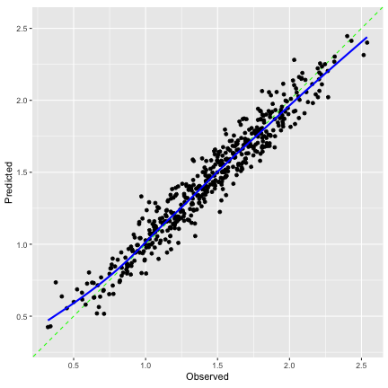

<!--
TODO:
* [ ] Look over / edit the post's title in the yaml
* [ ] Edit (or delete) the description; note this appears in the Twitter card
* [ ] Pick category and tags (see existing with `hugodown::tidy_show_meta()`)
* [ ] Find photo & update yaml metadata
* [ ] Create `thumbnail-sq.jpg`; height and width should be equal
* [ ] Create `thumbnail-wd.jpg`; width should be >5x height
* [ ] `hugodown::use_tidy_thumbnails()`
* [ ] Add intro sentence, e.g. the standard tagline for the package
* [ ] `usethis::use_tidy_thanks()`
-->

We're stoked to announce the release of [tabpfn](https://tabpfn.tidymodels.org/) 0.1.0. [TabPFN](https://github.com/PriorLabs/TabPFN) is a precompiled deep learning Python model for prediction. The _R package tabpfn_ is an interface to this model via reticulate. 

You can install it from CRAN with:


``` r
install.packages("tabpfn")
```


## What is TabPFN? 

The "tab" means _tabular_, which is code for everyday rectangular data structures that we find in csv files and databases. 

The "pfn" is more complicated -- it stands for "prior fitted network". The model is trained on fully synthetic datasets. The developers created a complex graph model that can simulate a wide variety of data-generating methods, including correlation structures, distributional skewness, missing-data mechanisms, interactions, latent variables, and more. It can also simulate random supervised relationships linking potential predictors to the outcome data. The training process for the model simulated a very large number of these data sets that, in effect, constitute a "training set data point". For example, during training, if a batch size of 64 was used, that means 64 randomly generated datasets were used in that iteration. 

From these data sets, a complex deep learning model is created that captures a huge number of possible relationships. The model is sophisticated enough and trained in a manner that allows it to effectively emulate Bayesian estimation. 

When we use the pre-trained model, our training set matters, even though there is no new estimation. The model includes an [attention mechanism](https://en.wikipedia.org/wiki/Attention_(machine_learning)) that "primes the model" by focusing on the types of relationships in your training data. In that way, the pre-fitted network is deliberately biased to effectively predict our new samples. This leads to [in-context learning](https://scholar.google.com/scholar?as_sdt=0%2C7&as_vis=1&q=%22in+context+learning%22).

And it works; in fact, it works really well. 

## License for the Underyling Model

[PriorLabs](https://priorlabs.ai/) created TabPFN. Version 2.5 of the model, which contained several improvements, requires an API key for accessing the model parameter. Without one, an error occurs:

> This model is gated and requires you to accept its terms.  Please follow these steps: 1. Visit [https://huggingface.co/Prior-Labs/tabpfn_2_5](https://huggingface.co/Prior-Labs/tabpfn_2_5) in your browser and accept the terms of use. 2. Log in to your Hugging Face account via the command line by running: hf auth login (Alternatively, you can set the `HF_TOKEN` environment variable with a read token).

The license includes provisions for "Non-Commercial Use Only" if you are just trying it out. 

Instructions for installing the package and obtaining the API key are in the [package's manual](https://tabpfn.tidymodels.org/reference/tab_pfn.html#license-requirements). 

Also, the model is most efficient when a GPU is available (by an order of magnitude or two). This may seem obvious to anyone already working with deep learning models, but it is a fairly new requirement for those strictly working with traditional tabular data models. 

## Usage

The syntax is idiomatic R: it supports fitting interfaces via data frames/vectors, formulas, and recipes. The standard R `predict()` method is used for prediction. `augument()` is also available for prediction. 

When evaluating pre-trained models, there is a possibility that they may have memorized well-known datasets (e.g., Ames housing, Palmer penguins). TabPFN isn't trained that way, but just in case we are worried about that, we'll use lesser-known data. [Worley (1987)](https://scholar.google.com/scholar?as_sdt=0%2C7&q=Worley%2C+B.+A.+%281987%29.+%22Deterministic+uncertainty+analysis%22) derived a mechanistic model for the flow rate of liquids from two aquifers positioned vertically (i.e., the "upper" and "lower" aquifers). We'll generate some of that data and add completely noisy predictors to increase the difficulty. The outcome is very skewed, so we'll log that too. 

While tabpfn is not a tidymodels package, we'll load the tidymodels library for simulation, data splitting, and visualization. 


``` r
library(tabpfn)
library(tidymodels)
library(probably)

set.seed(17)
aquifier_data <-
 sim_regression(2000,  method = "worley_1987") |>
 bind_cols(sim_noise(2000, 50)) |>
 mutate(outcome = log10(outcome))
```

We'll use a stratified 3:1 training and testing split:


``` r
set.seed(8223)
aquifier_split <- initial_split(aquifier_data, strata = outcome)
aquifier_split
```

```
## <Training/Testing/Total>
## <1500/500/2000>
```

``` r
aquifier_train <- training(aquifier_split)
aquifier_test  <- testing(aquifier_split)
```

and "fit" the model: 


``` r
tab_fit <- tab_pfn(outcome ~ ., data = aquifier_train)
```

Again, the model does not actually fit anything new. This computes the embeddings for the training set data and stores them for the prediction stage. 

To make predictions, `predict()` returns the model's results. Since we'll want to evaluate and plot the data, we'll use `augment()`, which just runs `predict()` and binds the results to the data being predicted: 


``` r
tab_pred <- augment(tab_fit, aquifier_test)
```

How does it work?


``` r
tab_pred |> metrics(outcome, .pred)
```

```
## # A tibble: 3 × 3
##   .metric .estimator .estimate
##   <chr>   <chr>          <dbl>
## 1 rmse    standard      0.104 
## 2 rsq     standard      0.937 
## 3 mae     standard      0.0829
```

``` r
tab_pred |> cal_plot_regression(outcome, .pred)
```



That looks good, especially with no training. 

## Next Steps

There is a lot more functionality to add to the package, including additional prediction types and interpretability tools. Many of these are available in [extensions](https://github.com/priorlabs/tabpfn-extensions). 

We'll also add a new parsnip model type for TabPFN and other integrations with tidymodels. 

## Acknowledgements

A huge thanks to Tomasz Kalinowski and Daniel Falbel for their support on this and all of their hard work on reticulate and torch. 

Thanks also to the contributors to date: [&#x0040;frankiethull](https://github.com/frankiethull), [&#x0040;mthulin](https://github.com/mthulin), and [&#x0040;t-kalinowski](https://github.com/t-kalinowski).

