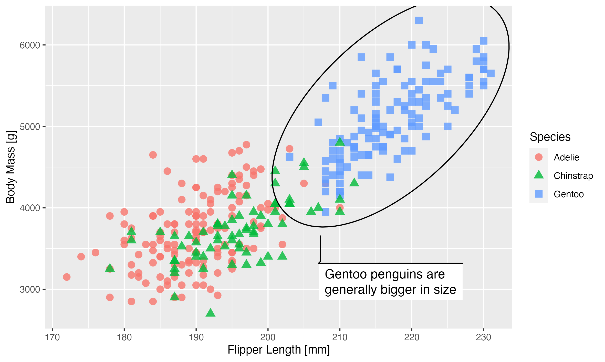
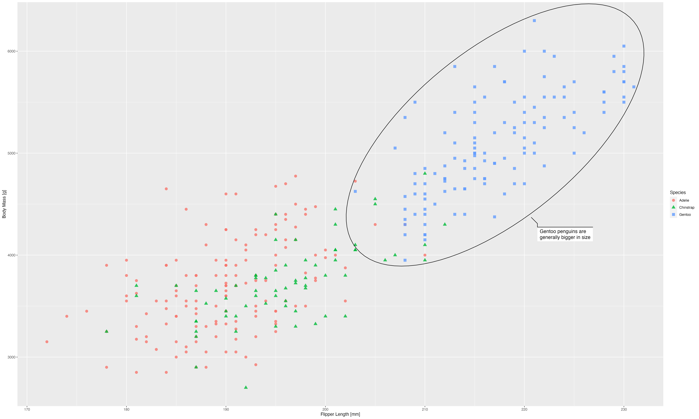
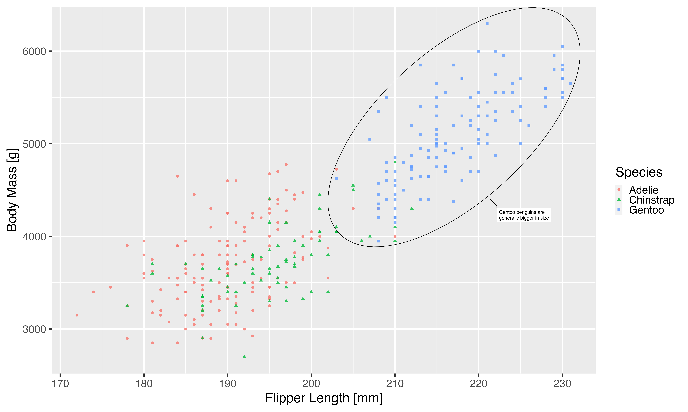
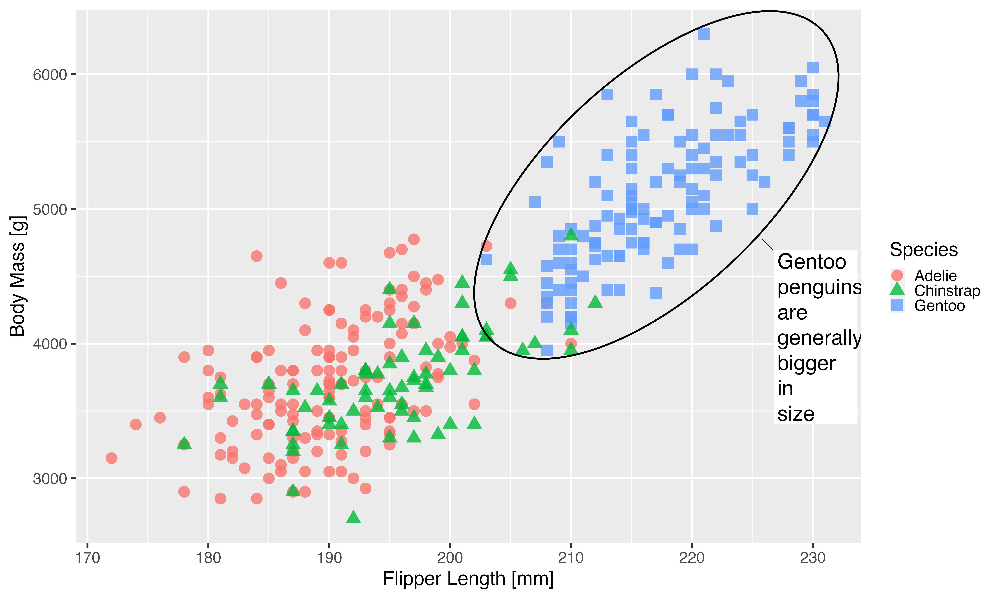

Some time ago, while working on the new edition of the ggplot2 book, I asked out to the R twitterverse what part of using ggplot2 was the most incomprehensible for seasoned users. By a very large margin the most "popular" response revolved around making sure that output had the correct scaling of text, lines, etc.

The latest release of ragg contains a new functionality that will hopefully make this issue a thing of the past. Read on how to use it.

Some definitions
----------------

Before we delve into the problem we should clarify a few concepts related to graphics and sizing:

**Absolute size:** This is the physical dimensions of the graphic (or, more precisely, the intended physical dimensions). This is measured in centimeters or inches or another absolute length unit.

**Pixel size:** For raster output, the graphic is encoded as a matrix of color values. Each cell in the matrix is a pixel. The pixel size is the number of rows and columns in the matrix. Pixels does not have any inherent physical size.

**Resolution:** This number ties absolute and pixel size together. It is usually given in ppi (pixels per inch), though dpi (dots per inch) is used interchangeably. A resolution of 72 ppi means that an inch is considered 72 pixels long.

**Pointsize:** This is a measure tied to text sizing. When we set a font to size 12, it is given in points. While the actual size of a point has [varied throughout history](https://en.wikipedia.org/wiki/Point_(typography)#Varying_standards), the general consensus now is that 1pt = 1/72 inch (this is also adopted by R). Since points is an absolute unit, the resolution of the output will determine the number of pixels it correspond to.

The problem
-----------

With formalities out of the way, we can describe the problem more clearly. At its core, this is about ensuring the correct scaling of a plot as we develop it for varying absolute sizes.

When we develop a graphic we will generally sit in front of a computer and fine tune it while continuously getting previews on the screen. Once we are content with it we will save it to the correct absolute size required by wherever we intend to publish the plot. In the remainder of the text we will assume that we sit in front of a computer developing a plot that should end up on a poster.

This is the plot, and how it looks on a computer:

<pre class='chroma'><code class='language-r' data-lang='r'><a href='https://rdrr.io/r/base/library.html'>library</a>(<a href='http://ggplot2.tidyverse.org'>ggplot2</a>)
<a href='https://rdrr.io/r/base/library.html'>library</a>(<a href='https://ragg.r-lib.org'>ragg</a>)
<a href='https://rdrr.io/r/base/library.html'>library</a>(<a href='https://allisonhorst.github.io/palmerpenguins'>palmerpenguins</a>)

# plot adapted from https://github.com/allisonhorst/palmerpenguins
p &lt;- <a href='https://ggplot2.tidyverse.org/reference/ggplot.html'>ggplot</a>(<a href='https://rdrr.io/r/stats/na.fail.html'>na.omit</a>(penguins), <a href='https://ggplot2.tidyverse.org/reference/aes.html'>aes</a>(x = flipper_length_mm, y = body_mass_g)) +
  <a href='https://ggplot2.tidyverse.org/reference/geom_point.html'>geom_point</a>(
    <a href='https://ggplot2.tidyverse.org/reference/aes.html'>aes</a>(color = species, shape = species),
    size = 3,
    alpha = 0.8
  ) + 
  ggforce::<a href='https://ggforce.data-imaginist.com/reference/geom_mark_ellipse.html'>geom_mark_ellipse</a>(
    <a href='https://ggplot2.tidyverse.org/reference/aes.html'>aes</a>(filter = species == "Gentoo", 
        description = "Gentoo penguins are generally bigger in size")
  ) + 
  <a href='https://ggplot2.tidyverse.org/reference/labs.html'>labs</a>(x = "Flipper Length [mm]", y = "Body Mass [g]",  colour = "Species", 
       shape = "Species")

pngfile &lt;- fs::<a href='http://fs.r-lib.org/reference/path.html'>path</a>(knitr::<a href='https://rdrr.io/pkg/knitr/man/fig_path.html'>fig_path</a>(),  "basis.png")

# I'm explicitly calling the device functions so you can see the dimensions 
# used
<a href='https://ragg.r-lib.org/reference/agg_png.html'>agg_png</a>(pngfile, width = 20, height = 12, units = "cm", res = 300)
<a href='https://rdrr.io/r/graphics/plot.default.html'>plot</a>(p)
<a href='https://rdrr.io/r/base/invisible.html'>invisible</a>(<a href='https://rdrr.io/r/grDevices/dev.html'>dev.off</a>())
knitr::<a href='https://rdrr.io/pkg/knitr/man/include_graphics.html'>include_graphics</a>(pngfile)
</code></pre>

This looks good, but remember we want to use this on a poster. A poster is usually observed at a farther distance than a computer screen, so in order to make it legible the plot should be bigger. How much bigger? Well, if we assume that we are watching our screen at 50 cm distance, and our poster is meant to be observed at 1.5 m distance, then our plot should be 3 times larger to take up the same amount of space in our vision:

With that in mind we quickly size up our plot:

<pre class='chroma'><code class='language-r' data-lang='r'>pngfile &lt;- fs::<a href='http://fs.r-lib.org/reference/path.html'>path</a>(knitr::<a href='https://rdrr.io/pkg/knitr/man/fig_path.html'>fig_path</a>(),  "large_basis.png")
<a href='https://ragg.r-lib.org/reference/agg_png.html'>agg_png</a>(pngfile, width = 60, height = 36, units = "cm", res = 300)
<a href='https://rdrr.io/r/graphics/plot.default.html'>plot</a>(p)
<a href='https://rdrr.io/r/base/invisible.html'>invisible</a>(<a href='https://rdrr.io/r/grDevices/dev.html'>dev.off</a>())
knitr::<a href='https://rdrr.io/pkg/knitr/man/include_graphics.html'>include_graphics</a>(pngfile)
</code></pre>

The plot above doesn't look physically larger, but that is because the webpage downscales it to make it fit. You can download each of the images and open them in a image editor to convince yourself that they are of different absolute size. The downscaling done by the webpage allows us to simulate how looking at our poster may feel like, and it is not pretty; everything seems super small and ineligible.

Why is that? Our plot is a mix of elements positioned and dimensioned based on both relative and absolute sizes. While the relative sizes expand along with the output size, the absolute sizes does not. The text is given in points which, as you recall, is an absolute dimension. The same is true for the element sizes in the scatterplot, the grid lines, etc. This means that as we scale up the output size, they remain the same size and will thus get smaller relative to the full image.

> The reverse can be a problem as well. If you render a plot to a smaller size than the one you've previewed you may find that text, margins, etc. take up all the available space.

Now, how should we go about correcting this?

Attempt 1: Use vector graphics
------------------------------

The discussion above is especially relevant to raster output since they don't resize gracefully and it is thus very important to get the correct dimensions and resolution when it is rendered. One way to resolve this is to not render to raster but use a vector graphic device such as [`pdf()`](https://rdrr.io/r/grDevices/pdf.html) or `svglite()`. With these you can simply render the graphic to a size where everything looks as it should and then resize the output to the physical size that you need. There are valid reasons to not want to use vector graphics, however. The look of the output may change depending on which program opens them. Custom fonts may not render correctly on other systems. Or you may have such a large amount of graphical elements that the vector graphic becomes unreasonably large and heavy to display. If none of this applies then using a vector graphic device is definitely a valid and reasonable solution. For the remainder of the post we assume that we want the output in a raster format such as png and explore how we may fix our scaling issues there.

Attempt 2: Theming
------------------

One approach to fixing this is by changing the theme settings of the plot, so that they work better for a larger size:

<pre class='chroma'><code class='language-r' data-lang='r'>p1 &lt;- p + 
  <a href='https://ggplot2.tidyverse.org/reference/ggtheme.html'>theme_gray</a>(base_size = 33)
pngfile &lt;- fs::<a href='http://fs.r-lib.org/reference/path.html'>path</a>(knitr::<a href='https://rdrr.io/pkg/knitr/man/fig_path.html'>fig_path</a>(),  "theming.png")
<a href='https://ragg.r-lib.org/reference/agg_png.html'>agg_png</a>(pngfile, width = 60, height = 36, units = "cm", res = 300)
<a href='https://rdrr.io/r/graphics/plot.default.html'>plot</a>(p1)
<a href='https://rdrr.io/r/base/invisible.html'>invisible</a>(<a href='https://rdrr.io/r/grDevices/dev.html'>dev.off</a>())
knitr::<a href='https://rdrr.io/pkg/knitr/man/include_graphics.html'>include_graphics</a>(pngfile)
</code></pre>

This approach got us surprisingly far. A lot of the theme elements of the plot is derived from the base size argument so many adapts. Not all though, as we can see the legend keys maintaining their relative small size. If you've been using a custom theme it may also be that you've overwritten some of the default sizes and will need to change that as well.

One thing missing is all the non-theme elements (i.e. things part of the layer). Because of this we'd have to redo the whole plot in order to get the desired result:

<pre class='chroma'><code class='language-r' data-lang='r'>p1 &lt;- <a href='https://ggplot2.tidyverse.org/reference/ggplot.html'>ggplot</a>(<a href='https://rdrr.io/r/stats/na.fail.html'>na.omit</a>(penguins), <a href='https://ggplot2.tidyverse.org/reference/aes.html'>aes</a>(x = flipper_length_mm, y = body_mass_g)) +
  <a href='https://ggplot2.tidyverse.org/reference/geom_point.html'>geom_point</a>(
    <a href='https://ggplot2.tidyverse.org/reference/aes.html'>aes</a>(color = species, shape = species),
    size = 9,
    alpha = 0.8
  ) + 
  ggforce::<a href='https://ggforce.data-imaginist.com/reference/geom_mark_ellipse.html'>geom_mark_ellipse</a>(
    <a href='https://ggplot2.tidyverse.org/reference/aes.html'>aes</a>(filter = species == "Gentoo", 
        description = "Gentoo penguins are generally bigger in size"),
    size = 1.5,
    label.fontsize = 36
  ) + 
  <a href='https://ggplot2.tidyverse.org/reference/labs.html'>labs</a>(x = "Flipper Length [mm]", y = "Body Mass [g]",  colour = "Species", 
       shape = "Species") + 
  <a href='https://ggplot2.tidyverse.org/reference/ggtheme.html'>theme_gray</a>(base_size = 33)
pngfile &lt;- fs::<a href='http://fs.r-lib.org/reference/path.html'>path</a>(knitr::<a href='https://rdrr.io/pkg/knitr/man/fig_path.html'>fig_path</a>(),  "theming2.png")
<a href='https://ragg.r-lib.org/reference/agg_png.html'>agg_png</a>(pngfile, width = 60, height = 36, units = "cm", res = 300)
<a href='https://rdrr.io/r/graphics/plot.default.html'>plot</a>(p1)
<a href='https://rdrr.io/r/base/invisible.html'>invisible</a>(<a href='https://rdrr.io/r/grDevices/dev.html'>dev.off</a>())
knitr::<a href='https://rdrr.io/pkg/knitr/man/include_graphics.html'>include_graphics</a>(pngfile)
</code></pre>

We can see that we are getting there, but the journey hasn't been pleasant. Especially for the last part it requires knowledge of all the different settings in a geom that encodes absolute sizes. For the mark geom we only fixed the ellipse line width and the text size, but there are many more settings that needs to be updated as well as is apparent from the weird look of the text box.

Another issue that arises is that if we need this plot at yet another different scale, we will need to change quite a lot of code in order to get there.

Attempt 3: Resolution scaling
-----------------------------

Since the resolution is the parameter that ties the pixel size and absolute size together it is possible to use it as a scaling factor, but it requires some non-obvious adjustments:

The first thing we need to do is convert our physical dimensions to pixel dimensions using our desired resolution. We want to end up with a 60x36cm plot at 300ppi. This gives us:

<pre class='chroma'><code class='language-r' data-lang='r'><a href='https://rdrr.io/r/base/c.html'>c</a>(60, 36) *
  0.3937 * # convert to inch
  300 # convert to pixels
#&gt; [1] 7086.60 4251.96</code></pre>

We can now use these values directly in our device and change the resolution of the device to trick it into thinking that text etc should be rendered at a larger size

<pre class='chroma'><code class='language-r' data-lang='r'>pngfile &lt;- fs::<a href='http://fs.r-lib.org/reference/path.html'>path</a>(knitr::<a href='https://rdrr.io/pkg/knitr/man/fig_path.html'>fig_path</a>(),  "resolution.png")
<a href='https://ragg.r-lib.org/reference/agg_png.html'>agg_png</a>(pngfile, width = 7087, height = 4252, units = "px", res = 900)
<a href='https://rdrr.io/r/graphics/plot.default.html'>plot</a>(p)
<a href='https://rdrr.io/r/base/invisible.html'>invisible</a>(<a href='https://rdrr.io/r/grDevices/dev.html'>dev.off</a>())
knitr::<a href='https://rdrr.io/pkg/knitr/man/include_graphics.html'>include_graphics</a>(pngfile)
</code></pre>

This actually works exactly as we hoped. We've gotten our huge version of the plot but with the same exact scaling of all graphic elements.

Depending on your temperament this may be a perfect solution. To me, I think the conversion from physical dimensions to pixels is tedious, and it has the added drawback that the dimensions of the plot is incorrectly encoded (it will appear as a 20\*12cm plot at 900ppi) which may impact how it is presented in different programs. In the end you may have to manually resize it to get the correct physical dimensions in the end.

The solution
------------

Seeing that there is no single perfect solution to fixing this with the tools at our disposal, I've added a new argument to the ragg devices called `scaling`. It's a multiplier that is applied to all absolute sizes, without interfering with the encoded dimensions of the output. Since we have increased the dimensions 3 times we set `scaling = 3` to make sure that the absolute sized elements are keeping their relative size.

<pre class='chroma'><code class='language-r' data-lang='r'>pngfile &lt;- fs::<a href='http://fs.r-lib.org/reference/path.html'>path</a>(knitr::<a href='https://rdrr.io/pkg/knitr/man/fig_path.html'>fig_path</a>(),  "scaling.png")
<a href='https://ragg.r-lib.org/reference/agg_png.html'>agg_png</a>(pngfile, width = 60, height = 36, units = "cm", res = 300, scaling = 3)
<a href='https://rdrr.io/r/graphics/plot.default.html'>plot</a>(p)
<a href='https://rdrr.io/r/base/invisible.html'>invisible</a>(<a href='https://rdrr.io/r/grDevices/dev.html'>dev.off</a>())
knitr::<a href='https://rdrr.io/pkg/knitr/man/include_graphics.html'>include_graphics</a>(pngfile)
</code></pre>

As can be seen, the new argument makes it very easy to reclaim the look of the plot after resizing. Hopefully this will remove a good deal of the pain related to generating plots for papers, posters, presentations, etc. You do have to remember to use the same scaling setting for all plots for them to have the same sizing, but apart from that it makes it very easy to fine tune the look for the medium your creating it for.

Remember that the scaling factor of `3` was simply chosen to fit our presumed viewing distance and should not be repeated without thought. Another example would be to create a small version of the plot, e.g. for a thumbnail on a webpage. While there is no harm in manually scaling down a raster image, you may find that especially text is more readable when rendered to the desired size directly. To show this off we'll make a half-sized version of our plot as well. To spruce it up we'll use [`ggsave()`](https://ggplot2.tidyverse.org/reference/ggsave.html) instead of calling the ragg device directly. Let's see how it looks without using scaling first:

<pre class='chroma'><code class='language-r' data-lang='r'>pngfile &lt;- fs::<a href='http://fs.r-lib.org/reference/path.html'>path</a>(knitr::<a href='https://rdrr.io/pkg/knitr/man/fig_path.html'>fig_path</a>(),  "small")
<a href='https://ggplot2.tidyverse.org/reference/ggsave.html'>ggsave</a>(
  pngfile, 
  p, 
  device = agg_png, 
  width = 10, height = 6, units = "cm", res = 300
)
knitr::<a href='https://rdrr.io/pkg/knitr/man/include_graphics.html'>include_graphics</a>(pngfile)
</code></pre>

As we can see, everything feels oversized for the plot, and the margins takes up way too much relative space. Using `scaling` we quickly resolve this:

<pre class='chroma'><code class='language-r' data-lang='r'>pngfile &lt;- fs::<a href='http://fs.r-lib.org/reference/path.html'>path</a>(knitr::<a href='https://rdrr.io/pkg/knitr/man/fig_path.html'>fig_path</a>(),  "downscaling.png")
<a href='https://ggplot2.tidyverse.org/reference/ggsave.html'>ggsave</a>(
  pngfile, 
  p, 
  device = agg_png, 
  width = 10, height = 6, units = "cm", res = 300,
  scaling = 0.5
)
knitr::<a href='https://rdrr.io/pkg/knitr/man/include_graphics.html'>include_graphics</a>(pngfile)
</code></pre>

Addendum
--------

-   Preparing graphics for the web presents an additional hurdle. The HTML specification assumes a screen resolution of 96ppi since that was the predominant screen resolution at the time. Modern monitors have a much higher resolution but the assumption is still in effect (though operating systems may mitigate it). This is the reason why plots may look slightly smaller when rendered through Shiny, blogdown, or hugodown. Simply set the resolution to 96ppi and use pixel dimensions for the output to make sure it has the correct scaling.
-   Rendering images with RMarkdown requires some care as well since chunk options both take an output dimension in inches as well as a scaling factor for how big the rendered image should appear in the document. [R for Data Science](https://r4ds.had.co.nz/graphics-for-communication.html#figure-sizing) has some additional information on this

