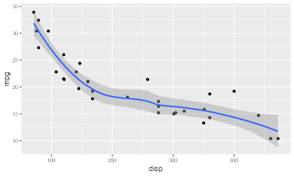
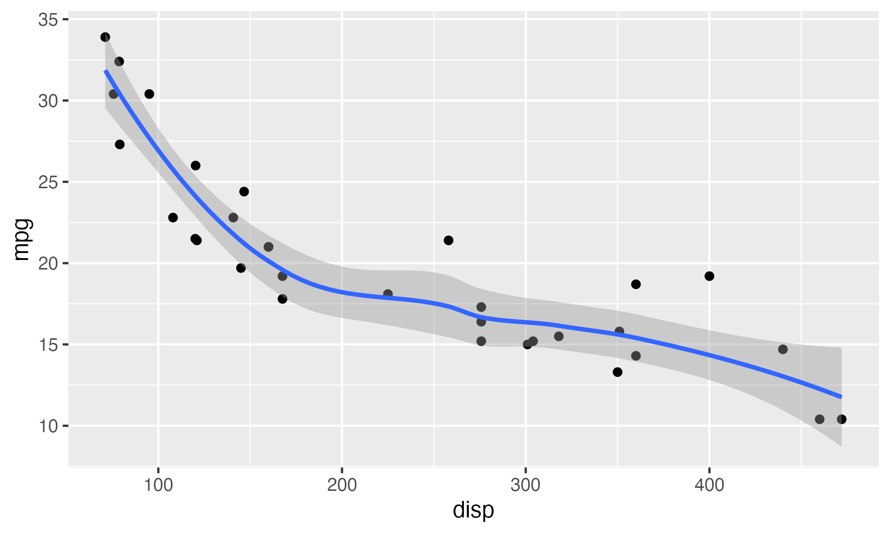
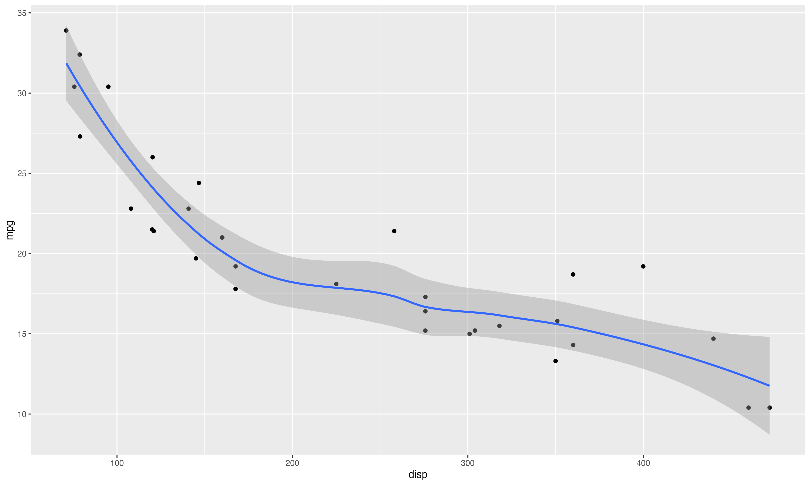
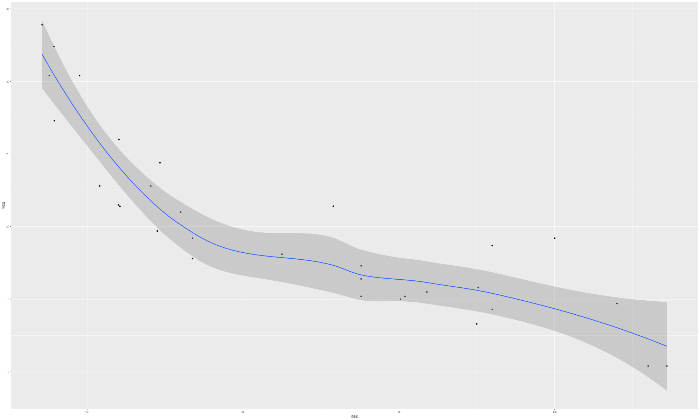
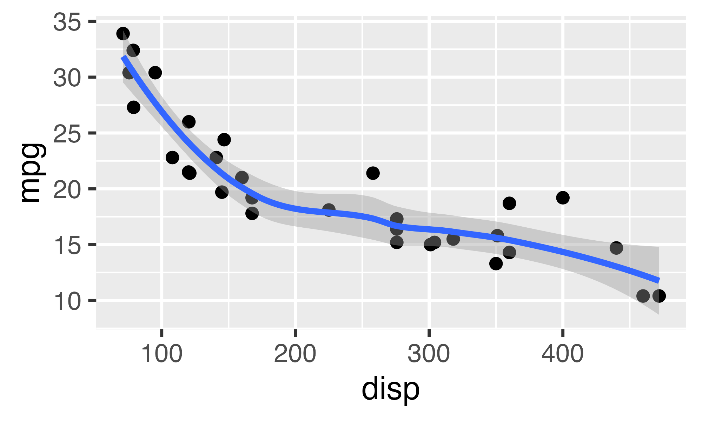

Some time ago, while working on the new edition of the ggplot2 book, I asked out to the R twitterverse what part of using ggplot2 was the most incomprehensible for seasoned users. By a very large margin the most "popular" response revolved around making sure that output had the correct scaling of text, lines, etc.

The latest release of ragg contains a new functionality that will hopefully make this issue a thing of the past. Read on how to use it.

The problem
-----------

The issue, if you are blissfully unaware, revolves around ensuring that dimensions in your graphic is tied to the resolution of the final plot. This means that it is quite difficult to increase the resolution of a plot while maintaining the same look of the plot. The issue is related to increasing the resolution of your screen, which, in olden days, resulted in almost comically small text and UI elements:

<pre class='chroma'><code class='language-r' data-lang='r'># Let us create an example plot
<a href='https://rdrr.io/r/base/library.html'>library</a>(<a href='http://ggplot2.tidyverse.org'>ggplot2</a>)
<a href='https://rdrr.io/r/base/library.html'>library</a>(<a href='https://ragg.r-lib.org'>ragg</a>)

p &lt;- <a href='https://ggplot2.tidyverse.org/reference/ggplot.html'>ggplot</a>(mtcars) + 
  <a href='https://ggplot2.tidyverse.org/reference/geom_point.html'>geom_point</a>(<a href='https://ggplot2.tidyverse.org/reference/aes.html'>aes</a>(disp, mpg)) + 
  <a href='https://ggplot2.tidyverse.org/reference/geom_smooth.html'>geom_smooth</a>(<a href='https://ggplot2.tidyverse.org/reference/aes.html'>aes</a>(disp, mpg))

pngfile &lt;- fs::<a href='http://fs.r-lib.org/reference/path.html'>path</a>(knitr::<a href='https://rdrr.io/pkg/knitr/man/fig_path.html'>fig_path</a>(),  "low_res.png")

<a href='https://ragg.r-lib.org/reference/agg_png.html'>agg_png</a>(pngfile, width = 15, height = 9, units = "cm", res = 72)
<a href='https://rdrr.io/r/graphics/plot.default.html'>plot</a>(p)
<a href='https://rdrr.io/r/base/invisible.html'>invisible</a>(<a href='https://rdrr.io/r/grDevices/dev.html'>dev.off</a>())
knitr::<a href='https://rdrr.io/pkg/knitr/man/include_graphics.html'>include_graphics</a>(pngfile)
</code></pre>

We may feel the the relative sizing in the plot is spot on here, but the resolution is horrible (after all 72 dpi is not something anyone wants to look at in this day and age). We can readily fix this by increasing the resolution:

<pre class='chroma'><code class='language-r' data-lang='r'>pngfile &lt;- fs::<a href='http://fs.r-lib.org/reference/path.html'>path</a>(knitr::<a href='https://rdrr.io/pkg/knitr/man/fig_path.html'>fig_path</a>(),  "high_res.png")
<a href='https://ragg.r-lib.org/reference/agg_png.html'>agg_png</a>(pngfile, width = 15, height = 9, units = "cm", res = 300)
<a href='https://rdrr.io/r/graphics/plot.default.html'>plot</a>(p)
<a href='https://rdrr.io/r/base/invisible.html'>invisible</a>(<a href='https://rdrr.io/r/grDevices/dev.html'>dev.off</a>())
knitr::<a href='https://rdrr.io/pkg/knitr/man/include_graphics.html'>include_graphics</a>(pngfile)
</code></pre>

So far, so good. Now, I want to create a poster with this plot. For the poster I'll need a larger size because it is meant to be read at a distance. For simplicity we'll make the plot twice as big in both dimensions

<pre class='chroma'><code class='language-r' data-lang='r'>pngfile &lt;- fs::<a href='http://fs.r-lib.org/reference/path.html'>path</a>(knitr::<a href='https://rdrr.io/pkg/knitr/man/fig_path.html'>fig_path</a>(),  "big_size.png")
<a href='https://ragg.r-lib.org/reference/agg_png.html'>agg_png</a>(pngfile, width = 30, height = 18, units = "cm", res = 300)
<a href='https://rdrr.io/r/graphics/plot.default.html'>plot</a>(p)
<a href='https://rdrr.io/r/base/invisible.html'>invisible</a>(<a href='https://rdrr.io/r/grDevices/dev.html'>dev.off</a>())
knitr::<a href='https://rdrr.io/pkg/knitr/man/include_graphics.html'>include_graphics</a>(pngfile)
</code></pre>

The size of the plot has increased but the absolute size of text, lines, margins, etc. has stayed the same. The end result is that the relative size of these elements has decreased. This was not what we wanted.

A related issue is rendering a plot to a fixed pixel size. Here the `res` argument is rather arbitrary as it relates the physical size to the pixel dimensions, and we haven't provided a physical size at all:

<pre class='chroma'><code class='language-r' data-lang='r'>pngfile &lt;- fs::<a href='http://fs.r-lib.org/reference/path.html'>path</a>(knitr::<a href='https://rdrr.io/pkg/knitr/man/fig_path.html'>fig_path</a>(),  "pixel_size.png")
<a href='https://ragg.r-lib.org/reference/agg_png.html'>agg_png</a>(pngfile, width = 2000, height = 1200, units = "px")
<a href='https://rdrr.io/r/graphics/plot.default.html'>plot</a>(p)
<a href='https://rdrr.io/r/base/invisible.html'>invisible</a>(<a href='https://rdrr.io/r/grDevices/dev.html'>dev.off</a>())
knitr::<a href='https://rdrr.io/pkg/knitr/man/include_graphics.html'>include_graphics</a>(pngfile)
</code></pre>

You can reclaim eligibility by increasing the `res` argument, but this is a quite non-obvious solution and one that requires a lot of trial and error.

<pre class='chroma'><code class='language-r' data-lang='r'>pngfile &lt;- fs::<a href='http://fs.r-lib.org/reference/path.html'>path</a>(knitr::<a href='https://rdrr.io/pkg/knitr/man/fig_path.html'>fig_path</a>(),  "pixel_size_legible.png")
<a href='https://ragg.r-lib.org/reference/agg_png.html'>agg_png</a>(pngfile, width = 2000, height = 1200, units = "px", res = 600)
<a href='https://rdrr.io/r/graphics/plot.default.html'>plot</a>(p)
<a href='https://rdrr.io/r/base/invisible.html'>invisible</a>(<a href='https://rdrr.io/r/grDevices/dev.html'>dev.off</a>())
knitr::<a href='https://rdrr.io/pkg/knitr/man/include_graphics.html'>include_graphics</a>(pngfile)
</code></pre>

The solution
------------

I came into this issue, thinking that it was simply a matter of educating users on how the different arguments interact, but I had to quickly reevaluate that stance. Basically, there is no solution that works across all the different ways of specifying image dimensions. Specifically, when the outputs needs to be a specific absolute size and resolution, the only resolution is to change theming of the plot object so text, size, margins, etc are increased.

Because of this I've added a new argument to all devices in ragg that lets you control the scaling of the output. It is interpreted as a multiplier that is applied to all absolute sizing in the plot, without affecting the encoded resolution of the plot. Let us use it to get the desired plot for our poster. We doubled each dimension for the poster version, so we need to set `scaling = 2` to maintain the look of the plot:

<pre class='chroma'><code class='language-r' data-lang='r'>pngfile &lt;- fs::<a href='http://fs.r-lib.org/reference/path.html'>path</a>(knitr::<a href='https://rdrr.io/pkg/knitr/man/fig_path.html'>fig_path</a>(),  "big_size_correct.png")
<a href='https://ragg.r-lib.org/reference/agg_png.html'>agg_png</a>(pngfile, width = 30, height = 18, units = "cm", res = 300, scaling = 2)
<a href='https://rdrr.io/r/graphics/plot.default.html'>plot</a>(p)
<a href='https://rdrr.io/r/base/invisible.html'>invisible</a>(<a href='https://rdrr.io/r/grDevices/dev.html'>dev.off</a>())
knitr::<a href='https://rdrr.io/pkg/knitr/man/include_graphics.html'>include_graphics</a>(pngfile)
</code></pre>

As can be seen, the new argument makes it very easy to reclaim the look of the plot after resizing. Hopefully this will remove a good deal of the pain related to generating plots for papers, posters, presentations, etc.

