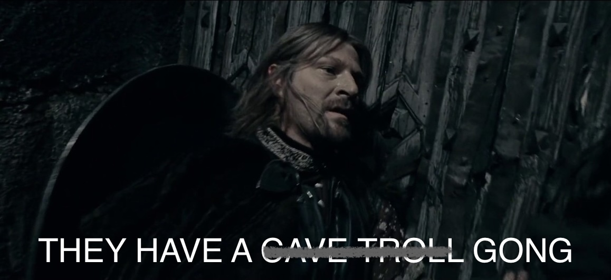

<!--
TODO:
* [ ] Look over / edit the post's title in the yaml
* [ ] Edit (or delete) the description; note this appears in the Twitter card
* [ ] Pick category and tags (see existing with `hugodown::tidy_show_meta()`)
* [ ] Find photo & update yaml metadata
* [ ] Create `thumbnail-sq.jpg`; height and width should be equal
* [ ] Create `thumbnail-wd.jpg`; width should be >5x height
* [ ] `hugodown::use_tidy_thumbnails()`
* [ ] Add intro sentence, e.g. the standard tagline for the package
* [ ] `usethis::use_tidy_thanks()`
-->

The 2025 Tidy Dev Day will be on September 19th! We'll gather after posit::conf near the conference venue (see details at the event page at the bottom) from 9am to 5pm.

Tidy Dev Day (TDD) is an event where developers and open source contributors meet to collaboratively solve issues. You can hone your software engineering skills or work on your first contribution. We will have a slate of existing issues that you can work on with or without the assistance of our developers. 

Here's how [Laura Acion](https://lacion.rbind.io/post/my-first-user/) described the 2019 event:

> I wish there were more of these R-related dev days. Developing events that are friendly, diverse, and safe to advance not only the tidyverse. I see no downsides. Kudos to the organizers.

Plus...

 

## Who should attend

You **don't** have to have an extensive development background or experience solving issues, or making pull requests. You do need a GitHub account, and some git experience. 

Leading up to TDD, we will hold (optional) virtual "office hours" for TDD participants to help you with your Git workflow so that you can stroll into TDD confident that your R, Git, GitHub, and IDE are set up in the most ideal way possible to work in harmony on your laptop.

## How to sign up

There is a token $10 cost for the day; we provide the venue, snacks, lunch, and a barista. If cost is an issue, please email <hadley@posit.co> and we'll work that out. We only charge a small fee to encourage people to show up for the day.

[**Get your ticket now!**](https://lu.ma/mpr5c30q)

**Note**: by using this link, you agree to Posit's Privacy Policy, available at https://posit.co/about/privacy-policy/. You also consent to using https://lu.ma/ for the purposes of processing your event attendance fees.

[Previous Tidy Dev Days](https://www.tidyverse.org/tags/tidyverse-dev-day/) have sold out quickly, so don't wait!

