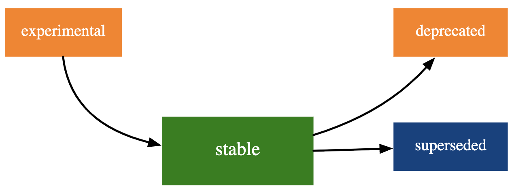
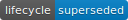

<!--
TODO:
* [ x ] Look over / edit the post's title in the yaml
* [ x ] Edit (or delete) the description; note this appears in the Twitter card
* [ x ] Pick category and tags (see existing with `hugodown::tidy_show_meta()`)
* [ x ] Find photo & update yaml metadata
* [ ] Create `thumbnail-sq.jpg`; height and width should be equal
* [ ] Create `thumbnail-wd.jpg`; width should be >5x height
* [ ] `hugodown::use_tidy_thumbnails()`
* [ ] Add intro sentence, e.g. the standard tagline for the package
* [ ] `usethis::use_tidy_thanks()`
-->

Last summer I wrote, in four parts, about [Teaching the tidyverse in 2020](https://education.rstudio.com/blog/2020/07/teaching-the-tidyverse-in-2020-part-1-getting-started/).
As we quickly approach the end of the summer (in the northern hemisphere) and the start of a new academic year, it seems like a good time to provide a new update for teaching the tidyverse, in 2021.
The main audience for this post is educators who teach the tidyverse and who want to update their teaching materials with updates to the tidyverse that happened over the past year.
Much of what is discussed here has already been covered in package update posts on this blog, but my goal is to summarize the highlights that are most relevant to teaching data science with the tidyverse, particularly to new learners.

## Lifecycle stages

The [lifecycle](https://lifecycle.r-lib.org/) package is used to manage the lifecycle of functions and features within the tidyverse, with clear messaging about what is still experimental and what the team is moving away from in the future.

The lifecycle stages you might encounter on functions or packages are experimental, stable, deprecated, and superseded.
It's helpful to be aware of the stages (and their associated badges) as you review and revise your teaching materials or as you consider incorporating new tooling into your teaching.



-    Stable indicates that breaking changes avoided where possible, and they're only made if the long term benefit of such a change exceeds the short term pain of changing existing code. If breaking changes are needed, they will occur gradually. Note that this badge is generally not shown as it applied to huge majority of functions. Teach away any stable functions, they're here to stay for the long run!

-    If a function is noted as deprecated, this means it has a better alternative available and is scheduled for removal. Generally functions will first be soft deprecated and then deprecated. Very important functions that become deprecated might next be defunct which means that function continues to exist but the deprecation warning turns into an error. An example of a deprecated function is `tibble::data_frame()`, with the preferred alternative `tibble::tibble()`. Arguments to functions can also be deprecated, e.g., in `tidyr::nest()` the new argument `new_col` makes the former `.key` argument not needed, and hence `.key` is deprecated. You should avoid teaching functions that are deprecated and correct their usage in your students' code by suggesting the preferred alternative.

-    Superseded indicates that there is a known better alternative for the function, but it's not going away. Some examples include the following:

    -   `tidyr::spread()` / `tidyr::gather()` vs. `tidyr::pivot_longer()` / `tidyr::pivot_wider()`

    -   Scoped verbs (e.g., `dplyr::mutate_if()`, `dplyr::select_at()`, `dplyr::rename_all()`, etc.) vs. `dplyr::across()`

    -   `dplyr::sample_n()` / `dplyr::sample_frac()` vs. `dplyr::slice_sample()` with `n` and `prop` arguments

    I would recommend not teaching superseded functions to new learners, and for learners who might be aware of them, I would recommend discouraging their use (though not correcting, i.e., no point deductions on a formative assessment), suggesting the alternative.

-    Experimental functions are made available so the community can try them out and provide feedback, however they come with no promises for long term stability. Some examples include the following:

    -   `dplyr::group_trim()` to unused levels of all factors that are used as grouping variables

    -   in `dplyr::summarize()`: `.groups` argument to define the grouping structure of the result

    -   in `dplyr::mutate()`: `.before` and `.after` arguments to control where new columns should appear

    I would recommend teaching experimental functions with caution, particularly to new learners with whom you might not formally discuss the concept of "lifecycle". However there is no reason to discourage use of these functions -- if students have stumbled upon a solution that involves an experimental function or argument and has used it correctly on their own, this is likely a good indication that the experiment is working!

If you'd like to learn more about the tidyverse lifecycle, I recommend the following resources:

-   [lifecycle 1.0.0 blog post](https://www.tidyverse.org/blog/2021/02/lifecycle-1-0-0/)
-   Hadley Wickham's rstudio::global(2021) talk [Maintaining the house the tidyverse built](https://www.rstudio.com/resources/rstudioglobal-2021/maintaining-the-house-the-tidyverse-built/). I think this talk would also be a good resource for software development courses!

  

At rstudio::global(2020) Hadley Wickham intr

We're pleased to announce the release of .
is ...

You can install it from CRAN with:

```{r, eval = FALSE}
install.packages("{package}")
```

This blog post will ...

You can see a full list of changes in the [release notes](%7B%20github_release%20%7D)

```{r setup}
library()
```

## Topic 1

## Topic 2

## Acknowledgements
