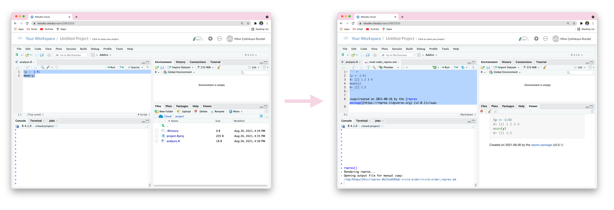

<!--
TODO:
* [ x ] Look over / edit the post's title in the yaml
* [ x ] Edit (or delete) the description; note this appears in the Twitter card
* [ x ] Pick category and tags (see existing with [`hugodown::tidy_show_meta()`](https://rdrr.io/pkg/hugodown/man/use_tidy_post.html))
* [ x ] Find photo & update yaml metadata
* [ x ] Create `thumbnail-sq.jpg`; height and width should be equal
* [ x ] Create `thumbnail-wd.jpg`; width should be >5x height
* [ x ] [`hugodown::use_tidy_thumbnails()`](https://rdrr.io/pkg/hugodown/man/use_tidy_post.html)
* [ x ] Add intro sentence, e.g. the standard tagline for the package
* [ ] [`usethis::use_tidy_thanks()`](https://usethis.r-lib.org/reference/use_tidy_thanks.html) -- not applicable
-->

Last summer I wrote a series of blog posts titled [teaching the tidyverse in 2020](https://education.rstudio.com/blog/2020/07/teaching-the-tidyverse-in-2020-part-4-when-to-purrr/). As we quickly approach the end of the summer (in the northern hemisphere) and the start of a new academic year, it seems like a good time to provide a new update for teaching the tidyverse, in 2021. The main audience for this post is educators who teach the tidyverse and who might want to bring their teaching materials up to date with updates to the tidyverse that happened over the past year. Much of what is discussed here has already been covered in package update posts on this blog, but my goal is to summarize the highlights that are most relevant to teaching data science with the tidyverse, particularly to new learners.

Specifically, I'll discuss

-   New teaching and learning resources
-   Lifecycle stages
-   Making reproducible examples with **reprex**
-   Building on the tidyverse for modeling with **tidymodels**
-   Reading data with **readr**
-   Web scraping with **rvest**
-   SQL and data.table translations with **dbplyr** and **dtplyr**

Let's get started!

<pre class='chroma'><code class='language-r' data-lang='r'><a href='https://rdrr.io/r/base/library.html'>library</a>(<a href='https://tidyverse.tidyverse.org'>tidyverse</a>)
#&gt; ── Attaching packages ─────────────────────────────────────── tidyverse 1.3.1 ──
#&gt; ✔ ggplot2 3.3.5     ✔ purrr   0.3.4
#&gt; ✔ tibble  3.1.4     ✔ dplyr   1.0.7
#&gt; ✔ tidyr   1.1.3     ✔ stringr 1.4.0
#&gt; ✔ readr   2.0.1     ✔ forcats 0.5.1
#&gt; ── Conflicts ────────────────────────────────────────── tidyverse_conflicts() ──
#&gt; ✖ dplyr::filter() masks stats::filter()
#&gt; ✖ dplyr::lag()    masks stats::lag()</code></pre>

## New teaching and learning resources

Before we dive into specific package functionality updates, I'd like to highlight two new teaching and learning resources:

-   **Cheatsheets:** Some of the most popular learning resources for tidyverse are the cheatsheets and many of these cheatsheets have recently been updated. Huge thanks to our intern [Averi Perny](https://twitter.com/avperny) on her fantastic work on this project! You can read more about the updates [here](https://blog.rstudio.com/2021/08/23/cheat-sheet-updates/) and find the new cheatsheets [here](https://www.rstudio.com/resources/cheatsheets/).
-   **ggplot2 FAQ:** A new resource that might be useful for learners is the FAQ we've recently developed for ggplot2, which you can access [here](https://ggplot2.tidyverse.org/articles/). These were compiled based on popular questions on StackOverflow and RStudio Community. Each question is accompanied with a short answer as well as an expanded example.

## Lifecycle stages

The lifecycle stages are a useful guide for teaching because they help you see what the tidyverse is moving forward and what it's moving away from. The [**lifecycle**](https://lifecycle.r-lib.org/) package is used to manage the lifecycle of functions and features within the tidyverse, with clear messaging about what is still experimental and what the tidyverse team is moving away from in the future. But instead of focusing on the package that implements this concept, when teaching I recommend focusing on the stages of the lifecycle instead. These are *experimental*, *stable*, *deprecated*, and *superseded*. It's helpful to be aware of the stages (and their associated badges) as you review and revise your teaching materials or as you consider incorporating new tooling into your teaching.

-    Stable indicates that breaking changes will be avoided where possible, and they're only made if the long term benefit of such a change exceeds the short term pain of changing existing code. If breaking changes are needed, they will occur gradually. This is the default state for most functions in the tidyverse and hence the badge is generally not shown. Teaching tip: teach away any stable functions, they're here to stay for the long run!

-    If a function is noted as deprecated, this means a better alternative is available and this function is scheduled for removal. Generally functions will first be soft deprecated and then deprecated. Very important functions that become deprecated might next be defunct, which means that function continues to exist but the deprecation warning turns into an error. An example of a deprecated function is [`tibble::data_frame()`](https://tibble.tidyverse.org/reference/deprecated.html), with the preferred alternative [`tibble::tibble()`](https://tibble.tidyverse.org/reference/tibble.html). Arguments to functions can also be deprecated, e.g., in [`tidyr::nest()`](https://tidyr.tidyverse.org/reference/nest.html) the new argument `new_col` makes the former `.key` argument not needed, and hence `.key` is deprecated. You should avoid teaching functions that are deprecated and correct their usage in your students' code by suggesting the preferred alternative.

-    Superseded indicates that there is a known better alternative for the function, but it's not going away. Some examples include the following:

    -   [`tidyr::pivot_longer()`](https://tidyr.tidyverse.org/reference/pivot_longer.html) / [`tidyr::pivot_wider()`](https://tidyr.tidyverse.org/reference/pivot_wider.html) for reshaping data supersede [`tidyr::spread()`](https://tidyr.tidyverse.org/reference/spread.html) / [`tidyr::gather()`](https://tidyr.tidyverse.org/reference/gather.html) (More on these [here](https://www.tidyverse.org/blog/2019/09/tidyr-1-0-0/) and [here](https://tidyr.tidyverse.org/articles/pivot.html))

    -   [`dplyr::across()`](https://dplyr.tidyverse.org/reference/across.html) for working across columns supersedes scoped verbs such as [`dplyr::mutate_if()`](https://dplyr.tidyverse.org/reference/mutate_all.html), [`dplyr::select_at()`](https://dplyr.tidyverse.org/reference/select_all.html), [`dplyr::rename_all()`](https://dplyr.tidyverse.org/reference/select_all.html), etc. (More on this [here](https://www.tidyverse.org/blog/2020/04/dplyr-1-0-0-colwise/) and [here](https://dplyr.tidyverse.org/articles/colwise.html))

    -   [`dplyr::slice_sample()`](https://dplyr.tidyverse.org/reference/slice.html) with `n` and `prop` arguments supersedes [`dplyr::sample_n()`](https://dplyr.tidyverse.org/reference/sample_n.html) / [`dplyr::sample_frac()`](https://dplyr.tidyverse.org/reference/sample_n.html) (More on this [here](https://www.tidyverse.org/blog/2020/03/dplyr-1-0-0-is-coming-soon/#superseded-functions))

    I don't recommend teaching superseded functions to new learners, and for learners who might be aware of them already, I would recommend discouraging their use (though not correcting, i.e., no point deductions on a formative assessment), and suggesting an alternative.

-    Experimental functions are made available so the community can try them out and provide feedback, however they come with no promises for long term stability. For example, the following have been labeled experimental for a while and have received improvements based on community feedback (and are very likely to graduate to stable in the next dplyr release):

    -   in [`dplyr::summarize()`](https://dplyr.tidyverse.org/reference/summarise.html): `.groups` argument to define the grouping structure of the result

    -   in [`dplyr::mutate()`](https://dplyr.tidyverse.org/reference/mutate.html): `.before` and `.after` arguments to control where new columns should appear

    I recommend teaching experimental functions with caution, particularly to new learners with whom you might not formally discuss the concept of a "lifecycle". However there is no reason to discourage use of these functions -- if students have stumbled upon a solution that involves an experimental function or argument and has used it correctly on their own, this is likely a good indication that the experiment is working!

If you'd like to learn more about the tidyverse lifecycle, I recommend the following resources:

-   Blog post: [lifecycle 1.0.0](https://www.tidyverse.org/blog/2021/02/lifecycle-1-0-0/)
-   Talk: [Maintaining the house the tidyverse built](https://www.rstudio.com/resources/rstudioglobal-2021/maintaining-the-house-the-tidyverse-built/) by Hadley Wickham at rstudio::global(2021)[^1]

## Making reproducible examples with reprex

The [**reprex**](https://reprex.tidyverse.org/) package helps users create **repr**oducible **ex**amples for posting to GitHub issues, StackOverflow, in Slack messages or snippets, or even to paste into PowerPoint or Keynote slides by placing the code to be shared in your clipboard. I find reprex very useful when teaching because it helps my students provide me with broken code in a way that makes it as easy as possible for me (and for other students in the class) to help them. There has been [many](https://reprex.tidyverse.org/news/index.html#reprex-1-0-0-2021-01-27) [exciting](https://reprex.tidyverse.org/news/index.html#reprex-2-0-0-2021-04-02) developments in reprex over the year. The one that is perhaps most relevant to teaching are improvements that make it easier to use reprex when working in [RStudio Server](https://www.rstudio.com/products/rstudio/#rstudio-server) and [RStudio Cloud](https://rstudio.cloud/) as well as those that allow using local data when creating a reprex.

Many courses teache R using RStudio Server or RStudio Cloud since this approach circumvents the need for students to install software and allows the instructor to have full control over the R environment their students are learning in. When working in these environments, the R code is running in a web browser and for security reasons it's not possible for reprex to place code on your system clipboard. When creating a reprex in these environments, you can now simply select the relevant code, and run `reprex()`. This will create a `.md` file containing the contents of the reprex, ready for you to copy via Cmd/Ctrl+C.

Another development that will help students, particularly those working on an assignment involving a local data file, create reprexes is the new `wd` argument to set working directory of the reprex.[^2] Writing a reproducible example with a minimal dataset is better practice, but this can be quite difficult for new learners. Being able to easily use local data will make it easier for them to benefit from other aspects of reprex earlier on.

Being able to create a reprex in the current working directory means you can also benefit from a project-level `.Rprofile` if you happen to have one in your project. This is likely not going to have implications for new learners, for whom this would be an advanced concept, but it can be helpful for instructors who teach with a different suite of packages than what they locally have installed (e.g., CRAN versions for teaching vs. development versions for personal use). If this describes you, I recommend using [**renv**](https://rstudio.github.io/renv/index.html) in projects where you keep teaching materials, which uses `.Rprofile` to implement a project-specific package library. Then, `reprex(wd = ".")` will create a reprex using the packages in that library.

For more on updates in reprex, read the blog posts for the [1.0.0](https://www.tidyverse.org/blog/2021/02/reprex-1-0-0/) and [2.0.0](https://www.tidyverse.org/blog/2021/04/reprex-2-0-0/) releases. And if you're new to reprex, start [here](https://reprex.tidyverse.org/articles/articles/learn-reprex.html).

## Building on tidyverse for modeling with tidymodels

The **tidymodels** framework is a collection of packages for modeling and machine learning using tidyverse principles. This framework has been around since 2017, but over the past year many of the packages within tidymodels have become stable and gained lots of documentation, making them attractive choices for teaching. If you're introducing your students to data science with the tidyverse, a great next step to consider is using tidymodels when it comes to modeling and inference.

<pre class='chroma'><code class='language-r' data-lang='r'><a href='https://rdrr.io/r/base/library.html'>library</a>(<a href='https://tidymodels.tidymodels.org'>tidymodels</a>)
#&gt; Registered S3 method overwritten by 'tune':
#&gt;   method                   from   
#&gt;   required_pkgs.model_spec parsnip
#&gt; ── Attaching packages ────────────────────────────────────── tidymodels 0.1.3 ──
#&gt; ✔ broom        0.7.9      ✔ rsample      0.1.0 
#&gt; ✔ dials        0.0.9      ✔ tune         0.1.6 
#&gt; ✔ infer        1.0.0      ✔ workflows    0.2.3 
#&gt; ✔ modeldata    0.1.1      ✔ workflowsets 0.1.0 
#&gt; ✔ parsnip      0.1.7      ✔ yardstick    0.0.8 
#&gt; ✔ recipes      0.1.16
#&gt; ── Conflicts ───────────────────────────────────────── tidymodels_conflicts() ──
#&gt; ✖ scales::discard() masks purrr::discard()
#&gt; ✖ dplyr::filter()   masks stats::filter()
#&gt; ✖ recipes::fixed()  masks stringr::fixed()
#&gt; ✖ dplyr::lag()      masks stats::lag()
#&gt; ✖ yardstick::spec() masks readr::spec()
#&gt; ✖ recipes::step()   masks stats::step()
#&gt; • Use tidymodels_prefer() to resolve common conflicts.</code></pre>

From a pedagogical perspective, tidymodels has three main advantages:

1.  Similar interfaces to different models.
2.  Model outputs as tibbles, which are straightforward to interact with for learners who already know how to wrangle and visualize data stored in this format.
3.  Features that help users avoid common machine learning pitfalls such as safeguards in functions that avoid over-fitting by making the test-training split a fundamental part of the modeling process.

Let's start with the first one --- providing similar interfaces to models. Consider the question "*How do you define the the number of trees when fitting a random forest model?\"* The answer is generally *\"depends on the package: `randomForest::randomForest()` uses `ntree`, `ranger::ranger()` uses `num.trees`, Spark's `sparklyr::ml_random_forest()` uses `num_trees`\"*. The answer with tidymodels is a bit simpler though: *\"using the `trees` argument in the `rand_forest()` package, regardless of the engine being used to fit the model\"*. This can allow new learners to focus on what"trees\" mean and how one decides how many to use, instead of the precise syntax needed by the various packages that can fit random forest models.

The pedagogical advantages of teaching modeling with the full tidymodels framework may not be clear for fitting simple models with [`lm()`](https://rdrr.io/r/stats/lm.html). For example, below we fit a simple linear regression model with a single predictor, using base R first and then using tidymodels.

<pre class='chroma'><code class='language-r' data-lang='r'># base R
<a href='https://rdrr.io/r/stats/lm.html'>lm</a>(hwy ~ cty, data = mpg) <a href='https://magrittr.tidyverse.org/reference/pipe.html'>%&gt;%</a>
  <a href='https://rdrr.io/r/base/summary.html'>summary</a>()
#&gt; 
#&gt; Call:
#&gt; lm(formula = hwy ~ cty, data = mpg)
#&gt; 
#&gt; Residuals:
#&gt;     Min      1Q  Median      3Q     Max 
#&gt; -5.3408 -1.2790  0.0214  1.0338  4.0461 
#&gt; 
#&gt; Coefficients:
#&gt;             Estimate Std. Error t value Pr(&gt;|t|)    
#&gt; (Intercept)  0.89204    0.46895   1.902   0.0584 .  
#&gt; cty          1.33746    0.02697  49.585   &lt;2e-16 ***
#&gt; ---
#&gt; Signif. codes:  0 '***' 0.001 '**' 0.01 '*' 0.05 '.' 0.1 ' ' 1
#&gt; 
#&gt; Residual standard error: 1.752 on 232 degrees of freedom
#&gt; Multiple R-squared:  0.9138,  Adjusted R-squared:  0.9134 
#&gt; F-statistic:  2459 on 1 and 232 DF,  p-value: &lt; 2.2e-16

# tidymodels
linear_reg() <a href='https://magrittr.tidyverse.org/reference/pipe.html'>%&gt;%</a>
  set_engine("lm") <a href='https://magrittr.tidyverse.org/reference/pipe.html'>%&gt;%</a>
  fit(hwy ~ cty, data = mpg) <a href='https://magrittr.tidyverse.org/reference/pipe.html'>%&gt;%</a>
  tidy()
#&gt; # A tibble: 2 × 5
#&gt;   term        estimate std.error statistic   p.value
#&gt;   &lt;chr&gt;          &lt;dbl&gt;     &lt;dbl&gt;     &lt;dbl&gt;     &lt;dbl&gt;
#&gt; 1 (Intercept)    0.892    0.469       1.90 5.84e-  2
#&gt; 2 cty            1.34     0.0270     49.6  1.87e-125</code></pre>

The tidymodels approach takes a few more steps, and for a simple model like this, the only advantage is likely in the summarisation step. With `tidy()`, we get the model output as a tibble, which is more straightforward to interact with programmatically and which, by default, omits the significant stars.

<pre class='chroma'><code class='language-r' data-lang='r'><a href='https://rdrr.io/r/stats/lm.html'>lm</a>(hwy ~ cty, data = mpg) <a href='https://magrittr.tidyverse.org/reference/pipe.html'>%&gt;%</a>
  tidy()
#&gt; # A tibble: 2 × 5
#&gt;   term        estimate std.error statistic   p.value
#&gt;   &lt;chr&gt;          &lt;dbl&gt;     &lt;dbl&gt;     &lt;dbl&gt;     &lt;dbl&gt;
#&gt; 1 (Intercept)    0.892    0.469       1.90 5.84e-  2
#&gt; 2 cty            1.34     0.0270     49.6  1.87e-125</code></pre>

The pedagogical advantages for the consistent API of the framework become more clear when we move on to fitting different models. Below you can see examples of how we can fit models using various engines or using the same engine, but different modes.

<pre class='chroma'><code class='language-r' data-lang='r'># different engines
linear_reg() <a href='https://magrittr.tidyverse.org/reference/pipe.html'>%&gt;%</a>
  set_engine("lm") <a href='https://magrittr.tidyverse.org/reference/pipe.html'>%&gt;%</a>
  set_mode("regression")

logistic_reg() <a href='https://magrittr.tidyverse.org/reference/pipe.html'>%&gt;%</a> 
  set_engine("glm") <a href='https://magrittr.tidyverse.org/reference/pipe.html'>%&gt;%</a>
  set_mode("classification")

rand_forest() <a href='https://magrittr.tidyverse.org/reference/pipe.html'>%&gt;%</a> 
  set_engine("ranger") <a href='https://magrittr.tidyverse.org/reference/pipe.html'>%&gt;%</a> 
  set_mode("regression")

decision_tree() <a href='https://magrittr.tidyverse.org/reference/pipe.html'>%&gt;%</a> 
  set_engine("rpart") <a href='https://magrittr.tidyverse.org/reference/pipe.html'>%&gt;%</a> 
  set_mode("regression")

# same engine, different modes
svm_linear() <a href='https://magrittr.tidyverse.org/reference/pipe.html'>%&gt;%</a> 
  set_engine("LiblineaR") <a href='https://magrittr.tidyverse.org/reference/pipe.html'>%&gt;%</a> 
  set_mode("regression")

svm_linear() <a href='https://magrittr.tidyverse.org/reference/pipe.html'>%&gt;%</a> 
  set_engine("LiblineaR") <a href='https://magrittr.tidyverse.org/reference/pipe.html'>%&gt;%</a> 
  set_mode("classification")</code></pre>

Fitting a bunch of models to the same data and picking the one you like the results of the best is not a good approach, so one would rarely see code as it appears in the chunk above in a single R script. Students will encounter these pipelines over the course of a semester, each in a slightly different data context. Because the syntax is uniform, it's easier to focus on the details of the model, not how to fit the darn thing in R.

Another pedagogical advantage, particularly for teaching tidymodels after tidyverse, is the syntax to build recipes for feature engineering resembles dplyr pipelines for data wrangling. In the following example we first provide a dplyr pipeline for data wrangling, and then show how a similar set of transformations can be achieved using **recipes** for feature engineering. The example uses the `email` dataset from the **openintro** package, which has variables like when the email was sent and received, how many people were cc'ed, number of attachments, etc.

<pre class='chroma'><code class='language-r' data-lang='r'># dplyr for data wrangling
openintro::<a href='https://openintrostat.github.io/openintro/reference/email.html'>email</a> <a href='https://magrittr.tidyverse.org/reference/pipe.html'>%&gt;%</a>
  <a href='https://dplyr.tidyverse.org/reference/select.html'>select</a>(-from, -sent_email) <a href='https://magrittr.tidyverse.org/reference/pipe.html'>%&gt;%</a>
  <a href='https://dplyr.tidyverse.org/reference/mutate.html'>mutate</a>(
    day_of_week = lubridate::<a href='http://lubridate.tidyverse.org/reference/day.html'>wday</a>(time),    # new variable: day of week
    month = lubridate::<a href='http://lubridate.tidyverse.org/reference/month.html'>month</a>(time)          # new variable: month
  ) <a href='https://magrittr.tidyverse.org/reference/pipe.html'>%&gt;%</a>
  <a href='https://dplyr.tidyverse.org/reference/select.html'>select</a>(-time) <a href='https://magrittr.tidyverse.org/reference/pipe.html'>%&gt;%</a>
  <a href='https://dplyr.tidyverse.org/reference/mutate.html'>mutate</a>(
    cc = <a href='https://rdrr.io/r/base/cut.html'>cut</a>(cc, breaks = <a href='https://rdrr.io/r/base/c.html'>c</a>(0, 1)),         # discretize cc
    attach = <a href='https://rdrr.io/r/base/cut.html'>cut</a>(attach, breaks = <a href='https://rdrr.io/r/base/c.html'>c</a>(0, 1)), # discretize attach
    dollar = <a href='https://rdrr.io/r/base/cut.html'>cut</a>(dollar, breaks = <a href='https://rdrr.io/r/base/c.html'>c</a>(0, 1))  # discretize dollar
  ) <a href='https://magrittr.tidyverse.org/reference/pipe.html'>%&gt;%</a>
  <a href='https://dplyr.tidyverse.org/reference/mutate.html'>mutate</a>(
    inherit = <a href='https://rdrr.io/r/base/cut.html'>cut</a>(inherit, breaks = <a href='https://rdrr.io/r/base/c.html'>c</a>(0, 1, 5, 10, 20)),  # discretize inherit
    password = <a href='https://rdrr.io/r/base/cut.html'>cut</a>(password, breaks = <a href='https://rdrr.io/r/base/c.html'>c</a>(0, 1, 5, 10, 20)) # discretize password
  )

# recipes for data preprocessing and feature engineering
# same steps, similar syntax, 
# less bookkeeping for the analyst in modeling setting
recipe(spam ~ ., data = openintro::<a href='https://openintrostat.github.io/openintro/reference/email.html'>email</a>) <a href='https://magrittr.tidyverse.org/reference/pipe.html'>%&gt;%</a>
  step_rm(from, sent_email) <a href='https://magrittr.tidyverse.org/reference/pipe.html'>%&gt;%</a>
  step_date(
    time, 
    features = <a href='https://rdrr.io/r/base/c.html'>c</a>("dow", "month")
    ) <a href='https://magrittr.tidyverse.org/reference/pipe.html'>%&gt;%</a>
  step_rm(time) <a href='https://magrittr.tidyverse.org/reference/pipe.html'>%&gt;%</a>
  step_cut(
    cc, 
    attach, 
    dollar, breaks = <a href='https://rdrr.io/r/base/c.html'>c</a>(0, 1)
    ) <a href='https://magrittr.tidyverse.org/reference/pipe.html'>%&gt;%</a>
  step_cut(
    inherit, 
    password, breaks = <a href='https://rdrr.io/r/base/c.html'>c</a>(0, 1, 5, 10, 20)
    )</code></pre>

You might be thinking "Why do I need the **recipes** `step_*()` functions when I can express the same steps with dplyr?" This brings us back to the "features that avoid common machine learning pitfalls". The advantage of this approach is that once recipe steps are developed with the training data, they can be automatically applied to the testing data for final model assessment.

So far the examples I've provided have been in a modeling context, but many statistics and data science courses also teach statistical inference, particularly parameter estimation using confidence intervals and hypothesis testing. The [**infer**](http://infer.tidymodels.org/) package, which is part of the tidymodels ecosystem, is designed to perform statistical inference using an expressive statistical grammar that cohered with the tidyverse design framework. With recent updates in infer, it is now possible to carry out both theoretical (Central Limit Theorem based) and simulation-based statistical inference using a similar workflow. For example, below we show first the pipeline for building a bootstrap distribution for a mean using a simulation-based approach (with `generate()` and then `calculate()` and then we show we define the sampling distribution (with `assume()`) if we were to build the confidence interval using a theoretical approach.

<pre class='chroma'><code class='language-r' data-lang='r'># simulation-based
gss <a href='https://magrittr.tidyverse.org/reference/pipe.html'>%&gt;%</a>
  specify(response = hours) <a href='https://magrittr.tidyverse.org/reference/pipe.html'>%&gt;%</a>
  generate(reps = 1000, type = "bootstrap") <a href='https://magrittr.tidyverse.org/reference/pipe.html'>%&gt;%</a>
  calculate(stat = "mean")
#&gt; Response: hours (numeric)
#&gt; # A tibble: 1,000 × 2
#&gt;    replicate  stat
#&gt;        &lt;int&gt; &lt;dbl&gt;
#&gt;  1         1  40.8
#&gt;  2         2  41.2
#&gt;  3         3  42.0
#&gt;  4         4  41.9
#&gt;  5         5  41.3
#&gt;  6         6  40.8
#&gt;  7         7  40.5
#&gt;  8         8  41.9
#&gt;  9         9  41.8
#&gt; 10        10  41.9
#&gt; # … with 990 more rows

# theoretical
gss <a href='https://magrittr.tidyverse.org/reference/pipe.html'>%&gt;%</a>
  specify(response = hours) <a href='https://magrittr.tidyverse.org/reference/pipe.html'>%&gt;%</a>
  assume(distribution = "t")
#&gt; A T distribution with 499 degrees of freedom.</code></pre>

Other recent updates to infer include support for doing inference for multiple regression as well as behavioral consistency of `calculate()`.

If you're new to the tidymodels ecosystem, I recommend the following resources for getting started

-   Expanded documentation:

    -   [Get started with tidymodels](https://www.tidymodels.org/start/)
    -   [Learn more and go further](https://www.tidymodels.org/learn/)

-   Book: [Tidy Modeling with R](https://www.tmwr.org/) by Max Kuhn and Julia Silge

-   Blog posts:

    -   [Choose your own tidymodels adventure](Choose%20your%20own%20tidymodels%20adventure)
    -   [infer 1.0.0](https://www.tidyverse.org/blog/2021/08/infer-1-0-0/)

If you're new to teaching tidymodels, the following resources can be helpful:

-   USCOTS 2021 Breakout session: [Tidy up your models](https://bit.ly/tidymodels-uscots21/) (developed and presented with [Debbie Yuster](https://www.ramapo.edu/tas/faculty/debbie-yuster/))
-   [Data Science in a Box](https://datasciencebox.org/making-rigorous-conclusions.html): Slides, application exercises, computing labs, and homework assignments on modelling and inference with tidymodels.

## Reading data with readr

A new version of [**readr**](https://www.tidyverse.org/blog/2021/07/readr-2-0-0/#reading-multiple-files-at-once) was recently released, with lots of updates outlined in [this blog post](https://www.tidyverse.org/blog/2021/07/readr-2-0-0/). The update most relevant to teaching is the new functionality for reading in multiple files at once, or more specifically, reading sets of files with the same columns into one output table in a single command.

Suppose in your `data/` folder you have two files, one for sales in August and the other for sales in September. Each of the files contain two variables: `brand` for brand ID, and `n` for number of items sold with that brand ID.

<pre class='chroma'><code class='language-r' data-lang='r'>files &lt;- fs::<a href='http://fs.r-lib.org/reference/dir_ls.html'>dir_ls</a>("data/")

files
#&gt; data/sales-aug.csv
#&gt; data/sales-sep.csv</code></pre>

You can now pass this vector with the paths to multiple files directly to the `read_*` functions in readr and add an identifying column for which file the records come from.

<pre class='chroma'><code class='language-r' data-lang='r'><a href='https://readr.tidyverse.org/reference/read_delim.html'>read_csv</a>(files, id = "path")
#&gt; # A tibble: 7 × 3
#&gt;   path            brand     n
#&gt;   &lt;chr&gt;           &lt;dbl&gt; &lt;dbl&gt;
#&gt; 1 data/sales-aug…  1234     8
#&gt; 2 data/sales-aug…  8721     2
#&gt; 3 data/sales-aug…  1822     3
#&gt; 4 data/sales-sep…  3333     1
#&gt; 5 data/sales-sep…  2156     3
#&gt; 6 data/sales-sep…  3987     6
#&gt; 7 data/sales-sep…  3216     5</code></pre>

Previously this not-so-advanced task required the use of mapping functions from purrr or the [vroom](https://vroom.r-lib.org/) package, but now tidyverse users are able to accomplish this task with just readr!

## Web scraping with rvest

If you've been teaching web scraping with [**rvest**](https://rvest.tidyverse.org/), I recommend updating your teaching materials as you might be able to further simplify and streamline some of the code you present to students. And if you haven't been teaching web scraping, I recommend reading our paper titled [Web Scraping in the Statistics and Data Science Curriculum: Challenges and Opportunities](https://www.tandfonline.com/doi/full/10.1080/10691898.2020.1787116) where we discuss how web scraping can be implemented in a pedagogically sound and technically executable way at various levels of statistics and data science curricula.

Most recent updates to rvest include the addition of a new function, [`html_text2()`](https://rvest.tidyverse.org/reference/html_text.html), which offers better handling for line breaks. Suppose you have the following paragraph of text across two lines on a webpage.

<pre class='chroma'><code class='language-r' data-lang='r'><a href='https://rdrr.io/r/base/library.html'>library</a>(<a href='https://rvest.tidyverse.org/'>rvest</a>)
#&gt; 
#&gt; Attaching package: 'rvest'
#&gt; The following object is masked from 'package:readr':
#&gt; 
#&gt;     guess_encoding

html &lt;- <a href='https://rvest.tidyverse.org/reference/minimal_html.html'>minimal_html</a>(
  "&lt;p&gt;  
    This is the first sentence in the paragraph.
    This is the second sentence that should be on the same line as the first sentence.&lt;br&gt;This third sentence should start on a new line.
  &lt;/p&gt;"
)</code></pre>

With the original [`html_text()`](https://rvest.tidyverse.org/reference/html_text.html) function extracting the text out of this paragraph results in the following:

<pre class='chroma'><code class='language-r' data-lang='r'>html <a href='https://magrittr.tidyverse.org/reference/pipe.html'>%&gt;%</a> <a href='https://rvest.tidyverse.org/reference/html_text.html'>html_text</a>() <a href='https://magrittr.tidyverse.org/reference/pipe.html'>%&gt;%</a> <a href='https://rdrr.io/r/base/writeLines.html'>writeLines</a>()
#&gt;   
#&gt;     This is the first sentence in the paragraph.
#&gt;     This is the second sentence that should be on the same line as the first sentence.This third sentence should start on a new line.
#&gt; </code></pre>

Note that the line breaks in the output do not respect the line break defined with ` `.

With the new [`html_text2()`](https://rvest.tidyverse.org/reference/html_text.html), ` ` is handled appropriately and the line breaks follow the expected pattern.

<pre class='chroma'><code class='language-r' data-lang='r'>html <a href='https://magrittr.tidyverse.org/reference/pipe.html'>%&gt;%</a> <a href='https://rvest.tidyverse.org/reference/html_text.html'>html_text2</a>() <a href='https://magrittr.tidyverse.org/reference/pipe.html'>%&gt;%</a> <a href='https://rdrr.io/r/base/writeLines.html'>writeLines</a>()
#&gt; This is the first sentence in the paragraph. This is the second sentence that should be on the same line as the first sentence.
#&gt; This third sentence should start on a new line.</code></pre>

The output of [`html_text2()`](https://rvest.tidyverse.org/reference/html_text.html) is generally what you want, but note that it is slower than [`html_text()`](https://rvest.tidyverse.org/reference/html_text.html). This might not make a big difference for teaching web scraping as a new topic, but it is worth keeping in mind when the task involves scraping a large amount of data. Your choice might also depend on what you're going to do next with the data. For example, if the next step involves tokenizing the scraped text with [`tidytext::unnest_tokens()`](https://rdrr.io/pkg/tidytext/man/unnest_tokens.html) you might not care how the line breaks were handled in the first step.

Since this change involves the addition of a new function without changing behaviour in any existing functions, incorporating it into your teaching would require testing [`html_text2()`](https://rvest.tidyverse.org/reference/html_text.html) in places where you previously used [`html_text()`](https://rvest.tidyverse.org/reference/html_text.html) to see if the result is preferable.

Another important update is that [`html_node()`](https://rvest.tidyverse.org/reference/rename.html) and [`html_nodes()`](https://rvest.tidyverse.org/reference/rename.html) (functions that undoubtedly show up in any lesson on web scraping with rvest) have been superseded in favor of [`html_element()`](https://rvest.tidyverse.org/reference/html_element.html) and [`html_elements()`](https://rvest.tidyverse.org/reference/html_element.html). The motivation behind this update is to better match what learners see when they're first learning about HTML. When updating teaching materials you should be able to use [`html_element()`](https://rvest.tidyverse.org/reference/html_element.html) and [`html_elements()`](https://rvest.tidyverse.org/reference/html_element.html) as drop in replacements for [`html_node()`](https://rvest.tidyverse.org/reference/rename.html) and [`html_nodes()`](https://rvest.tidyverse.org/reference/rename.html), respectively.

Finally, if [`html_table()`](https://rvest.tidyverse.org/reference/html_table.html) didn't work for you in the past, it's worth trying again since it's been rewritten from scratch to more closely match how browsers display tables with merged cells.

For more on updates in rvest, read the [rvest 1.0.0. blog post](https://www.tidyverse.org/blog/2021/03/rvest-1-0-0/) and review the updated [rvest vignette](https://rvest.tidyverse.org/articles/rvest.html).

## SQL and data.table translations with dbplyr and dtplyr

Two packages that provide interfaces for translations between **dplyr** and SQL and [**data.table**](https://rdatatable.gitlab.io/data.table/) code are **dbplyr** and **dtplyr**. If you're teaching either of these tools alongside the tidyverse, particularly to students who have learned the tidyverse first, the [`show_query()`](https://dplyr.tidyverse.org/reference/explain.html) function can be very helpful for translating tidyverse code into syntaxes used by these tools.

dtplyr translates dplyr pipelines into equivalent data.table code. To start, we first need to create a [`lazy_dt()`](https://rdrr.io/pkg/dtplyr/man/lazy_dt.html) object which will record the dplyr actions. Then, we write a dplyr pipeline as usual and save the result. The result can be viewed by piping it into [`as_tibble()`](https://tibble.tidyverse.org/reference/as_tibble.html) and the data.table code can be viewed with [`show_query()`](https://dplyr.tidyverse.org/reference/explain.html).

<pre class='chroma'><code class='language-r' data-lang='r'><a href='https://rdrr.io/r/base/library.html'>library</a>(<a href='https://github.com/tidyverse/dtplyr'>dtplyr</a>)

mtcars_dt &lt;- <a href='https://rdrr.io/pkg/dtplyr/man/lazy_dt.html'>lazy_dt</a>(mtcars)

cyl_summary &lt;- mtcars_dt <a href='https://magrittr.tidyverse.org/reference/pipe.html'>%&gt;%</a> 
  <a href='https://dplyr.tidyverse.org/reference/group_by.html'>group_by</a>(cyl) <a href='https://magrittr.tidyverse.org/reference/pipe.html'>%&gt;%</a> 
  <a href='https://dplyr.tidyverse.org/reference/summarise.html'>summarise</a>(<a href='https://dplyr.tidyverse.org/reference/across.html'>across</a>(disp:wt, mean))

# result
cyl_summary <a href='https://magrittr.tidyverse.org/reference/pipe.html'>%&gt;%</a> <a href='https://tibble.tidyverse.org/reference/as_tibble.html'>as_tibble</a>()
#&gt; # A tibble: 3 × 5
#&gt;     cyl  disp    hp  drat    wt
#&gt;   &lt;dbl&gt; &lt;dbl&gt; &lt;dbl&gt; &lt;dbl&gt; &lt;dbl&gt;
#&gt; 1     4  105.  82.6  4.07  2.29
#&gt; 2     6  183. 122.   3.59  3.12
#&gt; 3     8  353. 209.   3.23  4.00

# query
cyl_summary <a href='https://magrittr.tidyverse.org/reference/pipe.html'>%&gt;%</a> <a href='https://dplyr.tidyverse.org/reference/explain.html'>show_query</a>()
#&gt; `_DT1`[, .(disp = mean(disp), hp = mean(hp), drat = mean(drat), 
#&gt;     wt = mean(wt)), keyby = .(cyl)]</code></pre>

With recent updates, dtplyr can also translate some tidyr functions to data.table, e.g., [`pivot_wider()`](https://tidyr.tidyverse.org/reference/pivot_wider.html). In the following example the process is the same: start with [`lazy_dt()`](https://rdrr.io/pkg/dtplyr/man/lazy_dt.html), write a data transformation step using tidyverse code, view the resut with [`as_tibble()`](https://tibble.tidyverse.org/reference/as_tibble.html), and view the query with [`show_query()`](https://dplyr.tidyverse.org/reference/explain.html).

<pre class='chroma'><code class='language-r' data-lang='r'>fish_encounters_dt &lt;- <a href='https://rdrr.io/pkg/dtplyr/man/lazy_dt.html'>lazy_dt</a>(fish_encounters)

fish_encounters_wider &lt;- fish_encounters_dt <a href='https://magrittr.tidyverse.org/reference/pipe.html'>%&gt;%</a>
  <a href='https://tidyr.tidyverse.org/reference/pivot_wider.html'>pivot_wider</a>(names_from = station, values_from = seen, values_fill = 0)

# result
fish_encounters_wider <a href='https://magrittr.tidyverse.org/reference/pipe.html'>%&gt;%</a> <a href='https://tibble.tidyverse.org/reference/as_tibble.html'>as_tibble</a>()
#&gt; # A tibble: 19 × 12
#&gt;    fish  Release I80_1 Lisbon  Rstr Base_TD   BCE   BCW  BCE2  BCW2   MAE   MAW
#&gt;    &lt;fct&gt;   &lt;int&gt; &lt;int&gt;  &lt;int&gt; &lt;int&gt;   &lt;int&gt; &lt;int&gt; &lt;int&gt; &lt;int&gt; &lt;int&gt; &lt;int&gt; &lt;int&gt;
#&gt;  1 4842        1     1      1     1       1     1     1     1     1     1     1
#&gt;  2 4843        1     1      1     1       1     1     1     1     1     1     1
#&gt;  3 4844        1     1      1     1       1     1     1     1     1     1     1
#&gt;  4 4845        1     1      1     1       1     0     0     0     0     0     0
#&gt;  5 4847        1     1      1     0       0     0     0     0     0     0     0
#&gt;  6 4848        1     1      1     1       0     0     0     0     0     0     0
#&gt;  7 4849        1     1      0     0       0     0     0     0     0     0     0
#&gt;  8 4850        1     1      0     1       1     1     1     0     0     0     0
#&gt;  9 4851        1     1      0     0       0     0     0     0     0     0     0
#&gt; 10 4854        1     1      0     0       0     0     0     0     0     0     0
#&gt; 11 4855        1     1      1     1       1     0     0     0     0     0     0
#&gt; 12 4857        1     1      1     1       1     1     1     1     1     0     0
#&gt; 13 4858        1     1      1     1       1     1     1     1     1     1     1
#&gt; 14 4859        1     1      1     1       1     0     0     0     0     0     0
#&gt; 15 4861        1     1      1     1       1     1     1     1     1     1     1
#&gt; 16 4862        1     1      1     1       1     1     1     1     1     0     0
#&gt; 17 4863        1     1      0     0       0     0     0     0     0     0     0
#&gt; 18 4864        1     1      0     0       0     0     0     0     0     0     0
#&gt; 19 4865        1     1      1     0       0     0     0     0     0     0     0

# query
fish_encounters_wider <a href='https://magrittr.tidyverse.org/reference/pipe.html'>%&gt;%</a> <a href='https://dplyr.tidyverse.org/reference/explain.html'>show_query</a>()
#&gt; dcast(`_DT2`, formula = fish ~ station, value.var = "seen", fill = 0)</code></pre>

Similarly, dbplyr translates dplyr pipelines into equivalent SQL code. The only difference in the following example translating tidyr code to SQL code is the function used in the first step, [`memdb_frame()`](https://dbplyr.tidyverse.org/reference/memdb_frame.html), which creates a database table.

<pre class='chroma'><code class='language-r' data-lang='r'><a href='https://rdrr.io/r/base/library.html'>library</a>(<a href='https://dbplyr.tidyverse.org/'>dbplyr</a>)
#&gt; 
#&gt; Attaching package: 'dbplyr'
#&gt; The following objects are masked from 'package:dplyr':
#&gt; 
#&gt;     ident, sql

fish_encounters_db &lt;- <a href='https://dbplyr.tidyverse.org/reference/memdb_frame.html'>memdb_frame</a>(fish_encounters)

fish_encounters_wider &lt;- fish_encounters_db <a href='https://magrittr.tidyverse.org/reference/pipe.html'>%&gt;%</a>
  <a href='https://tidyr.tidyverse.org/reference/pivot_wider.html'>pivot_wider</a>(names_from = station, values_from = seen, values_fill = 0)

# result
fish_encounters_wider <a href='https://magrittr.tidyverse.org/reference/pipe.html'>%&gt;%</a> <a href='https://tibble.tidyverse.org/reference/as_tibble.html'>as_tibble</a>()
#&gt; # A tibble: 19 × 12
#&gt;    fish  Release I80_1 Lisbon  Rstr Base_TD   BCE   BCW  BCE2  BCW2   MAE   MAW
#&gt;    &lt;chr&gt;   &lt;int&gt; &lt;int&gt;  &lt;dbl&gt; &lt;dbl&gt;   &lt;dbl&gt; &lt;dbl&gt; &lt;dbl&gt; &lt;dbl&gt; &lt;dbl&gt; &lt;dbl&gt; &lt;dbl&gt;
#&gt;  1 4842        1     1      1     1       1     1     1     1     1     1     1
#&gt;  2 4843        1     1      1     1       1     1     1     1     1     1     1
#&gt;  3 4844        1     1      1     1       1     1     1     1     1     1     1
#&gt;  4 4845        1     1      1     1       1     0     0     0     0     0     0
#&gt;  5 4847        1     1      1     0       0     0     0     0     0     0     0
#&gt;  6 4848        1     1      1     1       0     0     0     0     0     0     0
#&gt;  7 4849        1     1      0     0       0     0     0     0     0     0     0
#&gt;  8 4850        1     1      0     1       1     1     1     0     0     0     0
#&gt;  9 4851        1     1      0     0       0     0     0     0     0     0     0
#&gt; 10 4854        1     1      0     0       0     0     0     0     0     0     0
#&gt; 11 4855        1     1      1     1       1     0     0     0     0     0     0
#&gt; 12 4857        1     1      1     1       1     1     1     1     1     0     0
#&gt; 13 4858        1     1      1     1       1     1     1     1     1     1     1
#&gt; 14 4859        1     1      1     1       1     0     0     0     0     0     0
#&gt; 15 4861        1     1      1     1       1     1     1     1     1     1     1
#&gt; 16 4862        1     1      1     1       1     1     1     1     1     0     0
#&gt; 17 4863        1     1      0     0       0     0     0     0     0     0     0
#&gt; 18 4864        1     1      0     0       0     0     0     0     0     0     0
#&gt; 19 4865        1     1      1     0       0     0     0     0     0     0     0

# query
fish_encounters_wider <a href='https://magrittr.tidyverse.org/reference/pipe.html'>%&gt;%</a> <a href='https://dplyr.tidyverse.org/reference/explain.html'>show_query</a>()
#&gt; &lt;SQL&gt;
#&gt; SELECT `fish`, MAX(CASE WHEN (`station` = 'Release') THEN (`seen`) WHEN NOT(`station` = 'Release') THEN (0.0) END) AS `Release`, MAX(CASE WHEN (`station` = 'I80_1') THEN (`seen`) WHEN NOT(`station` = 'I80_1') THEN (0.0) END) AS `I80_1`, MAX(CASE WHEN (`station` = 'Lisbon') THEN (`seen`) WHEN NOT(`station` = 'Lisbon') THEN (0.0) END) AS `Lisbon`, MAX(CASE WHEN (`station` = 'Rstr') THEN (`seen`) WHEN NOT(`station` = 'Rstr') THEN (0.0) END) AS `Rstr`, MAX(CASE WHEN (`station` = 'Base_TD') THEN (`seen`) WHEN NOT(`station` = 'Base_TD') THEN (0.0) END) AS `Base_TD`, MAX(CASE WHEN (`station` = 'BCE') THEN (`seen`) WHEN NOT(`station` = 'BCE') THEN (0.0) END) AS `BCE`, MAX(CASE WHEN (`station` = 'BCW') THEN (`seen`) WHEN NOT(`station` = 'BCW') THEN (0.0) END) AS `BCW`, MAX(CASE WHEN (`station` = 'BCE2') THEN (`seen`) WHEN NOT(`station` = 'BCE2') THEN (0.0) END) AS `BCE2`, MAX(CASE WHEN (`station` = 'BCW2') THEN (`seen`) WHEN NOT(`station` = 'BCW2') THEN (0.0) END) AS `BCW2`, MAX(CASE WHEN (`station` = 'MAE') THEN (`seen`) WHEN NOT(`station` = 'MAE') THEN (0.0) END) AS `MAE`, MAX(CASE WHEN (`station` = 'MAW') THEN (`seen`) WHEN NOT(`station` = 'MAW') THEN (0.0) END) AS `MAW`
#&gt; FROM `dbplyr_001`
#&gt; GROUP BY `fish`</code></pre>

I recommend the following resources to get started with these packages:

-   [Blog post on dplyr backends](https://www.tidyverse.org/blog/2021/02/dplyr-backends/)
-   [dtplyr translation vignette](https://dtplyr.tidyverse.org/articles/translation.html)
-   [Introduction to dbplyr vignette](https://dbplyr.tidyverse.org/articles/dbplyr.html)

[^1]: I think this talk would also be a good resource for software development courses on the topic of maintaining open source software and communicating updates and changes to users.

[^2]: Turns out this was always possible using the `outfile` argument, but now it's more intuitive!

