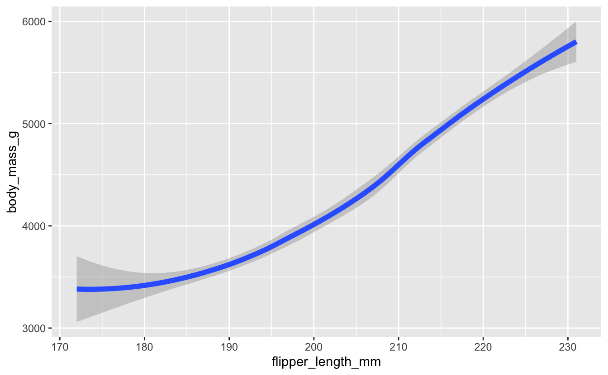

<!--
TODO:
* [x] Look over / edit the post's title in the yaml
* [x] Edit (or delete) the description; note this appears in the Twitter card
* [x] Pick category and tags (see existing with [`hugodown::tidy_show_meta()`](https://rdrr.io/pkg/hugodown/man/use_tidy_post.html))
* [x] Find photo & update yaml metadata
* [x] Create `thumbnail-sq.jpg`; height and width should be equal
* [x] Create `thumbnail-wd.jpg`; width should be >5x height
* [x] [`hugodown::use_tidy_thumbnails()`](https://rdrr.io/pkg/hugodown/man/use_tidy_post.html)
* [x] Add intro sentence, e.g. the standard tagline for the package
* [ ] [`usethis::use_tidy_thanks()`](https://usethis.r-lib.org/reference/use_tidy_thanks.html) -- not applicable
-->

Another year, another roundup of tidyverse updates, through the lens of an educator. As with previous [teaching the tidyverse posts](/blog/2021/08/teach-tidyverse-2021/), much of what is discussed in this blog post has already been covered in package update posts, however the goal of this roundup is to summarize the highlights that are most relevant to teaching data science with the tidyverse, particularly to new learners.

Specifically, I'll discuss:

**\[TO DO: Make sure outline matches final sections\]**

-   [Nine core packages in tidyverse 2.0.0](#sec-nine-core-packages-in-tidyverse-2.0.0)
-   [Improved and expanded `*_join()` functionality](#sec-improved-and-expanded-join-functionality)
-   [Per operation grouping](#sec-per-operation-grouping)
-   [Quality of life improvements to `case_when()` and `if_else()`](#sec-quality-of-life-improvements-to-case_when-and-if_else)
-   \[New argument for line geoms: linewidth\]
-   [New syntax for separating columns](#sec-new-syntax-for-separating-columns)
-   [Resource refresh](#sec-resource-refresh)
-   [What's on the horizon?](#sec-whats-on-the-horizon) **\[TO DO: Remove if not adding this section\]**

Throughout this blog post you'll encounter some code chunks with the comment `previously`, indicating what you used to do in the tidyverse. Often these will be coupled with chunks with the comment `now, optionally`, indicating what you *can* now do with the tidyverse. And rarely, they will be coupled with chunks with the comment `now`, indicating what you *should* do instead now with the tidyverse.

Let's get started with the obligatory...

<pre class='chroma'><code class='language-r' data-lang='r'><a href='https://rdrr.io/r/base/library.html'>library</a>(<a href='https://tidyverse.tidyverse.org'>tidyverse</a>)
#&gt; ── Attaching core tidyverse packages ──────────────────────── tidyverse 2.0.0 ──
#&gt; ✔ dplyr     1.1.2     ✔ readr     2.1.4
#&gt; ✔ forcats   1.0.0     ✔ stringr   1.5.0
#&gt; ✔ ggplot2   3.4.2     ✔ tibble    3.2.1
#&gt; ✔ lubridate 1.9.2     ✔ tidyr     1.3.0
#&gt; ✔ purrr     1.0.1     
#&gt; ── Conflicts ────────────────────────────────────────── tidyverse_conflicts() ──
#&gt; ✖ dplyr::filter() masks stats::filter()
#&gt; ✖ dplyr::lag()    masks stats::lag()
#&gt; ℹ Use the conflicted package (&lt;http://conflicted.r-lib.org/&gt;) to force all conflicts to become errors
</code></pre>

And, let's also load the [palmerpenguins](https://allisonhorst.github.io/palmerpenguins/) package that we will use in examples.

<pre class='chroma'><code class='language-r' data-lang='r'><a href='https://rdrr.io/r/base/library.html'>library</a>(<a href='https://allisonhorst.github.io/palmerpenguins/'>palmerpenguins</a>)</code></pre>

## Nine core packages in tidyverse 2.0.0

The main update in tidyverse 2.0.0, which was released in March 2023, is that it [lubridate](https://lubridate.tidyverse.org/) is now a core tidyverse package. The lubridate package that makes it easier to do the things R does with date-times, is now a core tidyverse package. So, while many of your scripts in the past may have started with

<pre class='chroma'><code class='language-r' data-lang='r'># previously
<a href='https://rdrr.io/r/base/library.html'>library</a>(<a href='https://tidyverse.tidyverse.org'>tidyverse</a>)
<a href='https://rdrr.io/r/base/library.html'>library</a>(<a href='https://lubridate.tidyverse.org'>lubridate</a>)</code></pre>

you can now just do

<pre class='chroma'><code class='language-r' data-lang='r'># now
<a href='https://rdrr.io/r/base/library.html'>library</a>(<a href='https://tidyverse.tidyverse.org'>tidyverse</a>)</code></pre>

and the lubridate package will be loaded as well.

If you, like me, use a graphic like the one below that maps the core tidyverse packages to phases of the data science cycle, here is an updated graphic including lubridate.

Additionally, the package loading message for the tidyverse now advertises the **conflicted** package.

<pre class='chroma'><code class='language-r' data-lang='r'>#&gt; ── Conflicts ────────────────────────────────────────── tidyverse_conflicts() ──
#&gt; ✖ dplyr::filter() masks stats::filter()
#&gt; ✖ dplyr::lag()    masks stats::lag()
#&gt; ℹ Use the conflicted package (&lt;http://conflicted.r-lib.org/&gt;) to force all conflicts to become errors
</code></pre>

Conflict resolution in R, i.e., what to do if multiple packages that are loaded in a session have functions with the same name, can get tricky, and the conflicted package is designed to help with that. R's default conflict resolution gives precedence to the most recently loaded package. For example, if you use the filter function before loading the tidyverse, R will use [`stats::filter()`](https://rdrr.io/r/stats/filter.html):

<pre class='chroma'><code class='language-r' data-lang='r'>penguins |&gt;
  <a href='https://dplyr.tidyverse.org/reference/filter.html'>filter</a>(species == "Adelie")
#&gt; Error in eval(expr, envir, enclos): object 'species' not found
</code></pre>

However, after loading the tidyverse, when you call [`filter()`](https://dplyr.tidyverse.org/reference/filter.html), R will *silently* choose [`dplyr::filter()`](https://dplyr.tidyverse.org/reference/filter.html):

<pre class='chroma'><code class='language-r' data-lang='r'>penguins |&gt;
  <a href='https://dplyr.tidyverse.org/reference/filter.html'>filter</a>(species == "Adelie")
#&gt; # A tibble: 152 × 8
#&gt;    species island    bill_length_mm bill_depth_mm flipper_length_mm body_mass_g
#&gt;    &lt;fct&gt;   &lt;fct&gt;              &lt;dbl&gt;         &lt;dbl&gt;             &lt;int&gt;       &lt;int&gt;
#&gt;  1 Adelie  Torgersen           39.1          18.7               181        3750
#&gt;  2 Adelie  Torgersen           39.5          17.4               186        3800
#&gt;  3 Adelie  Torgersen           40.3          18                 195        3250
#&gt;  4 Adelie  Torgersen           NA            NA                  NA          NA
#&gt;  5 Adelie  Torgersen           36.7          19.3               193        3450
#&gt;  6 Adelie  Torgersen           39.3          20.6               190        3650
#&gt;  7 Adelie  Torgersen           38.9          17.8               181        3625
#&gt;  8 Adelie  Torgersen           39.2          19.6               195        4675
#&gt;  9 Adelie  Torgersen           34.1          18.1               193        3475
#&gt; 10 Adelie  Torgersen           42            20.2               190        4250
#&gt; # ℹ 142 more rows
#&gt; # ℹ 2 more variables: sex &lt;fct&gt;, year &lt;int&gt;
</code></pre>

This silent conflict resolution approach works fine until it doesn't, and then it can be very frustrating to debug. The conflicted package does not allow for silent conflict resolution:

<pre class='chroma'><code class='language-r' data-lang='r'><a href='https://rdrr.io/r/base/library.html'>library</a>(<a href='https://conflicted.r-lib.org/'>conflicted</a>)
    
penguins |&gt;
  <a href='https://dplyr.tidyverse.org/reference/filter.html'>filter</a>(species == "Adelie")
#&gt; Error:
#&gt; ! [conflicted] filter found in 2 packages.
#&gt; Either pick the one you want with `::`:
#&gt; • dplyr::filter
#&gt; • stats::filter
#&gt; Or declare a preference with `conflicts_prefer()`:
#&gt; • `conflicts_prefer(dplyr::filter)`
#&gt; • `conflicts_prefer(stats::filter)`
</code></pre>

You can, of course, use [`dplyr::filter()`](https://dplyr.tidyverse.org/reference/filter.html) but if you have a bunch of data wrangling pipelines, which is likely the case if you're teaching data wrangling, it can get pretty busy.

Instead, with conflicted, you can explicitly declare which [`filter()`](https://dplyr.tidyverse.org/reference/filter.html) you want to use at the beginning (of a session, of a script, or of an R Markdown or Quarto file) with [`conflicts_prefer()`](https://conflicted.r-lib.org/reference/conflicts_prefer.html):

<pre class='chroma'><code class='language-r' data-lang='r'><a href='https://conflicted.r-lib.org/reference/conflicts_prefer.html'>conflicts_prefer</a>(dplyr::<a href='https://dplyr.tidyverse.org/reference/filter.html'>filter</a>)
#&gt; [conflicted] Will prefer dplyr::filter over any other package.
  
penguins |&gt;
  <a href='https://dplyr.tidyverse.org/reference/filter.html'>filter</a>(species == "Adelie")
#&gt; # A tibble: 152 × 8
#&gt;    species island    bill_length_mm bill_depth_mm flipper_length_mm body_mass_g
#&gt;    &lt;fct&gt;   &lt;fct&gt;              &lt;dbl&gt;         &lt;dbl&gt;             &lt;int&gt;       &lt;int&gt;
#&gt;  1 Adelie  Torgersen           39.1          18.7               181        3750
#&gt;  2 Adelie  Torgersen           39.5          17.4               186        3800
#&gt;  3 Adelie  Torgersen           40.3          18                 195        3250
#&gt;  4 Adelie  Torgersen           NA            NA                  NA          NA
#&gt;  5 Adelie  Torgersen           36.7          19.3               193        3450
#&gt;  6 Adelie  Torgersen           39.3          20.6               190        3650
#&gt;  7 Adelie  Torgersen           38.9          17.8               181        3625
#&gt;  8 Adelie  Torgersen           39.2          19.6               195        4675
#&gt;  9 Adelie  Torgersen           34.1          18.1               193        3475
#&gt; 10 Adelie  Torgersen           42            20.2               190        4250
#&gt; # ℹ 142 more rows
#&gt; # ℹ 2 more variables: sex &lt;fct&gt;, year &lt;int&gt;
</code></pre>

Getting back to the package loading message... It can be tempting, particularly in a teaching scenario, particularly to an audience of new learners, and particularly if you teach with slides and messages take up valuable slide real estate, I would urge you to not hide startup messages from teaching materials. Instead, address them early on to:

1.  Encourage reading and understanding messages, warnings, and errors -- teaching people to read error messages is hard enough, it's going to be even harder if you're not modeling that to them.

2.  Help during hard-to-debug situations resulting from base R's silent conflict resolution -- because, let's face it, someone in your class, if not you during a live-coding session, will see that pesky object not found error at some point when using [`filter()`](https://dplyr.tidyverse.org/reference/filter.html).

## Improved and expanded `*_join()` functionality

The **dplyr** package has long had the `*_join()` family of functions for joining data frames.

### `join_by()`

New functionality for join functions includes a new [`join_by()`](https://dplyr.tidyverse.org/reference/join_by.html) function for the `by` argument. So, while in the past your code may have looked like the following:

<pre class='chroma'><code class='language-r' data-lang='r'># previously
x |>
  *_join(
    y, 
    by = c("<x var>" = "<y var>")
  )
</code></pre>

you can now do:

<pre class='chroma'><code class='language-r' data-lang='r'># now, optionally
x |>
  *_join(
    y, 
    by = join_by(<x var> == <y var>)
  )
</code></pre>

For example, suppose you have the following information on the three islands we have penguins from:

<pre class='chroma'><code class='language-r' data-lang='r'>islands &lt;- <a href='https://tibble.tidyverse.org/reference/tribble.html'>tribble</a>(
  ~name,       ~coordinates,
  "Torgersen", "64°46′S 64°5′W",
  "Biscoe",    "65°26′S 65°30′W",
  "Dream",     "64°44′S 64°14′W"
)

islands
#&gt; # A tibble: 3 × 2
#&gt;   name      coordinates    
#&gt;   &lt;chr&gt;     &lt;chr&gt;          
#&gt; 1 Torgersen 64°46′S 64°5′W 
#&gt; 2 Biscoe    65°26′S 65°30′W
#&gt; 3 Dream     64°44′S 64°14′W
</code></pre>

You can join this to the penguins data frame by matching the `island` column in the penguins data frame to the `name` column in the islands data frame:

<pre class='chroma'><code class='language-r' data-lang='r'>penguins |&gt;
  <a href='https://dplyr.tidyverse.org/reference/mutate-joins.html'>left_join</a>(
    islands, 
    by = <a href='https://dplyr.tidyverse.org/reference/join_by.html'>join_by</a>(island == name)
  ) |&gt;
  <a href='https://dplyr.tidyverse.org/reference/select.html'>select</a>(species, island, coordinates)
#&gt; # A tibble: 344 × 3
#&gt;    species island    coordinates   
#&gt;    &lt;fct&gt;   &lt;chr&gt;     &lt;chr&gt;         
#&gt;  1 Adelie  Torgersen 64°46′S 64°5′W
#&gt;  2 Adelie  Torgersen 64°46′S 64°5′W
#&gt;  3 Adelie  Torgersen 64°46′S 64°5′W
#&gt;  4 Adelie  Torgersen 64°46′S 64°5′W
#&gt;  5 Adelie  Torgersen 64°46′S 64°5′W
#&gt;  6 Adelie  Torgersen 64°46′S 64°5′W
#&gt;  7 Adelie  Torgersen 64°46′S 64°5′W
#&gt;  8 Adelie  Torgersen 64°46′S 64°5′W
#&gt;  9 Adelie  Torgersen 64°46′S 64°5′W
#&gt; 10 Adelie  Torgersen 64°46′S 64°5′W
#&gt; # ℹ 334 more rows
</code></pre>

While `by = c("island" = "name")` would still work, I would recommend teaching [`join_by()`](https://dplyr.tidyverse.org/reference/join_by.html) over `by` so that:

1.  You can read it out loud as "where x is equal to y", just like in other logical statements where `==` is pronounced as "is equal to".
2.  You don't have to worry about `by = c(x = y)` (which is invalid) vs. `by = c(x = "y")` (which is valid) vs. `by = c("x" = "y")` (which is also valid).

### Handling various matches

The `*_join()` functions now have additional arguments for handling `multiple` matches and `unmatched` rows as well as for specifying the `relationship` between the two data frames.

So, while in the past your code may have looked like the following:

<pre class='chroma'><code class='language-r' data-lang='r'># previously
*_join(
  x,
  y,
  by
)
</code></pre>

you can now do:

<pre class='chroma'><code class='language-r' data-lang='r'># now, optionally
*_join(
  x,
  y,
  by,
  multiple = "all",
  unmatched = "drop",
  relationship = NULL
)
</code></pre>

Let's set up three data frames to demonstrate the new functionality:

1.  Information about three penguins, one row per `samp_id`:

<pre class='chroma'><code class='language-r' data-lang='r'>three_penguins &lt;- <a href='https://tibble.tidyverse.org/reference/tribble.html'>tribble</a>(
  ~samp_id, ~species,    ~island,
  1,        "Adelie",    "Torgersen",
  2,        "Gentoo",    "Biscoe",
  3,        "Chinstrap", "Dream"
)

three_penguins
#&gt; # A tibble: 3 × 3
#&gt;   samp_id species   island   
#&gt;     &lt;dbl&gt; &lt;chr&gt;     &lt;chr&gt;    
#&gt; 1       1 Adelie    Torgersen
#&gt; 2       2 Gentoo    Biscoe   
#&gt; 3       3 Chinstrap Dream
</code></pre>

1.  Information about weight measurements of these penguins, one row per `samp_id`, `meas_id` combination:

<pre class='chroma'><code class='language-r' data-lang='r'>weight_measurements &lt;- <a href='https://tibble.tidyverse.org/reference/tribble.html'>tribble</a>(
  ~samp_id, ~meas_id, ~body_mass_g,
  1,        1,        3220,
  1,        2,        3250,
  2,        1,        4730,
  2,        2,        4725,
  3,        1,        4000,
  3,        2,        4050
)

weight_measurements
#&gt; # A tibble: 6 × 3
#&gt;   samp_id meas_id body_mass_g
#&gt;     &lt;dbl&gt;   &lt;dbl&gt;       &lt;dbl&gt;
#&gt; 1       1       1        3220
#&gt; 2       1       2        3250
#&gt; 3       2       1        4730
#&gt; 4       2       2        4725
#&gt; 5       3       1        4000
#&gt; 6       3       2        4050
</code></pre>

1.  Information about flipper measurements of these penguins, one row per `samp_id`, `meas_id` combination:

<pre class='chroma'><code class='language-r' data-lang='r'>flipper_measurements &lt;- <a href='https://tibble.tidyverse.org/reference/tribble.html'>tribble</a>(
  ~samp_id, ~meas_id, ~flipper_length_mm,
  1,        1,        193,
  1,        2,        195,
  2,        1,        214,
  2,        2,        216,
  3,        1,        203,
  3,        2,        203
)

flipper_measurements
#&gt; # A tibble: 6 × 3
#&gt;   samp_id meas_id flipper_length_mm
#&gt;     &lt;dbl&gt;   &lt;dbl&gt;             &lt;dbl&gt;
#&gt; 1       1       1               193
#&gt; 2       1       2               195
#&gt; 3       2       1               214
#&gt; 4       2       2               216
#&gt; 5       3       1               203
#&gt; 6       3       2               203
</code></pre>

One-to-many relationships don't require extra care, they just work:

<pre class='chroma'><code class='language-r' data-lang='r'>three_penguins |&gt;
  <a href='https://dplyr.tidyverse.org/reference/mutate-joins.html'>left_join</a>(weight_measurements, <a href='https://dplyr.tidyverse.org/reference/join_by.html'>join_by</a>(samp_id))
#&gt; # A tibble: 6 × 5
#&gt;   samp_id species   island    meas_id body_mass_g
#&gt;     &lt;dbl&gt; &lt;chr&gt;     &lt;chr&gt;       &lt;dbl&gt;       &lt;dbl&gt;
#&gt; 1       1 Adelie    Torgersen       1        3220
#&gt; 2       1 Adelie    Torgersen       2        3250
#&gt; 3       2 Gentoo    Biscoe          1        4730
#&gt; 4       2 Gentoo    Biscoe          2        4725
#&gt; 5       3 Chinstrap Dream           1        4000
#&gt; 6       3 Chinstrap Dream           2        4050
</code></pre>

However, many-to-many relationships require some extra care. For example, if we join the `three_penguins` data frame to the `flipper_measurements` data frame, we get a warning:

<pre class='chroma'><code class='language-r' data-lang='r'>three_penguins |&gt;
  <a href='https://dplyr.tidyverse.org/reference/mutate-joins.html'>left_join</a>(flipper_measurements, <a href='https://dplyr.tidyverse.org/reference/join_by.html'>join_by</a>(samp_id))
#&gt; # A tibble: 6 × 5
#&gt;   samp_id species   island    meas_id flipper_length_mm
#&gt;     &lt;dbl&gt; &lt;chr&gt;     &lt;chr&gt;       &lt;dbl&gt;             &lt;dbl&gt;
#&gt; 1       1 Adelie    Torgersen       1               193
#&gt; 2       1 Adelie    Torgersen       2               195
#&gt; 3       2 Gentoo    Biscoe          1               214
#&gt; 4       2 Gentoo    Biscoe          2               216
#&gt; 5       3 Chinstrap Dream           1               203
#&gt; 6       3 Chinstrap Dream           2               203
</code></pre>

We get a warning about unexpected many-to-many relationships (unexpected because we didn't specify this type of relationship in our join call), and the warning suggests setting `relationship = "many-to-many"`. And note that we went from 6 rows (measurements) to 12, which is also unexpected.

<pre class='chroma'><code class='language-r' data-lang='r'>weight_measurements |&gt;
  <a href='https://dplyr.tidyverse.org/reference/mutate-joins.html'>left_join</a>(flipper_measurements, <a href='https://dplyr.tidyverse.org/reference/join_by.html'>join_by</a>(samp_id), relationship = "many-to-many")
#&gt; # A tibble: 12 × 5
#&gt;    samp_id meas_id.x body_mass_g meas_id.y flipper_length_mm
#&gt;      &lt;dbl&gt;     &lt;dbl&gt;       &lt;dbl&gt;     &lt;dbl&gt;             &lt;dbl&gt;
#&gt;  1       1         1        3220         1               193
#&gt;  2       1         1        3220         2               195
#&gt;  3       1         2        3250         1               193
#&gt;  4       1         2        3250         2               195
#&gt;  5       2         1        4730         1               214
#&gt;  6       2         1        4730         2               216
#&gt;  7       2         2        4725         1               214
#&gt;  8       2         2        4725         2               216
#&gt;  9       3         1        4000         1               203
#&gt; 10       3         1        4000         2               203
#&gt; 11       3         2        4050         1               203
#&gt; 12       3         2        4050         2               203
</code></pre>

With `relationship = "many-to-many"`, we no longer get a warning. However, the "explosion of rows" issue is still there. Addressing that requires rethinking what we join the two data frames by:

<pre class='chroma'><code class='language-r' data-lang='r'>weight_measurements |&gt;
  <a href='https://dplyr.tidyverse.org/reference/mutate-joins.html'>left_join</a>(flipper_measurements, <a href='https://dplyr.tidyverse.org/reference/join_by.html'>join_by</a>(samp_id, meas_id))
#&gt; # A tibble: 6 × 4
#&gt;   samp_id meas_id body_mass_g flipper_length_mm
#&gt;     &lt;dbl&gt;   &lt;dbl&gt;       &lt;dbl&gt;             &lt;dbl&gt;
#&gt; 1       1       1        3220               193
#&gt; 2       1       2        3250               195
#&gt; 3       2       1        4730               214
#&gt; 4       2       2        4725               216
#&gt; 5       3       1        4000               203
#&gt; 6       3       2        4050               203
</code></pre>

We can see that while the warning nudged us towards setting `relationship = "many-to-many"`, turns out the correct way to address the problem was to join by both `samp_id` and `meas_id`.

We'll wrap up our discussion on new functionality for handling `unmatched` cases. We'll create one more data frame (`four_penguins`) to exemplify this:

<pre class='chroma'><code class='language-r' data-lang='r'>four_penguins &lt;- <a href='https://tibble.tidyverse.org/reference/tribble.html'>tribble</a>(
  ~samp_id, ~species,    ~island,
  1,        "Adelie",    "Torgersen",
  2,        "Gentoo",    "Biscoe",
  3,        "Chinstrap", "Dream",
  4,        "Adelie",    "Biscoe"
)

four_penguins
#&gt; # A tibble: 4 × 3
#&gt;   samp_id species   island   
#&gt;     &lt;dbl&gt; &lt;chr&gt;     &lt;chr&gt;    
#&gt; 1       1 Adelie    Torgersen
#&gt; 2       2 Gentoo    Biscoe   
#&gt; 3       3 Chinstrap Dream    
#&gt; 4       4 Adelie    Biscoe
</code></pre>

If we just join `weight_measurements` to `four_penguins`, the unmatched fourth penguin silently disappears, which is less than ideal, particularly in a more realistic scenario with many more observations:

<pre class='chroma'><code class='language-r' data-lang='r'>weight_measurements |&gt;
  <a href='https://dplyr.tidyverse.org/reference/mutate-joins.html'>left_join</a>(four_penguins, <a href='https://dplyr.tidyverse.org/reference/join_by.html'>join_by</a>(samp_id))
#&gt; # A tibble: 6 × 5
#&gt;   samp_id meas_id body_mass_g species   island   
#&gt;     &lt;dbl&gt;   &lt;dbl&gt;       &lt;dbl&gt; &lt;chr&gt;     &lt;chr&gt;    
#&gt; 1       1       1        3220 Adelie    Torgersen
#&gt; 2       1       2        3250 Adelie    Torgersen
#&gt; 3       2       1        4730 Gentoo    Biscoe   
#&gt; 4       2       2        4725 Gentoo    Biscoe   
#&gt; 5       3       1        4000 Chinstrap Dream    
#&gt; 6       3       2        4050 Chinstrap Dream
</code></pre>

Setting `unmatched = "error"` can protects you from accidentally dropping rows:

<pre class='chroma'><code class='language-r' data-lang='r'>weight_measurements |&gt;
  <a href='https://dplyr.tidyverse.org/reference/mutate-joins.html'>left_join</a>(four_penguins, <a href='https://dplyr.tidyverse.org/reference/join_by.html'>join_by</a>(samp_id), unmatched = "error")
#&gt; Error in `left_join()`:
#&gt; ! Each row of `y` must be matched by `x`.
#&gt; ℹ Row 4 of `y` was not matched.
</code></pre>

Once you see the error message, you can decide how to handle the unmatched rows, e.g., explicitly drop them.

<pre class='chroma'><code class='language-r' data-lang='r'>weight_measurements |&gt;
  <a href='https://dplyr.tidyverse.org/reference/mutate-joins.html'>left_join</a>(four_penguins, <a href='https://dplyr.tidyverse.org/reference/join_by.html'>join_by</a>(samp_id), unmatched = "drop")
#&gt; # A tibble: 6 × 5
#&gt;   samp_id meas_id body_mass_g species   island   
#&gt;     &lt;dbl&gt;   &lt;dbl&gt;       &lt;dbl&gt; &lt;chr&gt;     &lt;chr&gt;    
#&gt; 1       1       1        3220 Adelie    Torgersen
#&gt; 2       1       2        3250 Adelie    Torgersen
#&gt; 3       2       1        4730 Gentoo    Biscoe   
#&gt; 4       2       2        4725 Gentoo    Biscoe   
#&gt; 5       3       1        4000 Chinstrap Dream    
#&gt; 6       3       2        4050 Chinstrap Dream
</code></pre>

There are many more developments related to `*_join()` functions (e.g., [inequality joins](/blog/2023/01/dplyr-1-1-0-joins/#inequality-joins) and [rolling joins](/blog/2023/01/dplyr-1-1-0-joins/#rolling-joins)), but many of these likely wouldn't come up in an introductory course so we won't get into their details. A good place to read more about them is [R for Data Science, 2nd edition](https://r4ds.hadley.nz/joins.html#sec-non-equi-joins).

Exploding joins (i.e., joins that result in a larger number of rows than either of the data frames from bie) can be hard to debug for students! Teaching them the tools to diagnose whether the join they performed, and that may not have given an error, is indeed the one they wanted to perform. Did they lose any cases? Did they gain an unexpected amount of cases? Did they perform a join without thinking and take down the entire teaching server? These things happen, particularly if students are working with their own data for an open-ended project!

## Per operation grouping

previously

<pre class='chroma'><code class='language-r' data-lang='r'># previously
df |&gt;
  <a href='https://dplyr.tidyverse.org/reference/group_by.html'>group_by</a>(x) |&gt;
  <a href='https://dplyr.tidyverse.org/reference/summarise.html'>summarize</a>(<a href='https://rdrr.io/r/base/mean.html'>mean</a>(y))</code></pre>

now, optionally

<pre class='chroma'><code class='language-r' data-lang='r'># previously
df |&gt;
  <a href='https://dplyr.tidyverse.org/reference/summarise.html'>summarize</a>(
    <a href='https://rdrr.io/r/base/mean.html'>mean</a>(y), 
    .by = x
  )</code></pre>

Persistent groups:

<pre class='chroma'><code class='language-r' data-lang='r'>penguins |&gt;
  <a href='https://tidyr.tidyverse.org/reference/drop_na.html'>drop_na</a>(sex, body_mass_g) |&gt;
  <a href='https://dplyr.tidyverse.org/reference/group_by.html'>group_by</a>(species, sex) |&gt;
  <a href='https://dplyr.tidyverse.org/reference/summarise.html'>summarize</a>(mean_bw = <a href='https://rdrr.io/r/base/mean.html'>mean</a>(body_mass_g)) |&gt;
  <a href='https://dplyr.tidyverse.org/reference/slice.html'>slice_head</a>(n = 1)
#&gt; `summarise()` has grouped output by 'species'. You can override using the
#&gt; `.groups` argument.
#&gt; # A tibble: 3 × 3
#&gt; # Groups:   species [3]
#&gt;   species   sex    mean_bw
#&gt;   &lt;fct&gt;     &lt;fct&gt;    &lt;dbl&gt;
#&gt; 1 Adelie    female   3369.
#&gt; 2 Chinstrap female   3527.
#&gt; 3 Gentoo    female   4680.
</code></pre>

Dropped groups:

<pre class='chroma'><code class='language-r' data-lang='r'>penguins |&gt;
  <a href='https://tidyr.tidyverse.org/reference/drop_na.html'>drop_na</a>(sex, body_mass_g) |&gt;
  <a href='https://dplyr.tidyverse.org/reference/group_by.html'>group_by</a>(species, sex) |&gt;
  <a href='https://dplyr.tidyverse.org/reference/summarise.html'>summarize</a>(mean_bw = <a href='https://rdrr.io/r/base/mean.html'>mean</a>(body_mass_g), .groups = "drop") |&gt;
  <a href='https://dplyr.tidyverse.org/reference/slice.html'>slice_head</a>(n = 1)
#&gt; # A tibble: 1 × 3
#&gt;   species sex    mean_bw
#&gt;   &lt;fct&gt;   &lt;fct&gt;    &lt;dbl&gt;
#&gt; 1 Adelie  female   3369.
</code></pre>

Per operation grouping:

<pre class='chroma'><code class='language-r' data-lang='r'># group by 1 variable
penguins |&gt;
  <a href='https://tidyr.tidyverse.org/reference/drop_na.html'>drop_na</a>(sex, body_mass_g) |&gt;
  <a href='https://dplyr.tidyverse.org/reference/summarise.html'>summarize</a>(
    mean_bw = <a href='https://rdrr.io/r/base/mean.html'>mean</a>(body_mass_g), 
    .by = species
  )
#&gt; # A tibble: 3 × 2
#&gt;   species   mean_bw
#&gt;   &lt;fct&gt;       &lt;dbl&gt;
#&gt; 1 Adelie      3706.
#&gt; 2 Gentoo      5092.
#&gt; 3 Chinstrap   3733.

# group by 2 variables
penguins |&gt;
  <a href='https://tidyr.tidyverse.org/reference/drop_na.html'>drop_na</a>(sex, body_mass_g) |&gt;
  <a href='https://dplyr.tidyverse.org/reference/summarise.html'>summarize</a>(
    mean_bw = <a href='https://rdrr.io/r/base/mean.html'>mean</a>(body_mass_g), 
    .by = <a href='https://rdrr.io/r/base/c.html'>c</a>(species, sex)
  )
#&gt; # A tibble: 6 × 3
#&gt;   species   sex    mean_bw
#&gt;   &lt;fct&gt;     &lt;fct&gt;    &lt;dbl&gt;
#&gt; 1 Adelie    male     4043.
#&gt; 2 Adelie    female   3369.
#&gt; 3 Gentoo    female   4680.
#&gt; 4 Gentoo    male     5485.
#&gt; 5 Chinstrap female   3527.
#&gt; 6 Chinstrap male     3939.
</code></pre>

Teaching tip: Choose one grouping method and stick to it

It doesn't matter whether you use group_by() (followed by .groups, where needed) or .by.

For new learners, pick one and stick to it. For more experienced learners, particularly those learning to design their own functions and packages, it can be interesting to go through the differences and evolution.

## Quality of life improvements to `case_when()` and `if_else()`

### `case_when()`

all else denoted by .default for case_when() less strict about value type for both

previously

<pre class='chroma'><code class='language-r' data-lang='r'># previously
df |>
  mutate(
    x = case_when(
      <condition 1> ~ "value 1",
      <condition 2> ~ "value 2",
      <condition 3> ~ "value 3",
      TRUE          ~ NA_character_
    )
  )
</code></pre>

now, optionally

<pre class='chroma'><code class='language-r' data-lang='r'># now, optionally
df |>
  mutate(
    x = case_when(
      <condition 1> ~ "value 1",
      <condition 2> ~ "value 2",
      <condition 3> ~ "value 3",
      .default = NA
    )
  )
</code></pre>

<pre class='chroma'><code class='language-r' data-lang='r'>penguins |&gt;
  <a href='https://dplyr.tidyverse.org/reference/mutate.html'>mutate</a>(
    bm_cat = <a href='https://dplyr.tidyverse.org/reference/case_when.html'>case_when</a>(
      <a href='https://rdrr.io/r/base/NA.html'>is.na</a>(body_mass_g) ~ NA,
      body_mass_g &lt; 3550 ~ "Small",
      <a href='https://dplyr.tidyverse.org/reference/between.html'>between</a>(body_mass_g, 3550, 4750) ~ "Medium",
      .default = "Large"
    )
  ) |&gt;
  <a href='https://dplyr.tidyverse.org/reference/relocate.html'>relocate</a>(body_mass_g, bm_cat)
#&gt; # A tibble: 344 × 9
#&gt;    body_mass_g bm_cat species island    bill_length_mm bill_depth_mm
#&gt;          &lt;int&gt; &lt;chr&gt;  &lt;fct&gt;   &lt;fct&gt;              &lt;dbl&gt;         &lt;dbl&gt;
#&gt;  1        3750 Medium Adelie  Torgersen           39.1          18.7
#&gt;  2        3800 Medium Adelie  Torgersen           39.5          17.4
#&gt;  3        3250 Small  Adelie  Torgersen           40.3          18  
#&gt;  4          NA NA     Adelie  Torgersen           NA            NA  
#&gt;  5        3450 Small  Adelie  Torgersen           36.7          19.3
#&gt;  6        3650 Medium Adelie  Torgersen           39.3          20.6
#&gt;  7        3625 Medium Adelie  Torgersen           38.9          17.8
#&gt;  8        4675 Medium Adelie  Torgersen           39.2          19.6
#&gt;  9        3475 Small  Adelie  Torgersen           34.1          18.1
#&gt; 10        4250 Medium Adelie  Torgersen           42            20.2
#&gt; # ℹ 334 more rows
#&gt; # ℹ 3 more variables: flipper_length_mm &lt;int&gt;, sex &lt;fct&gt;, year &lt;int&gt;
</code></pre>

### if_else()

<pre class='chroma'><code class='language-r' data-lang='r'>penguins |&gt;
  <a href='https://dplyr.tidyverse.org/reference/mutate.html'>mutate</a>(
    bm_unit = <a href='https://dplyr.tidyverse.org/reference/if_else.html'>if_else</a>(!<a href='https://rdrr.io/r/base/NA.html'>is.na</a>(body_mass_g), <a href='https://rdrr.io/r/base/paste.html'>paste</a>(body_mass_g, "g"), NA)
  ) |&gt;
  <a href='https://dplyr.tidyverse.org/reference/relocate.html'>relocate</a>(body_mass_g, bm_unit)
#&gt; # A tibble: 344 × 9
#&gt;    body_mass_g bm_unit species island    bill_length_mm bill_depth_mm
#&gt;          &lt;int&gt; &lt;chr&gt;   &lt;fct&gt;   &lt;fct&gt;              &lt;dbl&gt;         &lt;dbl&gt;
#&gt;  1        3750 3750 g  Adelie  Torgersen           39.1          18.7
#&gt;  2        3800 3800 g  Adelie  Torgersen           39.5          17.4
#&gt;  3        3250 3250 g  Adelie  Torgersen           40.3          18  
#&gt;  4          NA NA      Adelie  Torgersen           NA            NA  
#&gt;  5        3450 3450 g  Adelie  Torgersen           36.7          19.3
#&gt;  6        3650 3650 g  Adelie  Torgersen           39.3          20.6
#&gt;  7        3625 3625 g  Adelie  Torgersen           38.9          17.8
#&gt;  8        4675 4675 g  Adelie  Torgersen           39.2          19.6
#&gt;  9        3475 3475 g  Adelie  Torgersen           34.1          18.1
#&gt; 10        4250 4250 g  Adelie  Torgersen           42            20.2
#&gt; # ℹ 334 more rows
#&gt; # ℹ 3 more variables: flipper_length_mm &lt;int&gt;, sex &lt;fct&gt;, year &lt;int&gt;
</code></pre>

Teaching tip: It's a blessing to not have to introduce NA_character\_ and friends

Especially not having to introduce it as early as if_else() and case_when(). Cherish it!

Different types of NAs are a good topic for a course on R as a programming language, statistical computing, etc. but not necessary for an intro course.

## New argument for line geoms: `linewidth`

**TO DO: Add more context.**

<pre class='chroma'><code class='language-r' data-lang='r'># previously

penguins |&gt;
  <a href='https://tidyr.tidyverse.org/reference/drop_na.html'>drop_na</a>() |&gt;
  <a href='https://ggplot2.tidyverse.org/reference/ggplot.html'>ggplot</a>(
    <a href='https://ggplot2.tidyverse.org/reference/aes.html'>aes</a>(x = flipper_length_mm, y = body_mass_g)
  ) +
  <a href='https://ggplot2.tidyverse.org/reference/geom_smooth.html'>geom_smooth</a>(size = 2)
#&gt; Warning: Using `size` aesthetic for lines was deprecated in ggplot2 3.4.0.
#&gt; ℹ Please use `linewidth` instead.
#&gt; This warning is displayed once every 8 hours.
#&gt; Call `lifecycle::last_lifecycle_warnings()` to see where this warning was
#&gt; generated.
#&gt; `geom_smooth()` using method = 'loess' and formula = 'y ~ x'
</code></pre>

<pre class='chroma'><code class='language-r' data-lang='r'># now

penguins |&gt;
  <a href='https://tidyr.tidyverse.org/reference/drop_na.html'>drop_na</a>() |&gt;
  <a href='https://ggplot2.tidyverse.org/reference/ggplot.html'>ggplot</a>(
    <a href='https://ggplot2.tidyverse.org/reference/aes.html'>aes</a>(x = flipper_length_mm, y = body_mass_g)
  ) +
  <a href='https://ggplot2.tidyverse.org/reference/geom_smooth.html'>geom_smooth</a>(linewidth = 2)
#&gt; `geom_smooth()` using method = 'loess' and formula = 'y ~ x'
</code></pre>

Teaching tip: Check the output of your old teaching materials thoroughly

To not make a fool of yourself when teaching 🤣

## New syntax for separating columns

that supersede [`extract()`](https://tidyr.tidyverse.org/reference/extract.html), [`separate()`](https://tidyr.tidyverse.org/reference/separate.html), and [`separate_rows()`](https://tidyr.tidyverse.org/reference/separate_rows.html) because they have more consistent names and arguments, have better performance, and provide a new approach for handling problems:

|                                  | **MAKE COLUMNS**                                                                               | **MAKE ROWS**                                                                                    |
|:------------------|:--------------------------|:--------------------------|
| Separate with delimiter          | [`separate_wider_delim()`](https://tidyr.tidyverse.org/reference/separate_wider_delim.html)    | [`separate_longer_delim()`](https://tidyr.tidyverse.org/reference/separate_longer_delim.html)    |
| Separate by position             | [`separate_wider_position()`](https://tidyr.tidyverse.org/reference/separate_wider_delim.html) | [`separate_longer_position()`](https://tidyr.tidyverse.org/reference/separate_longer_delim.html) |
| Separate with regular expression |                                                                                                |                                                                                                  |

**\[TO DO: Add example\]**

Teaching tip: If teaching folks coming from doing data manipulation in spreadsheets, leverage that to motivate different types of `separate_*()` functions, and show the benefits of programming over point-and-click software for more advanced operations like separating longer and separating with regular expressions.

## Resource refresh

R for Data Science, 2nd Edition is out! [This blog post](blog/2023/07/r4ds-2e/) (and the [book's preface](https://r4ds.hadley.nz/preface-2e.html)) outlines updates since the first edition. One change in the 2nd Edition that will most likely affect almost all of your teaching materials is the use of the native R pipe (`|>`) instead of the magrittr pipe (`%>%`). I strongly recommend making this update since it will allow students to perform piped operations with any R function, and hence allow them to keep their data pipeline workflows regardless of whether the next package they learn is from the tidyverse (or package that uses tidyverse principles) or not.

## What's on the horizon?

**TO DO: Decide whether to add this section.**

