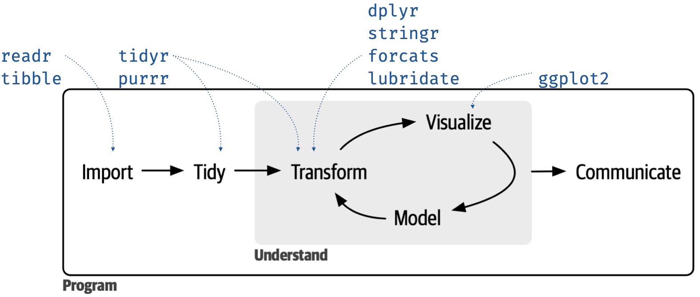

<!--
TODO:
* [x] Look over / edit the post's title in the yaml
* [x] Edit (or delete) the description; note this appears in the Twitter card
* [x] Pick category and tags (see existing with [`hugodown::tidy_show_meta()`](https://rdrr.io/pkg/hugodown/man/use_tidy_post.html))
* [x] Find photo & update yaml metadata
* [x] Create `thumbnail-sq.jpg`; height and width should be equal
* [x] Create `thumbnail-wd.jpg`; width should be >5x height
* [x] [`hugodown::use_tidy_thumbnails()`](https://rdrr.io/pkg/hugodown/man/use_tidy_post.html)
* [x] Add intro sentence, e.g. the standard tagline for the package
* [ ] [`usethis::use_tidy_thanks()`](https://usethis.r-lib.org/reference/use_tidy_thanks.html) -- not applicable
-->

Another year, another roundup of tidyverse updates, through the lens of an educator. As with previous [teaching the tidyverse posts](/blog/2021/08/teach-tidyverse-2021/), much of what is discussed in this blog post has already been covered in package update posts, however the goal of this roundup is to summarize the highlights that are most relevant to teaching data science with the tidyverse, particularly to new learners.

Specifically, I'll discuss: **TO DO: UPDATE OUTLINE**

-   [Nine core packages in tidyverse 2.0.0](#new-teaching-and-learning-resources)

Throughout this blog post you'll encounter some code chunks with the comment `previously`, indicating what you used to do in the tidyverse. Often these will be coupled with chunks with the comment `now, optionally`, indicating what you *can* now do with the tidyverse. And rarely, they will be coupled with chunks with the comment `now`, indicating what you *should* do instead now with the tidyverse.

Let's get started with the obligatory...

<pre class='chroma'><code class='language-r' data-lang='r'><a href='https://rdrr.io/r/base/library.html'>library</a>(<a href='https://tidyverse.tidyverse.org'>tidyverse</a>)
#&gt; ── Attaching core tidyverse packages ──────────────────────── tidyverse 2.0.0 ──
#&gt; ✔ dplyr     1.1.2     ✔ readr     2.1.4
#&gt; ✔ forcats   1.0.0     ✔ stringr   1.5.0
#&gt; ✔ ggplot2   3.4.2     ✔ tibble    3.2.1
#&gt; ✔ lubridate 1.9.2     ✔ tidyr     1.3.0
#&gt; ✔ purrr     1.0.1     
#&gt; ── Conflicts ────────────────────────────────────────── tidyverse_conflicts() ──
#&gt; ✖ dplyr::filter() masks stats::filter()
#&gt; ✖ dplyr::lag()    masks stats::lag()
#&gt; ℹ Use the conflicted package (&lt;http://conflicted.r-lib.org/&gt;) to force all conflicts to become errors
</code></pre>

And, let's also load the **palmerpenguins** package that we will use in examples.

<pre class='chroma'><code class='language-r' data-lang='r'><a href='https://rdrr.io/r/base/library.html'>library</a>(<a href='https://allisonhorst.github.io/palmerpenguins/'>palmerpenguins</a>)</code></pre>

## Nine core packages in tidyverse 2.0.0

The main update in tidyverse 2.0.0, which was released in March 2023, is that it **lubridate** is now a core tidyverse package. The lubridate package that makes it easier to do the things R does with date-times, is now a core tidyverse package. So, while many of your scripts in the past may have started with

<pre class='chroma'><code class='language-r' data-lang='r'># previously
<a href='https://rdrr.io/r/base/library.html'>library</a>(<a href='https://tidyverse.tidyverse.org'>tidyverse</a>)
<a href='https://rdrr.io/r/base/library.html'>library</a>(<a href='https://lubridate.tidyverse.org'>lubridate</a>)</code></pre>

you can now just do

<pre class='chroma'><code class='language-r' data-lang='r'># now
<a href='https://rdrr.io/r/base/library.html'>library</a>(<a href='https://tidyverse.tidyverse.org'>tidyverse</a>)</code></pre>

and the lubridate package will be loaded as well.

If you, like me, use a graphic like the one below that maps the core tidyverse packages to phases of the data science cycle, here is an updated graphic including lubridate.

Additionally, the package loading message for the tidyverse now advertises the **conflicted** package.

<pre class='chroma'><code class='language-r' data-lang='r'>#&gt; ── Conflicts ────────────────────────────────────────── tidyverse_conflicts() ──
#&gt; ✖ dplyr::filter() masks stats::filter()
#&gt; ✖ dplyr::lag()    masks stats::lag()
#&gt; ℹ Use the conflicted package (&lt;http://conflicted.r-lib.org/&gt;) to force all conflicts to become errors
</code></pre>

Conflict resolution in R, i.e., what to do if multiple packages that are loaded in a session have functions with the same name, can get tricky, and the conflicted package is designed to help with that. R's default conflict resolution gives precedence to the most recently loaded package. For example, if you use the filter function before loading the tidyverse, R will use [`stats::filter()`](https://rdrr.io/r/stats/filter.html):

<pre class='chroma'><code class='language-r' data-lang='r'>penguins |&gt;
  <a href='https://dplyr.tidyverse.org/reference/filter.html'>filter</a>(species == "Adelie")
#&gt; Error in eval(expr, envir, enclos): object 'species' not found
</code></pre>

However, after loading the tidyverse, when you call [`filter()`](https://dplyr.tidyverse.org/reference/filter.html), R will *silently* choose [`dplyr::filter()`](https://dplyr.tidyverse.org/reference/filter.html):

<pre class='chroma'><code class='language-r' data-lang='r'>penguins |&gt;
  <a href='https://dplyr.tidyverse.org/reference/filter.html'>filter</a>(species == "Adelie")
#&gt; # A tibble: 152 × 8
#&gt;    species island    bill_length_mm bill_depth_mm flipper_length_mm body_mass_g
#&gt;    &lt;fct&gt;   &lt;fct&gt;              &lt;dbl&gt;         &lt;dbl&gt;             &lt;int&gt;       &lt;int&gt;
#&gt;  1 Adelie  Torgersen           39.1          18.7               181        3750
#&gt;  2 Adelie  Torgersen           39.5          17.4               186        3800
#&gt;  3 Adelie  Torgersen           40.3          18                 195        3250
#&gt;  4 Adelie  Torgersen           NA            NA                  NA          NA
#&gt;  5 Adelie  Torgersen           36.7          19.3               193        3450
#&gt;  6 Adelie  Torgersen           39.3          20.6               190        3650
#&gt;  7 Adelie  Torgersen           38.9          17.8               181        3625
#&gt;  8 Adelie  Torgersen           39.2          19.6               195        4675
#&gt;  9 Adelie  Torgersen           34.1          18.1               193        3475
#&gt; 10 Adelie  Torgersen           42            20.2               190        4250
#&gt; # ℹ 142 more rows
#&gt; # ℹ 2 more variables: sex &lt;fct&gt;, year &lt;int&gt;
</code></pre>

This silent conflict resolution approach works fine until it doesn't, and then it can be very frustrating to debug. The conflicted package does not allow for silent conflict resolution:

<pre class='chroma'><code class='language-r' data-lang='r'><a href='https://rdrr.io/r/base/library.html'>library</a>(<a href='https://conflicted.r-lib.org/'>conflicted</a>)
    
penguins |&gt;
  <a href='https://dplyr.tidyverse.org/reference/filter.html'>filter</a>(species == "Adelie")
#&gt; Error:
#&gt; ! [conflicted] filter found in 2 packages.
#&gt; Either pick the one you want with `::`:
#&gt; • dplyr::filter
#&gt; • stats::filter
#&gt; Or declare a preference with `conflicts_prefer()`:
#&gt; • `conflicts_prefer(dplyr::filter)`
#&gt; • `conflicts_prefer(stats::filter)`
</code></pre>

You can, of course, use [`dplyr::filter()`](https://dplyr.tidyverse.org/reference/filter.html) but if you have a bunch of data wrangling pipelines, which is likely the case if you're teaching data wrangling, it can get pretty busy.

Instead, with conflicted, you can explicitly declare which [`filter()`](https://dplyr.tidyverse.org/reference/filter.html) you want to use at the beginning (of a session, of a script, or of an R Markdown or Quarto file) with [`conflicts_prefer()`](https://conflicted.r-lib.org/reference/conflicts_prefer.html):

<pre class='chroma'><code class='language-r' data-lang='r'><a href='https://conflicted.r-lib.org/reference/conflicts_prefer.html'>conflicts_prefer</a>(dplyr::<a href='https://dplyr.tidyverse.org/reference/filter.html'>filter</a>)
#&gt; [conflicted] Will prefer dplyr::filter over any other package.
  
penguins |&gt;
  <a href='https://dplyr.tidyverse.org/reference/filter.html'>filter</a>(species == "Adelie")
#&gt; # A tibble: 152 × 8
#&gt;    species island    bill_length_mm bill_depth_mm flipper_length_mm body_mass_g
#&gt;    &lt;fct&gt;   &lt;fct&gt;              &lt;dbl&gt;         &lt;dbl&gt;             &lt;int&gt;       &lt;int&gt;
#&gt;  1 Adelie  Torgersen           39.1          18.7               181        3750
#&gt;  2 Adelie  Torgersen           39.5          17.4               186        3800
#&gt;  3 Adelie  Torgersen           40.3          18                 195        3250
#&gt;  4 Adelie  Torgersen           NA            NA                  NA          NA
#&gt;  5 Adelie  Torgersen           36.7          19.3               193        3450
#&gt;  6 Adelie  Torgersen           39.3          20.6               190        3650
#&gt;  7 Adelie  Torgersen           38.9          17.8               181        3625
#&gt;  8 Adelie  Torgersen           39.2          19.6               195        4675
#&gt;  9 Adelie  Torgersen           34.1          18.1               193        3475
#&gt; 10 Adelie  Torgersen           42            20.2               190        4250
#&gt; # ℹ 142 more rows
#&gt; # ℹ 2 more variables: sex &lt;fct&gt;, year &lt;int&gt;
</code></pre>

Getting back to the package loading message... It can be tempting, particularly in a teaching scenario, particularly to an audience of new learners, and particularly if you teach with slides and messages take up valuable slide real estate, I would urge you to not hide startup messages from teaching materials. Instead, address them early on to:

1.  Encourage reading and understanding messages, warnings, and errors -- teaching people to read error messages is hard enough, it's going to be even harder if you're not modeling that to them.

2.  Help during hard-to-debug situations resulting from base R's silent conflict resolution -- because, let's face it, someone in your class, if not you during a live-coding session, will see that pesky object not found error at some point when using [`filter()`](https://dplyr.tidyverse.org/reference/filter.html).

## Improved and expanded `*_join()` functionality

The **dplyr** package has long had the `*_join()` family of functions for joining data frames.

New functionality for join functions includes a new [`join_by()`](https://dplyr.tidyverse.org/reference/join_by.html) function for the `by` argument. So, while in the past your code may have looked like the following:

<pre class='chroma'><code class='language-r' data-lang='r'># previously
x |>
  *_join(
    y, 
    by = c("<x var>" = "<y var>")
  )
</code></pre>

you can now do

<pre class='chroma'><code class='language-r' data-lang='r'># now, optionally
x |>
  *_join(
    y, 
    by = join_by(<x var> == <y var>)
  )
</code></pre>

For example, suppose you have the following information on the three islands we have penguins from:

<pre class='chroma'><code class='language-r' data-lang='r'>islands &lt;- <a href='https://tibble.tidyverse.org/reference/tribble.html'>tribble</a>(
  ~name,       ~coordinates,
  "Torgersen", "64°46′S 64°5′W",
  "Biscoe",    "65°26′S 65°30′W",
  "Dream",     "64°44′S 64°14′W"
)

islands
#&gt; # A tibble: 3 × 2
#&gt;   name      coordinates    
#&gt;   &lt;chr&gt;     &lt;chr&gt;          
#&gt; 1 Torgersen 64°46′S 64°5′W 
#&gt; 2 Biscoe    65°26′S 65°30′W
#&gt; 3 Dream     64°44′S 64°14′W
</code></pre>

You can join this to the penguins data frame by matching the `island` column in the penguins data frame to the `name` column in the islands data frame:

<pre class='chroma'><code class='language-r' data-lang='r'>penguins |&gt;
  <a href='https://dplyr.tidyverse.org/reference/mutate-joins.html'>left_join</a>(
    islands, 
    by = <a href='https://dplyr.tidyverse.org/reference/join_by.html'>join_by</a>(island == name)
  ) |&gt;
  <a href='https://dplyr.tidyverse.org/reference/select.html'>select</a>(species, island, coordinates)
#&gt; # A tibble: 344 × 3
#&gt;    species island    coordinates   
#&gt;    &lt;fct&gt;   &lt;chr&gt;     &lt;chr&gt;         
#&gt;  1 Adelie  Torgersen 64°46′S 64°5′W
#&gt;  2 Adelie  Torgersen 64°46′S 64°5′W
#&gt;  3 Adelie  Torgersen 64°46′S 64°5′W
#&gt;  4 Adelie  Torgersen 64°46′S 64°5′W
#&gt;  5 Adelie  Torgersen 64°46′S 64°5′W
#&gt;  6 Adelie  Torgersen 64°46′S 64°5′W
#&gt;  7 Adelie  Torgersen 64°46′S 64°5′W
#&gt;  8 Adelie  Torgersen 64°46′S 64°5′W
#&gt;  9 Adelie  Torgersen 64°46′S 64°5′W
#&gt; 10 Adelie  Torgersen 64°46′S 64°5′W
#&gt; # ℹ 334 more rows
</code></pre>

While `by = c("island" = "name")` would still work, I would recommend teaching [`join_by()`](https://dplyr.tidyverse.org/reference/join_by.html) over `by` so that:

1.  You can read it out loud as "where x is equal to y", just like in other logical statements where `==` is pronounced as "is equal to".
2.  You don't have to worry about `by = c(x = y)` (which is invalid) vs. `by = c(x = "y")` (which is valid) vs. `by = c("x" = "y")` (which is also valid).

## Acknowledgements

