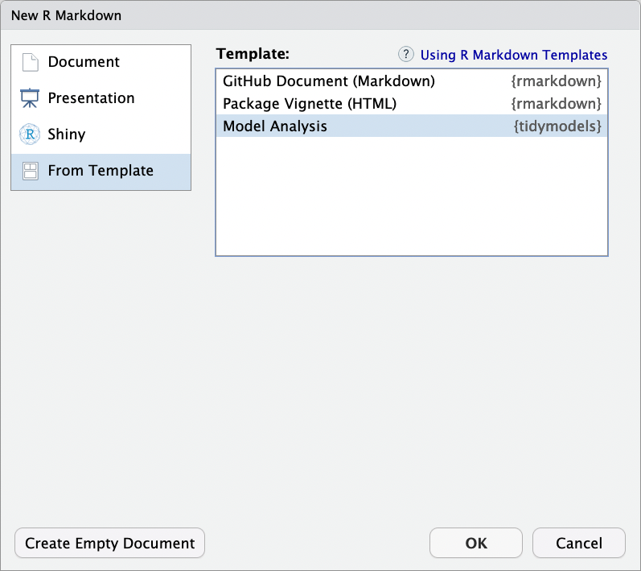
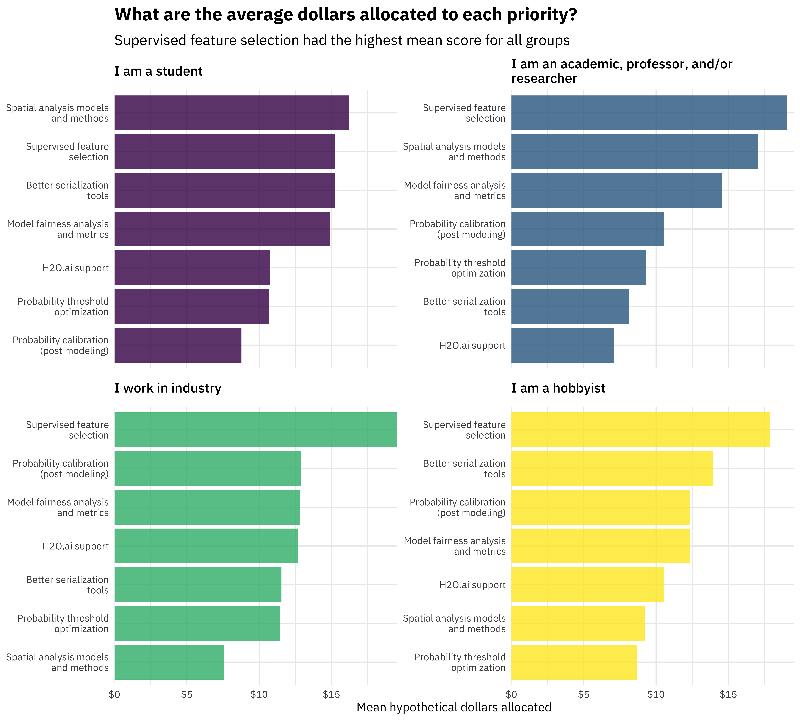

<!--
TODO:
* [ ] Look over / edit the post's title in the yaml
* [ ] Edit (or delete) the description; note this appears in the Twitter card
* [ ] Pick category and tags (see existing with `hugodown::tidy_show_meta()`)
* [ ] Find photo & update yaml metadata
* [ ] Create `thumbnail-sq.jpg`; height and width should be equal
* [ ] Create `thumbnail-wd.jpg`; width should be >5x height
* [ ] `hugodown::use_tidy_thumbnails()`
* [ ] Add intro sentence, e.g. the standard tagline for the package
* [ ] `usethis::use_tidy_thanks()`
-->

```{r include=FALSE, message=FALSE}
library(ggplot2)
theme_set(theme_minimal())
knitr::opts_chunk$set(collapse = TRUE, comment = "#>")
options(cli.width = 70, width = 70)
```

The [tidymodels](https://www.tidymodels.org/) framework is a collection of R packages for modeling and machine learning using tidyverse principles. 

```{r}
library(tidymodels)
```

Starting at the beginning of this year, we now publish [regular updates](https://www.tidyverse.org/categories/roundup/) here on the tidyverse blog summarizing what's new in the tidymodels ecosystem. You can check out the [`tidymodels` tag](https://www.tidyverse.org/tags/tidymodels/) to find all tidymodels blog posts here, including our roundup posts as well as those that are more focused. The purpose of these quarterly posts is to share useful new features and any updates you may have missed.

Since [our last roundup post](https://www.tidyverse.org/blog/2021/09/tidymodels-2021-q3/), there have been seven CRAN releases of tidymodels packages. You can install these updates from CRAN with:

```{r, eval = FALSE}
install.packages(c("broom", "embed", "rsample", "shinymodels",
                   "tidymodels", "workflows", "yardstick"))
```

The `NEWS` files are linked here for each package; you'll notice that some of these releases involve small bug fixes or internal changes that are not user-facing. We write code in these smaller, modular packages that we can release frequently both to make models easier to deploy and to keep our software easier to maintain. We know it may feel like a lot of moving parts to keep up with if you are a tidymodels user, so we want to highlight a couple of the more useful updates in these releases.

- [broom](https://broom.tidymodels.org/news/index.html#broom-0-7-10-2021-10-31)
- [embed](https://embed.tidymodels.org/news/index.html#embed-015)
- [rsample](https://rsample.tidymodels.org/news/index.html#rsample-011)
- [shinymodels](https://shinymodels.tidymodels.org/news/index.html#shinymodels-010)
- the [tidymodels](https://tidymodels.tidymodels.org/news/index.html#tidymodels-0-1-4-2021-10-01) metapackage itself
- [workflows](https://workflows.tidymodels.org/news/index.html#workflows-0-2-4-2021-10-12)
- [yardstick](https://yardstick.tidymodels.org/news/index.html#yardstick-0-0-9-2021-11-22)

## Tools for tidymodels analyses

Several of these releases incorporate tools to reduce the overhead for getting started with your tidymodels analysis or for understanding your results more deeply. The new release of the tidymodels metapackage itself provides an R Markdown template. To use the tidymodels analysis template from RStudio, access through `File -> New File -> R Markdown`. This will open the dialog box where you can select from one of the available templates:

```{r, echo=FALSE, out.width="70%", fig.alt="R Markdown template dialog box with three choices, including the tidymodels Model Analysis template"}

```


If you are not using RStudio, you'll also need to install [Pandoc](https://pandoc.org). Then, use the `rmarkdown::draft()` function to create the model card:

```r
rmarkdown::draft(
    "my_model_analysis.Rmd", 
    template = "model-analysis", 
    package = "tidymodels"
)
```

This template offers an opinionated guide on how to structure a basic modeling analysis from exploratory data analysis through evaluating your models. Your individual modeling analysis may require you to add to, subtract from, or otherwise change this structure, but you can consider this a general framework to start from.

This quarter, the package [shinymodels](https://shinymodels.tidymodels.org/) had its first CRAN release. This package was the focus of our tidymodels summer intern [Shisham Adhikari](https://www.shishamad.com/posts/how-i-got-my-rstudio-internship/) in 2021, and it provides support for launching a Shiny app to interactively explore tuning or resampling results.


## Make your own rsample split objects

The data resampling infrastructure provided by the [rsample](https://rsample.tidymodels.org/) package has always worked well when you start off with a dataset to split into training and testing. However, we heard from users that in some situations they have training and testing sets determined by other processes, or need to create their data split using more complex conditions. The latest release of rsample provides more fluent and flexible support for custom `rsplit` creation that sets you up for the rest of your tidymodels analysis. For example, you can create a split object from two dataframes.

```{r}
library(gapminder)

year_split <-
  make_splits(
    gapminder %>% filter(year <= 2000),
    gapminder %>% filter(year > 2000)
  )

year_split
testing(year_split)
```

You can alternatively [create a split using a list of indices](https://rsample.tidymodels.org/reference/make_splits.html); this `make_splits()` flexibility is good for when the defaults in `initial_split()` and `initial_time_split()` are not appropriate. We also added a [new function `validation_time_split()`](https://rsample.tidymodels.org/reference/validation_split.html) to create a single validation resample, much like `validation_split()`, but taking the first `prop` samples for training.

## Survey says...

This fall, we [launched our second tidymodels survey](https://www.tidyverse.org/blog/2021/10/tidymodels-2022-survey/) to gather community input on our priorities for 2022. Thank you so much to everyone who shared their opinion! Over 600 people completed the survey, a significant increase from last year, and the top three requested features overall are:

- **Supervised feature selection:** This includes basic supervised filtering methods as well as techniques such as recursive feature elimination.

- **Model fairness analysis and metrics:** Techniques to measure if there are biases in model predictions that treat groups or individuals unfairly.

- **Post modeling probability calibration:** Methods to characterize (and correct) probability predictions to make sure that probability estimates reflect the observed event rate(s).

You can also [check out our full analysis of the survey results](https://colorado.rstudio.com/rsc/tidymodels-priorities-2022/).



## Acknowledgements

We’d like to extend our thanks to all of the contributors who helped make these releases during Q4 possible!

- broom: [&#x0040;gjones1219](https://github.com/gjones1219), [&#x0040;gravesti](https://github.com/gravesti), [&#x0040;gregmacfarlane](https://github.com/gregmacfarlane), [&#x0040;ilapros](https://github.com/ilapros), [&#x0040;jamesrrae](https://github.com/jamesrrae), [&#x0040;juliasilge](https://github.com/juliasilge), [&#x0040;lcgodoy](https://github.com/lcgodoy), [&#x0040;RobBinS83](https://github.com/RobBinS83), [&#x0040;simonpcouch](https://github.com/simonpcouch), [&#x0040;statzhero](https://github.com/statzhero), [&#x0040;vincentarelbundock](https://github.com/vincentarelbundock), and [&#x0040;wviechtb](https://github.com/wviechtb)

- embed: [&#x0040;EmilHvitfeldt](https://github.com/EmilHvitfeldt), [&#x0040;jlmelville](https://github.com/jlmelville), [&#x0040;juliasilge](https://github.com/juliasilge), and [&#x0040;topepo](https://github.com/topepo)

- rsample: [&#x0040;EmilHvitfeldt](https://github.com/EmilHvitfeldt), [&#x0040;jmgirard](https://github.com/jmgirard), [&#x0040;juliasilge](https://github.com/juliasilge), [&#x0040;mmp3](https://github.com/mmp3), and [&#x0040;Shafi2016](https://github.com/Shafi2016)

- shinymodels: [&#x0040;romainfrancois](https://github.com/romainfrancois), and [&#x0040;topepo](https://github.com/topepo)

- tidymodels: [&#x0040;agronomofiorentini](https://github.com/agronomofiorentini), [&#x0040;AshleyHenry15](https://github.com/AshleyHenry15), and [&#x0040;topepo](https://github.com/topepo)

- workflows: [&#x0040;DavisVaughan](https://github.com/DavisVaughan), [&#x0040;dkgaraujo](https://github.com/dkgaraujo), [&#x0040;hfrick](https://github.com/hfrick), and [&#x0040;juliasilge](https://github.com/juliasilge)

- yardstick: [&#x0040;DavisVaughan](https://github.com/DavisVaughan), [&#x0040;joeycouse](https://github.com/joeycouse), [&#x0040;juliasilge](https://github.com/juliasilge), [&#x0040;mattwarkentin](https://github.com/mattwarkentin), [&#x0040;romainfrancois](https://github.com/romainfrancois), and [&#x0040;topepo](https://github.com/topepo)

