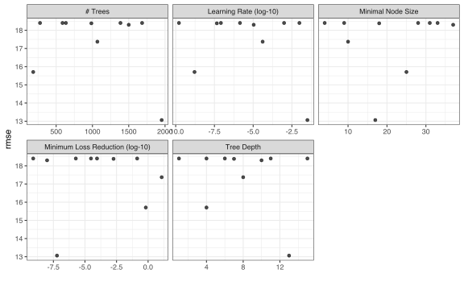

The [tidymodels](https://www.tidymodels.org/) framework is a collection of R packages for modeling and machine learning using tidyverse principles.

Since the beginning of 2021, we have been publishing [quarterly updates](https://www.tidyverse.org/categories/roundup/) here on the tidyverse blog summarizing what's new in the tidymodels ecosystem. The purpose of these regular posts is to share useful new features and any updates you may have missed. You can check out the [`tidymodels` tag](https://www.tidyverse.org/tags/tidymodels/) to find all tidymodels blog posts here, including our roundup posts as well as those that are more focused, like these from the past month or so:

-   [Improvements to model specification checking in tidymodels](https://www.tidyverse.org/blog/2022/10/parsnip-checking-1-0-2/)
-   [brulee 0.2.0](https://www.tidyverse.org/blog/2022/09/brulee-0-2-0/)
-   [Announcing bundle](https://www.tidyverse.org/blog/2022/09/bundle-0-1-0/)
-   [censored 0.1.0](https://www.tidyverse.org/blog/2022/08/censored-0-1-0/)
-   [rsample 1.1.0](https://www.tidyverse.org/blog/2022/08/rsample-1-1-0/)

Since [our last roundup post](https://www.tidyverse.org/blog/2022/07/tidymodels-2022-q2/), there have been CRAN releases of 22 tidymodels packages. Here are links to their NEWS files:

<div class="highlight">

-   agua [(0.1.0)](https://agua.tidymodels.org/news/index.html)
-   applicable [(0.1.0)](https://github.com/tidymodels/applicable/blob/develop/NEWS.md)
-   bonsai [(0.2.0)](https://bonsai.tidymodels.org/news/index.html)
-   broom [(1.0.1)](https://broom.tidymodels.org/news/index.html)
-   brulee [(0.2.0)](https://brulee.tidymodels.org/news/index.html)
-   butcher [(0.3.0)](https://butcher.tidymodels.org/news/index.html)
-   censored [(0.1.1)](https://censored.tidymodels.org/news/index.html)
-   corrr [(0.4.4)](https://corrr.tidymodels.org/news/index.html)
-   finetune [(1.0.1)](https://finetune.tidymodels.org/news/index.html)
-   modeldata [(1.0.1)](https://modeldata.tidymodels.org/news/index.html)
-   modeldb [(0.2.3)](https://modeldb.tidymodels.org/news/index.html)
-   parsnip [(1.0.2)](https://parsnip.tidymodels.org/news/index.html)
-   plsmod [(1.0.0)](https://plsmod.tidymodels.org/news/index.html)
-   poissonreg [(1.0.1)](https://poissonreg.tidymodels.org/news/index.html)
-   probably [(0.1.0)](https://probably.tidymodels.org/news/index.html)
-   recipes [(1.0.2)](https://recipes.tidymodels.org/news/index.html)
-   rsample [(1.1.0)](https://rsample.tidymodels.org/news/index.html)
-   spatialsample [(0.2.1)](https://spatialsample.tidymodels.org/news/index.html)
-   textrecipes [(1.0.1)](https://textrecipes.tidymodels.org/news/index.html)
-   tune [(1.0.1)](https://tune.tidymodels.org/news/index.html)
-   workflows [(1.1.0)](https://workflows.tidymodels.org/news/index.html)
-   yardstick [(1.1.0)](https://yardstick.tidymodels.org/news/index.html)

</div>

We'll highlight two specific upgrades: one for agua and another in recipes.

## A big upgrade for agua

With version 3.38.0.1 of the [h2o](https://cran.r-project.org/package=h2o) package, agua can now tune h2o models as if they were any other type of model engine.

[h2o](https://h2o.ai) has an excellent server-based computational engine for fitting a variety of different machine learning and statistical models. The h2o server can run locally or on some external high performance computing server. The downside is that it is light on tools for feature engineering and interactive data analysis.

Using h2o with tidymodels enables users to leverage the benefits of packages like recipes along with fast, server-based parallel processing.

While the syntax for model fitting and tuning are the same as any other non-h2o model, there are different ways to parallelize the work:

-   The h2o server has the ability to internally parallelize individual model computations. For example, when fitting trees, the search for the best split can be done using multiple threads. The number of threads that each model should be used is set with [h2o.init(nthreads)](https://docs.h2o.ai/h2o/latest-stable/h2o-r/docs/reference/h2o.init.html). The default (`-1`) is to use all CPUs on the host.

-   When using grid search, [h2o.grid(parallelism)](https://docs.h2o.ai/h2o/latest-stable/h2o-r/docs/reference/h2o.grid.html) determines how many models the h2o server should process at the same time. The default (`1`) constrains the server to run the models sequentially.

-   R has external parallelization tools (such as the foreach and future packages) that can start new R processes to simultaneously do work. This would run many models in parallel. For h2o, this determines how many models that the agua package could send to the server at once. This does not appear to be constrained by the `parallelism` argument to `h2o.grid()`.

With h2o and tidymodels, you should probably **use h2o's parallelization**. Using multiple approaches *can* work but only for some technologies. It's still pretty complicated and we will work more on un-complicating it.

To set up h2o parallelization, there is a new control argument called `backend_options`. If you were doing a grid search, you first define how many threads the h2o server should use:

``` r
library(tidymodels)
library(agua)
library(finetune)

h2o_thread_spec <- agua_backend_options(parallelism = 10) 
```

Then, pass the output to any of the existing control functions:

``` r
grid_ctrl <- control_grid(backend_options = h2o_thread_spec)
```

Now h2o can parallel process 10 models at once.

Here is an example using a simulated data set with a numeric outcome:

<div class="highlight">

<pre class='chroma'><code class='language-r' data-lang='r'><span class='kr'><a href='https://rdrr.io/r/base/library.html'>library</a></span><span class='o'>(</span><span class='nv'><a href='https://tidymodels.tidymodels.org'>tidymodels</a></span><span class='o'>)</span>
<span class='kr'><a href='https://rdrr.io/r/base/library.html'>library</a></span><span class='o'>(</span><span class='nv'><a href='https://agua.tidymodels.org/'>agua</a></span><span class='o'>)</span>
<span class='kr'><a href='https://rdrr.io/r/base/library.html'>library</a></span><span class='o'>(</span><span class='nv'><a href='https://github.com/tidymodels/finetune'>finetune</a></span><span class='o'>)</span>

<span class='c'># Simulate the data</span>
<span class='nv'>n_train</span> <span class='o'>&lt;-</span> <span class='m'>200</span>
<span class='nf'><a href='https://rdrr.io/r/base/Random.html'>set.seed</a></span><span class='o'>(</span><span class='m'>6147</span><span class='o'>)</span>
<span class='nv'>sim_dat</span> <span class='o'>&lt;-</span> <span class='nf'>sim_regression</span><span class='o'>(</span><span class='nv'>n_train</span><span class='o'>)</span>

<span class='c'># Resample using 10-fold cross-validation</span>
<span class='nf'><a href='https://rdrr.io/r/base/Random.html'>set.seed</a></span><span class='o'>(</span><span class='m'>91</span><span class='o'>)</span>
<span class='nv'>sim_rs</span> <span class='o'>&lt;-</span> <span class='nf'>vfold_cv</span><span class='o'>(</span><span class='nv'>sim_dat</span><span class='o'>)</span>
</code></pre>

</div>

We'll use grid search to tune a boosted tree:

<div class="highlight">

<pre class='chroma'><code class='language-r' data-lang='r'><span class='nv'>boost_spec</span> <span class='o'>&lt;-</span>
  <span class='nf'><a href='https://parsnip.tidymodels.org/reference/boost_tree.html'>boost_tree</a></span><span class='o'>(</span>
    trees <span class='o'>=</span> <span class='nf'><a href='https://hardhat.tidymodels.org/reference/tune.html'>tune</a></span><span class='o'>(</span><span class='o'>)</span>,
    min_n <span class='o'>=</span> <span class='nf'><a href='https://hardhat.tidymodels.org/reference/tune.html'>tune</a></span><span class='o'>(</span><span class='o'>)</span>,
    tree_depth <span class='o'>=</span> <span class='nf'><a href='https://hardhat.tidymodels.org/reference/tune.html'>tune</a></span><span class='o'>(</span><span class='o'>)</span>,
    learn_rate <span class='o'>=</span> <span class='nf'><a href='https://hardhat.tidymodels.org/reference/tune.html'>tune</a></span><span class='o'>(</span><span class='o'>)</span>,
    loss_reduction <span class='o'>=</span> <span class='nf'><a href='https://hardhat.tidymodels.org/reference/tune.html'>tune</a></span><span class='o'>(</span><span class='o'>)</span>
  <span class='o'>)</span> <span class='o'><a href='https://magrittr.tidyverse.org/reference/pipe.html'>%&gt;%</a></span>
  <span class='nf'><a href='https://parsnip.tidymodels.org/reference/set_engine.html'>set_engine</a></span><span class='o'>(</span><span class='s'>"h2o"</span><span class='o'>)</span> <span class='o'><a href='https://magrittr.tidyverse.org/reference/pipe.html'>%&gt;%</a></span>
  <span class='nf'><a href='https://parsnip.tidymodels.org/reference/set_args.html'>set_mode</a></span><span class='o'>(</span><span class='s'>"regression"</span><span class='o'>)</span>
</code></pre>

</div>

Now, let's parallel process our computations.

<div class="highlight">

<pre class='chroma'><code class='language-r' data-lang='r'><span class='c'># Start the h2o server</span>
<span class='nf'>h2o</span><span class='nf'>::</span><span class='nf'><a href='https://rdrr.io/pkg/h2o/man/h2o.init.html'>h2o.init</a></span><span class='o'>(</span><span class='o'>)</span>

<span class='c'># Multi-thread the model fits</span>
<span class='nv'>h2o_thread_spec</span> <span class='o'>&lt;-</span> <span class='nf'><a href='https://agua.tidymodels.org/reference/h2o_tune.html'>agua_backend_options</a></span><span class='o'>(</span>parallelism <span class='o'>=</span> <span class='m'>10</span><span class='o'>)</span>
<span class='nv'>grid_ctrl</span> <span class='o'>&lt;-</span> <span class='nf'><a href='https://tune.tidymodels.org/reference/control_grid.html'>control_grid</a></span><span class='o'>(</span>backend_options <span class='o'>=</span> <span class='nv'>h2o_thread_spec</span><span class='o'>)</span>
</code></pre>

</div>

We'll evaluate a very small grid at first:

<div class="highlight">

<pre class='chroma'><code class='language-r' data-lang='r'><span class='nf'><a href='https://rdrr.io/r/base/Random.html'>set.seed</a></span><span class='o'>(</span><span class='m'>7616</span><span class='o'>)</span>
<span class='nv'>grid_res</span> <span class='o'>&lt;-</span>
  <span class='nv'>boost_spec</span> <span class='o'><a href='https://magrittr.tidyverse.org/reference/pipe.html'>%&gt;%</a></span>
  <span class='nf'><a href='https://tune.tidymodels.org/reference/tune_grid.html'>tune_grid</a></span><span class='o'>(</span><span class='nv'>outcome</span> <span class='o'>~</span> <span class='nv'>.</span>, resamples <span class='o'>=</span> <span class='nv'>sim_rs</span>, grid <span class='o'>=</span> <span class='m'>10</span>, control <span class='o'>=</span> <span class='nv'>grid_ctrl</span><span class='o'>)</span>
</code></pre>

</div>

<div class="highlight">

<pre class='chroma'><code class='language-r' data-lang='r'><span class='nf'><a href='https://tune.tidymodels.org/reference/show_best.html'>show_best</a></span><span class='o'>(</span><span class='nv'>grid_res</span>, metric <span class='o'>=</span> <span class='s'>"rmse"</span><span class='o'>)</span> <span class='o'><a href='https://magrittr.tidyverse.org/reference/pipe.html'>%&gt;%</a></span> <span class='nf'>select</span><span class='o'>(</span><span class='o'>-</span><span class='nv'>.config</span>, <span class='o'>-</span><span class='nv'>.metric</span>, <span class='o'>-</span><span class='nv'>.estimator</span><span class='o'>)</span>

<span class='c'>#&gt; <span style='color: #555555;'># A tibble: 5 × 8</span></span>
<span class='c'>#&gt;   trees min_n tree_depth    learn_rate loss_reduction  mean     n std_err</span>
<span class='c'>#&gt;   <span style='color: #555555; font-style: italic;'>&lt;int&gt;</span> <span style='color: #555555; font-style: italic;'>&lt;int&gt;</span>      <span style='color: #555555; font-style: italic;'>&lt;int&gt;</span>         <span style='color: #555555; font-style: italic;'>&lt;dbl&gt;</span>          <span style='color: #555555; font-style: italic;'>&lt;dbl&gt;</span> <span style='color: #555555; font-style: italic;'>&lt;dbl&gt;</span> <span style='color: #555555; font-style: italic;'>&lt;int&gt;</span>   <span style='color: #555555; font-style: italic;'>&lt;dbl&gt;</span></span>
<span class='c'>#&gt; <span style='color: #555555;'>1</span>  <span style='text-decoration: underline;'>1</span>954    17         13 0.031<span style='text-decoration: underline;'>8</span>               6.08<span style='color: #555555;'>e</span><span style='color: #BB0000;'>-8</span>  13.1    10   0.828</span>
<span class='c'>#&gt; <span style='color: #555555;'>2</span>   184    25          4 0.000<span style='text-decoration: underline;'>000</span>001<span style='text-decoration: underline;'>64</span>        6.56<span style='color: #555555;'>e</span><span style='color: #BB0000;'>-1</span>  15.7    10   1.03 </span>
<span class='c'>#&gt; <span style='color: #555555;'>3</span>  <span style='text-decoration: underline;'>1</span>068    10          8 0.000<span style='text-decoration: underline;'>040</span>9            1.19<span style='color: #555555;'>e</span>+1  17.4    10   1.08 </span>
<span class='c'>#&gt; <span style='color: #555555;'>4</span>  <span style='text-decoration: underline;'>1</span>500    37         10 0.000<span style='text-decoration: underline;'>010</span>8            9.97<span style='color: #555555;'>e</span><span style='color: #BB0000;'>-9</span>  18.3    10   1.03 </span>
<span class='c'>#&gt; <span style='color: #555555;'>5</span>   985    18          7 0.000<span style='text-decoration: underline;'>000</span>045<span style='text-decoration: underline;'>4</span>         1.84<span style='color: #555555;'>e</span><span style='color: #BB0000;'>-3</span>  18.4    10   1.04</span>

<span class='nf'><a href='https://ggplot2.tidyverse.org/reference/autoplot.html'>autoplot</a></span><span class='o'>(</span><span class='nv'>grid_res</span>, metric <span class='o'>=</span> <span class='s'>"rmse"</span><span class='o'>)</span>

</code></pre>


</div>

It was a small grid and most of the configurations were not especially good. We can further optimize the results by applying simulated annealing search to the best grid results.

<div class="highlight">

<pre class='chroma'><code class='language-r' data-lang='r'><span class='nv'>sa_ctrl</span> <span class='o'>&lt;-</span> <span class='nf'><a href='https://finetune.tidymodels.org/reference/control_sim_anneal.html'>control_sim_anneal</a></span><span class='o'>(</span>backend_options <span class='o'>=</span> <span class='nv'>h2o_thread_spec</span><span class='o'>)</span>

<span class='nf'><a href='https://rdrr.io/r/base/Random.html'>set.seed</a></span><span class='o'>(</span><span class='m'>4</span><span class='o'>)</span>
<span class='nv'>sa_res</span> <span class='o'>&lt;-</span>
  <span class='nv'>boost_spec</span> <span class='o'><a href='https://magrittr.tidyverse.org/reference/pipe.html'>%&gt;%</a></span>
  <span class='nf'><a href='https://finetune.tidymodels.org/reference/tune_sim_anneal.html'>tune_sim_anneal</a></span><span class='o'>(</span>
    <span class='nv'>outcome</span> <span class='o'>~</span> <span class='nv'>.</span>,
    resamples <span class='o'>=</span> <span class='nv'>sim_rs</span>,
    initial <span class='o'>=</span> <span class='nv'>grid_res</span>,
    iter <span class='o'>=</span> <span class='m'>25</span>,
    control <span class='o'>=</span> <span class='nv'>sa_ctrl</span>
  <span class='o'>)</span>

<span class='c'>#&gt; <span style='color: #000000;'>Optimizing rmse</span></span>
<span class='c'>#&gt; <span style='color: #000000;'>Initial best: 13.06400</span></span>
<span class='c'>#&gt; <span style='color: #000000;'> 1 </span><span style='color: #00BB00;'>♥ new best          </span><span style='color: #000000;'> rmse=12.688  (+/-0.7899)</span></span>
<span class='c'>#&gt; <span style='color: #000000;'> 2 </span><span style='color: #BBBB00;'>◯ accept suboptimal </span><span style='color: #000000;'> rmse=12.849  (+/-0.8304)</span></span>
<span class='c'>#&gt; <span style='color: #000000;'> 3 </span><span style='color: #BBBB00;'>◯ accept suboptimal </span><span style='color: #000000;'> rmse=13.129  (+/-0.8266)</span></span>
<span class='c'>#&gt; <span style='color: #000000;'> 4 </span><span style='color: #BBBB00;'>◯ accept suboptimal </span><span style='color: #000000;'> rmse=13.678  (+/-0.9544)</span></span>
<span class='c'>#&gt; <span style='color: #000000;'> 5 </span><span style='color: #00BB00;'>+ better suboptimal </span><span style='color: #000000;'> rmse=13.433  (+/-0.792)</span></span>
<span class='c'>#&gt; <span style='color: #000000;'> 6 </span><span style='color: #00BB00;'>+ better suboptimal </span><span style='color: #000000;'> rmse=12.99  (+/-0.9031)</span></span>
<span class='c'>#&gt; <span style='color: #000000;'> 7 </span><span style='color: #BB0000;'>─ discard suboptimal</span><span style='color: #000000;'> rmse=16.531  (+/-1.027)</span></span>
<span class='c'>#&gt; <span style='color: #000000;'> 8 </span><span style='color: #BB0000;'>─ discard suboptimal</span><span style='color: #000000;'> rmse=13.522  (+/-0.9802)</span></span>
<span class='c'>#&gt; <span style='color: #000000;'> 9 </span><span style='color: #BB0000;'>✖ restart from best </span><span style='color: #000000;'> rmse=13.097  (+/-0.8109)</span></span>
<span class='c'>#&gt; <span style='color: #000000;'>10 </span><span style='color: #00BB00;'>♥ new best          </span><span style='color: #000000;'> rmse=12.66  (+/-0.8028)</span></span>
<span class='c'>#&gt; <span style='color: #000000;'>11 </span><span style='color: #BBBB00;'>◯ accept suboptimal </span><span style='color: #000000;'> rmse=13.116  (+/-0.8135)</span></span>
<span class='c'>#&gt; <span style='color: #000000;'>12 </span><span style='color: #00BB00;'>+ better suboptimal </span><span style='color: #000000;'> rmse=12.714  (+/-0.7747)</span></span>
<span class='c'>#&gt; <span style='color: #000000;'>13 </span><span style='color: #BB0000;'>─ discard suboptimal</span><span style='color: #000000;'> rmse=13.074  (+/-0.6598)</span></span>
<span class='c'>#&gt; <span style='color: #000000;'>14 </span><span style='color: #BB0000;'>─ discard suboptimal</span><span style='color: #000000;'> rmse=14.489  (+/-1.028)</span></span>
<span class='c'>#&gt; <span style='color: #000000;'>15 </span><span style='color: #BBBB00;'>◯ accept suboptimal </span><span style='color: #000000;'> rmse=12.715  (+/-0.8043)</span></span>
<span class='c'>#&gt; <span style='color: #000000;'>16 </span><span style='color: #BB0000;'>─ discard suboptimal</span><span style='color: #000000;'> rmse=13.788  (+/-1.027)</span></span>
<span class='c'>#&gt; <span style='color: #000000;'>17 </span><span style='color: #BB0000;'>─ discard suboptimal</span><span style='color: #000000;'> rmse=13.057  (+/-0.7716)</span></span>
<span class='c'>#&gt; <span style='color: #000000;'>18 </span><span style='color: #BB0000;'>✖ restart from best </span><span style='color: #000000;'> rmse=13.064  (+/-0.7095)</span></span>
<span class='c'>#&gt; <span style='color: #000000;'>19 </span><span style='color: #00BB00;'>♥ new best          </span><span style='color: #000000;'> rmse=12.645  (+/-0.7706)</span></span>
<span class='c'>#&gt; <span style='color: #000000;'>20 </span><span style='color: #BBBB00;'>◯ accept suboptimal </span><span style='color: #000000;'> rmse=12.7  (+/-0.821)</span></span>
<span class='c'>#&gt; <span style='color: #000000;'>21 </span><span style='color: #BB0000;'>─ discard suboptimal</span><span style='color: #000000;'> rmse=13.018  (+/-0.8047)</span></span>
<span class='c'>#&gt; <span style='color: #000000;'>22 </span><span style='color: #BB0000;'>─ discard suboptimal</span><span style='color: #000000;'> rmse=14.812  (+/-1.017)</span></span>
<span class='c'>#&gt; <span style='color: #000000;'>23 </span><span style='color: #BB0000;'>─ discard suboptimal</span><span style='color: #000000;'> rmse=13.098  (+/-0.921)</span></span>
<span class='c'>#&gt; <span style='color: #000000;'>24 </span><span style='color: #BBBB00;'>◯ accept suboptimal </span><span style='color: #000000;'> rmse=12.708  (+/-0.7538)</span></span>
<span class='c'>#&gt; <span style='color: #000000;'>25 </span><span style='color: #BBBB00;'>◯ accept suboptimal </span><span style='color: #000000;'> rmse=13.054  (+/-0.9046)</span></span></code></pre>

</div>

Again, h2o is doing all of the computational work for fitting models and tidymodels is proposing new parameter configurations.

One other nice feature of the new agua release is the h2o engine for the [`auto_ml()`](https://parsnip.tidymodels.org/reference/auto_ml.html) model. This builds a stacked ensemble on a set of different models (not unlike our [stacks](https://stacks.tidymodels.org) package but with far less code).

There is a great worked example [on the agua website](https://agua.tidymodels.org/articles/auto_ml.html) so make sure to check this out!

## More spline recipe steps

Spline techniques allow linear models to produce nonlinear model curves These are called [basis expasion methods](https://bookdown.org/max/FES/numeric-one-to-many.html#numeric-basis-functions) since they take a single numeric predictor and make additional nonlinear feature columns.

If you have ever used `geom:smooth()`, you have probably used a spline function.

The recipes package now has an expanded set of spline functions (with a common naming convention):

-   [`step_spline_b()`](https://recipes.tidymodels.org/dev/reference/step_spline_b.html)
-   [`step_spline_convex()`](https://recipes.tidymodels.org/dev/reference/step_spline_convex.html)
-   [`step_spline_monotone()`](https://recipes.tidymodels.org/dev/reference/step_spline_monotone.html)
-   [`step_spline_natural()`](https://recipes.tidymodels.org/dev/reference/step_spline_natural.html)
-   [`step_spline_nonnegative()`](https://recipes.tidymodels.org/dev/reference/step_spline_nonnegative.html)

There is also another step to make polynomial functions: [`step_poly_bernstein()`](https://recipes.tidymodels.org/dev/reference/step_poly_bernstein.html)

These functions take different approaches to creating the new set of features. Take a look at the references to see the technical details.

## Acknowledgements

It's important that we thank everyone in the community that contributed to tidymodels:

<div class="highlight">

-   agua: [@coforfe](https://github.com/coforfe), [@gouthaman87](https://github.com/gouthaman87), [@jeliason](https://github.com/jeliason), [@qiushiyan](https://github.com/qiushiyan), and [@topepo](https://github.com/topepo).
-   applicable: [@topepo](https://github.com/topepo).
-   bonsai: [@barrettlayman](https://github.com/barrettlayman), [@DesmondChoy](https://github.com/DesmondChoy), [@dfsnow](https://github.com/dfsnow), [@dpprdan](https://github.com/dpprdan), [@jameslamb](https://github.com/jameslamb), and [@simonpcouch](https://github.com/simonpcouch).
-   broom: [@AaronRendahl](https://github.com/AaronRendahl), [@AmeliaMN](https://github.com/AmeliaMN), [@bbolker](https://github.com/bbolker), [@capnrefsmmat](https://github.com/capnrefsmmat), [@corybrunson](https://github.com/corybrunson), [@ddsjoberg](https://github.com/ddsjoberg), [@friendly](https://github.com/friendly), [@johanneskoch94](https://github.com/johanneskoch94), and [@simonpcouch](https://github.com/simonpcouch).
-   brulee: [@topepo](https://github.com/topepo).
-   butcher: [@DavisVaughan](https://github.com/DavisVaughan), [@EmilHvitfeldt](https://github.com/EmilHvitfeldt), [@juliasilge](https://github.com/juliasilge), and [@topepo](https://github.com/topepo).
-   censored: [@bcjaeger](https://github.com/bcjaeger), [@hfrick](https://github.com/hfrick), [@mattwarkentin](https://github.com/mattwarkentin), [@simonpcouch](https://github.com/simonpcouch), [@therneau](https://github.com/therneau), and [@topepo](https://github.com/topepo).
-   corrr: [@jagodap](https://github.com/jagodap), and [@topepo](https://github.com/topepo).
-   finetune: [@DMozzanica](https://github.com/DMozzanica), [@EmilHvitfeldt](https://github.com/EmilHvitfeldt), [@qiushiyan](https://github.com/qiushiyan), [@simonpcouch](https://github.com/simonpcouch), and [@topepo](https://github.com/topepo).
-   modeldata: [@topepo](https://github.com/topepo).
-   modeldb: [@topepo](https://github.com/topepo).
-   parsnip: [@barnabywalker](https://github.com/barnabywalker), [@bcjaeger](https://github.com/bcjaeger), [@ben-e](https://github.com/ben-e), [@CarmenCiardiello](https://github.com/CarmenCiardiello), [@daniel-althoff](https://github.com/daniel-althoff), [@EmilHvitfeldt](https://github.com/EmilHvitfeldt), [@gustavomodelli](https://github.com/gustavomodelli), [@hfrick](https://github.com/hfrick), [@joeycouse](https://github.com/joeycouse), [@john-b-edwards](https://github.com/john-b-edwards), [@juliasilge](https://github.com/juliasilge), [@mdneuzerling](https://github.com/mdneuzerling), [@mikemahoney218](https://github.com/mikemahoney218), [@mrkaye97](https://github.com/mrkaye97), [@qiushiyan](https://github.com/qiushiyan), [@siegfried](https://github.com/siegfried), [@simonpcouch](https://github.com/simonpcouch), [@topepo](https://github.com/topepo), [@TylerGrantSmith](https://github.com/TylerGrantSmith), and [@zhaoliang0302](https://github.com/zhaoliang0302).
-   plsmod: [@topepo](https://github.com/topepo).
-   poissonreg: [@hfrick](https://github.com/hfrick), [@mattwarkentin](https://github.com/mattwarkentin), and [@simonpcouch](https://github.com/simonpcouch).
-   probably: [@DavisVaughan](https://github.com/DavisVaughan).
-   recipes: [@abichat](https://github.com/abichat), [@adisarid](https://github.com/adisarid), [@EmilHvitfeldt](https://github.com/EmilHvitfeldt), [@JamesHWade](https://github.com/JamesHWade), [@juliasilge](https://github.com/juliasilge), [@luisDVA](https://github.com/luisDVA), [@naveranoc](https://github.com/naveranoc), [@nhward](https://github.com/nhward), [@RMHogervorst](https://github.com/RMHogervorst), [@ruddnr](https://github.com/ruddnr), [@simonpcouch](https://github.com/simonpcouch), [@topepo](https://github.com/topepo), and [@zhaoliang0302](https://github.com/zhaoliang0302).
-   rsample: [@DavisVaughan](https://github.com/DavisVaughan), [@EmilHvitfeldt](https://github.com/EmilHvitfeldt), [@hfrick](https://github.com/hfrick), [@juliasilge](https://github.com/juliasilge), [@mikemahoney218](https://github.com/mikemahoney218), and [@tjmahr](https://github.com/tjmahr).
-   spatialsample: [@mikemahoney218](https://github.com/mikemahoney218).
-   textrecipes: [@EmilHvitfeldt](https://github.com/EmilHvitfeldt), [@hadley](https://github.com/hadley), and [@PursuitOfDataScience](https://github.com/PursuitOfDataScience).
-   tune: [@Athospd](https://github.com/Athospd), [@EmilHvitfeldt](https://github.com/EmilHvitfeldt), [@frankhezemans](https://github.com/frankhezemans), [@kevin199011](https://github.com/kevin199011), [@misken](https://github.com/misken), [@PursuitOfDataScience](https://github.com/PursuitOfDataScience), [@qiushiyan](https://github.com/qiushiyan), [@simonpcouch](https://github.com/simonpcouch), and [@topepo](https://github.com/topepo).
-   workflows: [@DavisVaughan](https://github.com/DavisVaughan), [@EmilHvitfeldt](https://github.com/EmilHvitfeldt), [@JosiahParry](https://github.com/JosiahParry), [@lrossouw](https://github.com/lrossouw), [@msberends](https://github.com/msberends), [@simonpcouch](https://github.com/simonpcouch), and [@topepo](https://github.com/topepo).
-   yardstick: [@DavisVaughan](https://github.com/DavisVaughan), [@deschen1](https://github.com/deschen1), [@EmilHvitfeldt](https://github.com/EmilHvitfeldt), [@juliasilge](https://github.com/juliasilge), [@leonhGeis](https://github.com/leonhGeis), [@PriitPaluoja](https://github.com/PriitPaluoja), and [@topepo](https://github.com/topepo).

</div>

