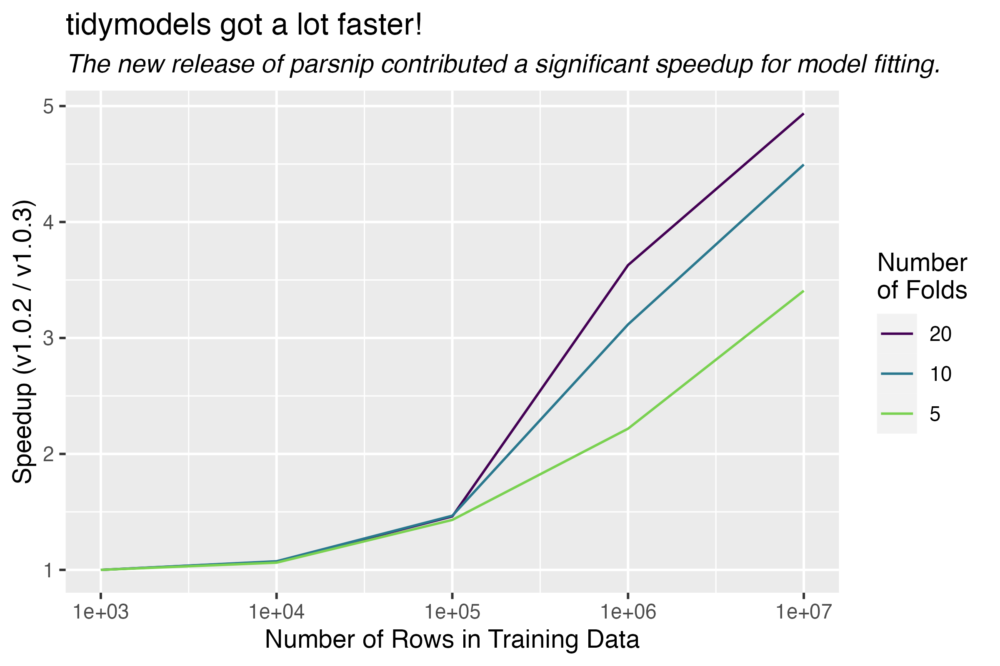

```{r}
#| include: false
#| label: startup

library(tidymodels)

tidymodels_prefer()
theme_set(theme_bw())
options(pillar.advice = FALSE, pillar.min_title_chars = Inf, width = 120)
```

```{r}
#| label: get-repo-info
#| include: FALSE

since <- "2022-10-19"

source("repo-functions.R")

tm_data <- 
  map_dfr(tm_pkgs, get_current_release) %>% 
  filter(date > ymd(since)) %>% 
  mutate(
    repo = paste0("tidymodels/", package),
    thanks = map_chr(repo, return_tidy_thanks, from = since),
    thanks = glue("- {package}: {thanks}"),
    news = glue("- {package} [({version})](https://{package}.tidymodels.org/news/index.html)")
  )

txt_pkg_list <- knitr::combine_words(tm_data$package)
```

The [tidymodels](https://www.tidymodels.org/) framework is a collection of R packages for modeling and machine learning using tidyverse principles.

Since the beginning of 2021, we have been publishing [quarterly updates](https://www.tidyverse.org/categories/roundup/) here on the tidyverse blog summarizing what's new in the tidymodels ecosystem. The purpose of these regular posts is to share useful new features and any updates you may have missed. You can check out the [`tidymodels` tag](https://www.tidyverse.org/tags/tidymodels/) to find all tidymodels blog posts here, including our roundup posts as well as those that are more focused, like these posts from the past couple months:

-   [tidyclust is on CRAN](https://www.tidyverse.org/blog/2022/12/tidyclust-0-1-0/)
-   [Model calibration](https://www.tidyverse.org/blog/2022/11/model-calibration/)
-   [Improvements to model specification checking in tidymodels](https://www.tidyverse.org/blog/2022/10/parsnip-checking-1-0-2/)

Since [our last roundup post](https://www.tidyverse.org/blog/2022/10/tidymodels-2022-q3/), there have been CRAN releases of `r nrow(tm_data)` tidymodels packages. Here are links to their NEWS files:

```{r}
#| echo: FALSE
#| results: asis

cat(tm_data$news, sep = "\n")
```

We'll highlight a few especially notable changes below: more specialized role selectors in recipes, extended support for grouped resampling in rsample, and a big speedup in parsnip. First, loading the collection of packages:

```{r}
#| eval: FALSE
library(tidymodels)
```

## Specialized role selectors

The [recipes package for preprocessing](https://recipes.tidymodels.org/) supports tidyselect-style variable selection, and includes some of its own selectors to support common modeling workflows.

To illustrate, we'll make use of a dataset `silly_data` with a number of different variable types:

```{r}
#| include: FALSE
assign_letter <- function(names) {
  c("class", letters[1:(length(names)-1)])
}

goofy_data <- 
  sim_classification(num_linear = 3) %>%
  mutate(across(ends_with("_1"), ~ as.factor(round(.x)))) %>%
  mutate(two_factor_1 = as.integer(two_factor_1)) %>%
  rowwise() %>%
  mutate(char = rnorm(1), char = if_else(char > .5, "maroon", "white")) %>%
  ungroup() %>%
  rename_with(assign_letter)
```

```{r}
str(goofy_data)
```

Imagine a classification problem on the `goofy_data` where we'd like to predict `class` using the remaining variables as predictors. The selector functions allow us to perform operations on only the predictors with a certain class. For instance, centering and scaling all numeric predictors:

```{r}
recipe(class ~ ., goofy_data) %>%
  step_normalize(all_numeric_predictors()) %>%
  prep()
```

Or making dummy variables out of each of the nominal predictors:

```{r}
recipe(class ~ ., goofy_data) %>%
  step_dummy(all_nominal_predictors()) %>%
  prep()
```

Operations like those above have been long-standing functionality in recipes, and are powerful tools for effective modeling. The most recent release of recipes introduced [finer-grain selectors](https://fosstodon.org/@emilhvitfeldt/109315135944110742) for variable types. For instance, we may want to only center and scale the *double* (i.e. real-valued) predictors, excluding the integers. With the new release of recipes, we can easily do so:

```{r}
recipe(class ~ ., goofy_data) %>%
  step_normalize(all_double_predictors()) %>%
  prep()
```

This is one of a number of new selectors:

-   The `all_nominal()` selector now has finer-grained versions `all_string()`, `all_factor()`, `all_unordered()`, and `all_ordered()`.

-   The `all_numeric()` selector now has finer-grained versions `all_double()`, and `all_integer()`.

-   New `all_logical()`, `all_date()`, and `all_datetime()` selectors.

All new selectors have `*_predictors()` variants. You can read more about recipes 1.0.3 in the [release notes](https://recipes.tidymodels.org/news/index.html#recipes-103).

## Grouped resampling

The most recent release of rsample introduced support for stratification with grouped resampling. Consider the following data set, giving whether a number of `household`s `chops` the `n_melons` melons in their fridge:

```{r}
#| include: FALSE
set.seed(1)

household_table <- 
  tibble(
    household = 1:100,
    chops = sample(c(rep("Yes", 90), rep("No", 10)))
  )

n_melons_table <- 
  tibble(
    household = sample(1:100, 5e3, replace = TRUE),
    n_melons = rexp(5e3, .01)
  )

melons <- 
  full_join(household_table, n_melons_table, by = "household") %>%
  rowwise() %>%
  mutate(n_melons = if_else(chops == "Yes", n_melons, rpois(1, 2) * n_melons)) %>%
  ungroup() %>%
  mutate(n_melons = as.integer(round(n_melons)),
         household = as.factor(household)) %>%
  filter(n_melons < 500)
```

```{r}
melons
```

There are `r length(unique(melons$household))` different households in this dataset, each of which either chops their melons or keeps them whole. At different points in time, they have some number of melons in their fridge.

Each of the resampling functions in rsample have a `group_*`ed analogue. From rsample's ["Common Patterns" article](https://rsample.tidymodels.org/articles/Common_Patterns.html#grouped-resampling):

> Often, some observations in your data will be "more related" to each other than would be probable under random chance, for instance because they represent repeated measurements of the same subject or were all collected at a single location. In these situations, you often want to assign all related observations to either the analysis or assessment fold as a group, to avoid having assessment data that\'s closely related to the data used to fit a model.

For example, the grouped `initial_split()` variant will allot the training and testing set mutually exclusive levels of the `group` variable:

```{r}
#| include: FALSE
set.seed(1)
```

```{r}
resample <- group_initial_split(melons, group = household)

sum(
  unique(training(resample)$household) %in% 
  unique(testing(resample)$household)
)
```

However, note that there are only a few households that don't chop their melons, and those households tend to have many more melons to chop!

```{r melon-plot, fig.alt = "A ggplot histogram displaying the mean number of melons per household, filled by whether the household chops their melons or not. The plot shows that there are relatively few households that don't chop their melons, but those households have many more melons to chop. Households that chop their melons have around 80 to chop, while those that don't have around 200."}
#| message: FALSE
#| warning: FALSE
#| echo: FALSE
melons %>%
  group_by(household, chops) %>%
  summarize(mean_n_melons = mean(n_melons)) %>%
  ggplot(aes(x = mean_n_melons, fill = chops)) +
  geom_histogram(bins = 20) +
  scale_fill_viridis_d(end = .5) +
  labs(x = "Mean Number of Melons Per Household", 
       y = "Count", 
       color = "Household\nChops Melons")
```

If we're ultimately interested in modeling whether a household chops their melons, we ought to ensure that both values of `chops` are well-represented in both the training and testing set. The argument `strata = chops` indicates that sampling by `household` will occur within values of `chops`.

```{r}
#| include: FALSE
set.seed(1)
```

```{r}
resample_stratified <- group_initial_split(melons, group = household, strata = chops)
```

Note that this resampling scheme still resulted in different `household`s being allotted to training and testing:

```{r}
sum(
  unique(training(resample_stratified)$household) %in% 
  unique(testing(resample_stratified)$household)
)
```

Also, though, it ensured that similar proportions of `chops` values are allotted to the training and testing set:

```{r}
diff(c(
  mean(training(resample_stratified)$chops == "Yes"),
  mean(testing(resample_stratified)$chops == "Yes")
))
```

You can read more about rsample 1.1.1 in the [release notes](https://rsample.tidymodels.org/news/index.html#rsample-111).

## Performance speedup

We recently made a performance tweak, released as part of parsnip 1.0.3, that resulted in a substantial speedup in fit time. Fitting models via parsnip is a fundamental operation in the tidymodels, so the speedup can be observed across many modeling workflows.

The figure below demonstrates this speedup in [an experiment](https://gist.github.com/simonpcouch/651d0ea4d968b455ded8194578dabf52) involving fitting a simple linear regression model on resamples of simulated data. Simulated datasets with between one hundred and one million rows were partitioned into five, ten, or twenty folds and fitted with the new version of parsnip as well as the version preceding it. With smaller datasets, the speedup is negligible, but fit times decrease by a factor of three to five once training data reaches one million rows.

```{r speedup, echo = FALSE, fig.alt = "A ggplot titled 'tidymodels got a lot faster!' displaying the relative speedup between parsnip 1.0.2 and 1.0.3. The number of rows in training data is on the x axis, ranging from one hundred to one million, and the factor of speedup (1.0.2 over 1.0.3) is on the y axis, ranging from 1 to 5. Three lines, colored by 'number of folds,' noting 5, 10, or 20 resamples, stretch from the bottom left to top right of the plot. This shows that, as training data gets larger, the magnitude of speedup with the new parsnip version gets larger and larger.", out.width = '100%'}

```

You can read more about parsnip 1.0.3 in the [release notes](https://parsnip.tidymodels.org/news/index.html#parsnip-103).

## Acknowledgements

We'd like to thank those in the community that contributed to tidymodels in the last quarter:

```{r}
#| echo: FALSE
#| results: asis

cat(tm_data$thanks, sep = "\n")
```

We're grateful for all of the tidymodels community, from observers to users to contributors, and wish you all a happy new year!
