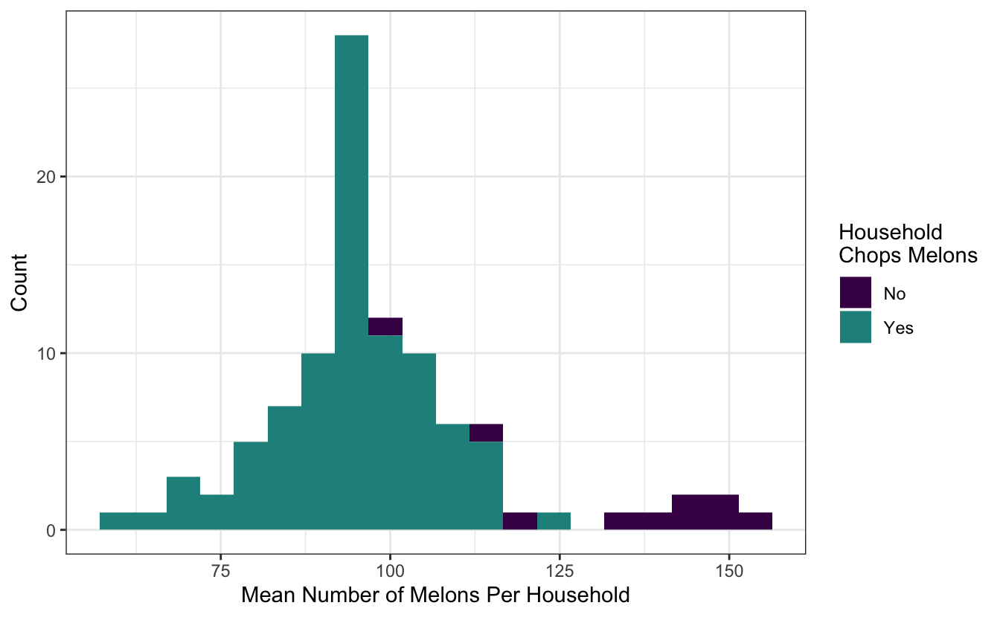

The [tidymodels](https://www.tidymodels.org/) framework is a collection of R packages for modeling and machine learning using tidyverse principles.

Since the beginning of 2021, we have been publishing [quarterly updates](https://www.tidyverse.org/categories/roundup/) here on the tidyverse blog summarizing what's new in the tidymodels ecosystem. The purpose of these regular posts is to share useful new features and any updates you may have missed. You can check out the [`tidymodels` tag](https://www.tidyverse.org/tags/tidymodels/) to find all tidymodels blog posts here, including our roundup posts as well as those that are more focused, like these posts from the past couple months:

-   [tidyclust is on CRAN](https://www.tidyverse.org/blog/2022/12/tidyclust-0-1-0/)
-   [Model calibration](https://www.tidyverse.org/blog/2022/11/model-calibration/)
-   [Improvements to model specification checking in tidymodels](https://www.tidyverse.org/blog/2022/10/parsnip-checking-1-0-2/)

Since [our last roundup post](https://www.tidyverse.org/blog/2022/10/tidymodels-2022-q3/), there have been CRAN releases of 9 tidymodels packages. Here are links to their NEWS files:

-   bonsai [(0.2.1)](https://bonsai.tidymodels.org/news/index.html)
-   broom [(1.0.2)](https://broom.tidymodels.org/news/index.html)
-   butcher [(0.3.1)](https://butcher.tidymodels.org/news/index.html)
-   dials [(1.1.0)](https://dials.tidymodels.org/news/index.html)
-   parsnip [(1.0.3)](https://parsnip.tidymodels.org/news/index.html)
-   recipes [(1.0.3)](https://recipes.tidymodels.org/news/index.html)
-   rsample [(1.1.1)](https://rsample.tidymodels.org/news/index.html)
-   stacks [(1.0.1)](https://stacks.tidymodels.org/news/index.html)
-   workflows [(1.1.2)](https://workflows.tidymodels.org/news/index.html)

We'll highlight a few especially notable changes below: more specialized role selectors in recipes, extended support for grouped resampling in rsample, and a big speedup in parsnip. First, loading the collection of packages:

<pre class='chroma'><code class='language-r' data-lang='r'><a href='https://rdrr.io/r/base/library.html'>library</a>(<a href='https://tidymodels.tidymodels.org'>tidymodels</a>)</code></pre>

## Specialized role selectors

The [recipes package for preprocessing](https://recipes.tidymodels.org/) supports tidyselect-style variable selection, and includes some of its own selectors to support common modeling workflows.

To illustrate, we'll make use of a dataset `goofy_data` with a number of different variable types:

<pre class='chroma'><code class='language-r' data-lang='r'><a href='https://rdrr.io/r/utils/str.html'>str</a>(goofy_data)#&gt; tibble [100 × 10] (S3: tbl_df/tbl/data.frame)
#&gt;  $ class: Factor w/ 2 levels "class_1","class_2": 2 1 1 1 1 2 2 1 1 2 ...
#&gt;  $ a    : int [1:100] 7 2 3 3 6 6 6 3 4 4 ...
#&gt;  $ b    : num [1:100] -1.114 -1.795 -0.83 -0.858 1.427 ...
#&gt;  $ c    : Factor w/ 3 levels "-1","0","1": 3 3 3 2 3 2 1 1 1 1 ...
#&gt;  $ d    : num [1:100] 0.5168 0.0575 0.1609 0.3959 0.1046 ...
#&gt;  $ e    : num [1:100] 0.016 0.613 0.4421 0.7851 0.0519 ...
#&gt;  $ f    : Factor w/ 5 levels "-2","-1","0",..: 4 3 2 5 1 3 2 4 3 4 ...
#&gt;  $ g    : num [1:100] -0.616 0.587 -0.613 1.582 1.43 ...
#&gt;  $ h    : num [1:100] 0.401 0.442 -1.139 0.382 0.474 ...
#&gt;  $ i    : chr [1:100] "white" "white" "white" "white" ...</code></pre>

Imagine a classification problem on the `goofy_data` where we'd like to predict `class` using the remaining variables as predictors. The selector functions allow us to perform operations on only the predictors with a certain class. For instance, centering and scaling all numeric predictors:

<pre class='chroma'><code class='language-r' data-lang='r'>recipe(class ~ ., goofy_data) %&gt;%
  step_normalize(all_numeric_predictors()) %&gt;%
  prep()#&gt; Recipe
#&gt; 
#&gt; Inputs:
#&gt; 
#&gt;       role #variables
#&gt;    outcome          1
#&gt;  predictor          9
#&gt; 
#&gt; Training data contained 100 data points and no missing data.
#&gt; 
#&gt; Operations:
#&gt; 
#&gt; Centering and scaling for a, b, d, e, g, h [trained]</code></pre>

Or making dummy variables out of each of the nominal predictors:

<pre class='chroma'><code class='language-r' data-lang='r'>recipe(class ~ ., goofy_data) %&gt;%
  step_dummy(all_nominal_predictors()) %&gt;%
  prep()#&gt; Recipe
#&gt; 
#&gt; Inputs:
#&gt; 
#&gt;       role #variables
#&gt;    outcome          1
#&gt;  predictor          9
#&gt; 
#&gt; Training data contained 100 data points and no missing data.
#&gt; 
#&gt; Operations:
#&gt; 
#&gt; Dummy variables from c, f, i [trained]</code></pre>

Operations like those above have been long-standing functionality in recipes, and are powerful tools for effective modeling. The most recent release of recipes introduced [finer-grain selectors](https://fosstodon.org/@emilhvitfeldt/109315135944110742) for variable types. For instance, we may want to only center and scale the *double* (i.e. real-valued) predictors, excluding the integers. With the new release of recipes, we can easily do so:

<pre class='chroma'><code class='language-r' data-lang='r'>recipe(class ~ ., goofy_data) %&gt;%
  step_normalize(all_double_predictors()) %&gt;%
  prep()#&gt; Recipe
#&gt; 
#&gt; Inputs:
#&gt; 
#&gt;       role #variables
#&gt;    outcome          1
#&gt;  predictor          9
#&gt; 
#&gt; Training data contained 100 data points and no missing data.
#&gt; 
#&gt; Operations:
#&gt; 
#&gt; Centering and scaling for b, d, e, g, h [trained]</code></pre>

This is one of a number of new selectors:

-   The `all_nominal()` selector now has finer-grained versions `all_string()`, `all_factor()`, `all_unordered()`, and `all_ordered()`.

-   The `all_numeric()` selector now has finer-grained versions `all_double()`, and `all_integer()`.

-   New `all_logical()`, `all_date()`, and `all_datetime()` selectors.

All new selectors have `*_predictors()` variants. You can read more about recipes 1.0.3 in the [release notes](https://recipes.tidymodels.org/news/index.html#recipes-103).

## Grouped resampling

The most recent release of rsample introduced support for stratification with grouped resampling. Consider the following toy data set on the number of melons in a household:

<pre class='chroma'><code class='language-r' data-lang='r'>melons#&gt; # A tibble: 4,928 × 3
#&gt;    household n_melons chops
#&gt;    &lt;fct&gt;        &lt;int&gt; &lt;chr&gt;
#&gt;  1 1              114 Yes  
#&gt;  2 1              179 Yes  
#&gt;  3 1              163 Yes  
#&gt;  4 1               35 Yes  
#&gt;  5 1               93 Yes  
#&gt;  6 1               55 Yes  
#&gt;  7 1              165 Yes  
#&gt;  8 1               30 Yes  
#&gt;  9 1              140 Yes  
#&gt; 10 1                7 Yes  
#&gt; # … with 4,918 more rows</code></pre>

There are 100 different households in this dataset. Each member of the household has some number of melons `n_melons` in their fridge. A household, i.e., all its members, either `chops` their melons or keeps them whole.

Each of the resampling functions in rsample have a `group_*`ed analogue. From rsample's ["Common Patterns" article](https://rsample.tidymodels.org/articles/Common_Patterns.html#grouped-resampling):

> Often, some observations in your data will be "more related" to each other than would be probable under random chance, for instance because they represent repeated measurements of the same subject or were all collected at a single location. In these situations, you often want to assign all related observations to either the analysis or assessment fold as a group, to avoid having assessment data that\'s closely related to the data used to fit a model.

For example, the grouped `initial_split()` variant will allot the training and testing set mutually exclusive levels of the `group` variable:

<pre class='chroma'><code class='language-r' data-lang='r'>resample &lt;- group_initial_split(melons, group = household)

<a href='https://rdrr.io/r/base/sum.html'>sum</a>(
  <a href='https://rdrr.io/r/base/unique.html'>unique</a>(training(resample)$household) <a href='https://rdrr.io/r/base/match.html'>%in%</a> 
  <a href='https://rdrr.io/r/base/unique.html'>unique</a>(testing(resample)$household)
)#&gt; [1] 0</code></pre>

However, note that there are only a few households that don't chop their melons, and those households tend to have many more melons to chop!

If we're ultimately interested in modeling whether a household chops their melons, we ought to ensure that both values of `chops` are well-represented in both the training and testing set. The argument `strata = chops` indicates that sampling by `household` will occur within values of `chops`. Note that the strata must be constant in each group, so here, all members of a household need to either chop or not.

<pre class='chroma'><code class='language-r' data-lang='r'>resample_stratified &lt;- group_initial_split(melons, group = household, strata = chops)</code></pre>

Note that this resampling scheme still resulted in different `household`s being allotted to training and testing:

<pre class='chroma'><code class='language-r' data-lang='r'><a href='https://rdrr.io/r/base/sum.html'>sum</a>(
  <a href='https://rdrr.io/r/base/unique.html'>unique</a>(training(resample_stratified)$household) <a href='https://rdrr.io/r/base/match.html'>%in%</a> 
  <a href='https://rdrr.io/r/base/unique.html'>unique</a>(testing(resample_stratified)$household)
)#&gt; [1] 0</code></pre>

Also, though, it ensured that similar proportions of `chops` values are allotted to the training and testing set:

<pre class='chroma'><code class='language-r' data-lang='r'><a href='https://rdrr.io/r/base/diff.html'>diff</a>(<a href='https://rdrr.io/r/base/c.html'>c</a>(
  <a href='https://rdrr.io/r/base/mean.html'>mean</a>(training(resample_stratified)$chops == "Yes"),
  <a href='https://rdrr.io/r/base/mean.html'>mean</a>(testing(resample_stratified)$chops == "Yes")
))#&gt; [1] 0.01000042</code></pre>

You can read more about rsample 1.1.1 in the [release notes](https://rsample.tidymodels.org/news/index.html#rsample-111).

## Performance speedup

We recently made a performance tweak, released as part of parsnip 1.0.3, that resulted in a substantial speedup in fit time. Fitting models via parsnip is a fundamental operation in the tidymodels, so the speedup can be observed across many modeling workflows.

The figure below demonstrates this speedup in [an experiment](https://gist.github.com/simonpcouch/651d0ea4d968b455ded8194578dabf52) involving fitting a simple linear regression model on resamples of simulated data. Simulated datasets with between one hundred and one million rows were partitioned into five, ten, or twenty folds and fitted with the new version of parsnip as well as the version preceding it. With smaller datasets, the speedup is negligible, but fit times decrease by a factor of three to five once training data reaches one million rows.

You can read more about parsnip 1.0.3 in the [release notes](https://parsnip.tidymodels.org/news/index.html#parsnip-103).

## Acknowledgements

We'd like to thank those in the community that contributed to tidymodels in the last quarter:

-   bonsai: [@HenrikBengtsson](https://github.com/HenrikBengtsson), and [@simonpcouch](https://github.com/simonpcouch).
-   broom: [@amorris28](https://github.com/amorris28), [@capnrefsmmat](https://github.com/capnrefsmmat), [@larmarange](https://github.com/larmarange), [@lukepilling](https://github.com/lukepilling), and [@simonpcouch](https://github.com/simonpcouch).
-   butcher: [@galen-ft](https://github.com/galen-ft), and [@juliasilge](https://github.com/juliasilge).
-   dials: [@EmilHvitfeldt](https://github.com/EmilHvitfeldt), [@hfrick](https://github.com/hfrick), and [@Tadge-Analytics](https://github.com/Tadge-Analytics).
-   parsnip: [@EmilHvitfeldt](https://github.com/EmilHvitfeldt), [@exsell-jc](https://github.com/exsell-jc), [@fkohrt](https://github.com/fkohrt), [@hfrick](https://github.com/hfrick), [@jonthegeek](https://github.com/jonthegeek), [@Marwolaeth](https://github.com/Marwolaeth), [@mattwarkentin](https://github.com/mattwarkentin), [@schoonees](https://github.com/schoonees), [@simonpcouch](https://github.com/simonpcouch), [@sweiner123](https://github.com/sweiner123), and [@topepo](https://github.com/topepo).
-   recipes: [@andeek](https://github.com/andeek), [@DavisVaughan](https://github.com/DavisVaughan), [@EmilHvitfeldt](https://github.com/EmilHvitfeldt), [@hfrick](https://github.com/hfrick), [@joeycouse](https://github.com/joeycouse), [@mdancho84](https://github.com/mdancho84), and [@mobius-eng](https://github.com/mobius-eng).
-   rsample: [@bschneidr](https://github.com/bschneidr), [@DavisVaughan](https://github.com/DavisVaughan), [@EmilHvitfeldt](https://github.com/EmilHvitfeldt), [@hfrick](https://github.com/hfrick), [@mikemahoney218](https://github.com/mikemahoney218), [@pgg1309](https://github.com/pgg1309), and [@topepo](https://github.com/topepo).
-   stacks: [@simonpcouch](https://github.com/simonpcouch).
-   workflows: [@EmilHvitfeldt](https://github.com/EmilHvitfeldt), [@hfrick](https://github.com/hfrick), [@simonpcouch](https://github.com/simonpcouch), [@talegari](https://github.com/talegari), and [@xiaochi-liu](https://github.com/xiaochi-liu).

We're grateful for all of the tidymodels community, from observers to users to contributors, and wish you all a happy new year!

