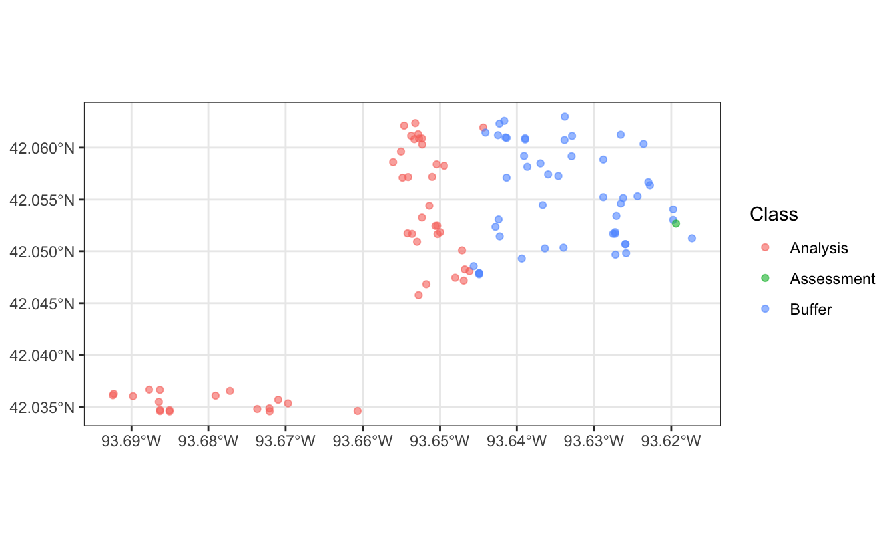

<!--
TODO:
* [x] Look over / edit the post's title in the yaml
* [x] Edit (or delete) the description; note this appears in the Twitter card
* [x] Pick category and tags (see existing with [`hugodown::tidy_show_meta()`](https://rdrr.io/pkg/hugodown/man/use_tidy_post.html))
* [x] Find photo & update yaml metadata
* [x] Create `thumbnail-sq.jpg`; height and width should be equal
* [x] Create `thumbnail-wd.jpg`; width should be >5x height
* [x] [`hugodown::use_tidy_thumbnails()`](https://rdrr.io/pkg/hugodown/man/use_tidy_post.html)
* [x] Add intro sentence, e.g. the standard tagline for the package
* [x] [`usethis::use_tidy_thanks()`](https://usethis.r-lib.org/reference/use_tidy_thanks.html)
-->

The [tidymodels](https://www.tidymodels.org/) framework is a collection of R packages for modeling and machine learning using tidyverse principles.

Since the beginning of 2021, we have been publishing [quarterly updates](https://www.tidyverse.org/categories/roundup/) here on the tidyverse blog summarizing what's new in the tidymodels ecosystem. The purpose of these regular posts is to share useful new features and any updates you may have missed. You can check out the [`tidymodels` tag](https://www.tidyverse.org/tags/tidymodels/) to find all tidymodels blog posts here, including our roundup posts as well as those that are more focused, like the [post](https://www.tidyverse.org/blog/2023/05/desirability2/) on the release of the new desirability2 package.

Since [our last roundup post](https://www.tidyverse.org/blog/2023/04/tidymodels-2023-q1/), there have been CRAN releases of 7 tidymodels packages. Here are links to their NEWS files:

-   agua [(0.1.3)](https://agua.tidymodels.org/news/index.html)
-   broom [(1.0.5)](https://broom.tidymodels.org/news/index.html)
-   desirability2 [(0.0.1)](https://desirability2.tidymodels.org/news/index.html)
-   embed [(1.1.1)](https://embed.tidymodels.org/news/index.html)
-   probably [(1.0.2)](https://probably.tidymodels.org/news/index.html)
-   spatialsample [(0.4.0)](https://spatialsample.tidymodels.org/news/index.html)
-   tidymodels [(1.1.0)](https://tidymodels.tidymodels.org/news/index.html)

We'll highlight a few especially notable changes below: a new package with data for modeling, nearest neighbor distance matching cross-validation for spatial data, and a website refresh.

First, loading the collection of packages:

<pre class='chroma'><code class='language-r' data-lang='r'><a href='https://rdrr.io/r/base/library.html'>library</a>(<a href='https://tidymodels.tidymodels.org'>tidymodels</a>)</code></pre>

## modeldatatoo

Many of the datasets used in tidymodels examples are available in the modeldata package. The new modeldatatoo package now extends the collection by several bigger datasets. To allow for the bigger size, the package does not contain those datasets directly but rather provides functions to access them, prefixed with `data_`. For example:

<pre class='chroma'><code class='language-r' data-lang='r'><a href='https://rdrr.io/r/base/library.html'>library</a>(<a href='https://github.com/tidymodels/modeldatatoo'>modeldatatoo</a>)

<a href='https://tidymodels.github.io/modeldatatoo/reference/data_animals.html'>data_animals</a>()
#&gt; # A tibble: 610 × 48
#&gt;    text    colour lifespan weight kingdom class phylum diet  conservation_status
#&gt;    &lt;chr&gt;   &lt;chr&gt;  &lt;chr&gt;    &lt;chr&gt;  &lt;chr&gt;   &lt;chr&gt; &lt;chr&gt;  &lt;chr&gt; &lt;chr&gt;              
#&gt;  1 "Aardv… Brown… 23 years 60kg … Animal… Mamm… Chord… Omni… Least Concern      
#&gt;  2 "Abyss… Fawn,… NA       NA     NA      NA    NA     NA    NA                 
#&gt;  3 "Adeli… Black… 10 - 20… 3kg -… Animal… Aves  Chord… Carn… Least Concern      
#&gt;  4 "Affen… Black… NA       NA     NA      NA    NA     NA    NA                 
#&gt;  5 "Afgha… Black… NA       NA     NA      NA    NA     NA    NA                 
#&gt;  6 "Afric… Grey,… 60 - 70… 3,600… Animal… Mamm… Chord… Herb… Threatened         
#&gt;  7 "Afric… Black… 15 - 20… 1.4kg… Animal… Mamm… Chord… Omni… Least Concern      
#&gt;  8 "Afric… Brown… 8 - 15 … 25g -… Animal… Amph… Chord… Carn… Least Concern      
#&gt;  9 "Afric… Grey,… 60 - 70… 900kg… Animal… Mamm… Chord… Herb… Endangered         
#&gt; 10 "Afric… Black… 15 - 20… 1.4kg… Animal… Mamm… Chord… Omni… Least Concern      
#&gt; # ℹ 600 more rows
#&gt; # ℹ 39 more variables: order &lt;chr&gt;, scientific_name &lt;chr&gt;, skin_type &lt;chr&gt;,
#&gt; #   habitat &lt;chr&gt;, predators &lt;chr&gt;, family &lt;chr&gt;, lifestyle &lt;chr&gt;,
#&gt; #   average_litter_size &lt;chr&gt;, genus &lt;chr&gt;, top_speed &lt;chr&gt;,
#&gt; #   favourite_food &lt;chr&gt;, main_prey &lt;chr&gt;, type &lt;chr&gt;, common_name &lt;chr&gt;,
#&gt; #   group &lt;chr&gt;, size &lt;chr&gt;, distinctive_features &lt;chr&gt;, size_l &lt;chr&gt;,
#&gt; #   origin &lt;chr&gt;, special_features &lt;chr&gt;, location &lt;chr&gt;, …
</code></pre>

The new datasets are:

-   [`data_animals()`](https://tidymodels.github.io/modeldatatoo/reference/data_animals.html) contains a long-form description of the animal (in the `text` column) as well as quite a bit of missing data and malformed fields.
-   [`data_chimiometrie_2019()`](https://tidymodels.github.io/modeldatatoo/reference/data_chimiometrie_2019.html) contains spectra measured at 550 (unknown) wavelengths, published as the challenge at the Chimiometrie 2019 conference.
-   [`data_elevators()`](https://tidymodels.github.io/modeldatatoo/reference/data_elevators.html) contains information on a subset of the elevators in New York City.

Because those datasets are stored online, accessing them requires an active internet connection. We plan on using those datasets mostly for workshops and websites. The datasets in the modeldata package are part of the package directly, so they can be used everywhere (regardless of an active internet connection). We typically use them for package documentation.

## spatialsample

spatialsample is a package for spatial resampling, extending the rsample framework to help create spatial extrapolation between your analysis and assessment data sets.

The latest release of spatialsample includes nearest neighbor distance matching (NNDM) cross-validation via [`spatial_nndm_cv()`](https://spatialsample.tidymodels.org/reference/spatial_nndm_cv.html). NNDM is a variant of leave-one-out cross-validation which assigns each observation to a single assessment fold, and then attempts to remove data from each analysis fold until the nearest neighbor distance distribution between assessment and analysis folds matches the nearest neighbor distance distribution between training data and the locations a model will be used to predict. [Proposed by Milà et al. (2022)](https://doi.org/10.1111/2041-210X.13851), this method aims to provide accurate estimates of how well models will perform in the locations they will actually be predicting. This method was originally implemented in the CAST package and can now be used with spatialsample as well.

Let's use the Ames housing data and turn it from a regular tibble into a `sf` object for spatial data.

<pre class='chroma'><code class='language-r' data-lang='r'><a href='https://rdrr.io/r/base/library.html'>library</a>(<a href='https://github.com/tidymodels/spatialsample'>spatialsample</a>)
<a href='https://rdrr.io/r/utils/data.html'>data</a>(ames, package = "modeldata")

ames_sf &lt;- sf::<a href='https://r-spatial.github.io/sf/reference/st_as_sf.html'>st_as_sf</a>(ames, coords = <a href='https://rdrr.io/r/base/c.html'>c</a>("Longitude", "Latitude"), crs = 4326)</code></pre>

Let's assume that we are building a model to predict observations similar to this subset of the data:

<pre class='chroma'><code class='language-r' data-lang='r'>ames_prediction_sites &lt;- ames_sf[2001:2100, ]</code></pre>

Let's create NNDM cross-validation folds from a reduced training set as an example, just to keep things light.

<pre class='chroma'><code class='language-r' data-lang='r'>ames_folds &lt;- <a href='https://spatialsample.tidymodels.org/reference/spatial_nndm_cv.html'>spatial_nndm_cv</a>(ames_sf[1:100, ], ames_prediction_sites)</code></pre>

The resulting `rset` contains 100 splits of the data, always keeping 1 of the 100 data points in the assessment set.

<pre class='chroma'><code class='language-r' data-lang='r'>ames_folds
#&gt; # A tibble: 100 × 2
#&gt;    splits         id     
#&gt;    &lt;list&gt;         &lt;chr&gt;  
#&gt;  1 &lt;split [50/1]&gt; Fold001
#&gt;  2 &lt;split [83/1]&gt; Fold002
#&gt;  3 &lt;split [50/1]&gt; Fold003
#&gt;  4 &lt;split [50/1]&gt; Fold004
#&gt;  5 &lt;split [50/1]&gt; Fold005
#&gt;  6 &lt;split [50/1]&gt; Fold006
#&gt;  7 &lt;split [50/1]&gt; Fold007
#&gt;  8 &lt;split [76/1]&gt; Fold008
#&gt;  9 &lt;split [86/1]&gt; Fold009
#&gt; 10 &lt;split [88/1]&gt; Fold010
#&gt; # ℹ 90 more rows
</code></pre>

Starting with all other 99 points in the analysis set, points are excluded until the distribution of nearest neighbor distances from the analysis set to the assessment set matches that of nearest neighbor distances from the training set to the prediction sites.

Looking at one of the splits, we can see the single assessment point, the points included in the analysis set, and the points excluded as the buffer.

<pre class='chroma'><code class='language-r' data-lang='r'>get_rsplit(ames_folds, 3) |&gt; 
  <a href='https://ggplot2.tidyverse.org/reference/autoplot.html'>autoplot</a>()
</code></pre>

The `ames_fold` object can then be used with functions from the tune package as usual.

## tidymodels.org

The tidymodels website, [tidymodels.org](https://www.tidymodels.org/), has been updated to use [Quarto](https://quarto.org/). Things largely look the same as before but this change simplifies the build system which should make it easier for more people to contribute.

This change to Quarto has also allowed us to improve the search functionality of the website. The tables for finding parsnip models, recipe steps, and broom tidiers at <https://www.tidymodels.org/find/> now all list objects across all CRAN packages, not just tidymodels packages. This should make it much easier to find the right extension for your task, even if not implemented within tidymodels!

And if it does not exist yet, open an issue on GitHub or browse the [developer documentation for extending tidymodels](https://www.tidymodels.org/learn/#category=developer%20tools)!

## Acknowledgements

We'd like to extend our thanks to all of the contributors to tidymodels in the last quarter:

-   agua: [@gvelasq](https://github.com/gvelasq).
-   broom: [@awcm0n](https://github.com/awcm0n), [@gregmacfarlane](https://github.com/gregmacfarlane), [@jwilliman](https://github.com/jwilliman), [@mccarthy-m-g](https://github.com/mccarthy-m-g), [@RoyalTS](https://github.com/RoyalTS), [@simonpcouch](https://github.com/simonpcouch), and [@ste-tuf](https://github.com/ste-tuf).
-   desirability2: [@topepo](https://github.com/topepo).
-   embed: [@EmilHvitfeldt](https://github.com/EmilHvitfeldt), and [@naveranoc](https://github.com/naveranoc).
-   probably: [@agormp](https://github.com/agormp), [@EmilHvitfeldt](https://github.com/EmilHvitfeldt), [@juliasilge](https://github.com/juliasilge), [@simonpcouch](https://github.com/simonpcouch), and [@topepo](https://github.com/topepo).
-   spatialsample: [@jamesgrecian](https://github.com/jamesgrecian), [@mikemahoney218](https://github.com/mikemahoney218), and [@nipnipj](https://github.com/nipnipj).
-   tidymodels: [@forecastingEDs](https://github.com/forecastingEDs), [@JosiahParry](https://github.com/JosiahParry), and [@topepo](https://github.com/topepo).

