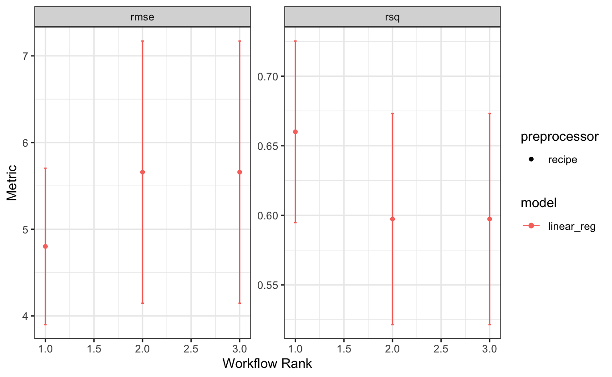
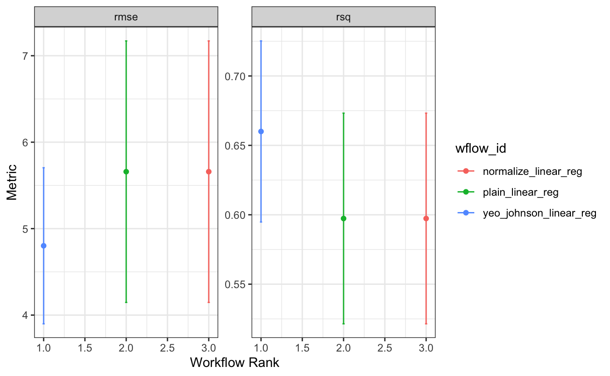

<!--
TODO:
* [x] Look over / edit the post's title in the yaml
* [x] Edit (or delete) the description; note this appears in the Twitter card
* [x] Pick category and tags (see existing with [`hugodown::tidy_show_meta()`](https://rdrr.io/pkg/hugodown/man/use_tidy_post.html))
* [x] Find photo & update yaml metadata
* [x] Create `thumbnail-sq.jpg`; height and width should be equal
* [x] Create `thumbnail-wd.jpg`; width should be >5x height
* [x] [`hugodown::use_tidy_thumbnails()`](https://rdrr.io/pkg/hugodown/man/use_tidy_post.html)
* [x] Add intro sentence, e.g. the standard tagline for the package
* [x] [`usethis::use_tidy_thanks()`](https://usethis.r-lib.org/reference/use_tidy_thanks.html)
-->

The [tidymodels](https://www.tidymodels.org/) framework is a collection of R packages for modeling and machine learning using tidyverse principles.

Since the beginning of 2021, we have been publishing [quarterly updates](https://www.tidyverse.org/categories/roundup/) here on the tidyverse blog summarizing what's new in the tidymodels ecosystem. The purpose of these regular posts is to share useful new features and any updates you may have missed. You can check out the [`tidymodels` tag](https://www.tidyverse.org/tags/tidymodels/) to find all tidymodels blog posts here, including our roundup posts as well as those that are more focused, like these posts from the past couple of months:

-   [Survival analysis for time-to-event data with tidymodels](https://www.tidyverse.org/blog/2024/04/tidymodels-survival-analysis/)
-   [Fair machine learning with tidymodels](https://www.tidyverse.org/blog/2024/03/tidymodels-fairness/)
-   TODO: link to release post for tune 1.2.0

Since [our last roundup post](https://www.tidyverse.org/blog/2024/01/tidymodels-2023-q4/), there have been CRAN releases of 21 tidymodels packages. Here are links to their NEWS files:

-   baguette [(1.0.2)](https://baguette.tidymodels.org/news/index.html)
-   brulee [(0.3.0)](https://brulee.tidymodels.org/news/index.html)
-   butcher [(0.3.4)](https://butcher.tidymodels.org/news/index.html)
-   censored [(0.3.0)](https://censored.tidymodels.org/news/index.html)
-   dials [(1.2.1)](https://dials.tidymodels.org/news/index.html)
-   embed [(1.1.4)](https://embed.tidymodels.org/news/index.html)
-   finetune [(1.2.0)](https://finetune.tidymodels.org/news/index.html)
-   hardhat [(1.3.1)](https://hardhat.tidymodels.org/news/index.html)
-   modeldata [(1.3.0)](https://modeldata.tidymodels.org/news/index.html)
-   parsnip [(1.2.1)](https://parsnip.tidymodels.org/news/index.html)
-   probably [(1.0.3)](https://probably.tidymodels.org/news/index.html)
-   recipes [(1.0.10)](https://recipes.tidymodels.org/news/index.html)
-   rsample [(1.2.1)](https://rsample.tidymodels.org/news/index.html)
-   shinymodels [(0.1.1)](https://shinymodels.tidymodels.org/news/index.html)
-   stacks [(1.0.4)](https://stacks.tidymodels.org/news/index.html)
-   tidyclust [(0.2.1)](https://tidyclust.tidymodels.org/news/index.html)
-   tidymodels [(1.2.0)](https://tidymodels.tidymodels.org/news/index.html)
-   tune [(1.2.0)](https://tune.tidymodels.org/news/index.html)
-   workflows [(1.1.4)](https://workflows.tidymodels.org/news/index.html)
-   workflowsets [(1.1.0)](https://workflowsets.tidymodels.org/news/index.html)
-   yardstick [(1.3.1)](https://yardstick.tidymodels.org/news/index.html)

We'll highlight a few especially notable changes below: new prediction options in censored, consistency in augmenting parsnip models and workflows, as well as a new autoplot type for workflow sets.

<pre class='chroma'><code class='language-r' data-lang='r'><a href='https://rdrr.io/r/base/library.html'>library</a>(<a href='https://tidymodels.tidymodels.org'>tidymodels</a>)
<a href='https://rdrr.io/r/base/library.html'>library</a>(<a href='https://github.com/tidymodels/censored'>censored</a>)</code></pre>

## New prediction options in censored

As part of the framework-wide integration of survival analysis, the parsnip extension package censored has received some love in the form of new prediction options.

Random forests with the `"aorsf"` engine can now predict survival time, thanks to the new feature in the [aorsf](https://docs.ropensci.org/aorsf/) package itself. This means that all engines in censored can now predict survival time.

Let's predict survival time for the first five rows of the lung cancer dataset, survival analysis' `mtcars`.

<pre class='chroma'><code class='language-r' data-lang='r'>rf_spec &lt;- <a href='https://parsnip.tidymodels.org/reference/rand_forest.html'>rand_forest</a>() |&gt;
  <a href='https://parsnip.tidymodels.org/reference/set_engine.html'>set_engine</a>("aorsf") |&gt;
  <a href='https://parsnip.tidymodels.org/reference/set_args.html'>set_mode</a>("censored regression")

rf_fit &lt;- rf_spec |&gt;
  <a href='https://generics.r-lib.org/reference/fit.html'>fit</a>(<a href='https://rdrr.io/pkg/survival/man/Surv.html'>Surv</a>(time, status) ~ age + sex, data = lung)

lung_5 &lt;- lung[1:5, ]
<a href='https://rdrr.io/r/stats/predict.html'>predict</a>(rf_fit, new_data = lung_5, type = "time")
#&gt; # A tibble: 5 × 1
#&gt;   .pred_time
#&gt;        &lt;dbl&gt;
#&gt; 1       219.
#&gt; 2       243.
#&gt; 3       239.
#&gt; 4       236.
#&gt; 5       257.
</code></pre>

Some models allow for predictions based on different values for tuning parameter without having to refit the model. In parsnip, we refer to this as ["the submodel trick."](https://parsnip.tidymodels.org/articles/Submodels.html) Some of those models are regularized models fitted with the [glmnet](https://glmnet.stanford.edu/) engine. In censored, the corresponding [`multi_predict()`](https://parsnip.tidymodels.org/reference/multi_predict.html) method has now gained the prediction types `"time"` and `"raw"` in addition to the existing types `"survival"` and `"linear_pred"`.

Let's fit a regularized Cox model to illustrate. Note how we set the `penalty` to a fixed value of `0.1`.

<pre class='chroma'><code class='language-r' data-lang='r'>cox_fit &lt;- <a href='https://parsnip.tidymodels.org/reference/proportional_hazards.html'>proportional_hazards</a>(penalty = 0.1) |&gt;
  <a href='https://parsnip.tidymodels.org/reference/set_engine.html'>set_engine</a>("glmnet") |&gt;
  <a href='https://parsnip.tidymodels.org/reference/set_args.html'>set_mode</a>("censored regression") |&gt;
  <a href='https://generics.r-lib.org/reference/fit.html'>fit</a>(<a href='https://rdrr.io/pkg/survival/man/Surv.html'>Surv</a>(time, status) ~ ., data = lung)</code></pre>

Predictions made with [`predict()`](https://rdrr.io/r/stats/predict.html) use that penalty value of 0.1. With [`multi_predict()`](https://parsnip.tidymodels.org/reference/multi_predict.html), we can change that value to something different without having to refit. Conveniently, we can predict for multiple penalty values as well.

<pre class='chroma'><code class='language-r' data-lang='r'><a href='https://rdrr.io/r/stats/predict.html'>predict</a>(cox_fit, new_data = lung_5, type = "time")
#&gt; # A tibble: 5 × 1
#&gt;   .pred_time
#&gt;        &lt;dbl&gt;
#&gt; 1        NA 
#&gt; 2       425.
#&gt; 3        NA 
#&gt; 4       350.
#&gt; 5        NA

mpred &lt;- <a href='https://parsnip.tidymodels.org/reference/multi_predict.html'>multi_predict</a>(cox_fit, new_data = lung_5, type = "time", 
                       penalty = <a href='https://rdrr.io/r/base/c.html'>c</a>(0.01, 0.1)) 
mpred
#&gt; # A tibble: 5 × 1
#&gt;   .pred           
#&gt;   &lt;list&gt;          
#&gt; 1 &lt;tibble [2 × 2]&gt;
#&gt; 2 &lt;tibble [2 × 2]&gt;
#&gt; 3 &lt;tibble [2 × 2]&gt;
#&gt; 4 &lt;tibble [2 × 2]&gt;
#&gt; 5 &lt;tibble [2 × 2]&gt;
</code></pre>

The resulting tibble is nested by observation to follow the convention of one row per observation. For each observation, the predictions are stored in a tibble containing the penalty value along with the prediction.

<pre class='chroma'><code class='language-r' data-lang='r'>mpred$.pred[[2]]
#&gt; # A tibble: 2 × 2
#&gt;   penalty .pred_time
#&gt;     &lt;dbl&gt;      &lt;dbl&gt;
#&gt; 1    0.01       461.
#&gt; 2    0.1        425.
</code></pre>

You can see that the predicted value from [`predict()`](https://rdrr.io/r/stats/predict.html) matches the predicted value from [`multi_predict()`](https://parsnip.tidymodels.org/reference/multi_predict.html) with a penalty of 0.1.

## Consistent `augment()` for workflows and parsnip models

If you are interested in exploring predictions in relation to predictors, [`augment()`](https://generics.r-lib.org/reference/augment.html) is your extended [`predict()`](https://rdrr.io/r/stats/predict.html) method: it will augment the inputted dataset with its predictions. For classification, it will add hard class predictions as well as class probabilities. For regression, it will add the numeric prediction. If the outcome variable is part of the dataset, it also calculates residuals. This has already been the case for fitted parsnip models, and the [`augment()`](https://generics.r-lib.org/reference/augment.html) method for workflows will now also calculate residuals.

<pre class='chroma'><code class='language-r' data-lang='r'>spec_fit &lt;- <a href='https://generics.r-lib.org/reference/fit.html'>fit</a>(<a href='https://parsnip.tidymodels.org/reference/linear_reg.html'>linear_reg</a>(), mpg ~ ., mtcars)
wflow_fit &lt;- workflow(mpg ~ ., <a href='https://parsnip.tidymodels.org/reference/linear_reg.html'>linear_reg</a>()) <a href='https://magrittr.tidyverse.org/reference/pipe.html'>%&gt;%</a> <a href='https://generics.r-lib.org/reference/fit.html'>fit</a>(mtcars)

<a href='https://generics.r-lib.org/reference/augment.html'>augment</a>(spec_fit, mtcars)
#&gt; # A tibble: 32 × 13
#&gt;    .pred  .resid   mpg   cyl  disp    hp  drat    wt  qsec    vs    am  gear
#&gt;    &lt;dbl&gt;   &lt;dbl&gt; &lt;dbl&gt; &lt;dbl&gt; &lt;dbl&gt; &lt;dbl&gt; &lt;dbl&gt; &lt;dbl&gt; &lt;dbl&gt; &lt;dbl&gt; &lt;dbl&gt; &lt;dbl&gt;
#&gt;  1  22.6 -1.60    21       6  160    110  3.9   2.62  16.5     0     1     4
#&gt;  2  22.1 -1.11    21       6  160    110  3.9   2.88  17.0     0     1     4
#&gt;  3  26.3 -3.45    22.8     4  108     93  3.85  2.32  18.6     1     1     4
#&gt;  4  21.2  0.163   21.4     6  258    110  3.08  3.22  19.4     1     0     3
#&gt;  5  17.7  1.01    18.7     8  360    175  3.15  3.44  17.0     0     0     3
#&gt;  6  20.4 -2.28    18.1     6  225    105  2.76  3.46  20.2     1     0     3
#&gt;  7  14.4 -0.0863  14.3     8  360    245  3.21  3.57  15.8     0     0     3
#&gt;  8  22.5  1.90    24.4     4  147.    62  3.69  3.19  20       1     0     4
#&gt;  9  24.4 -1.62    22.8     4  141.    95  3.92  3.15  22.9     1     0     4
#&gt; 10  18.7  0.501   19.2     6  168.   123  3.92  3.44  18.3     1     0     4
#&gt; # ℹ 22 more rows
#&gt; # ℹ 1 more variable: carb &lt;dbl&gt;

<a href='https://generics.r-lib.org/reference/augment.html'>augment</a>(wflow_fit, mtcars)
#&gt; # A tibble: 32 × 13
#&gt;    .pred  .resid   mpg   cyl  disp    hp  drat    wt  qsec    vs    am  gear
#&gt;  * &lt;dbl&gt;   &lt;dbl&gt; &lt;dbl&gt; &lt;dbl&gt; &lt;dbl&gt; &lt;dbl&gt; &lt;dbl&gt; &lt;dbl&gt; &lt;dbl&gt; &lt;dbl&gt; &lt;dbl&gt; &lt;dbl&gt;
#&gt;  1  22.6 -1.60    21       6  160    110  3.9   2.62  16.5     0     1     4
#&gt;  2  22.1 -1.11    21       6  160    110  3.9   2.88  17.0     0     1     4
#&gt;  3  26.3 -3.45    22.8     4  108     93  3.85  2.32  18.6     1     1     4
#&gt;  4  21.2  0.163   21.4     6  258    110  3.08  3.22  19.4     1     0     3
#&gt;  5  17.7  1.01    18.7     8  360    175  3.15  3.44  17.0     0     0     3
#&gt;  6  20.4 -2.28    18.1     6  225    105  2.76  3.46  20.2     1     0     3
#&gt;  7  14.4 -0.0863  14.3     8  360    245  3.21  3.57  15.8     0     0     3
#&gt;  8  22.5  1.90    24.4     4  147.    62  3.69  3.19  20       1     0     4
#&gt;  9  24.4 -1.62    22.8     4  141.    95  3.92  3.15  22.9     1     0     4
#&gt; 10  18.7  0.501   19.2     6  168.   123  3.92  3.44  18.3     1     0     4
#&gt; # ℹ 22 more rows
#&gt; # ℹ 1 more variable: carb &lt;dbl&gt;
</code></pre>

Both methods also append on the left-hand side of the data frame, rather than the right-hand side. This means that prediction columns are always visible when printed, even for data frames with many columns.

## New autoplot type for workflow sets

Many tidymodels objects have [`autoplot()`](https://ggplot2.tidyverse.org/reference/autoplot.html) methods for quickly getting a sense of the most important aspects of an object. For workflow sets, the method shows the value of the calcualted performance metrics, as well as the respective rank of each workflow in the set. Let's put together a workflow set on the actual `mtcars` data and take a look at the default autoplot.

<pre class='chroma'><code class='language-r' data-lang='r'>mt_rec &lt;- recipe(mpg ~ ., mtcars)
mt_rec2 &lt;- mt_rec |&gt; step_normalize(all_numeric_predictors())
mt_rec3 &lt;- mt_rec |&gt; step_YeoJohnson(all_numeric_predictors())

wflow_set &lt;- workflow_set(
  <a href='https://rdrr.io/r/base/list.html'>list</a>(plain = mt_rec, normalize = mt_rec2, yeo_johnson = mt_rec3), 
  <a href='https://rdrr.io/r/base/list.html'>list</a>(<a href='https://parsnip.tidymodels.org/reference/linear_reg.html'>linear_reg</a>())
)

<a href='https://rdrr.io/r/base/Random.html'>set.seed</a>(1)
wflow_set_fit &lt;- workflow_map(
  wflow_set, 
  "fit_resamples", 
  resamples = bootstraps(mtcars), 
  seed = 1
)

<a href='https://ggplot2.tidyverse.org/reference/autoplot.html'>autoplot</a>(wflow_set_fit)
</code></pre>

This allows you to grasp the metric values and rank of a workflow and let's you distinguish the type of preprocessor and model. In our case, we only have one type of model, and even just one type of preprocessor, a recipe. What we are much more interested in is which recipe corresponds to which rank. The new option of `type = "wflow_id"` lets us see which values and ranks correspond with which workflow and thus also with which recipe.

<pre class='chroma'><code class='language-r' data-lang='r'><a href='https://ggplot2.tidyverse.org/reference/autoplot.html'>autoplot</a>(wflow_set_fit, type = "wflow_id")
</code></pre>

This makes it easy to spot that it's the Yeo-Johnson transformation that makes the difference here!

## Acknowledgements

We'd like to thank those in the community that contributed to tidymodels in the last quarter:

-   baguette: [@EmilHvitfeldt](https://github.com/EmilHvitfeldt), and [@topepo](https://github.com/topepo).
-   brulee: [@jrosell](https://github.com/jrosell), and [@topepo](https://github.com/topepo).
-   butcher: [@juliasilge](https://github.com/juliasilge).
-   censored: [@EmilHvitfeldt](https://github.com/EmilHvitfeldt), [@hfrick](https://github.com/hfrick), [@simonpcouch](https://github.com/simonpcouch), and [@tripartio](https://github.com/tripartio).
-   dials: [@hfrick](https://github.com/hfrick), and [@topepo](https://github.com/topepo).
-   embed: [@EmilHvitfeldt](https://github.com/EmilHvitfeldt).
-   finetune: [@hfrick](https://github.com/hfrick), [@jrosell](https://github.com/jrosell), [@mfansler](https://github.com/mfansler), [@simonpcouch](https://github.com/simonpcouch), and [@topepo](https://github.com/topepo).
-   hardhat: [@DavisVaughan](https://github.com/DavisVaughan), and [@simonpcouch](https://github.com/simonpcouch).
-   modeldata: [@topepo](https://github.com/topepo).
-   parsnip: [@birbritto](https://github.com/birbritto), [@EmilHvitfeldt](https://github.com/EmilHvitfeldt), [@hfrick](https://github.com/hfrick), [@jmunyoon](https://github.com/jmunyoon), [@marcelglueck](https://github.com/marcelglueck), [@mattheaphy](https://github.com/mattheaphy), [@mesdi](https://github.com/mesdi), [@nipnipj](https://github.com/nipnipj), [@pgg1309](https://github.com/pgg1309), [@simonpcouch](https://github.com/simonpcouch), [@topepo](https://github.com/topepo), and [@wzbillings](https://github.com/wzbillings).
-   probably: [@brshallo](https://github.com/brshallo), [@Jeffrothschild](https://github.com/Jeffrothschild), [@jgaeb](https://github.com/jgaeb), [@simonpcouch](https://github.com/simonpcouch), and [@topepo](https://github.com/topepo).
-   recipes: [@DemetriPananos](https://github.com/DemetriPananos), [@EmilHvitfeldt](https://github.com/EmilHvitfeldt), [@jdonland](https://github.com/jdonland), [@JiahuaQu](https://github.com/JiahuaQu), [@joranE](https://github.com/joranE), [@mikemahoney218](https://github.com/mikemahoney218), [@olivroy](https://github.com/olivroy), [@SantiagoD999](https://github.com/SantiagoD999), [@simonpcouch](https://github.com/simonpcouch), [@stufield](https://github.com/stufield), and [@topepo](https://github.com/topepo).
-   rsample: [@EmilHvitfeldt](https://github.com/EmilHvitfeldt), [@hfrick](https://github.com/hfrick), [@mikemahoney218](https://github.com/mikemahoney218), [@paulcbauer](https://github.com/paulcbauer), [@StevenWallaert](https://github.com/StevenWallaert), [@topepo](https://github.com/topepo), and [@ZWael](https://github.com/ZWael).
-   shinymodels: [@simonpcouch](https://github.com/simonpcouch).
-   stacks: [@simonpcouch](https://github.com/simonpcouch).
-   tidyclust: [@EmilHvitfeldt](https://github.com/EmilHvitfeldt), and [@katieburak](https://github.com/katieburak).
-   tidymodels: [@jkylearmstrong](https://github.com/jkylearmstrong), [@mine-cetinkaya-rundel](https://github.com/mine-cetinkaya-rundel), [@nikosGeography](https://github.com/nikosGeography), [@nipnipj](https://github.com/nipnipj), and [@topepo](https://github.com/topepo).
-   tune: [@AlbertoImg](https://github.com/AlbertoImg), [@EmilHvitfeldt](https://github.com/EmilHvitfeldt), [@hfrick](https://github.com/hfrick), [@joranE](https://github.com/joranE), [@joshuagi](https://github.com/joshuagi), [@lionel-](https://github.com/lionel-), [@marcozanotti](https://github.com/marcozanotti), [@Peter4801](https://github.com/Peter4801), [@rfsaldanha](https://github.com/rfsaldanha), [@simonpcouch](https://github.com/simonpcouch), [@topepo](https://github.com/topepo), and [@walkerjameschris](https://github.com/walkerjameschris).
-   workflows: [@EmilHvitfeldt](https://github.com/EmilHvitfeldt), [@mesdi](https://github.com/mesdi), [@Milardkh](https://github.com/Milardkh), [@simonpcouch](https://github.com/simonpcouch), and [@topepo](https://github.com/topepo).
-   workflowsets: [@hfrick](https://github.com/hfrick), and [@simonpcouch](https://github.com/simonpcouch).
-   yardstick: [@asb2111](https://github.com/asb2111), [@Dpananos](https://github.com/Dpananos), [@EduMinsky](https://github.com/EduMinsky), [@EmilHvitfeldt](https://github.com/EmilHvitfeldt), [@hfrick](https://github.com/hfrick), and [@tripartio](https://github.com/tripartio).

We're grateful for all of the tidymodels community, from observers to users to contributors. Happy modeling!

