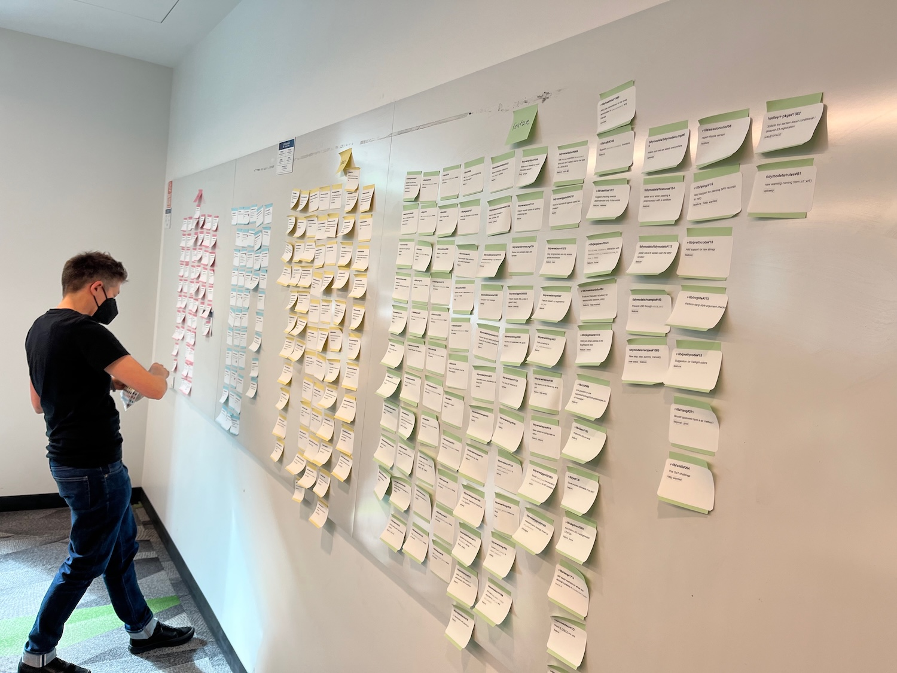

<!--
TODO:
* [ ] Look over / edit the post's title in the yaml
* [ ] Edit (or delete) the description; note this appears in the Twitter card
* [ ] Pick category and tags (see existing with `hugodown::tidy_show_meta()`)
* [ ] Find photo & update yaml metadata
* [ ] Create `thumbnail-sq.jpg`; height and width should be equal
* [ ] Create `thumbnail-wd.jpg`; width should be >5x height
* [ ] `hugodown::use_tidy_thumbnails()`
* [ ] Add intro sentence, e.g. the standard tagline for the package
* [ ] `usethis::use_tidy_thanks()`
-->

The tidymodels framework is a collection of R packages for modeling and machine learning using tidyverse principles.

Since the beginning of 2021, we have been publishing quarterly updates here on the tidyverse blog summarizing what’s new in the tidymodels ecosystem. The purpose of these regular posts is to share useful new features and any updates you may have missed. You can check out the tidymodels tag to find all tidymodels blog posts here, including our roundup posts as well as those that are more focused.

We've sent a steady stream of tidymodels packages to CRAN recently. We usually release them in batches since many of our packages are tightly coupled with one another. Internally, this process is referred to as the "cascade" of CRAN submissions.  

The post will update you on which packages have changed and the major improvements you should know about. 

Here's a list of the packages and their News sections: 

- [baguette](https://baguette.tidymodels.org/news/index.html)
- [brulee](https://brulee.tidymodels.org/news/index.html)
- [censored](https://censored.tidymodels.org/news/index.html)
- [dials](https://dials.tidymodels.org/news/index.html)
- [hardhat](https://hardhat.tidymodels.org/news/index.html)
- [parsnip](https://parsnip.tidymodels.org/news/index.html)
- [recipes](https://recipes.tidymodels.org/news/index.html)
- [tidymodels](https://tidymodels.tidymodels.org/news/index.html)
- [tune](https://tune.tidymodels.org/news/index.html)
- [workflows](https://workflows.tidymodels.org/news/index.html)

Let's look at a few specific updates.

## Improvements in errors and warnings

A group effort was made to improve our error and warning messages across many packages. This started with an internal "upkeep week" (which ended up being 3-4 weeks) and concluded at the [Tidy Dev Day in Seattle](https://www.tidyverse.org/blog/2024/04/tdd-2024/) after posit::conf(2024).  

The goal was to use new tools in the cli and rlang packages to make messages more informative than they used to be. For example, using 

```r
tidy(pca_extract_trained, number = 3, type = "variances")
```

used to result in the error message 

```
Error in `match.arg()`:
! 'arg' should be one of "coef", "variance"
```

The new system references the function that you called and not the underlying base R function that actually errored. It also suggests a solution: 

```
Error in `tidy()`:
! `type` must be one of "coef" or "variance", not "variances".
i Did you mean "variance"?
```      

The rlang package created a set of [standalone files](https://usethis.r-lib.org/reference/use_standalone.html) that contain high-quality type checkers and related functions. This also improves the information that users get from an error. For example, using an inappropriate formula value in `fit(linear_reg(), "boop", mtcars)`, the old message was: 

```
Error in `fit()`:
! The `formula` argument must be a formula, but it is a <character>.
```

and now you see

```
Error in `fit()`:
! `formula` must be a formula, not the string "boop".
```

This was _a lot_ of work and we're still aren’t finished. Two events helped us get as far as we did. 

First, Simon Couch made the [chores](https://simonpcouch.github.io/chores/) package (its previous name was "pal"), which enabled us to use AI tools to solve small-scope problems, such as converting old rlang error code to use the new [cli syntax](https://rlang.r-lib.org/reference/topic-condition-formatting.html). I can’t overstate how much of a speed-up this was for us. 

Second, at developer day, many external folks pitched in to make pull requests from a list of issues:

```{r}
#| label: post-its
#| fig.cap: Organizing Tidy Dev Day issues.
#| echo: false
#| fig.align: center


```

I love these sessions for many reasons, but mostly because we meet users and contributors to our packages in person and work with them on specific tasks. 

There is a lot more to do here; we have a lot of secondary packages that would benefit from these improvements too. 

## Quantile regression in parsnip

One big update in parsnip was a new modeling mode of `"quantile regression"`. Daniel McDonald and Ryan Tibshirani largely provided some inertia for this work based on their disease modeling framework. 

You can generate quantile predictions by first creating a model specification, which includes the quantiles that you want to predict:

```{r}
#| label: sshhh
#| include: false
library(tidymodels)
```

```{r}
#| label: quant-spec
library(tidymodels)
tidymodels_prefer()

ames <- 
  modeldata::ames |> 
  mutate(Sale_Price = log10(Sale_Price)) |> 
  select(Sale_Price, Latitude)

quant_spec <- 
  linear_reg() |> 
  set_engine("quantreg") |> 
  set_mode("quantile regression", quantile_levels = c(0.1, 0.5, 0.9))
quant_spec
```

We'll add some spline terms via a recipe and fit the model:

```{r}
#| label: quant-fit
spline_rec <- 
  recipe(Sale_Price ~ ., data = ames) |> 
  step_spline_natural(Latitude, deg_free = 10)

quant_fit <- 
  workflow(spline_rec, quant_spec) |> 
  fit(data = ames)

quant_fit
```

For prediction, tidymodels always returns a data frame with as many rows as the input data set (here: `ames`). The result for quantile predictions is a special vctrs class: 

```{r}
#| label: quant-pred
quant_pred <- predict(quant_fit, ames) 
quant_pred |> slice(1:4)

class(quant_pred$.pred_quantile)
```

where the output `[5.31]` shows the middle quantile. 

We can expand the set of quantile predictions so that there are three rows for each source row in `ames`. There’s also an integer column called `.row` so that we can merge the data with the source data:  

```{r}
#| label: quant-collect
quant_pred$.pred_quantile[1]
as_tibble(quant_pred$.pred_quantile[1])
```

Here are the predicted quantile values: 

```{r}
#| label: quant-plot
#| fig.align: center
#| fig.height: 6.25
#| out.width: 80%
#| fig.cap: 10%, 50%, and 90% quantile predictions. 

quant_pred$.pred_quantile |> 
  as_tibble() |> 
  full_join(ames |> add_rowindex(), by = ".row") |> 
  arrange(Latitude) |> 
  ggplot(aes(x = Latitude)) + 
  geom_point(data = ames, aes(y = Sale_Price), alpha = 1 / 5) +
  geom_line(aes(y = .pred_quantile, col = format(.quantile_levels)), 
            show.legend = FALSE, linewidth = 1.5) +
  theme_bw()
```

For now, the new mode does not have many engines. We need to implement some performance statistics in the yardstick package before integrating these models into the whole tidymodels ecosystem. 

In other news, we’ve added some additional neural network models based on some improvements in the brulee package. Namely, two-layer networks can be tuned for feed-forward networks on tabular data (using torch). 

One other improvement has been simmering for a long time: the ability to exploit sparse data structures better. We’ve improved our `fit()` interfaces for the few model engines that can use sparsely encoded data. There is much more to come on this in a few months, especially around recipes, so stay tuned. 

Finally, we’ve created a set of [checklists](https://parsnip.tidymodels.org/articles/checklists.html) that can be used when creating new models or engines. These are very helpful, even for us, since there is a lot of minutiae to remember. 

## Parallelism in tune

This was a small maintenance release mostly related to parallel processing. Up to now, tune facilitated parallelism using the [foreach](https://cran.r-project.org/package=foreach) package. That package is mature but not actively developed, so we have been slowly moving toward using the [future](https://www.futureverse.org/packages-overview.html) package(s). 

The [first step in this journey](https://www.tidyverse.org/blog/2024/04/tune-1-2-0/#modernized-support-for-parallel-processing) was to keep using foreach internally (but lean toward future) but to encourage users to move from directly invoking the foreach package and, instead, load and use the future package. 

We’re now moving folks into the second stage. tune will now raise a warning when:

- A parallel backend has been registered with foreach, and
- No [`plan()`](https://future.futureverse.org/reference/plan.html) has been specified with future.

This will allow users to transition their existing code to only future and allow us to update existing documentation and training materials. 

We anticipate that the third stage, **removing foreach entirely**, will occur sometime before posit::conf(2025) in September. 

## Things to look forward to

We are working hard on a few major initiatives that we plan on showing off at posit::conf(2025). 

First is integrated support for sparse **data**. The emphasis is on "data" because users can use sparse data frames _or_ the usual sparse matrix format. This is a big deal because it does not force you to convert non-numeric data into a numeric matrix format. Again, we’ll discuss this more in the future, but you should be able to use sparse data frames in parsnip, recipes, tune, etc. 

The second initiative is the longstanding goal of adding **postprocessing** to tidymodels. Just as you can add a preprocessor to a model workflow, you will be able to add a set of postprocessing adjustments to the predictions your model generates. See our [previous post](https://www.tidyverse.org/blog/2024/10/postprocessing-preview/) for a sneak peek. 

These should come to fruition (and CRAN) before or around August 2025. 

## Acknowledgements

We want to sincerely thank everyone who contributed to these packages since their previous versions: 

[&#x0040;AlbertoImg](https://github.com/AlbertoImg), [&#x0040;asb2111](https://github.com/asb2111), [&#x0040;balraadjsings](https://github.com/balraadjsings), [&#x0040;bcjaeger](https://github.com/bcjaeger), [&#x0040;beansrowning](https://github.com/beansrowning), [&#x0040;BrennanAntone](https://github.com/BrennanAntone), [&#x0040;cheryldietrich](https://github.com/cheryldietrich), [&#x0040;chillerb](https://github.com/chillerb), [&#x0040;conarr5](https://github.com/conarr5), [&#x0040;corybrunson](https://github.com/corybrunson), [&#x0040;dajmcdon](https://github.com/dajmcdon), [&#x0040;davidrsch](https://github.com/davidrsch), [&#x0040;Edgar-Zamora](https://github.com/Edgar-Zamora), [&#x0040;EmilHvitfeldt](https://github.com/EmilHvitfeldt), [&#x0040;gaborcsardi](https://github.com/gaborcsardi), [&#x0040;gimholte](https://github.com/gimholte), [&#x0040;grantmcdermott](https://github.com/grantmcdermott), [&#x0040;grouptheory](https://github.com/grouptheory), [&#x0040;hfrick](https://github.com/hfrick), [&#x0040;ilaria-kode](https://github.com/ilaria-kode), [&#x0040;JamesHWade](https://github.com/JamesHWade), [&#x0040;jesusherranz](https://github.com/jesusherranz), [&#x0040;jkylearmstrong](https://github.com/jkylearmstrong), [&#x0040;joranE](https://github.com/joranE), [&#x0040;joscani](https://github.com/joscani), [&#x0040;Joscelinrocha](https://github.com/Joscelinrocha), [&#x0040;josho88](https://github.com/josho88), [&#x0040;joshuagi](https://github.com/joshuagi), [&#x0040;JosiahParry](https://github.com/JosiahParry), [&#x0040;jrosell](https://github.com/jrosell), [&#x0040;jrwinget](https://github.com/jrwinget), [&#x0040;KarlKoe](https://github.com/KarlKoe), [&#x0040;kscott-1](https://github.com/kscott-1), [&#x0040;lilykoff](https://github.com/lilykoff), [&#x0040;lionel-](https://github.com/lionel-), [&#x0040;LouisMPenrod](https://github.com/LouisMPenrod), [&#x0040;luisDVA](https://github.com/luisDVA), [&#x0040;marcelglueck](https://github.com/marcelglueck), [&#x0040;marcozanotti](https://github.com/marcozanotti), [&#x0040;martaalcalde](https://github.com/martaalcalde), [&#x0040;mattwarkentin](https://github.com/mattwarkentin), [&#x0040;mihem](https://github.com/mihem), [&#x0040;mitchellmanware](https://github.com/mitchellmanware), [&#x0040;naokiohno](https://github.com/naokiohno), [&#x0040;nhward](https://github.com/nhward), [&#x0040;npelikan](https://github.com/npelikan), [&#x0040;obgeneralao](https://github.com/obgeneralao), [&#x0040;owenjonesuob](https://github.com/owenjonesuob), [&#x0040;pbhogale](https://github.com/pbhogale), [&#x0040;Peter4801](https://github.com/Peter4801), [&#x0040;pgg1309](https://github.com/pgg1309), [&#x0040;reisner](https://github.com/reisner), [&#x0040;rfsaldanha](https://github.com/rfsaldanha), [&#x0040;rkb965](https://github.com/rkb965), [&#x0040;RobLBaker](https://github.com/RobLBaker), [&#x0040;RodDalBen](https://github.com/RodDalBen), [&#x0040;SantiagoD999](https://github.com/SantiagoD999), [&#x0040;shum461](https://github.com/shum461), [&#x0040;simonpcouch](https://github.com/simonpcouch), [&#x0040;szimmer](https://github.com/szimmer), [&#x0040;talegari](https://github.com/talegari), [&#x0040;therealjpetereit](https://github.com/therealjpetereit), [&#x0040;topepo](https://github.com/topepo), [&#x0040;walkerjameschris](https://github.com/walkerjameschris), and  [&#x0040;ZWael](https://github.com/ZWael)

