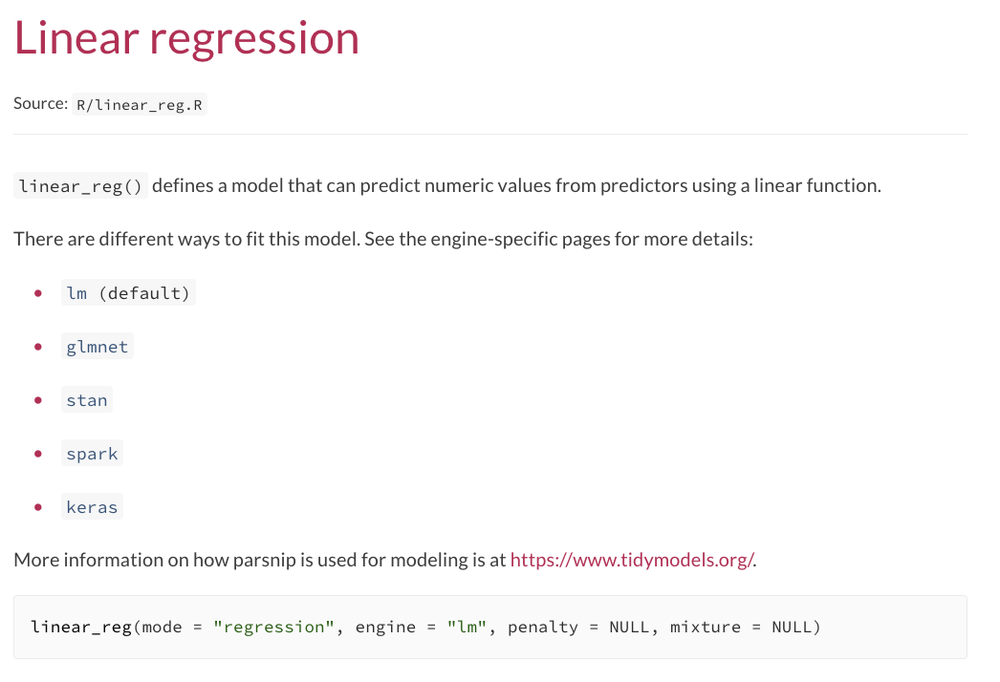
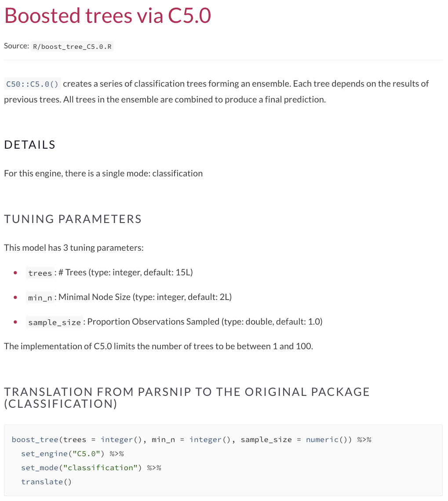
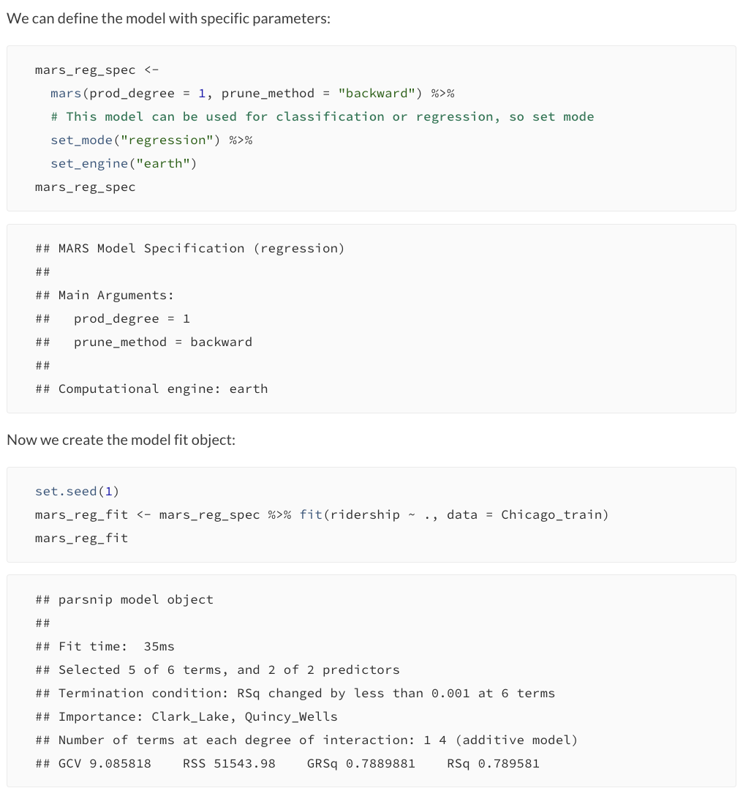

<!--
TODO:
* [ ] Look over / edit the post's title in the yaml
* [ ] Edit (or delete) the description; note this appears in the Twitter card
* [ ] Pick category and tags (see existing with `hugodown::tidy_show_meta()`)
* [ ] Find photo & update yaml metadata
* [ ] Create `thumbnail-sq.jpg`; height and width should be equal
* [ ] Create `thumbnail-wd.jpg`; width should be >5x height
* [ ] `hugodown::use_tidy_thumbnails()`
* [ ] Add intro sentence, e.g. the standard tagline for the package
* [ ] `usethis::use_tidy_thanks()`
-->

Recently, we had a series of CRAN releases: [hardhat](https://hardhat.tidymodels.org/news/index.html#hardhat-0-1-6-2021-07-14), [workflows](https://workflows.tidymodels.org/news/#workflows-0-2-3-2021-07-15), [parsnip](https://parsnip.tidymodels.org/news/#parsnip-0-1-7-2021-07-21), [tune](https://tune.tidymodels.org/news/#tune-0-1-6-2021-07-21), [finetune](https://finetune.tidymodels.org/news/#finetune-0-1-0-unreleased), [workflowsets](https://workflowsets.tidymodels.org/news/#workflowsets-0-1-0-unreleased), and [discrim](https://discrim.tidymodels.org/news/#discrim-0-1-3-unreleased). These were coordinated because of some cross-package improvements. This blog post summarizes the changes. 

## Object extraction

The tidymodels team decided that we needed a consistent set of APIs for extracting things from objects. For example, a parsnip model has the underlying model fit based on the engine. For example, `linear_reg()` with the `"lm"` engine contains an `lm` object. There were some existing functions to do this (mostly named `pull_*()`) but they were fairly inconsistent and were not generics. 

We added the following functions: `extract_fit_engine()`, `extract_fit_parsnip()`, `extract_mold()`, `extract_numeric()`, `extract_preprocessor()`, `extract_recipe()`, `extract_spec_parsnip()`, `extract_workflow()`, and `extract_workflow_set_result()`. 

The nice thing about this change is that a function such as `extract_recipe()` can be used with objects created by the tune, workflows, or workflowsets packages. 

The existing `pull_*()` methods have been soft-deprecated and will stick around for a while. 

## Better model documentation

One issue that we've seen in the parsnip documentation is that there is just _so much_ on each model page. It can be intimidating and difficult to find that one piece of information that you were looking for. 

We've reorganized the model pages so that there are now sub-packages for each engine. For example, when you use `?linear_reg`, the help page has a _dynamic_ list of engines from parsnip or any parsnip-adjacent package that has been loaded. Here is what the pkgdown site looks like: 

```{r parsnip, echo = FALSE, fig.align='center', out.width="90%"}

```

There is a similar dynamic list in the `See Also` section. 

Each engine page provides basic information about tuning parameters, modes, preprocessing requirements, and anything else that we thing is relevant. For example, for the C5.0 engine for `boost_tree()`:

```{r C50, echo = FALSE, fig.align='center', out.width="90%"}

```

Finally, the existing parsnip documentation didn't show the actual fitting and/or prediction in action. A [new pkgdown article](https://parsnip.tidymodels.org/articles/articles/Examples.html) has worked examples demonstrating the use of parsnip models on real data. Here is a screen shot for MARS regression via the earth package: 

```{r earth, echo = FALSE, fig.align='center', out.width="90%"}

```

We think that these changes will greatly improve the whole parsnip experience, especially for new users. 

## Simpler parsnip and workflows interfaces

Our good friend and colleague [David Robinson](https://twitter.com/drob) had [some great ideas](http://varianceexplained.org/r/sliced-ml/#where-tidymodels-can-improve) for specific improvements for our APIs. After some discussion, both of his suggestions were implemented. 

First, we enabled a default engine for parsnip models (you may have noticed this in the screen shots above). This produces simpler code for some model functions and, if a model has a single mode, fitting is as easy as

```r
# use lm() for regression
linear_reg() %>% fit(mpg ~ ., data = mtcars)
```

Another nice feature is more succinct piping for workflows. A preprocessor, such as a formula or recipe, can be piped into `workflow()` now. Also, there is an optional second argument in that function for the model specification. 

Instead of 

```r
car_rec <- 
  recipe(mpg ~ ., data = mtcars) %>% 
  step_ns(disp, deg_free = 5)

car_wflow <- 
  workflow() %>% 
  add_recipe(car_rec) %>% 
  add_model(linear_reg())
```

you can now use

```r
car_wflow <- 
  recipe(mpg ~ ., data = mtcars) %>% 
  step_ns(disp, deg_free = 5) %>% 
  workflow(linear_reg()) 
```  

If you might be on the fence about using tiydmodels, [David's blog post](http://varianceexplained.org/r/sliced-ml/) does an excellent job encapsulating the benefits of our approach, so give it a read. 


## Other changes

parsnip now has a generalized additive model function [`gen_additive_mod()`](https://parsnip.tidymodels.org/reference/gen_additive_mod.html)! 

The tune package has better control over random numbers since, in some cases, the [RNGkind was changed](https://github.com/tidymodels/tune/issues/389) after tuning a model. 

The discrim package has the new parsnip-like documentation and new model engines. Also, the shrunken discriminant analysis method of Ahdesmaki and Strimmer (2010) was added as an engine to `discrim_linear()`. The newly resurrected sparsediscrim package allowed use to include new engines for [`discrim_linear()`](https://discrim.tidymodels.org/reference/details_discrim_linear_sparsediscrim.html) and [`discrim_quad()`](https://discrim.tidymodels.org/reference/details_discrim_quad_sparsediscrim.html). 


## Acknowledgements

We'd like to thank everyone who has contributed to these packages since their last release:

**hardhat**: [&#x0040;cregouby](https://github.com/cregouby), [&#x0040;DavisVaughan](https://github.com/DavisVaughan), [&#x0040;DiabbZegpi](https://github.com/DiabbZegpi), [&#x0040;hfrick](https://github.com/hfrick), [&#x0040;jwijffels](https://github.com/jwijffels), [&#x0040;LasWin](https://github.com/LasWin), and [&#x0040;topepo](https://github.com/topepo).

**workflows**: [&#x0040;DavisVaughan](https://github.com/DavisVaughan), [&#x0040;dgrtwo](https://github.com/dgrtwo), [&#x0040;EmilHvitfeldt](https://github.com/EmilHvitfeldt), [&#x0040;LiamBlake](https://github.com/LiamBlake), and [&#x0040;topepo](https://github.com/topepo).

**parsnip**: [&#x0040;cgoo4](https://github.com/cgoo4), [&#x0040;dgrtwo](https://github.com/dgrtwo), [&#x0040;EmilHvitfeldt](https://github.com/EmilHvitfeldt), [&#x0040;graysonwhite](https://github.com/graysonwhite), [&#x0040;hfrick](https://github.com/hfrick), [&#x0040;juliasilge](https://github.com/juliasilge), [&#x0040;mdancho84](https://github.com/mdancho84), [&#x0040;RaymondBalise](https://github.com/RaymondBalise), [&#x0040;topepo](https://github.com/topepo), and [&#x0040;yutannihilation](https://github.com/yutannihilation).

**tune**: [&#x0040;amazongodman](https://github.com/amazongodman), [&#x0040;brshallo](https://github.com/brshallo), [&#x0040;dpanyard](https://github.com/dpanyard), [&#x0040;EmilHvitfeldt](https://github.com/EmilHvitfeldt), [&#x0040;juliasilge](https://github.com/juliasilge), [&#x0040;klin333](https://github.com/klin333), [&#x0040;mbac](https://github.com/mbac), [&#x0040;PathosEthosLogos](https://github.com/PathosEthosLogos), [&#x0040;tjcason](https://github.com/tjcason), [&#x0040;topepo](https://github.com/topepo), and [&#x0040;yogat3ch](https://github.com/yogat3ch).

**finetune**: [&#x0040;DavisVaughan](https://github.com/DavisVaughan), [&#x0040;hfrick](https://github.com/hfrick), [&#x0040;hnagaty](https://github.com/hnagaty), [&#x0040;lukasal](https://github.com/lukasal), [&#x0040;Mayalaroz](https://github.com/Mayalaroz), [&#x0040;mrkaye97](https://github.com/mrkaye97), [&#x0040;shinyquant](https://github.com/shinyquant), [&#x0040;skeydan](https://github.com/skeydan), and [&#x0040;topepo](https://github.com/topepo).

**workflowsets**: [&#x0040;amazongodman](https://github.com/amazongodman), [&#x0040;jonthegeek](https://github.com/jonthegeek), [&#x0040;juliasilge](https://github.com/juliasilge), [&#x0040;oskasf](https://github.com/oskasf), [&#x0040;topepo](https://github.com/topepo), and [&#x0040;yogat3ch](https://github.com/yogat3ch).

**discrim**: [&#x0040;topepo](https://github.com/topepo).
