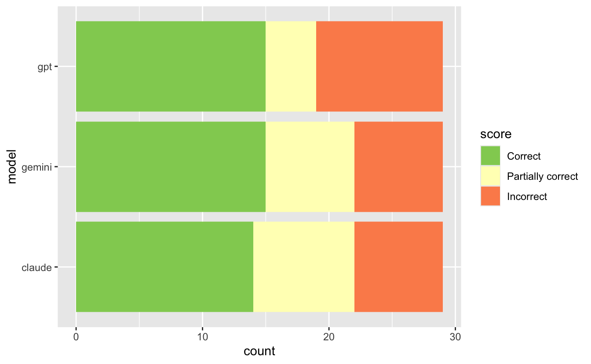

<!--
TODO:
* [x] Look over / edit the post's title in the yaml
* [x] Edit (or delete) the description; note this appears in the Twitter card
* [x] Pick category and tags (see existing with [`hugodown::tidy_show_meta()`](https://rdrr.io/pkg/hugodown/man/use_tidy_post.html))
* [x] Find photo & update yaml metadata
* [x] Create `thumbnail-sq.jpg`; height and width should be equal
* [x] Create `thumbnail-wd.jpg`; width should be >5x height
* [x] [`hugodown::use_tidy_thumbnails()`](https://rdrr.io/pkg/hugodown/man/use_tidy_post.html)
* [x] Add intro sentence, e.g. the standard tagline for the package
* [x] [`usethis::use_tidy_thanks()`](https://usethis.r-lib.org/reference/use_tidy_thanks.html)
-->

We're bear-y excited to announce the release of [vitals](https::vitals.tidyverse.org) on CRAN. vitals is a framework for large language model evaluation in R. It's specifically aimed at ellmer users who want to measure the effectiveness of their LLM products like [custom chat apps](https://posit.co/blog/custom-chat-app/) and [querychat](https://github.com/posit-dev/querychat) apps.

You can install it from CRAN with:

<div class="highlight">

<pre class='chroma'><code class='language-r' data-lang='r'><span><span class='nf'><a href='https://rdrr.io/r/utils/install.packages.html'>install.packages</a></span><span class='o'>(</span><span class='s'>"vitals"</span><span class='o'>)</span></span></code></pre>

</div>

This blog post will demonstrate the basics of evaluating LLM products with vitals. Specifically, we'll focus on a dataset of challenging R coding problems, evaluating how well different models from leading AI labs can solve them. This post just scratches the surface of what's possible with vitals; check out the [package website](https://vitals.tidyverse.org/) to learn more.

<div class="highlight">

</div>

## The basics

At their core, LLM evals are composed of three pieces:

1.  **Datasets** contain a set of labelled samples. Datasets are just a tibble with, minimally, columns `input` and `target`. `input` is a prompt that could be submitted by a user and `target` is either literal value(s) or grading guidance.
2.  **Solvers** evaluate the `input` in the dataset and produce a final result (hopefully) approximating `target`. In vitals, the simplest solver is just an ellmer chat (e.g. [`ellmer::chat_anthropic()`](https://ellmer.tidyverse.org/reference/chat_anthropic.html)) wrapped in [`generate()`](https://vitals.tidyverse.org/reference/generate.html), i.e. `generate(ellmer::chat_anthropic()`), which will call the Chat object's `$chat()` method and return whatever it returns. When evaluating your own LLM products like [shinychat](https://posit-dev.github.io/shinychat/) and [querychat](https://github.com/posit-dev/querychat) apps, the underlying ellmer chat is your solver.
3.  **Scorers** evaluate the final output of solvers. They may use text comparisons, model grading, or other custom schemes to determine how well the solver approximated the `target` based on the `input`.

This blog post will explore these three components using `are`, an example dataset that ships with the package.

First, loading some packages:

<div class="highlight">

<pre class='chroma'><code class='language-r' data-lang='r'><span><span class='kr'><a href='https://rdrr.io/r/base/library.html'>library</a></span><span class='o'>(</span><span class='nv'><a href='https://github.com/tidyverse/vitals'>vitals</a></span><span class='o'>)</span></span>
<span><span class='kr'><a href='https://rdrr.io/r/base/library.html'>library</a></span><span class='o'>(</span><span class='nv'><a href='https://ellmer.tidyverse.org'>ellmer</a></span><span class='o'>)</span></span>
<span><span class='kr'><a href='https://rdrr.io/r/base/library.html'>library</a></span><span class='o'>(</span><span class='nv'><a href='https://dplyr.tidyverse.org'>dplyr</a></span><span class='o'>)</span></span>
<span><span class='kr'><a href='https://rdrr.io/r/base/library.html'>library</a></span><span class='o'>(</span><span class='nv'><a href='https://ggplot2.tidyverse.org'>ggplot2</a></span><span class='o'>)</span></span></code></pre>

</div>

## An R eval dataset

While the package is capable of evaluating LLM products for arbitrary capabilities, the package ships with an example dataset `are` that evaluates R coding performance. From the `are` docs:

> An R Eval is a dataset of challenging R coding problems. Each `input` is a question about R code which could be solved on first-read only by human experts and, with a chance to read documentation and run some code, by fluent data scientists. Solutions are in `target` and enable a fluent data scientist to evaluate whether the solution deserves full, partial, or no credit.

<div class="highlight">

<pre class='chroma'><code class='language-r' data-lang='r'><span><span class='nf'><a href='https://pillar.r-lib.org/reference/glimpse.html'>glimpse</a></span><span class='o'>(</span><span class='nv'>are</span><span class='o'>)</span></span>
<span><span class='c'>#&gt; Rows: 29</span></span>
<span><span class='c'>#&gt; Columns: 7</span></span>
<span><span class='c'>#&gt; $ id        <span style='color: #555555; font-style: italic;'>&lt;chr&gt;</span> "after-stat-bar-heights"<span style='color: #555555;'>, </span>"conditional-grouped-summary"<span style='color: #555555;'>, </span>"correlated-delays…</span></span>
<span><span class='c'>#&gt; $ input     <span style='color: #555555; font-style: italic;'>&lt;chr&gt;</span> "This bar chart shows the count of different cuts of diamonds, and each bar…</span></span>
<span><span class='c'>#&gt; $ target    <span style='color: #555555; font-style: italic;'>&lt;chr&gt;</span> "Preferably: \n\n```\nggplot(data = diamonds) + \n  geom_bar(aes(x = cut, y…</span></span>
<span><span class='c'>#&gt; $ domain    <span style='color: #555555; font-style: italic;'>&lt;chr&gt;</span> "Data analysis"<span style='color: #555555;'>, </span>"Data analysis"<span style='color: #555555;'>, </span>"Data analysis"<span style='color: #555555;'>, </span>"Programming"<span style='color: #555555;'>, </span>"Data ana…</span></span>
<span><span class='c'>#&gt; $ task      <span style='color: #555555; font-style: italic;'>&lt;chr&gt;</span> "New code"<span style='color: #555555;'>, </span>"New code"<span style='color: #555555;'>, </span>"New code"<span style='color: #555555;'>, </span>"Debugging"<span style='color: #555555;'>, </span>"New code"<span style='color: #555555;'>, </span>"New code"<span style='color: #555555;'>, </span>"D…</span></span>
<span><span class='c'>#&gt; $ source    <span style='color: #555555; font-style: italic;'>&lt;chr&gt;</span> "https://jrnold.github.io/r4ds-exercise-solutions/data-visualisation.html"<span style='color: #555555;'>,</span>…</span></span>
<span><span class='c'>#&gt; $ knowledge <span style='color: #555555; font-style: italic;'>&lt;list&gt;</span> "tidyverse"<span style='color: #555555;'>, </span>"tidyverse"<span style='color: #555555;'>, </span>"tidyverse"<span style='color: #555555;'>, </span>"r-lib"<span style='color: #555555;'>, </span>"tidyverse"<span style='color: #555555;'>, </span>"tidyverse"<span style='color: #555555;'>, </span>…</span></span>
<span></span></code></pre>

</div>

At a high level:

-   `id`: A unique identifier for the problem.
-   `input`: The question to be answered.
-   `target`: The solution, often with a description of notable features of a correct solution.
-   `domain`, `task`, and `knowledge` are pieces of metadata describing the kind of R coding challenge.
-   `source`: Where the problem came from, as a URL. Many of these coding problems are adapted "from the wild" and include the kinds of context usually available to those answering questions.

For the purposes of actually carrying out the initial evaluation, we're specifically interested in the `input` and `target` columns. Let's print out the first entry in full so you can get a taste of a typical problem in this dataset:

<div class="highlight">

<pre class='chroma'><code class='language-r' data-lang='r'><span><span class='nf'><a href='https://rdrr.io/r/base/cat.html'>cat</a></span><span class='o'>(</span><span class='nv'>are</span><span class='o'>$</span><span class='nv'>input</span><span class='o'>[</span><span class='m'>1</span><span class='o'>]</span><span class='o'>)</span></span>
<span><span class='c'>#&gt; This bar chart shows the count of different cuts of diamonds, and each bar is</span></span>
<span><span class='c'>#&gt; stacked and filled  according to clarity:</span></span>
<span><span class='c'>#&gt; </span></span>
<span><span class='c'>#&gt; </span></span>
<span><span class='c'>#&gt; ```</span></span>
<span><span class='c'>#&gt; </span></span>
<span><span class='c'>#&gt; ggplot(data = diamonds) + </span></span>
<span><span class='c'>#&gt;   geom_bar(mapping = aes(x = cut, fill = clarity))</span></span>
<span><span class='c'>#&gt; ```</span></span>
<span><span class='c'>#&gt; </span></span>
<span><span class='c'>#&gt; </span></span>
<span><span class='c'>#&gt; Could you change this code so that the proportion of diamonds with a given cut</span></span>
<span><span class='c'>#&gt; corresponds to the bar height and not the count? Each bar should still be</span></span>
<span><span class='c'>#&gt; filled according to clarity.</span></span>
<span></span></code></pre>

</div>

Here's the suggested solution:

<div class="highlight">

<pre class='chroma'><code class='language-r' data-lang='r'><span><span class='nf'><a href='https://rdrr.io/r/base/cat.html'>cat</a></span><span class='o'>(</span><span class='nv'>are</span><span class='o'>$</span><span class='nv'>target</span><span class='o'>[</span><span class='m'>1</span><span class='o'>]</span><span class='o'>)</span></span>
<span><span class='c'>#&gt; Preferably: </span></span>
<span><span class='c'>#&gt; </span></span>
<span><span class='c'>#&gt; ```</span></span>
<span><span class='c'>#&gt; ggplot(data = diamonds) + </span></span>
<span><span class='c'>#&gt;   geom_bar(aes(x = cut, y = after_stat(count) / sum(after_stat(count)), fill = clarity))</span></span>
<span><span class='c'>#&gt; ```</span></span>
<span><span class='c'>#&gt; </span></span>
<span><span class='c'>#&gt; or:</span></span>
<span><span class='c'>#&gt; </span></span>
<span><span class='c'>#&gt; ```</span></span>
<span><span class='c'>#&gt; ggplot(data = diamonds) +</span></span>
<span><span class='c'>#&gt;   geom_bar(mapping = aes(x = cut, y = ..prop.., group = clarity, fill = clarity))</span></span>
<span><span class='c'>#&gt; ```</span></span>
<span><span class='c'>#&gt; </span></span>
<span><span class='c'>#&gt; or:</span></span>
<span><span class='c'>#&gt; </span></span>
<span><span class='c'>#&gt; ```</span></span>
<span><span class='c'>#&gt; ggplot(data = diamonds) +</span></span>
<span><span class='c'>#&gt;   geom_bar(mapping = aes(x = cut, y = after_stat(count / sum(count)), group = clarity, fill = clarity))</span></span>
<span><span class='c'>#&gt; ```</span></span>
<span><span class='c'>#&gt; </span></span>
<span><span class='c'>#&gt; The dot-dot notation (`..count..`) was deprecated in ggplot2 3.4.0, but it</span></span>
<span><span class='c'>#&gt; still works and should receive full credit:</span></span>
<span><span class='c'>#&gt; </span></span>
<span><span class='c'>#&gt; ```</span></span>
<span><span class='c'>#&gt; ggplot(data = diamonds) + </span></span>
<span><span class='c'>#&gt;   geom_bar(aes(x = cut, y = ..count.. / sum(..count..), fill = clarity))</span></span>
<span><span class='c'>#&gt; ```</span></span>
<span><span class='c'>#&gt; </span></span>
<span><span class='c'>#&gt; Simply setting `position = "fill"` will result in each bar having a height of 1</span></span>
<span><span class='c'>#&gt; and is not correct.</span></span>
<span></span></code></pre>

</div>

## Evaluation tasks

First, we'll create a few ellmer chat objects that use different LLMs:

<div class="highlight">

<pre class='chroma'><code class='language-r' data-lang='r'><span><span class='nv'>claude</span> <span class='o'>&lt;-</span> <span class='nf'><a href='https://ellmer.tidyverse.org/reference/chat_anthropic.html'>chat_anthropic</a></span><span class='o'>(</span>model <span class='o'>=</span> <span class='s'>"claude-sonnet-4-20250514"</span><span class='o'>)</span></span>
<span><span class='nv'>gpt</span> <span class='o'>&lt;-</span> <span class='nf'><a href='https://ellmer.tidyverse.org/reference/chat_openai.html'>chat_openai</a></span><span class='o'>(</span>model <span class='o'>=</span> <span class='s'>"gpt-4.1"</span><span class='o'>)</span></span>
<span><span class='nv'>gemini</span> <span class='o'>&lt;-</span> <span class='nf'><a href='https://ellmer.tidyverse.org/reference/chat_google_gemini.html'>chat_google_gemini</a></span><span class='o'>(</span>model <span class='o'>=</span> <span class='s'>"gemini-2.5-pro"</span><span class='o'>)</span></span></code></pre>

</div>

LLM evaluation with vitals happens in two main steps:

1.  Use `Task$new()` to situate a dataset, solver, and scorer in a `Task`.

<div class="highlight">

<pre class='chroma'><code class='language-r' data-lang='r'><span><span class='nv'>tsk</span> <span class='o'>&lt;-</span> <span class='nv'><a href='https://vitals.tidyverse.org/reference/Task.html'>Task</a></span><span class='o'>$</span><span class='nf'>new</span><span class='o'>(</span></span>
<span>  dataset <span class='o'>=</span> <span class='nv'>are</span>,</span>
<span>  solver <span class='o'>=</span> <span class='nf'><a href='https://vitals.tidyverse.org/reference/generate.html'>generate</a></span><span class='o'>(</span><span class='o'>)</span>,</span>
<span>  scorer <span class='o'>=</span> <span class='nf'><a href='https://vitals.tidyverse.org/reference/scorer_model.html'>model_graded_qa</a></span><span class='o'>(</span></span>
<span>    partial_credit <span class='o'>=</span> <span class='kc'>TRUE</span>, </span>
<span>    scorer_chat <span class='o'>=</span> <span class='nv'>claude</span></span>
<span>  <span class='o'>)</span>,</span>
<span>  name <span class='o'>=</span> <span class='s'>"An R Eval"</span></span>
<span><span class='o'>)</span></span>
<span></span>
<span><span class='nv'>tsk</span></span>
<span><span class='c'>#&gt; An evaluation <span style='color: #0000BB;'>task</span> <span style='color: #00BB00;'>An-R-Eval</span>.</span></span>
<span></span></code></pre>

</div>

1.  Use `Task$eval()` to evaluate the solver, evaluate the scorer, and then explore a persistent log of the results in the [interactive log viewer](https://vitals.tidyverse.org/articles/vitals.html#analyzing-the-results).

<div class="highlight">

<pre class='chroma'><code class='language-r' data-lang='r'><span><span class='nv'>tsk_claude</span> <span class='o'>&lt;-</span> <span class='nv'>tsk</span><span class='o'>$</span><span class='nf'>clone</span><span class='o'>(</span><span class='o'>)</span></span>
<span><span class='nv'>tsk_claude</span><span class='o'>$</span><span class='nf'>eval</span><span class='o'>(</span>solver_chat <span class='o'>=</span> <span class='nv'>claude</span><span class='o'>)</span></span></code></pre>

</div>

`$clone()`ing the object makes a copy so that the underlying `tsk` is unchanged---we do this so that we can reuse the `tsk` object to evaluate other potential `solver_chat`s. After evaluation, the task contains information from the solving and scoring steps. Here's what the model responded to that first question with:

<div class="highlight">

<pre class='chroma'><code class='language-r' data-lang='r'><span><span class='nf'><a href='https://rdrr.io/r/base/cat.html'>cat</a></span><span class='o'>(</span><span class='nv'>tsk_claude</span><span class='o'>$</span><span class='nf'>get_samples</span><span class='o'>(</span><span class='o'>)</span><span class='o'>$</span><span class='nv'>result</span><span class='o'>[</span><span class='m'>1</span><span class='o'>]</span><span class='o'>)</span></span>
<span><span class='c'>#&gt; You can change the code to show proportions instead of counts by adding `position = "fill"` to the `geom_bar()` function:</span></span>
<span><span class='c'>#&gt; </span></span>
<span><span class='c'>#&gt; ```r</span></span>
<span><span class='c'>#&gt; ggplot(data = diamonds) + </span></span>
<span><span class='c'>#&gt;   geom_bar(mapping = aes(x = cut, fill = clarity), position = "fill")</span></span>
<span><span class='c'>#&gt; ```</span></span>
<span><span class='c'>#&gt; </span></span>
<span><span class='c'>#&gt; This will:</span></span>
<span><span class='c'>#&gt; - Make each bar have the same height (representing 100% or proportion of 1)</span></span>
<span><span class='c'>#&gt; - Show the relative proportions of each clarity type within each cut</span></span>
<span><span class='c'>#&gt; - Still maintain the stacked bar format with clarity as the fill color</span></span>
<span><span class='c'>#&gt; </span></span>
<span><span class='c'>#&gt; The y-axis will now show proportions from 0 to 1 instead of raw counts, making it easier to compare the relative distribution of clarity across different cuts of diamonds.</span></span>
<span></span></code></pre>

</div>

The task also contains score information from the scoring step. We've used [`model_graded_qa()`](https://vitals.tidyverse.org/reference/scorer_model.html) as our scorer, which uses another model to evaluate the quality of our solver's solutions against the reference solutions in the `target` column. [`model_graded_qa()`](https://vitals.tidyverse.org/reference/scorer_model.html) is a model-graded scorer provided by the package. This step compares Claude's solutions against the reference solutions in the `target` column, assigning a score to each solution using another model. That score is either `C` (correct) or `I` (incorrect), though since we've set `partial_credit = TRUE`, the model can also choose to allot the response `P` (partially correct). vitals will use the same model that generated the final response as the model to score solutions.

Hold up, though---we're using an LLM to generate responses to questions, and then using the LLM to grade those responses?

<div class="highlight">


</div>

This technique is called "model grading" or "LLM-as-a-judge." Done correctly, model grading is an effective and scalable solution to scoring. That said, it's not without its faults. Here's what the grading model thought of the response:

<div class="highlight">

<pre class='chroma'><code class='language-r' data-lang='r'><span><span class='nf'><a href='https://rdrr.io/r/base/cat.html'>cat</a></span><span class='o'>(</span><span class='nv'>tsk_claude</span><span class='o'>$</span><span class='nf'>get_samples</span><span class='o'>(</span><span class='o'>)</span><span class='o'>$</span><span class='nv'>scorer_chat</span><span class='o'>[[</span><span class='m'>1</span><span class='o'>]</span><span class='o'>]</span><span class='o'>$</span><span class='nf'>last_turn</span><span class='o'>(</span><span class='o'>)</span><span class='o'>@</span><span class='nv'>text</span><span class='o'>)</span></span>
<span><span class='c'>#&gt; Looking at this task, I need to understand what's being asked and what the submission provides.</span></span>
<span><span class='c'>#&gt; </span></span>
<span><span class='c'>#&gt; The task asks to change the code so that "the proportion of diamonds with a given cut corresponds to the bar height." This means each bar's height should represent what fraction of the total dataset has that particular cut.</span></span>
<span><span class='c'>#&gt; </span></span>
<span><span class='c'>#&gt; However, the submission provides `position = "fill"`, which creates bars that all have the same height (1.0 or 100%) and shows the relative proportions of clarity types *within* each cut category. This is fundamentally different from what was requested.</span></span>
<span><span class='c'>#&gt; </span></span>
<span><span class='c'>#&gt; The criterion clearly states that the preferred solutions should show the proportion of the total dataset that each cut represents, using approaches like:</span></span>
<span><span class='c'>#&gt; - `y = after_stat(count) / sum(after_stat(count))`</span></span>
<span><span class='c'>#&gt; - `y = ..prop..` with appropriate grouping</span></span>
<span><span class='c'>#&gt; - Similar statistical transformations</span></span>
<span><span class='c'>#&gt; </span></span>
<span><span class='c'>#&gt; The criterion explicitly states that "Simply setting `position = "fill"` will result in each bar having a height of 1 and is not correct."</span></span>
<span><span class='c'>#&gt; </span></span>
<span><span class='c'>#&gt; The submission's approach would result in:</span></span>
<span><span class='c'>#&gt; - All bars having the same height (1.0)</span></span>
<span><span class='c'>#&gt; - Showing clarity proportions within each cut</span></span>
<span><span class='c'>#&gt; - Not showing the relative frequency of different cuts in the dataset</span></span>
<span><span class='c'>#&gt; </span></span>
<span><span class='c'>#&gt; This does not meet the requirement that "the proportion of diamonds with a given cut corresponds to the bar height."</span></span>
<span><span class='c'>#&gt; </span></span>
<span><span class='c'>#&gt; While the submission provides working R code and a clear explanation of what `position = "fill"` does, it solves a different problem than what was asked.</span></span>
<span><span class='c'>#&gt; </span></span>
<span><span class='c'>#&gt; GRADE: I</span></span>
<span></span></code></pre>

</div>

Especially the first few times you run an eval, you'll want to inspect its results closely. The vitals package ships with an app, the Inspect log viewer (see a demo [here](https://vitals.tidyverse.org/articles/vitals.html#analyzing-the-results)), that allows you to drill down into the solutions and grading decisions from each model for each sample. In the first couple runs, you'll likely find revisions you can make to your grading guidance in `target` and with the LLM judge that align model responses with your intent.

Any arguments to the solver or scorer can be passed to `$eval()`, allowing for straightforward parameterization of tasks. For example, if I wanted to evaluate OpenAI's GPT 4.1 on this task rather than Anthropic's Claude 4 Sonnet, I could write:

<div class="highlight">

<pre class='chroma'><code class='language-r' data-lang='r'><span><span class='nv'>tsk_gpt</span> <span class='o'>&lt;-</span> <span class='nv'>tsk</span><span class='o'>$</span><span class='nf'>clone</span><span class='o'>(</span><span class='o'>)</span></span>
<span><span class='nv'>tsk_gpt</span><span class='o'>$</span><span class='nf'>eval</span><span class='o'>(</span>solver_chat <span class='o'>=</span> <span class='nv'>gpt</span><span class='o'>)</span></span></code></pre>

</div>

Or, similarly for Google's Gemini 2.5 Pro:

<div class="highlight">

<pre class='chroma'><code class='language-r' data-lang='r'><span><span class='nv'>tsk_gemini</span> <span class='o'>&lt;-</span> <span class='nv'>tsk</span><span class='o'>$</span><span class='nf'>clone</span><span class='o'>(</span><span class='o'>)</span></span>
<span><span class='nv'>tsk_gemini</span><span class='o'>$</span><span class='nf'>eval</span><span class='o'>(</span>solver_chat <span class='o'>=</span> <span class='nv'>gemini</span><span class='o'>)</span></span></code></pre>

</div>

## Analysis

To generate analysis-ready data frames, pass any number of Tasks to [`vitals_bind()`](https://vitals.tidyverse.org/reference/vitals_bind.html):

<div class="highlight">

<pre class='chroma'><code class='language-r' data-lang='r'><span><span class='nv'>tsk_eval</span> <span class='o'>&lt;-</span> </span>
<span>  <span class='nf'><a href='https://vitals.tidyverse.org/reference/vitals_bind.html'>vitals_bind</a></span><span class='o'>(</span></span>
<span>    claude <span class='o'>=</span> <span class='nv'>tsk_claude</span>, </span>
<span>    gpt <span class='o'>=</span> <span class='nv'>tsk_gpt</span>, </span>
<span>    gemini <span class='o'>=</span> <span class='nv'>tsk_gemini</span></span>
<span>  <span class='o'>)</span></span>
<span></span>
<span><span class='nv'>tsk_eval</span></span>
<span><span class='c'>#&gt; <span style='color: #555555;'># A tibble: 87 × 4</span></span></span>
<span><span class='c'>#&gt;    task   id                          score metadata         </span></span>
<span><span class='c'>#&gt;    <span style='color: #555555; font-style: italic;'>&lt;chr&gt;</span>  <span style='color: #555555; font-style: italic;'>&lt;chr&gt;</span>                       <span style='color: #555555; font-style: italic;'>&lt;ord&gt;</span> <span style='color: #555555; font-style: italic;'>&lt;list&gt;</span>           </span></span>
<span><span class='c'>#&gt; <span style='color: #555555;'> 1</span> claude after-stat-bar-heights      I     <span style='color: #555555;'>&lt;tibble [1 × 10]&gt;</span></span></span>
<span><span class='c'>#&gt; <span style='color: #555555;'> 2</span> claude conditional-grouped-summary P     <span style='color: #555555;'>&lt;tibble [1 × 10]&gt;</span></span></span>
<span><span class='c'>#&gt; <span style='color: #555555;'> 3</span> claude correlated-delays-reasoning I     <span style='color: #555555;'>&lt;tibble [1 × 10]&gt;</span></span></span>
<span><span class='c'>#&gt; <span style='color: #555555;'> 4</span> claude curl-http-get               C     <span style='color: #555555;'>&lt;tibble [1 × 10]&gt;</span></span></span>
<span><span class='c'>#&gt; <span style='color: #555555;'> 5</span> claude dropped-level-legend        I     <span style='color: #555555;'>&lt;tibble [1 × 10]&gt;</span></span></span>
<span><span class='c'>#&gt; <span style='color: #555555;'> 6</span> claude filter-multiple-conditions  C     <span style='color: #555555;'>&lt;tibble [1 × 10]&gt;</span></span></span>
<span><span class='c'>#&gt; <span style='color: #555555;'> 7</span> claude geocode-req-perform         P     <span style='color: #555555;'>&lt;tibble [1 × 10]&gt;</span></span></span>
<span><span class='c'>#&gt; <span style='color: #555555;'> 8</span> claude group-by-summarize-message  C     <span style='color: #555555;'>&lt;tibble [1 × 10]&gt;</span></span></span>
<span><span class='c'>#&gt; <span style='color: #555555;'> 9</span> claude grouped-filter-summarize    P     <span style='color: #555555;'>&lt;tibble [1 × 10]&gt;</span></span></span>
<span><span class='c'>#&gt; <span style='color: #555555;'>10</span> claude grouped-geom-line           P     <span style='color: #555555;'>&lt;tibble [1 × 10]&gt;</span></span></span>
<span><span class='c'>#&gt; <span style='color: #555555;'># ℹ 77 more rows</span></span></span>
<span></span></code></pre>

</div>

From here, you're in Happy Data Frame Land.🌈 To start off, we can quickly juxtapose those evaluation results:

<div class="highlight">

<pre class='chroma'><code class='language-r' data-lang='r'><span><span class='nv'>tsk_eval</span> <span class='o'>|&gt;</span></span>
<span>  <span class='nf'><a href='https://dplyr.tidyverse.org/reference/rename.html'>rename</a></span><span class='o'>(</span>model <span class='o'>=</span> <span class='nv'>task</span><span class='o'>)</span> <span class='o'>|&gt;</span></span>
<span>  <span class='nf'><a href='https://dplyr.tidyverse.org/reference/mutate.html'>mutate</a></span><span class='o'>(</span></span>
<span>    score <span class='o'>=</span> <span class='nf'><a href='https://rdrr.io/r/base/factor.html'>factor</a></span><span class='o'>(</span></span>
<span>      <span class='nf'><a href='https://dplyr.tidyverse.org/reference/case_when.html'>case_when</a></span><span class='o'>(</span></span>
<span>        <span class='nv'>score</span> <span class='o'>==</span> <span class='s'>"I"</span> <span class='o'>~</span> <span class='s'>"Incorrect"</span>,</span>
<span>        <span class='nv'>score</span> <span class='o'>==</span> <span class='s'>"P"</span> <span class='o'>~</span> <span class='s'>"Partially correct"</span>,</span>
<span>        <span class='nv'>score</span> <span class='o'>==</span> <span class='s'>"C"</span> <span class='o'>~</span> <span class='s'>"Correct"</span></span>
<span>      <span class='o'>)</span>,</span>
<span>      levels <span class='o'>=</span> <span class='nf'><a href='https://rdrr.io/r/base/c.html'>c</a></span><span class='o'>(</span><span class='s'>"Incorrect"</span>, <span class='s'>"Partially correct"</span>, <span class='s'>"Correct"</span><span class='o'>)</span>,</span>
<span>      ordered <span class='o'>=</span> <span class='kc'>TRUE</span></span>
<span>    <span class='o'>)</span></span>
<span>  <span class='o'>)</span> <span class='o'>|&gt;</span></span>
<span>  <span class='nf'><a href='https://ggplot2.tidyverse.org/reference/ggplot.html'>ggplot</a></span><span class='o'>(</span><span class='nf'><a href='https://ggplot2.tidyverse.org/reference/aes.html'>aes</a></span><span class='o'>(</span>y <span class='o'>=</span> <span class='nv'>model</span>, fill <span class='o'>=</span> <span class='nv'>score</span><span class='o'>)</span><span class='o'>)</span> <span class='o'>+</span></span>
<span>  <span class='nf'><a href='https://ggplot2.tidyverse.org/reference/geom_bar.html'>geom_bar</a></span><span class='o'>(</span><span class='o'>)</span> <span class='o'>+</span></span>
<span>  <span class='nf'><a href='https://ggplot2.tidyverse.org/reference/scale_brewer.html'>scale_fill_brewer</a></span><span class='o'>(</span>breaks <span class='o'>=</span> <span class='nv'>rev</span>, palette <span class='o'>=</span> <span class='s'>"RdYlGn"</span><span class='o'>)</span></span>
</code></pre>


</div>

Are these differences just a result of random noise, though? While the package doesn't implement any analysis-related functionality itself, we've written up some [recommendations on analyzing evaluation data](https://vitals.tidyverse.org/articles/analysis.html) on the package website.

## Acknowledgements

Many thanks to JJ Allaire, Hadley Wickham, Max Kuhn, and Mine Çetinkaya-Rundel for their help in bringing this package to life.

