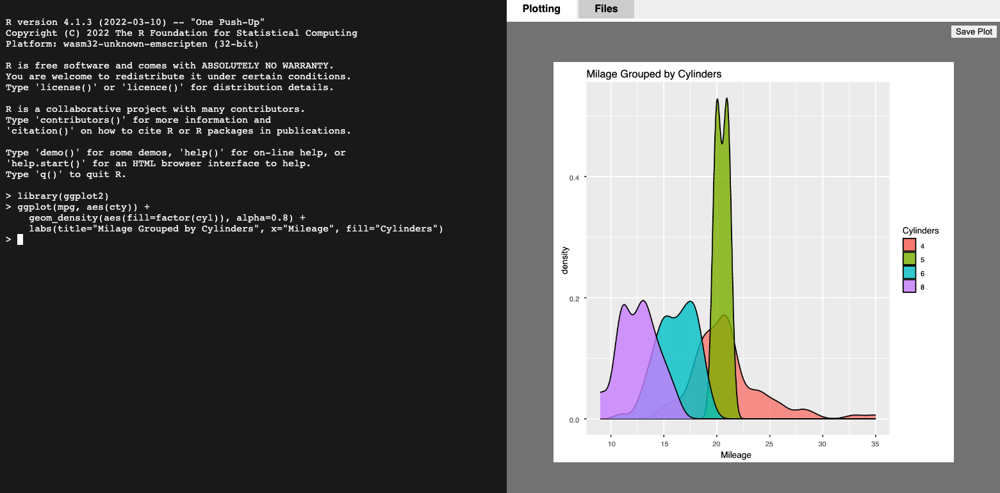
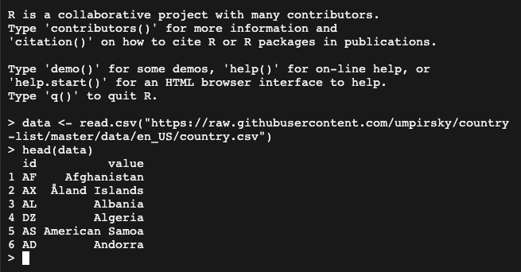
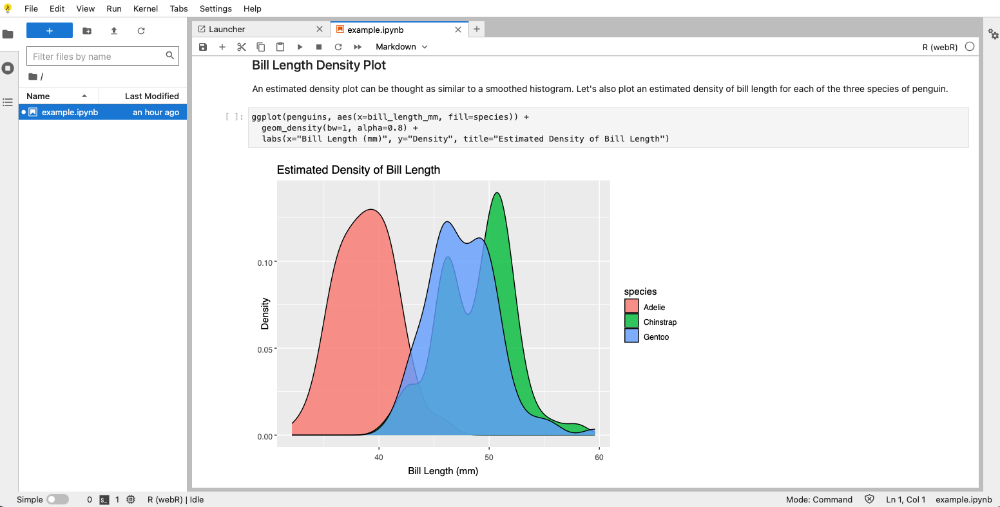

<!--
TODO:
* [X] Look over / edit the post's title in the yaml
* [X] Edit (or delete) the description; note this appears in the Twitter card
* [X] Pick category and tags (see existing with [`hugodown::tidy_show_meta()`](https://rdrr.io/pkg/hugodown/man/use_tidy_post.html))
* [X] Find photo & update yaml metadata
* [X] Create `thumbnail-sq.jpg`; height and width should be equal
* [X] Create `thumbnail-wd.jpg`; width should be >5x height
* [X] [`hugodown::use_tidy_thumbnails()`](https://rdrr.io/pkg/hugodown/man/use_tidy_post.html)
* [x] Add intro sentence, e.g. the standard tagline for the package
* [x] [`usethis::use_tidy_thanks()`](https://usethis.r-lib.org/reference/use_tidy_thanks.html)
* [x] Update temporary URLS to r-wasm.org
* [x] Check for evalR API changes
* [ ] Change r-wasm/jupyterlite-webr-kernel GitHub repo public
* [x] Update r-wasm/webR repo for AWS and r-wasm.org URLs
* [ ] Push npm update for r-wasm/webr package
* [ ] Update static service worker URLs
* [ ] Update webR shortcode URLs
* [ ] Update post date
-->
<!-- Initialise webR in the page -->

<!-- Add webr engine for knit -->

<div class="highlight">

</div>

<!-- Blog post main content -->

We're super excited to announce the release of webR v0.1.0! This is the first release of webR intended for general use by the web development and R communities and is the result of almost a year of hard work by the webR developers.

This post will introduce webR, demonstrate some of the possibilities that running R in a web browser brings, and give a quick overview of how to include webR in your own TypeScript or JavaScript web applications.

## Introduction

WebR is a version of the open-source R interpreter compiled for WebAssembly, along with a supporting TypeScript library for interacting with the console and R objects from a JavaScript environment.

By compiling R to WebAssembly a user can visit a website and run R code directly within the web browser, without R installed on their device or a supporting computational R server. All that is required is a normal web server, including the type of cloud hosting service provided by Github Pages or Netlify.

## How it works

WebR's core is based around compiling the open-source R interpreter for [WebAssembly](https://webassembly.org), using the [Emscripten](https://emscripten.org) compiler suite along with [LLVM Flang](https://flang.llvm.org/docs/) to work with R's pre-existing C and Fortran based source code.

WebAssembly (often abbreviated as Wasm) is a standard defining a virtual stack machine along with a corresponding *bytecode*. Efficient Wasm engines have already been implemented in most modern web browsers, which allows for the deployment of high performance Wasm applications on the web.

While it's certainly possible for an interested programmer to write Wasm bytecode by hand, it is not required to do so. Similar to how code and data is compiled into *machine code* for a certain computer processor, code and data can be compiled into the Wasm bytecode by compiler software that supports the Wasm standard.

However, unlike with traditional machine code, the Wasm virtual machine (VM) is consistent across multiple different types of environment, architecture, and device -- in theory the same bytecode binary can run anywhere without having to be recompiled for that environment. In this way the Wasm VM is similar to Java's JVM. However, in comparison to the JVM, Wasm has been designed and built from the ground up for use on the modern web, requiring strict sandboxing and security controls.

Future use for WebAssembly has also been identified in server-side web development, containerisation, cloud computing, and more. With these applications, Wasm has been suggested as a universal binary format of the future. Multiple implementations of the Wasm VM already exist designed to run *outside* a web browser, through proposed Wasm standards such as [WASI](https://wasi.dev).

## What's possible?

Undoubtedly, webR opens a world of possibilities for the interactive use of R and data science on the web.

### An online R console

A web-based interactive R console is included in the webR source repository as a demonstration of integrating webR into a wider web application. A publicly accessible instance of the webR console can be found at <https://webr.r-wasm.org/latest/>.

<a href="webr-repl.png" target="_blank"></a>

With the webR online console a new user can get up and running with R in seconds. The webR console is also functional on many modern mobile devices, where traditional versions of R are not always available for installation at all[^1].

It's possible to perform data analysis on reasonably large datasets by uploading data to a Virtual File System (VFS). The webR console provides an interface to view and interact with the VFS (**Files** tab, top right). Once a data file has been uploaded to the VFS it can be read by R like any standard file.

<a href="webr-repl2.png" target="_blank"></a>

Note that uploading and downloading files to the VFS in this way does not actually involve transferring any data over the network. However, webR has been built so that it is possible to load data into webR over the network by using R's built in functions that can download from URL, such as [`read.csv()`](https://rdrr.io/r/utils/read.table.html)[^2].

<a href="webr-repl3.png" target="_blank"></a>

Plotting is also supported (**Plotting** tab, top right), meaning a user can produce beautiful plot output with the webR console, closing the loop of reading data, performing analysis, and producing output. It is entirely feasible that a casual user could perform the basics of data science entirely within their web browser using webR.

### An educational tool

Consider the following code block containing some simple R code. After a short loading period while the webR binary and supporting files are downloaded, a **Run code** button is enabled on the code block, with the code itself able to be edited and remixed on the fly. Feel free to try this out now!

<div class="highlight">



</div>

After executing the R code once, try changing the `am` variable in the model to `gear` and then clicking **Run code** again. You should immediately see how changing the model affects the components of the resulting fit. There is a real R session running and powering this code block -- try replacing the entire code with something new!

The following interactive code block produces an R plot that is directly embedded into the page. As with the previous example, the plot can be recreated or remixed multiple times by the reader simply by clicking the **Run Code** button.

<div class="highlight">



</div>

In my experience this way of interacting and experimenting with R code without the mental overhead of context switching from a web browser to an R console, or copying and pasting lines of example code, feels extremely fresh and exciting. An exciting potential application for webR is providing high-quality educational web content in exactly this kind of format.

### Reproducible reports

A core principle of good science is that results should be repeatable and reproducible by others. Unfortunately the misuse of data analysis, leading to unreliable results, [is a known issue](https://en.wikipedia.org/wiki/Misuse_of_statistics).

The idea of a reproducible report is to bring the philosophy of repeatability to the delivery format itself. Reproducible reports weave together explanatory prose, data science, source code, output and figures; all in a single place with a consistent execution environment. With this, a user reading the report has everything they need to reproduce and confirm results for themselves.

While Jupyter notebooks were not the first implementation of executable documents[^3], their popularity has grown over the last decade or so as a way to support high quality reproducible reports. Jupyter has been named [*"The data scientists' computational notebook of choice"*](https://www.nature.com/articles/d41586-018-07196-1) and almost 10 million Jupyter notebooks were publicly accessible on GitHub as of Oct 2020[^4].

While a Jupyter notebook usually requires a Python and Jupyter installation to fully reproduce results, recent work by the [JupyterLite](https://jupyterlite.readthedocs.io/en/latest/) team uses Wasm to bring Jupyter to the web browser. JupyterLite can be used with [Pyodide](https://pyodide.org/en/stable/) to run Python based notebooks directly in the browser.

WebR aims to provide that same experience for Jupyter notebooks based on R. As part of the initial release of webR, we are also releasing a [webR kernel for JupyterLite](https://github.com/r-wasm/jupyterlite-webr-kernel), allowing users to write and execute reproducible Jupyter notebooks for R directly in the web browser.

A JupyterLite instance with the webR kernel available can be found at <https://jupyter.r-wasm.org/>, along with a sample R Jupyter notebook demonstrating a reproducible report.

<a href="jupyter.png" target="_blank"></a>

The JupyterLite kernel for R is still in the early stages of development and [includes some limitations](https://github.com/r-wasm/jupyterlite-webr-kernel#limitations), but the core infrastructure is in place with the release of webR.

### R packages

R has a rich history of user-created extensions through the use of R packages. Most packages are a combination of R and C or C++ code, and so many packages must be compiled from source for the system they are running on. Unfortunately, it is not possible to install packages in this way in webR. Such an installation process would require an entire C/C++ to WebAssembly compiler toolchain running in the web page!

For the moment, downloading pre-compiled Wasm binaries is the only supported way to install packages in webR. A pre-installed `webr` support package provides a helper function <code>webr::install()</code> which can be used to install packages from a CRAN-like repository. As part of the webR release we have provided a small repository of binary R packages compiled for Wasm, publicly hosted with URL `https://repo.r-wasm.org/`.

## Using webR in your own projects

WebR aims to be as quick and easy to use as possible for those familiar with JavaScript web development. While a short introduction to using webR follows in this blog post, we think the best way to get up and running is by reading the Getting Started section of the [webR documentation](https://docs.r-wasm.org/webr/latest/). The documentation goes into further detail about how to download webR, technical requirements for serving web pages that use webR, and provides more detailed examples.

### Downloading and using webR from npm

For a project with dependencies managed by npm, the [webR JavaScript package](https://www.npmjs.com/package/@r-wasm/webr) can be installed by using the command,

``` bash
npm i @r-wasm/webr
```

Once available, webR can be imported into a project and a new instance of webR initialised with,

``` javascript
import { WebR } from '@r-wasm/webr';

const webR = new WebR();
await webR.init();
```

Once a new instance of the `WebR()` class has been created, webR will begin to download WebAssembly binaries from the public CDN, and R will be started.

### Downloading webR release packages

Full release packages for webR can also be downloaded from the webR [GitHub Releases](https://github.com/r-wasm/webR/releases) page. The full release packages include the webR JavaScript loader, along with WebAssembly binaries for R and its supporting libraries.

Hosting a full release package on a web server makes it possible to use webR entirely on your own infrastructure, rather than relying on downloading Wasm binaries from the public CDN.

### An example of executing R code

Once R is ready the JavaScript promise returned by `webR.init()` will resolve. At this point R code can be evaluated and results converted into JavaScript objects,

``` javascript
let result = await webR.evalR('rnorm(10,5,1)');
let output = await result.toArray();
console.log(output);
```

In the above example the `result` object can be thought of as a reference to a specific R object, and is converted into a standard JavaScript array using the `toArray()` function.

Further examples and details of how to interact with the R console and work with R objects can be found in the [webR documentation](https://docs.r-wasm.org/webr/latest/examples.html).

## The future of webR

Going forward we plan to expand and improve webR, including compiling more R packages for the webR public package repository. It is our hope that we can provide the same web-based computational infrastructure for R that [Pyodide](https://pyodide.org/en/stable/) has provided for the Python ecosystem.

While WebAssembly engines are in theory able to provide near-native performance, when it comes to the requirements for advanced data science or the deployment of sophisticated machine learning models, the benefits of running tools such as the RStudio IDE natively or a high-performance cloud deployment will likely always outperform the relatively restricted WebAssembly virtual machine. Despite this, webR can provide a smooth, interactive and immediate introduction to the world of working with data in R. Users who have not had the chance to use R in the past due to the barriers raised by the installation of new software to their workstation, or registration for a cloud-based service, might yet still be convinced to introduce R to their workflow though an introduction with interactive examples or short reports powered by webR.

Fairly recently, the Shiny team announced [Shiny for Python](https://shiny.rstudio.com/py/), a feature rich reactive web application framework targeting Python. Of particular note, the team used WebAssembly and Pyodide as a way to run a [Shinylive](https://shiny.rstudio.com/py/docs/shinylive.html) server directly in the user's web browser. One of the most exciting possible applications for webR is a similar architecture targeting the traditional R version of Shiny. Is it possible for a *Shinylive for R* to be powered by webR? We certainly hope so.

## Acknowledgements

A massive thank you to all early webR users for their willingness to experiment and their feedback in the form of GitHub issues and pull requests,

[@Anurodhyadav](https://github.com/Anurodhyadav), [@barryrowlingson](https://github.com/barryrowlingson), [@christianp](https://github.com/christianp), [@ekianjo](https://github.com/ekianjo), [@georgestagg](https://github.com/georgestagg), [@HTUser-1](https://github.com/HTUser-1), [@jason-variadiclabs](https://github.com/jason-variadiclabs), [@jjesusfilho](https://github.com/jjesusfilho), [@kdpsingh](https://github.com/kdpsingh), [@lionel-](https://github.com/lionel-), [@psychemedia](https://github.com/psychemedia), [@Sjesc](https://github.com/Sjesc), [@SugarRayLua](https://github.com/SugarRayLua) [@unclecode](https://github.com/unclecode), and [@wch](https://github.com/wch).

[^1]: I am aware of at least one early adopter using webR as a way to access R on their Apple iPad.

[^2]: Note that there are some security measures in place when fetching data that are applied to all web applications. Downloading datasets from URL requires that the web server providing the data supports and allows [Cross Origin Resource Sharing (CORS)](https://developer.mozilla.org/en-US/docs/Web/HTTP/CORS)

[^3]: Knuth originally introduced the precursor [Literate Programming](https://en.wikipedia.org/wiki/Literate_programming) paradigm in 1984, and more recently tools such as Sweave, knitr and RMarkdown enable embedding R and computational results directly into a report.

[^4]: Admittedly, only a small proportion using an R kernel. [The overwhelming majority use Python, R comes second, and Julia third.](https://blog.jetbrains.com/datalore/2020/12/17/we-downloaded-10-000-000-jupyter-notebooks-from-github-this-is-what-we-learned/)

