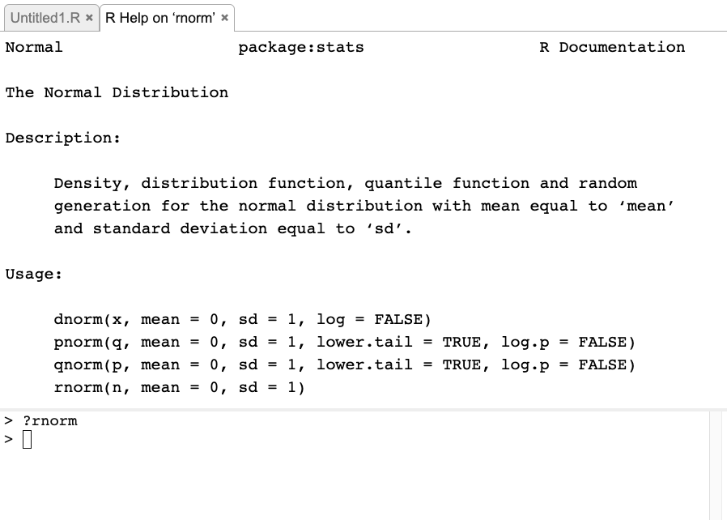
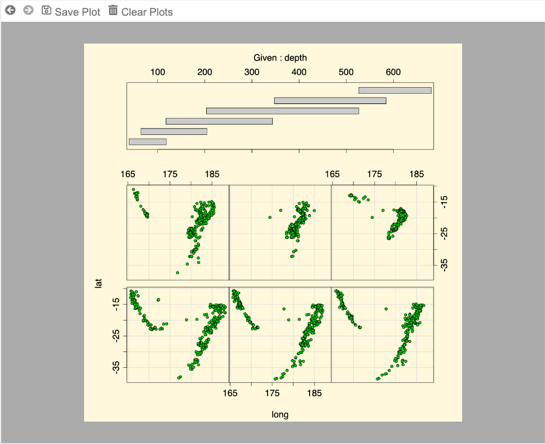
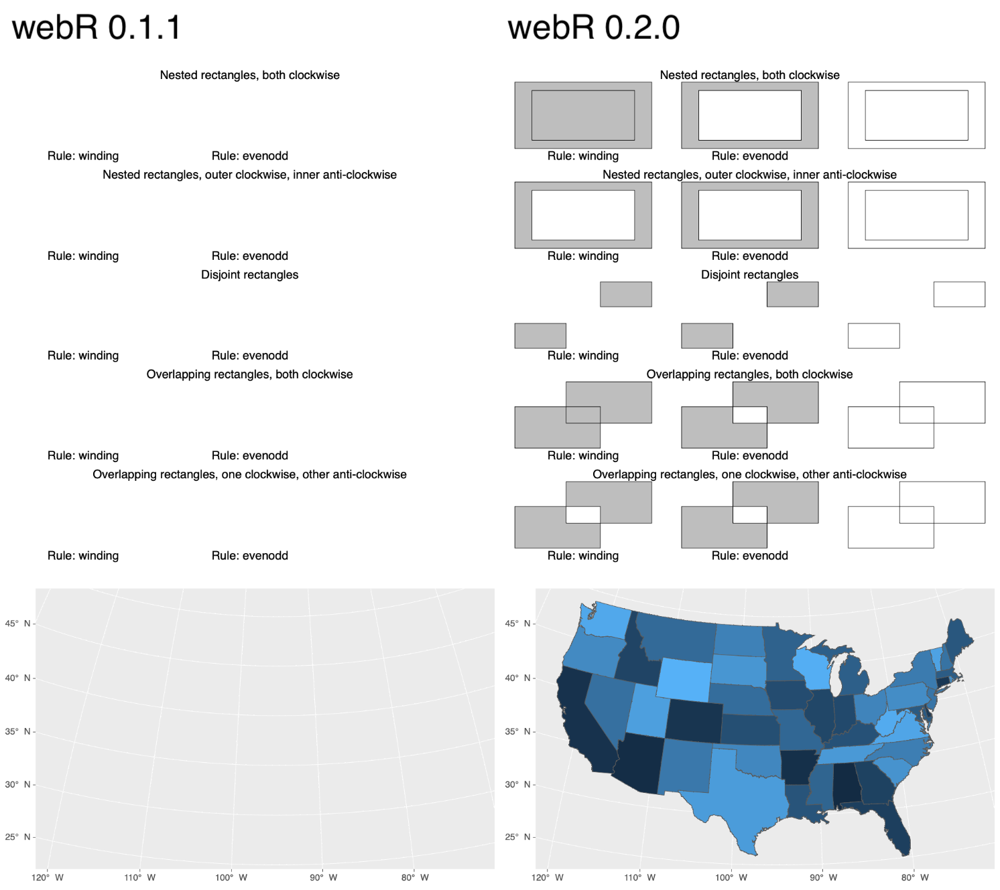
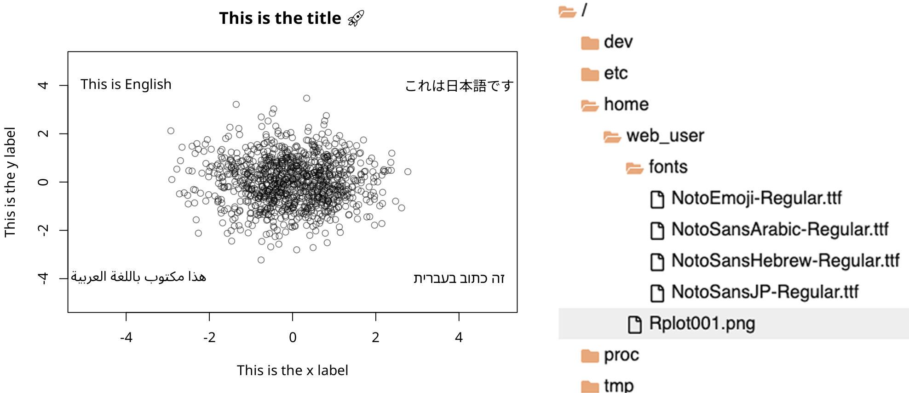
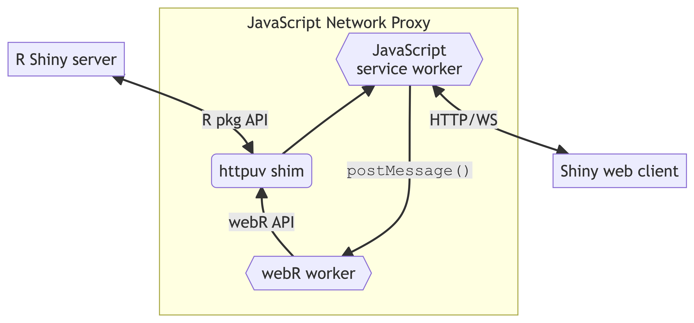

```{=html}
<!--
TODO:
* [x] Look over / edit the post's title in the yaml
* [x] Edit (or delete) the description; note this appears in the Twitter card
* [x] Pick category and tags (see existing with `hugodown::tidy_show_meta()`)
* [x] Find photo & update yaml metadata
* [x] Create `thumbnail-sq.jpg`; height and width should be equal
* [x] Create `thumbnail-wd.jpg`; width should be >5x height
* [x] `hugodown::use_tidy_thumbnails()`
* [x] Add intro sentence, e.g. the standard tagline for the package
* [x] `usethis::use_tidy_thanks()`
* [x] Release webR 0.2.0
* [] Update all links from /0.2.0-rc.1 to /0.2.0
* [x] Update webr-repo packages
* [x] Update webr-repo dashboard
-->
```
<!-- Initialise webR in the page -->

`r hugodown::shortcode("webr-init")`

<!-- Add webr engine for knit -->

```{r, echo=FALSE}
knitr::knit_engines$set(webr = function(options) {
  code <- paste(options$code, collapse = "\n")
  w <- knitr::opts_current$get('fig.width') * 72
  h <- knitr::opts_current$get('fig.height') * 72
  hugodown::shortcode("webr-editor", code = I(encodeString(code, quote = '`')), width = w, height = h)
})
```

We're absolutely thrilled to announce the release of [webR](https://docs.r-wasm.org/webr/v0.2.0/) 0.2.0! This release gathers together many updates and improvements to webR over the last few months, including improvements to the HTML canvas graphics device, support for Cairo-based bitmap graphics, accessibility and internationalisation improvements, additional Wasm R package support (including Shiny), a new webR REPL app, and various updates to the webR developer API.

This blog post will take a deep dive through the major breaking changes and new features available in webR 0.2.0. I also plan to record and release a series of companion videos discussing the new release, so keep an eye out if you're someone who prefers watching and listening over reading long-form articles. I'll update this post with all the links once they're available.

## WebAssembly and webR

My previous [webR release blog post](https://www.tidyverse.org/blog/2023/03/webr-0-1-0/) goes into detail about what WebAssembly is, why people are excited about it, and how it relates to the R community and ecosystem in general through webR. I would recommend it as a good place to start, if the project is new to you[^1].

[^1]: In addition, [Danielle Navarro's webR blog post](https://blog.djnavarro.net/posts/2023-04-09_webr/) is very good and Bob Rudis's [webR experiments](https://rud.is/webr-experiments/) are well worth exploring, along with his recent [NY R conference talk](https://youtu.be/inpwcTUmBDY).

A short explanation is that WebAssembly (also known as Wasm) allows software that's normally compiled for a specific computer system to instead run anywhere, including in web browsers. Wasm is the technology that powers [Pyodide](https://pyodide.org) (used by [Shinylive for Python](https://shiny.rstudio.com/py/docs/shinylive.html)) and webR brings this technology to the R world. Using webR it is possible to run R code directly in a web browser[^2], without the need for the traditional supporting R server to execute the code.

[^2]: Also other JavaScript/Wasm environments, such as Node.js. For example, [ROpenSci's r-universe](https://ropensci.org/r-universe/) package platform provides download links for datasets contained in R packages, in a variety of formats, [powered by running webR server-side in Node.js](https://fosstodon.org/@jeroenooms/110299179903212170).

Running R code directly in a browser opens the door for many new and exciting uses for R on the web. Applications that I'm personally excited in seeing developed are,

-   Live and interactive R code and graphics in documents & presentations,
-   Tactile educational content for R, with examples that can be remixed on-the-fly by learners,
-   Reproducible statistics through containerisation and notebook-style literate programming.

Even in these early days, some of this is already being provided by development of downstream projects such as James Balamuta's [quarto-webr](https://github.com/coatless/quarto-webr) extension, allowing Quarto users to easily embed interactive R code blocks in their documents.

### Interactive code blocks

One of my favourite demonstrations of what webR can do is interactive code blocks for R code. After a short loading period while the webR binary is downloaded, a **Run code** button will be enabled below. Using examples like this, R code can be immediately edited and executed -- feel free to experiment! Click the "Run code" button to see the resulting box plot, change the colour from `mediumseagreen` to `red` and run the code again.

```{webr}
colnames(mtcars)

boxplot(
  mpg ~ cyl, data = mtcars,
  col = "mediumseagreen",
  xlab = "Number of Cylinders",
  ylab = "Miles/(US) gallon",
  main = "Motor Trend Car Road Tests",
  sub = "Source: 1974 Motor Trend US magazine"
)
```

It's easy to see the potential teaching benefit examples like this could bring to educational content or R package documentation.

## The webR REPL app

WebR can be loaded into a web page to be used as a part of a wider web application, and ships with a demo application that does just that. The webR REPL app[^3] provides a simple R environment directly in your web browser. The app can be accessed at <https://webr.r-wasm.org/v0.2.0/> and includes sections for R console input/output, code editing, file management, and graphics device output. 

[^3]: REPL stands for "Read, Eval, Print, Loop", and is another name for the R console that you're probably familiar with. The application is named the "webR REPL app" because the original version simply provided the user with a fullscreen R console in their web browser.

With the webR REPL app, a casual user could get up and running with R in seconds, without having to install any software on their machine. It is entirely feasible that they could perform the basics of data science entirely within their web browser!

Other than interactive code blocks, like in the example earlier, the webR REPL app is perhaps the first thing that users new to webR will interact with. For this reason, we have spent some time working to improve the technical implementation and user experience of using the app. The app has been completely rewritten in the React web framework, replacing the older jQuery library. This allows for better component code organisation and more rapid development of features and updates.

<a href="repl.png"></a>

### Code editor

The app now comes with a tabbed code editor, allowing for easier editing and execution of R code. The editor integrates with the webR virtual filesystem (VFS), meaning that multiple R scripts can be opened, edited, and saved and they will be available to the running Wasm R process.

The editor pane is built upon the excellent [CodeMirror](https://codemirror.net) text editor, which provides most of the component's functionality. CodeMirror provides built-in support for syntax highlighting of R code, which is enabled by default when R source files are displayed.

The editor is integrated with the currently running R process and automatic code suggestions are shown as you type, provided by R's [built in completion generator](https://stat.ethz.ch/R-manual/R-devel/library/utils/html/rcompgen.html). The suggestions are context sensitive and are aware of package and function names, valid arguments, and even objects that exist in the global environment.

<a href="completion.png"></a>

The running Wasm R process is also configured at initialisation to use the editor component as its display [pager mechanism](https://stat.ethz.ch/R-manual/R-devel/library/base/html/file.show.html). With this configuration in place running commands such as `?rnorm` in the app automatically opens a new read-only tab in the editor displaying R's built-in documentation.

<a href="documentation.png"></a>

### Plotting pane

The plotting pane has been updated to take advantage of improvements in webR's HTML canvas graphics device, set as the default device as part of initialisation. In particular, multiple plots are now supported and older plots can be directly accessed using the previous and next buttons in the plotting toolbar. You can try this out with R's built in graphics demo, by running `demo(graphics)` and/or `demo(persp)`.

<a href="plotting.png"></a>

### Files pane

The files pane has been completely redesigned, removing its dependency on jQuery and instead making use of the [react-accessible-treeview](https://www.npmjs.com/package/react-accessible-treeview) package. As well as a technical improvement, this change means that interacting with the webR filesystem should be more usable to those with web accessibility requirements. We feel it's important that, where possible, everybody is able to use our software.

<a href="files.png"></a>

Additional buttons have also been added to this pane, allowing users to easily manipulate the virtual file system visible to the running Wasm R process. New files and directories can be created or deleted, and text-based files can be directly opened and modified in the editor pane, removing the need to download, edit and then re-upload files.

### Console pane

The R console component shown in the lower left portion of the app is powered by the wonderful [xterm.js](https://xtermjs.org) software, which provides a high performance terminal emulator on the web. R output looks at its best when running in this kind of environment, so that [ANSI escape codes](https://en.wikipedia.org/wiki/ANSI_escape_code) can be used to provide a much smoother console experience incorporating cursor placement, box drawing characters, bold text, terminal colours, and more.

<a href="term.png"></a>

An optional accessibility mode is provided by xterm.js so that terminal output is readable by screen reader software, such as [macOS's VoiceOver](https://support.apple.com/en-gb/guide/voiceover/welcome/mac). The webR REPL app now enables this mode by default to improve the accessibility of terminal output.

## HTML Canvas graphics device

The webR support package provides a custom [`webr::canvas()`](https://docs.r-wasm.org/webr/latest/api/r.html#graphics-device-for-drawing-to-a-html-canvas-element) graphics device that renders output using the [Web Canvas API](https://developer.mozilla.org/en-US/docs/Web/API/Canvas_API). When the graphics device is used, drawing commands from R are translated into Canvas API calls. The browser renders the graphics and the resulting image data is drawn to a HTML `<canvas>` element on the page.

With the release of webR 0.2.0, we have improved the performance and added new features to the HTML canvas graphics device.

### Performance improvements with `OffscreenCanvas`

Using the Canvas API to draw graphics in a browser is elegant, but presents a problem. R is running via WebAssembly in a JavaScript [Web Worker](https://developer.mozilla.org/en-US/docs/Web/API/Web_Workers_API/Using_web_workers) thread, but the `<canvas>` element the plot image data is written to is on the main thread, part of the web page [DOM](https://developer.mozilla.org/en-US/docs/Web/API/Document_Object_Model/Introduction). And, unfortunately, JavaScript Web Worker threads have no direct access to the DOM.

Previous releases of webR solve this problem in a rather naive way, it simply sends the Canvas API calls to the main thread to be executed there. This leads to a few issues,

-   Canvas API calls are serialised as text to be sent to the main thread. Sufficiently complex plot text must therefore be quoted and escaped.

-   Each API call is sent in a separate message. For a complex plot this can be thousands of messages to dispatch and handle.

-   The messaging is one-way, results of useful methods like [`measureText()`](https://developer.mozilla.org/en-US/docs/Web/API/CanvasRenderingContext2D/measureText) cannot easily be retrieved.

-   Parsing and executing the API call on the main thread means using JavaScript's [`eval()`](https://developer.mozilla.org/en-US/docs/Web/JavaScript/Reference/Global_Objects/eval) or [`Function()`](https://developer.mozilla.org/en-US/docs/Web/JavaScript/Reference/Global_Objects/Function), leading to poor performance. These functions should also be avoided when possible in any case, for security reasons.

Solid engineering efforts could be made to improve the situation, e.g. through batching API calls and better encoding, but there is a better way: the [`OffscreenCanvas`](https://developer.mozilla.org/en-US/docs/Web/API/OffscreenCanvas) interface. `OffscreenCanvas` is designed to solve this exact problem of rendering graphics off-screen, such as in a worker thread. With `OffscreenCanvas` the Canvas API calls can all be executed on the worker thread, and only a single message containing the completed image data transferred to the main thread when rendering is complete. It is an efficient and technically satisfying solution, except that when webR 0.1.1 was released `OffscreenCanvas` wasn't supported by the Safari web browser.

Today, on the other hand, `OffscreenCanvas` is [supported](https://developer.mozilla.org/en-US/docs/Web/API/OffscreenCanvas#browser_compatibility) in all major desktop and mobile browsers. Safari has supported it since version 16.4, and so with webR 0.2.0 we have rewritten the [`webr::canvas()`](https://docs.r-wasm.org/webr/latest/api/r.html#graphics-device-for-drawing-to-a-html-canvas-element) graphics device to take full advantage of the `OffscreenCanvas` interface. This has led to a significant performance improvement, particularly when creating plots containing many points. The two videos below show the same plot rendered in webR 0.1.1 and 0.2.0, the difference is not just visible, but an order of magnitude faster.

<video controls loop width="100%" src="plot.mp4" style="border: 2px solid #CCC;">

<source src="plot.mp4">

</video>

::: {style="text-align: center; font-weight: bold;"}
A performance comparison plotting 300000 points in webR 0.1.1 and 0.2.0.
:::

A potential downside is that users of less up-to-date browsers without `OffscreenCanvas` support won't be able to use the [`webr::canvas()`](https://docs.r-wasm.org/webr/latest/api/r.html#graphics-device-for-drawing-to-a-html-canvas-element) graphics device. Such users should instead make use of our additional updates to webR to support the traditional Cairo-based bitmap devices. The [built-in graphics devices section](#built-in-bitmap-graphics-devices) discusses that in more detail.

### Modern text rendering and internationalisation

With webR 0.1.1, the canvas graphics device had only minimal support for rendering text. The typeface was fixed, the font metrics were estimated with a heuristic, and Unicode characters outside the Basic Latin block often failed to render. It worked most of the time, but it was far from ideal. This area of software engineering is [suprisingly difficult](https://faultlore.com/blah/text-hates-you/) to get right, and even native installations of R can have [serious text rendering issues](https://www.tidyverse.org/blog/2021/02/modern-text-features/).

In comparison, web browser support for text rendering is excellent. Now that we use the `OffscreenCanvas` interface, we too can take advantage of the years of work behind browser's support for text on the web. The example below demonstrates several of the modern text rendering features now supported by [`webr::canvas()`](https://docs.r-wasm.org/webr/latest/api/r.html#graphics-device-for-drawing-to-a-html-canvas-element).

```{webr}
plot(
  rnorm(1000), rnorm(1000),
  col = rgb(0, 0, 0, 0.5),
  xlim = c(-5, 5), ylim = c(-5, 5),
  main = "This is the title 🚀",
  xlab = "This is the x label",
  ylab = "This is the y label",
  family = "Futura"
)
text(-3.5, 4, "This is English", family = "monospace")
text(-3.5, -4, "هذا مكتوب باللغة العربية")
text(3.5, 4, "これは日本語です")
text(3.5, -4, "זה כתוב בעברית")
```

Any system font available to the web browser can now be used[^5]. As well as a nice-to-have, this also provides improved accessibility. For example, there are fonts designed specifically for use by readers with dyslexia and other similar reading barriers[^6] that could be used for drawing text in plots.

[^5]: This also includes the world of CSS web fonts, but it is a little tricky. [Extra work](https://stackoverflow.com/a/53808942) must be done so that the font is available to the Web Worker. Probably this can be handled better in a future release of [`webr::canvas()`](https://docs.r-wasm.org/webr/latest/api/r.html#graphics-device-for-drawing-to-a-html-canvas-element).

[^6]: [Dyslexie](https://www.dyslexiefont.com), [Open Dyslexic](https://opendyslexic.org). Results of research in this area is mixed, but even if these fonts don't improve the speed of text comprehension, some users may simply prefer or feel more comfortable with them.

Font metrics are now exact, using [`measureText()`](https://developer.mozilla.org/en-US/docs/Web/API/CanvasRenderingContext2D/measureText), rather than estimating the width and height of Latin glyphs using heuristics. This gives more accurate positioning of rendered text and improves the general quality of resulting plots.

Support for Unicode, font glyph fallback, complex ligatures, and right-to-left (RTL) text have all been improved. This vastly improves results when rendering text for international users, particularly for non-Latin RTL scripts such as the Arabic and Hebrew text in the example above.

Also, colour emoji can now be added to plots. 😃

### Paths and winding rules

Additional support for the drawing and filling of paths and polygons, including with different [winding rules](https://oreillymedia.github.io/Using_SVG/extras/ch06-fill-rule.html), has been added to the webR canvas graphics device. An area where this new functionality makes a world of difference is plotting spatial features and maps. Previously broken R code for plotting maps with the `ggplot2` and `sf` packages now works well with webR 0.2.0.

<a href="paths.png"></a>

### Output messages from the canvas graphics device

As a result of the changes to the HTML canvas graphics device, the structure of output messages communicated to the main thread has been redesigned. This is a breaking change and existing webR applications will need to be updated to listen for the new output messaging format.

[A Plotting section](https://docs.r-wasm.org/webr/latest/plotting.html) has been added to the webR documentation describing how plotting works with the [`webr::canvas()`](https://docs.r-wasm.org/webr/latest/api/r.html#graphics-device-for-drawing-to-a-html-canvas-element) device, and how to handle the output messages in your own web applications.

A `'canvas'` type output message with an `event` property of `'canvasNewPage'` indicates the start of a new plot,

``` typescript
{ type: 'canvas', data: { event: 'canvasNewPage' } }
```

An output message with an `event` property of `'canvasImage'` indicates that there is some graphics data ready to be drawn,

``` typescript
{ type: 'canvas', data: { event: 'canvasImage', image: ImageBitmap } }
```

The `image` property in the message data contains a JavaScript [`ImageBitmap`](https://developer.mozilla.org/en-US/docs/Web/API/ImageBitmap) object. This can be drawn to a HTML `<canvas>` element using the [`drawImage()`](https://developer.mozilla.org/en-US/docs/Web/API/CanvasRenderingContext2D/drawImage) method.

## Built-in bitmap graphics devices {#built-in-bitmap-graphics-devices}

Not all environments where webR could be running support plotting to a HTML `<canvas>` element. Older browsers may not support the required `OffscreenCanvas` interface, webR might be running server-side in Node.js, or webR might be running more traditional R code or packages that are unaware of the [`webr::canvas()`](https://docs.r-wasm.org/webr/latest/api/r.html#graphics-device-for-drawing-to-a-html-canvas-element) graphics device.

For supporting these use cases, with webR 0.2.0 the built-in bitmap graphics devices are now able to be used, writing their output to the webR VFS. This includes the `png()`, `bmp()`, `jpeg()`, `tiff()` devices, and potentially others implemented using the Cairo graphics library.

In the example below, webR is loaded into a JavaScript environment and plotting is done using the built-in `png()` graphics device. The resulting image is written to the virtual filesystem and its contents can then be obtained using webR's [`FS`](https://docs.r-wasm.org/webr/latest/api/js/classes/WebR.WebR.html#fs) interface, designed to be similar to [Emscripten's filesystem API](https://emscripten.org/docs/api_reference/Filesystem-API.html).

``` typescript
import { WebR } from 'webr';

const webR = new WebR();
await webR.init();

await webR.evalRVoid(`
  png('/tmp/Rplot.png', width = 800, height = 800, res = 144)
  hist(rnorm(1000))
  dev.off()
`);

const plotImageData = await webR.FS.readFile('/tmp/Rplot.png');
```

The image data is contained in the `plotImageData` variable as a JavaScript [`UInt8Array`](https://developer.mozilla.org/en-US/docs/Web/JavaScript/Reference/Global_Objects/Uint8Array). Once obtained from the VFS, the image can be served to the end user as a [`Blob`](https://developer.mozilla.org/en-US/docs/Web/API/Blob) file download, displayed on a web page, or if running webR server-side returned over the network.

### Text rendering and font support

As with the [`webr::canvas()`](https://docs.r-wasm.org/webr/latest/api/r.html#graphics-device-for-drawing-to-a-html-canvas-element) improvements described in the previous section, we feel it is important that the built in R graphics devices provides a high level of support for text rendering in webR. Here, however, the approach is different. The built-in graphics devices renders image data entirely within the WebAssembly environment, so we can no longer rely on the web browser for high quality text!

The built-in graphics devices are powered by the Cairo graphics library, which can now optionally be compiled for Wasm as part of the webR build process. In addition, when enabled various other libraries are compiled for Wasm to improve the quality of text rendering in Cairo,

-   [pango](https://pango.gnome.org)
-   [fribidi](http://fribidi.org)
-   [harfbuzz](https://harfbuzz.github.io)
-   [freetype](https://freetype.org)
-   [fontconfig](https://www.freedesktop.org/wiki/Software/fontconfig/)

Public releases of webR distributed via GitHub and CDN will be built with these libraries all enabled and included.

#### Font files on the VFS

When plotting with the built-in bitmap graphics devices, fonts must be accessible to the Cairo library through the webR VFS. A minimal selection of [Google's Noto fonts](https://fonts.google.com/noto) are bundled with webR when Cairo graphics is enabled.

The fontconfig library is also configured to search the VFS directory `/home/web_user/fonts` for additional fonts. Users who wish to use custom fonts, or alternative writing systems, may do so by uploading font files to this directory. In the case of international scripts or non-Latin Unicode such as emoji, fontconfig will automatically use font fallback to select reasonable fonts containing the required glyphs.

``` r
png(width = 1200, height = 800, res = 180)
plot(
  rnorm(1000), rnorm(1000),
  col = rgb(0, 0, 0, 0.5),
  xlim = c(-5, 5), ylim = c(-5, 5),
  main = "This is the title 🚀",
  xlab = "This is the x label",
  ylab = "This is the y label"
)
text(-3.5, 4, "This is English")
text(-3.5, -4, "هذا مكتوب باللغة العربية")
text(3.5, 4, "これは日本語です")
text(3.5, -4, "זה כתוב בעברית")
dev.off()
```

This is essentially the same example as in the previous section, demonstrating a selection of advanced font functionality. In this example we are rendering a PNG file using the built-in `png()` graphics device. We can see that by uploading appropriate fonts to the VFS, the same set of advanced text rendering features that are provided by the browser can also be used with R's built-in bitmap graphics devices.

<a href="textplot.png"></a>

## Lazy virtual filesystem

All of the additional features I've written about so far come with a price: increased Wasm binary and data download size. Consider the fonts in the previous section - each font file bundled with webR is going to increase the total size of the default webR filesystem by around 500KB.

This is a high price to pay in time and bandwidth when not every user is going to need every feature. A similar principle also applies to other files included with R by default. It's nice that all the default R documentation, examples, and datasets are available on the VFS, but we don't necessarily need those files downloaded every time to every client machine.

With webR 0.2.0 a "lazy" virtual filesystem mechanism, powered by [a feature of Emscripten's FS API](https://emscripten.org/docs/porting/files/Synchronous-Virtual-XHR-Backed-File-System-Usage.html), is introduced. With this, only the files required to launch R and use the default packages are downloaded at initialisation time. Additional files provided on the VFS are still available for use, but they are only downloaded from the remote server when they are requested in some way by the running Wasm R process.

With the introduction of the lazy virtual filesystem, along with other efficiency improvements, the initial download size for webR is now much smaller, a great improvement.

| Component                       | 0.1.1 | 0.2.0 | (% of previous) |
|---------------------------------|--------|--------|-----------------|
| `R.bin.data`                    | 25.3MB | 5.2MB  | 20.6%           |
| `R.bin.wasm`                    | 12.8MB | 1.7MB  | 7.5%            |
| **Total for the webR REPL app** | 40.2MB | 9.5MB  | 23.6%           |

## R packages

Since initial release, webR has supported loading R packages by first installing them to the Emscripten VFS using the helper function [`webr::install()`](https://docs.r-wasm.org/webr/latest/api/r.html#install-one-or-more-packages-from-a-webr-binary-package-repo) or by manually placing R packages in the VFS at `/usr/lib/R/library`. We find that pure R packages usually work well, but R packages with underlying C (or Fortran, or otherwise...) code must be compiled from source for Wasm.

We host a public CRAN-like R package repository containing packages built for Wasm in this way, so that there exists a subset of useful and supported R packages that can be used with webR. The public repository is hosted at <https://repo.r-wasm.org> and this repo URL is used by default when running [`webr::install()`](https://docs.r-wasm.org/webr/latest/api/r.html#install-one-or-more-packages-from-a-webr-binary-package-repo) to install a Wasm R package.

It remains the case that building custom R packages for Wasm is not well documented, but we do hope to improve the situation over time as our package build infrastructure develops and matures. In the future, we plan to provide a Wasm R package build system as a set of Docker containers, so that users are able to build their own packages for webR using a container environment.

### WebAssembly system libraries for R packages

Many R packages require linking with system libraries to build and run. When building such R packages for WebAssembly, not only does the package code require compiling for Wasm, but also any system libraries that code depends on.

To expand support for R packages, webR 0.2.0 ships with [additional recipes](https://github.com/r-wasm/webr/tree/main/libs/recipes) to build system libraries from source for Wasm. The libraries consist of a selection of utility, database, graphics, text rendering, geometry, and geospatial support packages, with specific libraries chosen for their possibility to be compiled for Wasm as well as the number of R packages relying on them. I expect that the number of system libraries supported will continue to grow over time as we attempt to build more R packages for Wasm.

As of webR 0.1.1, **219** packages were available to install through our public Wasm R package repo. With the release of webR 0.2.0 and its additional system libraries, the number of available packages is now **10324** (approximately 51% of CRAN packages). Though, it should be noted that these packages have not been tested in detail. Here, "available" just means that the Emscripten compiler successfully built the R package for Wasm, along with its prerequisite packages.

### Public Wasm R packages dashboard

While available R packages can be listed using `available.packages()` with our CRAN-like Wasm R package repo, it's not the smoothest experience for users simply wanting to check if a given package is available. A dashboard has been added to the [repo index page](https://repo.r-wasm.org) which lists the available packages compiled for Wasm in an interactive table. The table also lists package dependencies, noting which prerequisite packages, if any, are still missing.

<a href="repo.png"></a>

It might be interesting to note that this dashboard itself is running under webR, through a fully client-side Shiny app.

## Running httpuv & Shiny under webR

Using features new to webR 0.2.0, a [httpuv webR package shim](https://github.com/r-wasm/httpuv) has been created that provides the functionality usually provided by the [httpuv](https://cran.r-project.org/web/packages/httpuv/index.html) R package. The package enables R to handle HTTP and WebSocket traffic, and is a prerequisite for the R Shiny package.

The shim works by taking advantage of the [JavaScript Service Worker API](https://developer.mozilla.org/en-US/docs/Web/API/Service_Worker_API). Normally Service Workers are used to implement fast offline caching of web content, but they can also be used as a general network proxy. The httpuv shim makes use of a Service Worker to intercept network traffic from a running Shiny web client, and forward that traffic to be handled by an instance of webR.

From the Shiny server's point of view, it is communicating with the usual httpuv package using its R API. From the point of view of the Shiny web client, it is talking to a Shiny server over the network. Between the two, the JavaScript Service Worker and webR work together to act as a network proxy and handle the traffic entirely within the client[^7].

[^7]: [Shinylive for Python](https://shiny.posit.co/py/docs/shinylive.html) also uses a JavaScript Service Worker scheme to serve fully client-side apps.

<a href="httpuv.png"></a>

The httpuv shim package is still in the experimental stage, but it is currently available for testing and is included in our public webR package repository.

### An example shiny app

<a href="shiny.png"></a>

An example Shiny app, making use of the httpuv shim and running fully client-side, is available at <https://shiny-standalone-webr-demo.netlify.app>.

Once the app has loaded in your browser, it's possible to confirm that the app is running entirely client-side by observing the Shiny server trace output at the bottom of the screen. You should even be able to disconnect completely from the internet and continue to use the app offline.

The source code for the demo, which includes some information describing how to set up a webR Shiny server in this way, can be found at <a href="https://github.com/georgestagg/shiny-standalone-webr-demo">georgestagg/shiny-standalone-webr-demo</a>. Note that this repository is targeted towards advanced web developers with prior experience of development with JavaScript Web Workers. It is intended as a demonstration of the technology, rather than a tutorial.

A coming-soon version of Shinylive for R will provide a much better user experience for getting fully client-side R Shiny apps up and running, without requiring advanced knowledge of JavaScript's Worker API. I believe Shinylive with webR integration will pave the way for providing a user-friendly method to build and deploy containerised R Shiny apps, running on WebAssembly.

## Changes to the webR developer API

It's possible for webR to be used in isolation, but it's likely that developers will want to interface webR with other JavaScript frameworks and tools. The dynamism and interconnectivity of the web is one of its great strengths, and we'd like the same to be true of webR. This section describes changes to webR's developer API, used to interact with the running R session from the JavaScript environment.

### Performance improvements with MessagePack protocol

When working to integrate webR into a wider application, at some point we will need to move data into the running R process, and later return results back to JavaScript. It's possible to move data into R by evaluating R code directly, but the webR library also provides [other ways to transfer raw data to R](https://docs.r-wasm.org/webr/latest/convert-js-to-r.html).

Consider the example below. Data is transferred from JavaScript into the running R process by binding `jsData` to an R variable in the global environment using [`webR.objs.globalEnv.bind()`](https://docs.r-wasm.org/webr/latest/convert-js-to-r.html#binding-objects-to-an-r-environment). Next, some computation on the data is done, represented as evaluating the `do_analysis()` R function. Finally the result is returned back to JavaScript, first as a reference to an R object and then transferring the result data back to the JavaScript environment using [`toJs()`](https://docs.r-wasm.org/webr/latest/convert-r-to-js.html#serialising-r-objects).

``` javascript
const jsData = [... some large JavaScript dataset ...];
await webR.objs.globalEnv.bind('data', jsData);

const ret = await webR.evalR("do_analysis(data)");
const result = await ret.toJs();
```

It's easy to see how this workflow could be useful as part of a wider application, enabling a complex data manipulation or a statistical modelling in R that would otherwise be awkward to perform directly in JavaScript.

Behind the scenes, we've done work to ensure that data is transferred efficiently to and from the R environment, and in webR 0.2.0 the [MessagePack](https://msgpack.org/index.html) protocol is now used as the main way that data is serialised and transferred, replacing JSON encoding.

This change provides a significant performance improvement. [Initial testing](https://github.com/r-wasm/webr/pull/204) shows an order of magnitude speed boost when transferring large sets of data from the JavaScript environment into R. Thanks to [\@jeroen](https://github.com/r-wasm/webr/issues/203) for prompting me to look into it!

### The typing of R object references

When working with webR in TypeScript it is important to keep track of R object types. All references to R objects are instances of the [`RObject`](https://docs.r-wasm.org/webr/latest/objects.html) class, and various subclasses implement specific features for each fundamental R data type.

In this example, an [`RDouble`](https://docs.r-wasm.org/webr/latest/api/js/classes/RWorker.RDouble.html) object is returned at runtime, but `webR.evalR()` is typed to return a generic `RObject`. Notice that the [`.toNumber()`](https://docs.r-wasm.org/webr/latest/api/js/classes/RWorker.RDouble.html#tonumber) method exists on `RDouble`, but not on the `RObject` superclass. So while this example runs with no problem once compiled to JavaScript, it gives an error under TypeScript!

``` typescript
const obj = await webR.evalR('1.23456');
const data = await obj.toJs();

const num = await obj.toNumber(); // An error under TypeScript!
```

One solution is to use the [`as`](https://www.typescriptlang.org/docs/handbook/2/everyday-types.html#type-assertions) keyword to assert a specific type of `RObject` subclass. Alternatively, webR also provides [variants of the `evalR()` function](https://docs.r-wasm.org/webr/latest/evaluating.html#returning-javascript-values-when-evaluating-r-code) that return and convert results to a specific type of JavaScript object.

In many cases these methods will work well, *but they require you to know for sure what type of R object has been returned*. Additional support has been added in webR 0.2.0 to better handle typing when it is not entirely clear what type of `RObject` you have.

#### Type predicate functions

TypeScript supports a kind of return type known as a [type predicate](https://www.typescriptlang.org/docs/handbook/2/narrowing.html#using-type-predicates). These return types can be used to create user-defined type guards, functions that take an object argument and return a boolean indicating if the object is of a compatible type. With this, TypeScript is able to automatically [narrow](https://www.typescriptlang.org/docs/handbook/2/narrowing.html) types based on the return value from the type predicate function.

WebR 0.2.0 ships with a selection of [type predicate functions for each fundamental R data type](https://docs.r-wasm.org/webr/latest/objects.html#type-predicate-functions) supported by webR. In the following example, the TypeScript error described above is dealt with by using the function [`isRDouble()`](https://docs.r-wasm.org/webr/latest/api/js/modules/RMain.html#isrdouble). Inside the branch, TypeScript narrows the object type to an `RDouble`, resolving the issue.

``` typescript
import { isRDouble } from 'webr';

const obj = await webR.evalR('1.23456');

try {
  if (isRDouble(obj)) {
    // In this branch, TypeScript narrows the type of `obj` to an `RDouble`
    const num = await obj.toNumber();
  
    // Do something with `num` ...
  }
} finally {
  webR.destroy(obj);
}
```

### Handling errors with `WebRError`

When executing R code with webR's `evalR()` family of functions, by default any error condition from R is converted into a JavaScript [`Error`](https://developer.mozilla.org/en-US/docs/Web/JavaScript/Reference/Global_Objects/Error) and thrown. This feature can be very useful, because it allows developers to catch issues while executing R code in the native JavaScript environment.

However, consider the following example,

``` typescript
try {
  const result = await webR.evalR('some_R_code()');
  doSomethingWith(result);
} catch (e) {
  // Handle some error that occured
}
```

If an error is thrown, how can we tell if the error came from R or from some issue inside the JavaScript function? Nested `try`/`catch` could be used, but this becomes unwieldy quickly. Parsing the error message text is another option, though not so elegant.

With webR 0.2.0 any errors that occur in R code executed using `evalR()`, or any internal webR issues, are thrown as instances of [`WebRError`](https://docs.r-wasm.org/webr/latest/api/js/classes/WebR.WebRError.html). With this change, the [`instanceof`](https://developer.mozilla.org/en-US/docs/Web/JavaScript/Reference/Operators/instanceof) keyword can be used to differentiate between errors occurring in R, and errors in JavaScript code.

``` typescript
import { WebRError } from 'webR';

try {
  const result = await webR.evalR('some_R_code()');
  doSomethingWith(result);
} catch (e) {
  if (e instanceof WebRError) {
    console.error("An error occured executing R code");
  } else {
    console.error("An error occured in JavaScript");
  }
  throw e;
}
```

### Safely handling webR termination

Consider the following `async` loop, a useful pattern to continuously handle webR output messages,

``` typescript
async function run() {
  for (;;) {
    const output = await webR.read();
    switch (output.type) {
      case 'stdout':
      case 'stderr':
        console.log(output.data);
        break;
      default:
        console.warn(`Unhandled output type: ${output.type}.`);
    }
  }
}
```

Here `await webR.read()` waits asynchronously for output messages from webR's communication channel. For example, a running R process might print results between long computational delays. Such occasional printed output might be received as messages with a `type` property of `'stdout'`.

After a message is received, it is handled in a `switch` statement and then the loop continues around to wait for another output message. This works well while webR is running, but what happens when terminated with [`webR.close()`](https://docs.r-wasm.org/webr/latest/api/js/classes/WebR.WebR.html#close)? The R worker thread is stopped and destroyed, but the loop continues to wait for a message that will never come.

With webR 0.2.0 a new type of message is issued when webR is terminated using `webR.close()`. After the webR worker thread has been destroyed, a message is emitted on the usual output channel with a `type` property of `'closed'`, with no associated `data` property. The implication is that once this message has been emitted, that particular instance of webR has terminated and the the async loop is no longer needed.

With this change, exiting the loop once webR has terminated could be as simple as adding an extra `case` statement,

``` typescript
async function run() {
  for (;;) {
    const output = await webR.read();
    switch (output.type) {
      case 'stdout':
      case 'stderr':
        console.log(output.data);
        break;
      case 'closed':
        return;
      default:
        console.warn(`Unhandled output type: ${output.type}.`);
    }
  }
}
```

## Installation and next steps

Developers can integrate webR in their own JavaScript or TypeScript projects by installing the [webR npm package](https://www.npmjs.com/package/webr), or by directly importing webR from CDN. Issues and PRs are accepted and welcome on the main [r-wasm/webr](https://github.com/r-wasm/webr) GitHub repository.

### npm

With this release, the webR npm package name has been updated, simplified from the original `@r-wasm/webr` package name to simply `webr`.

``` bash
npm i webr
```

The original namespaced package `@r-wasm/webr` will be deprecated, and from v0.2.0 onwards npm will display a message pointing to the new package name.

### CDN URL

Alternatively, webR can be imported directly as a module from CDN.

``` javascript
import { WebR } from "https://webr.r-wasm.org/v0.2.0/webr.mjs"
```

### Binary release packages

Finally, binary webR packages can be downloaded from GitHub on the releases page of the [r-wasm/webr](https://github.com/r-wasm/webr) repo.

### Documentation

The next step of integrating webR into your own software should be to visit the documentation pages, provided at <https://docs.r-wasm.org/webr/v0.2.0/>. My previous [webR release blog post](https://www.tidyverse.org/blog/2023/03/webr-0-1-0/) also briefly explains how to get started, though the docs go into much more detail.

## Acknowledgements

A big thank you to all of webR's early adopters, experimenting with the system and providing feedback in the form of GitHub Issues and PRs.

[\@Anurodhyadav](https://github.com/Anurodhyadav), [\@arkraieski](https://github.com/arkraieski), [\@averissimo](https://github.com/averissimo), [\@awconway](https://github.com/awconway), [\@bahadzie](https://github.com/bahadzie), [\@ceciliacsilva](https://github.com/ceciliacsilva), [\@DanielEWeeks](https://github.com/DanielEWeeks), [\@eteitelbaum](https://github.com/eteitelbaum), [\@fortunewalla](https://github.com/fortunewalla), [\@gedw99](https://github.com/gedw99), [\@gwd-at](https://github.com/gwd-at), [\@hatemhosny](https://github.com/hatemhosny), [\@hrbrmstr](https://github.com/hrbrmstr), [\@ivelasq](https://github.com/ivelasq), [\@JeremyPasco](https://github.com/JeremyPasco), [\@jeroen](https://github.com/jeroen), [\@jooyoungseo](https://github.com/jooyoungseo), [\@jpjais](https://github.com/jpjais), [\@kforner](https://github.com/kforner), [\@lauritowal](https://github.com/lauritowal), [\@lionel-](https://github.com/lionel-), [\@matthiasbirkich](https://github.com/matthiasbirkich), [\@neocarto](https://github.com/neocarto), [\@noamross](https://github.com/noamross), [\@Polkas](https://github.com/Polkas), [\@qiushiyan](https://github.com/qiushiyan), [\@ries9112](https://github.com/ries9112), [\@SugarRayLua](https://github.com/SugarRayLua), [\@timelyportfolio](https://github.com/timelyportfolio), [\@WebReflection](https://github.com/WebReflection), and [\@WillemSleegers](https://github.com/WillemSleegers).
