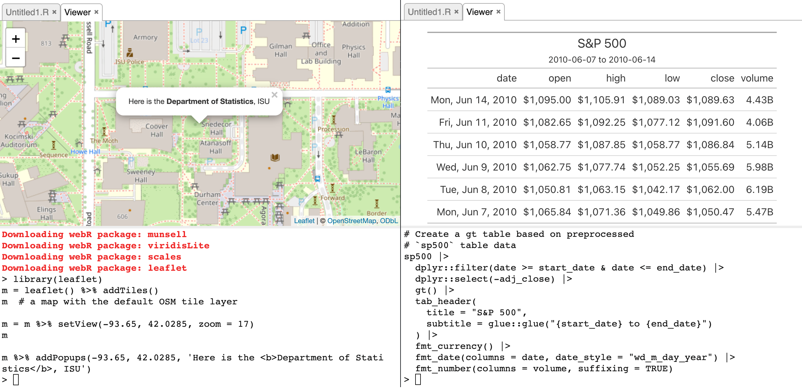
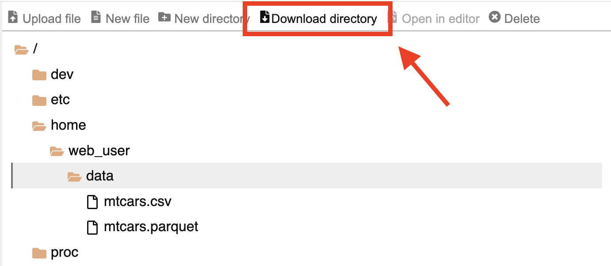
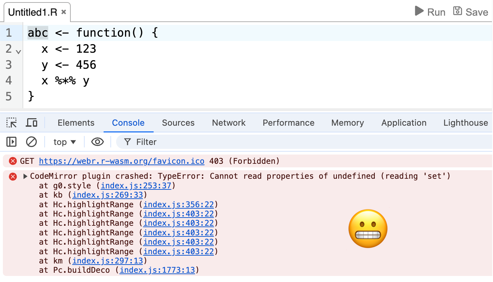
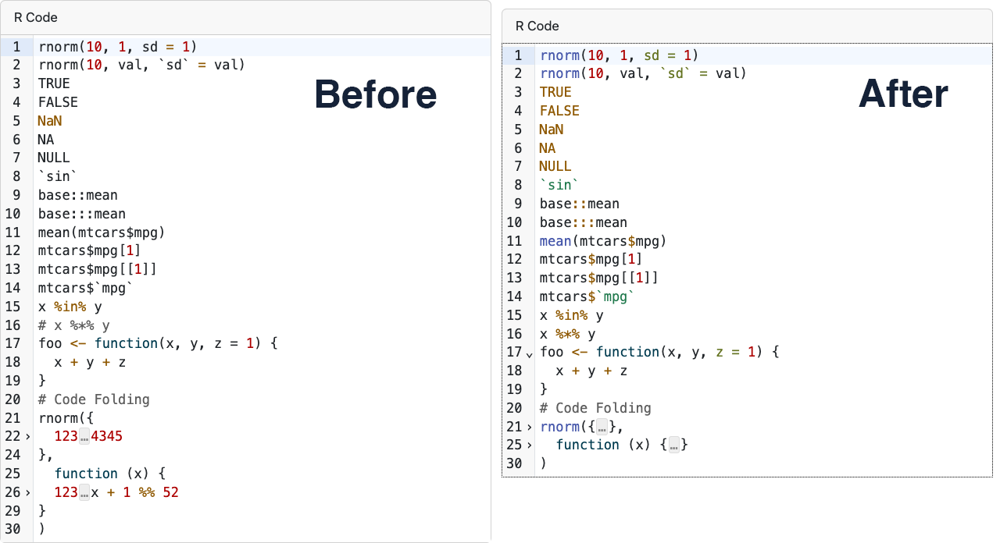

<!--
TODO:
* [x] Look over / edit the post's title in the yaml
* [x] Edit (or delete) the description; note this appears in the Twitter card
* [x] Pick category and tags (see existing with [`hugodown::tidy_show_meta()`](https://rdrr.io/pkg/hugodown/man/use_tidy_post.html))
* [x] Find photo & update yaml metadata
* [x] Create `thumbnail-sq.jpg`; height and width should be equal
* [x] Create `thumbnail-wd.jpg`; width should be >5x height
* [x] [`hugodown::use_tidy_thumbnails()`](https://rdrr.io/pkg/hugodown/man/use_tidy_post.html)
* [x] Add intro sentence, e.g. the standard tagline for the package
* [x] [`usethis::use_tidy_thanks()`](https://usethis.r-lib.org/reference/use_tidy_thanks.html)
-->
<!-- Initialise webR in the page -->

<!-- Add webr engine for knit -->

<div class="highlight">

</div>

<!-- Custom styles for output -->

<div class="highlight">

<style type="text/css">
.output > pre, .output code {
  background-color: #ffffff !important;
  margin-top: -17px;
  border-top-left-radius: 0px;
  border-top-right-radius: 0px;
}

.error > pre, .error code {
  background-color: #fcebeb !important;
  color: #410E0E !important;
}
</style>

</div>

We're totally stoked to announce the release of [webr](https://docs.r-wasm.org/webr/v0.4.2/) 0.4.2!

It's been a little while since I've written about webR here, and a few releases between my last blog post and this one. In this post I'll cover some of the exciting changes to the core webR distribution, and also include some interesting tidbits for JavaScript developers using webR in their own applications. You can see a full list of changes in the [release notes](https://github.com/r-wasm/webr/releases).

This post is the first in an R for WebAssembly roundup series. Subsequent posts will cover updates to Shinylive for R, and introduce new a new Quarto extension that uses the power of webR and WebAssembly to elevate your documents with interactivity.

## Supporting HTML and widget display

The base R distribution may be run using nothing but a text console, but some additional options can be implemented by frontends to provide system-dependent display of content. Previously, we implemented the [`pager`](https://stat.ethz.ch/R-manual/R-devel/library/base/html/file.show.html) option so that R's help system can be better displayed within the [webR application](https://webr.r-wasm.org/latest/). Using the pager we can show R function and package documentation outside of the text console in dedicated tabbed windows.

In recent releases of webR we have expanded our support for such display systems, providing an implementation both for the [`View()`](https://stat.ethz.ch/R-manual/R-devel/library/utils/html/View.html) function and the `viewer` global option used by [htmlwidgets](https://www.htmlwidgets.org/).

This gives us the ability to show a tabular data viewer for `data.frame`-like R objects and an `iframe` based HTML content viewer, enabling dynamic web-based output from R packages like [`leaflet`](https://rstudio.github.io/leaflet/articles/leaflet.html) and [`gt`](https://gt.rstudio.com/).



The implementation of `viewer` is fairly general, making use of webR's [output messages](https://docs.r-wasm.org/webr/latest/communication.html#output-messages) mechanism to send the required information to the main JavaScript thread for display. That way, any application using webR may choose to listen for those messages and how to show the resulting content on the page. We'll make use of this in a later post where I introduce using webR to generate dynamic content in a new Quarto extension.

## Improvements to the webR app UI

Recent webR releases have also made some other quality of life improvements to the webR app. Some minor improvements include making each UI panel resizeable, and offering `.zip` download of an entire directory in the Files panel.



### R source syntax highlighting and parsing

The webR app's code editor is powered by [CodeMirror](https://codemirror.net/) with R parsing provided by the [codemirror-lang-r](https://github.com/TravisYeah/lang-r) package. CodeMirror's extensibility is excellent, and the library is well suited for integrating into a wider project like this. However, we noticed that the `codemirror-lang-r` package had a few issues highlighting certain types of R syntax. In particular, in our application highlighting matrix operations such as `%*%` would crash the parser!



As well as fixing this bug, we've worked to improve the R parser to better support some other types of R syntax and have [contributed these changes upstream](https://github.com/TravisYeah/lezer-r/pull/1) so as to benefit other users of `codemirror-lang-r`.



## WebAssembly R package binary format

One of R's greatest strengths is its vibrant community of R packages and their developers, and so one of the development goals of webR is that packages are downloaded and installed as fast as possible. In the latest release of webR, some joint work with [Jeroen Ooms](https://github.com/jeroen) improving the performance of loading WebAssembly binary R packages has landed.

R packages and other filesystem data is efficiently made available to the R WebAssembly process using [Emscripten's file packager](https://emscripten.org/docs/porting/files/packaging_files.html#packaging-using-the-file-packager-tool) and the [`WORKERFS`](https://emscripten.org/docs/api_reference/Filesystem-API.html#filesystem-api-workerfs) filesystem driver. Previously we used uncompressed filesystem data, with the intention of serving content using [HTTP compression](https://en.wikipedia.org/wiki/HTTP_compression). However, web services do not always compress files automatically[^1], especially if they are large. So, in the latest release of webR, filesystem data may now be mounted from a `gzip` compressed file[^2], and the base R filesystem is also distributed in compressed form.

R package developers might recognise that traditional R package binaries are *already* produced as a `gzip` compressed archive. And, as pointed out to me by Jeroen, the format of a `.tar` archive is very similar to Emscripten's `.data` files. With some [clever arrangement](https://r-wasm.github.io/rwasm/articles/tar-metadata.html) of R package archive data and Emscripten filesystem metadata, pre-processed WebAssembly R package binaries may now be directly mounted to the virtual filesystem by webR.

Mounting R packages in this way is more efficient than installing `.tgz` archives in the usual manner because the decompression step happens in the browser, rather than using R's slower internal routines, and the `WORKERFS` filesystem driver also avoids memory copies with the archive files until they are actually opened and read by the WebAssembly R process.

Both the [webR default repository](repo.r-wasm.org) and [R-Universe](https://r-universe.dev/) now serve binary R packages for WebAssembly in this new format. These packages can be installed and loaded interactively in the webR application, or used as dependencies in a deployed Shinylive for R app. For your own custom R packages, the [rwasm](https://r-wasm.github.io/rwasm/index.html) package can be used to compile WebAssembly binaries using a pre-configured Docker container. However, I'd actually recommend [creating a personal R-Universe repository](https://ropensci.org/blog/2021/06/22/setup-runiverse/) for your packages instead, since this will automatically build binaries for multiple targets including WebAssembly.

A much simpler but effective change has also been made: R packages listed only as `LinkingTo` dependencies are no longer downloaded by webR on package installation. These are packages are required for building an R package from source, but *not at runtime*. The change saves network resources when installing WebAssembly R packages. In one particular worst-case scenario, this change avoided downloading about 100 megabytes of data!

## Virtual file system drivers

A nice side-effect of the work in the previous section is that [mounting filesystem data with `WORKERFS`](https://github.com/r-wasm/webr/issues/328) now also works correctly under Node.js, fixing a fairly painful and long-standing bug for our server-side users of webR.

We've also introduced mounting with Emscripten's [`IDBFS`](https://emscripten.org/docs/api_reference/Filesystem-API.html#filesystem-api-idbfs) filesystem driver when running webR in the browser[^3]. This driver makes use of the low-level [IndexedDB API](https://developer.mozilla.org/en-US/docs/Web/API/IndexedDB_API) provided by the JavaScript environment to write virtual filesystem contents to a form of local storage on the device.

With this, files that have been written to the virtual filesystem can be persisted over page reloads and automatically made available again to the WebAssembly R process when the page is revisited in the future, without needing to re-download the content.

You can try it out right here! Any files written to the `/persist` directory in the interactive R console below should be persisted. The first time you load this page, the directory will be empty. However, if files are written they will remain available after you refresh the page or revisit in the future.

<div class="highlight">

{{< webr-editor code=`install.packages('cli', quiet = TRUE)\n\nfiles <- list.files("/persist")\nfiles\n\nif (length(files) == 0) {\n  cli::cli_alert_warning("No files found in '/persist', I'll create one...")\n  write.csv(mtcars, "/persist/mtcars.csv")\n} else {\n  cli::cli_alert_success("Nice! Some existing files were found in '/persist'.")\n}` width=504 height=311.472 >}}

</div>

It should be noted that filesystem data stored in an IndexedDB database can only be accessed within the same [origin](https://developer.mozilla.org/en-US/docs/Glossary/Origin), essentially across the current web page's domain. Also, browsers may decide the amount of storage space provided, what content is deleted when quotas are reached, and when exactly that deletion occurs. In private browsing mode, for example, data is usually removed when the private session ends.

Even with these caveats, I expect developers working with webR will be able to make use of the `IDBFS` driver to selectively cache content or R packages that are too large to download over the network on every single page load, further improving start up times in their own apps as a result.

## Developing with webR

### Deprecating the `ServiceWorker` channel

The `ServiceWorker` [communication channel](https://docs.r-wasm.org/webr/v0.3.2/communication.html), a method webR offered to handle message passing between the main browser thread and the [JavaScript Web Worker](https://developer.mozilla.org/en-US/docs/Web/API/Web_Workers_API/Using_web_workers) running the R WebAssembly binary, has been deprecated. The communication channel was originally devised as a way to allow use of webR in cases where the `SharedArrayBuffer` API is not available. This includes any use of webR with an origin that is not [Cross-Origin Isolated](https://developer.mozilla.org/en-US/docs/Web/API/Window/crossOriginIsolated), such as when content is hosted by GitHub Pages.

The channel was implemented using a [JavaScript Service Worker](https://developer.mozilla.org/en-US/docs/Web/API/Service_Worker_API) proxy and synchronous [XHR](https://developer.mozilla.org/en-US/docs/Web/API/XMLHttpRequest) requests. Unfortunately, with the overhead of message serialisation and capturing network requests, performance was significantly impacted. The channel was also not compatible with applications that make use of a service worker for genuine network proxy functionality, such as Shinylive.

An alternative method has since been developed in the form of the `PostMessage` communication channel. This instead uses the [JavaScript `PostMessage` API](https://developer.mozilla.org/en-US/docs/Web/API/Worker/postMessage), which is designed to handle communication between workers efficiently. It has much better performance and even provides a way to [transfer objects](https://developer.mozilla.org/en-US/docs/Web/API/Web_Workers_API/Transferable_objects) using zero-copy operations. There are some minor downsides when using the `PostMessage` channel, mostly related to taking input using tools like [`readline()`](https://rdrr.io/r/base/readline.html), or nested REPLs like R's [`browser()`](https://rdrr.io/r/base/browser.html), but for most applications we find that this is not catastrophic and a reasonable price to pay for what is intended as a fallback method.

If you are working on a webR application where [`readline()`](https://rdrr.io/r/base/readline.html) functionality *is absolutely* required, but you cannot set your web server headers to enable cross-origin isolation, an alternative implementation of using a service worker to solve the problem can be found with the [coi-serviceworker](https://github.com/gzuidhof/coi-serviceworker) package. When enabled, the web page will appear to webR to be cross-origin isolated and so `SharedArrayBuffer` can be used. This still has the other drawbacks of requiring a service worker, but will have much better performance than using webR's `ServiceWorker` channel directly.

For these reasons, the `PostMessage` communication channel is now the default fallback when the web page is not cross-origin isolated. The `ServiceWorker` channel will continue to be available in the short-term, if explicitly requested, but will eventually be removed in a future version of webR.

### API additions

We've made some minor changes to the webR JavaScript API. There's nothing ground breaking here, but some new tools that we hope to be useful.

##### Report current version

With the aim of providing functionality similar to the [`R.Version()`](https://rdrr.io/r/base/Version.html) and [`packageVersion()`](https://rdrr.io/r/utils/packageDescription.html) R functions, the version of the currently running webR session may now be obtained from the JavaScript environment.

``` js
> const webR = new WebR();
> webR.version;
// '0.4.3-dev+d1fb4f4'
```

##### Discover an object's class

An R object's [`class()`](https://rdrr.io/r/base/class.html) may be inspected from an `RObject` proxy. The returned value is an `RCharacter` vector of classes from which the object inherits.

``` js
> await webR.evalR("mtcars")
    .then(obj => obj.class())
    .then(cls => cls.toArray());
// ['data.frame']
```

##### Explicitly construct an R `data.frame`

In a previous version of webR, we introduced creating new R `data.frame` objects from JavaScript using the generic `RObject` constructor. WebR will build a `data.frame` for arguments with compatible shape: either an object with named columns, or an array with objects for each row.

``` js
> let source1 = { abc: [1, 2, 3], xyz: [4, 5, 6] };
> await new webR.RObject(source1)
   .then(obj => obj.class())
   .then(cls => cls.toArray());
// ['data.frame']

> let source2 = [ { abc: 1, xyz: 4 }, { abc: 2, xyz: 5 }, { abc: 3, xyz: 6 }];
> await new webR.RObject(source2)
   .then(obj => obj.class())
   .then(cls => cls.toArray());
// ['data.frame']
```

You might ask why not create an R list object by default? The reason is that we expect a common situation to be taking datasets defined in the JavaScript environment and processing them using R. With `data.frame` as the default, JavaScript objects that have been formatted for use with existing JavaScript frameworks can be almost transparently passed to R.

``` js
> penguins;
//  Array(344) [
//  0: { species: 'Adelie', island: 'Torgersen', flipper_length_mm: 181, ... }
//   ... more
// ]
> const sample_mass = await webR.evalR(`
    \\(x) x |> dplyr::sample_n(5) |> dplyr::pull("body_mass_g")
  `);
> await sample_mass(penguins);
// { type: 'double', names: null, values: [3300, 3250, 4000, 4700, 3750] }
```

The generic constructor throws an exception for JavaScript objects that cannot be coerced as a `data.frame`. If you'd prefer to create an R list, you must instead be explicit by using the `RList` constructor,

``` js
> let source = { def: [123, 456], uvw: 'hello' };
> await new webR.RObject(source);
// Uncaught WebRWorkerError: Can't construct `data.frame`. Source object is not eligible.

> let obj = await new webR.RList(source);
> await obj.type();
// 'list'
```

The `RObject` constructor is designed to be a useful default for interactive work at a JavaScript console. However, production applications should be [explicit in the choice of constructor](https://docs.r-wasm.org/webr/latest/api/js/modules/RWorker.html#classes). With this in mind we have added a new class [`RDataFrame`](https://docs.r-wasm.org/webr/latest/api/js/classes/RWorker.RDataFrame.html), a subclass of `RList`, so that users may be explicit in their choice of creating a `data.frame`, rather than relying on the generic `RObject` constructor.

``` js
> let source = { abc: [1, 2, 3], xyz: [4, 5, 6] };
> await new webR.RDataFrame(source)
   .then(obj => obj.class())
   .then(cls => cls.toArray());
// ['data.frame']
```

Now, if your source object is not quite as you expect, rather than continuing silently without error an exception will be thrown. We hope this will reduce the chance of type-related bugs and unexpected behaviour, and aid in debugging when issues do occur.

``` js
// Say we _expect_ a JS object here, but something went wrong...
> let bug = undefined;

> const obj1 = await new webR.RObject(bug);
// [No error and webR silently continues with an unexpected R object]

> const obj2 = await new webR.RDataFrame(bug);
// Uncaught WebRWorkerError: Can't construct `data.frame`. Source object is not eligible.
```

## Acknowledgements

Special thanks to [@jeroen](https://github.com/jeroen), for helpful conversations when it comes to packaging for webR. And thank you, as always, to the users and developers contributing to webR in the form of discussion, bug reports, and pull requests.

[@027xiguapi](https://github.com/027xiguapi), [@adrianolszewski](https://github.com/adrianolszewski), [@alekrutkowski](https://github.com/alekrutkowski), [@andrjohns](https://github.com/andrjohns), [@baogorek](https://github.com/baogorek), [@bugzpodder](https://github.com/bugzpodder), [@christianp](https://github.com/christianp), [@coatless](https://github.com/coatless), [@codingthemystery](https://github.com/codingthemystery), [@ColinFay](https://github.com/ColinFay), [@derrickstaten](https://github.com/derrickstaten), [@dipterix](https://github.com/dipterix), [@EduardBel](https://github.com/EduardBel), [@gregvolny](https://github.com/gregvolny), [@guillaumechaumet](https://github.com/guillaumechaumet), [@gyanaranjans](https://github.com/gyanaranjans), [@helgasoft](https://github.com/helgasoft), [@HenrikBengtsson](https://github.com/HenrikBengtsson), [@isbool](https://github.com/isbool), [@JosiahParry](https://github.com/JosiahParry), [@luisDVA](https://github.com/luisDVA), [@minhaj57sorder](https://github.com/minhaj57sorder), [@olivroy](https://github.com/olivroy), [@oranwutang](https://github.com/oranwutang), [@pawelru](https://github.com/pawelru), [@psychemedia](https://github.com/psychemedia), [@rainer-rq-koelle](https://github.com/rainer-rq-koelle), [@richarddmorey](https://github.com/richarddmorey), [@richardjtelford](https://github.com/richardjtelford), [@seanbirchall](https://github.com/seanbirchall), [@shalom-lab](https://github.com/shalom-lab), [@StaffanBetner](https://github.com/StaffanBetner), [@stobor827](https://github.com/stobor827), [@SugarRayLua](https://github.com/SugarRayLua), [@tavosansal](https://github.com/tavosansal), [@thomascwells](https://github.com/thomascwells), [@timelyportfolio](https://github.com/timelyportfolio), and [@zpinocchio](https://github.com/zpinocchio).

[^1]: It depends a lot on how the hosting service has configured their production web server and the files themselves; both size and content type can make a difference to behaviour. Some services allow for pre-compressed content, while others do not. The [AWS CloudFront documentation](https://docs.aws.amazon.com/AmazonCloudFront/latest/DeveloperGuide/ServingCompressedFiles.html) gives a good overview of how this all fits together.

[^2]: Emscripten's `file_packager` tool also supports built-in `LZ4` compression with the `--lz4` flag. While generally useful for bundling files for WebAssembly applications, we avoid using this feature since it writes important data to a `.js` output file that must be executed. Ideally, we'd prefer our package loading mechanism to only require a single file download, similar to traditional R package archives.

[^3]: Note that currently users wanting to make use of `IDBFS` mounting must configure webR to use the [`PostMessage` Communication Channel](https://docs.r-wasm.org/webr/latest/communication.html).

