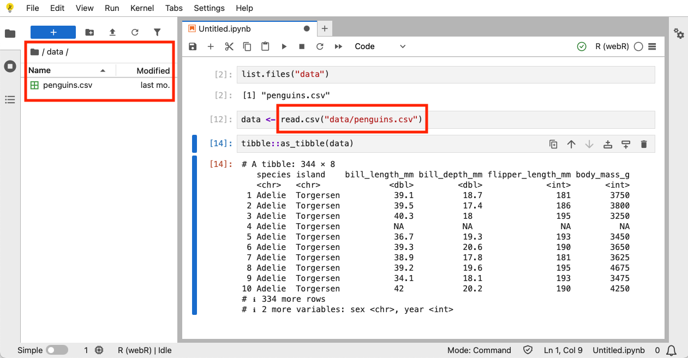
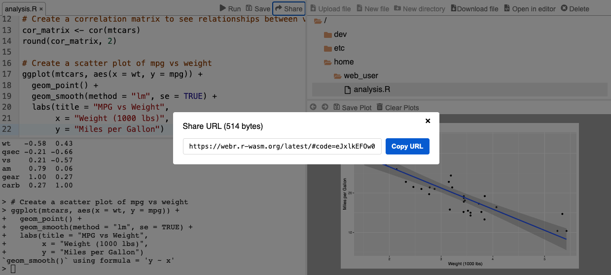

<!--
TODO:
* [x] Look over / edit the post's title in the yaml
* [x] Edit (or delete) the description; note this appears in the Twitter card
* [x] Pick category and tags (see existing with [`hugodown::tidy_show_meta()`](https://rdrr.io/pkg/hugodown/man/use_tidy_post.html))
* [x] Find photo & update yaml metadata
* [x] Create `thumbnail-sq.jpg`; height and width should be equal
* [x] Create `thumbnail-wd.jpg`; width should be >5x height
* [x] [`hugodown::use_tidy_thumbnails()`](https://rdrr.io/pkg/hugodown/man/use_tidy_post.html)
* [x] Add intro sentence, e.g. the standard tagline for the package
* [x] [`usethis::use_tidy_thanks()`](https://usethis.r-lib.org/reference/use_tidy_thanks.html)
-->

We're extremely pleased to announce the release of [webR](https://docs.r-wasm.org/webr/v0.5.4/) 0.5.4. WebR brings R to the web browser using WebAssembly, powering [Quarto Live](https://r-wasm.github.io/quarto-live/), [Shinylive](https://shinylive.io/r/examples/), and other interactive websites with client-side R sessions.

This post highlights some key changes in recent webR releases. We've updated to R 4.5.1, upgraded the Emscripten version, implemented shareable URLs in the webR application, and added filesystem support for JupyterLite. For a complete list of changes, see the [GitHub release notes](https://github.com/r-wasm/webr/releases).

## R and Emscripten upgrades

Our WebAssembly compiled version of R is now up to date with R 4.5.1, ensuring that we have access to all the latest R core improvements and bug fixes. Under the hood, we've also upgraded Emscripten to version 4.0.8 and updated the version of LLVM we use to compile Fortran sources to 20.1.4.

Emscripten serves as the crucial layer between the web browser and R's source code, playing a role similar to an operating system. Upgrading Emscripten and LLVM ensures we're taking advantage of the latest WebAssembly features provided by both projects.

## JupyterLite filesystem support

The [webR JupyterLite kernel](https://pypi.org/project/jupyterlite-webr/) now targets the latest JupyterLite 0.6 series. An exciting improvement is the addition of a virtual filesystem driver designed specifically for use with JupyterLite. Files uploaded to JupyterLite's filesystem are now accessible to webR, and conversely, files created by webR can now be downloaded through the JupyterLite web interface.

To try out these new features, visit <https://jupyter.r-wasm.org>, which has been upgraded to include both the latest version of JupyterLite and our webR kernel.

## Sharing URLs in the webR application

The webR application has been updated to support URL-based sharing. When you edit and save your files using the online editor, the application automatically updates the page URL to encode the current state of all open files.

Copy and share the URL with colleagues and they'll be able to see exactly what you're working on, providing an effortless way to share R code examples.

Try it out for yourself! <a href="https://webr.r-wasm.org/latest/#code=eJxNUDtOw0AQFa1PMVqatbCSADUFihIaaKCgjMabsb1i12vtTnBMywm4QxpukAtwL9bx8qlGmveZee%2Fj%2FdCipU%2Fao%2B0MzR4PHXJznDfO0ryncrML5Od%2F6BYZv86Oug2Mxsw6VC9YU5Cirjvj%2BErkmdGlRz%2FItMmz7ByWnpAJEIJCZvIwQuAqsF0Nr2EGPem64QJ6zQ0oZ5yHcgA1GN1uyWeTl7Ss0IcCMF7cww30UTHEGV2KpLqBChU7L6M2z3O4yABqcnbTOd2yDPqNIuf6HxCsc9xIS9y4bcSEsaKAMNLWt%2FdPq4lqsAwyTgDWbEZQLNHD8%2BnvU4T1jgysqkorTa0aRHFih135K1h7Z4EbgikHjGUG4sQcA4nkJy8XiwWYMuQJHFOKB20oQBfru4vluzZhP8HFMtUVRNxPb8drljZWt9qikfk37j%2Bfgw%3D%3D&a" target="_blank">This link</a> will open the webR application with a pre-loaded example R script.

## Changes for web developers

### Returning JavaScript objects to R

The `eval_js()` function has been enhanced and can now return a wider variety of R object types beyond scalar integers.

<!-- This output is pre-rendered because webr::eval_js() runs only under Emscripten -->

<pre class='chroma'><code class='language-r' data-lang='r'># Previously, only integers could be returned
webr::eval_js("1729")
#&gt; [1] 1729

# Now, structured outputs can be returned 
df &lt;- webr::eval_js("(&#123;foo: [1,2,3], bar: [4,5,6], baz: ['a', 'b', 'c']&#125;)")
<a href='https://rdrr.io/r/base/class.html'>class</a>(df)
#&gt; [1] "data.frame"
df
#&gt;   foo bar baz
#&gt; 1   1   4   a
#&gt; 2   2   5   b
#&gt; 3   3   6   c
</code></pre>

By default JavaScript objects are converted to R data frames, matching the existing behaviour of [Quarto Live](https://r-wasm.github.io/quarto-live/) when sharing data between OJS and R, but you can also use [R object constructors](https://docs.r-wasm.org/webr/latest/api/js/modules/RWorker.html#classes) for more control over the conversion process.

In addition, the `RList` constructor now recursively converts JavaScript objects into R lists, rather than just the outer object only. This is usually what we want when working with complex nested structures.

<!-- This output is pre-rendered because webr::eval_js() runs only under Emscripten -->

<pre class='chroma'><code class='language-r' data-lang='r'># The inner object `baz` is now converted into a nested R list
webr::<a href='https://rdrr.io/pkg/webr/man/eval_js.html'>eval_js</a>("new RList(&#123;foo: 123, bar: ['a', 'z'], baz: &#123;x: 2, y: [7, 1, 8]&#125;&#125;)")
#&gt; $foo
#&gt; [1] 123
#&gt; 
#&gt; $bar
#&gt; [1] "a" "z"
#&gt; 
#&gt; $baz
#&gt; $baz$x
#&gt; [1] 2
#&gt; 
#&gt; $baz$y
#&gt; [1] 7 1 8
</code></pre>

### Filesystem API

Filesystem errors now provide more specific information. Instead of a simple generic `"FS Error"` message, you'll also see `"ErrnoError: n"` where `n` is the actual error number as returned by the [Emscripten Filesystem API](https://emscripten.org/docs/api_reference/Filesystem-API.html), making debugging easier.

We've also exposed some additional Emscripten filesystem API functions on the [`WebR.FS` JavaScript interface](https://docs.r-wasm.org/webr/latest/api/js/classes/WebR.WebR.html#fs), so that they can be accessed from the webR main thread.

## Acknowledgements

Thank you, as always, to the users and developers contributing to webR in the form of discussion in issues, bug reports, and pull requests.

[@agmath](https://github.com/agmath), [@aixnr](https://github.com/aixnr), [@ajostel](https://github.com/ajostel), [@allefeld](https://github.com/allefeld), [@baogorek](https://github.com/baogorek), [@christianp](https://github.com/christianp), [@dipterix](https://github.com/dipterix), [@Dual-Ice](https://github.com/Dual-Ice), [@durraniu](https://github.com/durraniu), [@dusadrian](https://github.com/dusadrian), [@econstar](https://github.com/econstar), [@EduardBel](https://github.com/EduardBel), [@eitsupi](https://github.com/eitsupi), [@gergness](https://github.com/gergness), [@gregvolny](https://github.com/gregvolny), [@H4x0rcr4x](https://github.com/H4x0rcr4x), [@Hasnep](https://github.com/Hasnep), [@holtzy](https://github.com/holtzy), [@JeremyPasco](https://github.com/JeremyPasco), [@jeroen](https://github.com/jeroen), [@jgf5013](https://github.com/jgf5013), [@jmbo1190](https://github.com/jmbo1190), [@Josselyn142](https://github.com/Josselyn142), [@jrosell](https://github.com/jrosell), [@kwgish](https://github.com/kwgish), [@lauralambert99](https://github.com/lauralambert99), [@madhur-tandon](https://github.com/madhur-tandon), [@manojkumaryejjala](https://github.com/manojkumaryejjala), [@manuelgirbal](https://github.com/manuelgirbal), [@perhurt](https://github.com/perhurt), [@psychemedia](https://github.com/psychemedia), [@Quantilogy](https://github.com/Quantilogy), [@richarddmorey](https://github.com/richarddmorey), [@schloerke](https://github.com/schloerke), [@sn248](https://github.com/sn248), [@vsk-1167](https://github.com/vsk-1167), [@wch](https://github.com/wch), [@yhm-amber](https://github.com/yhm-amber), and [@zpinocchio](https://github.com/zpinocchio).

