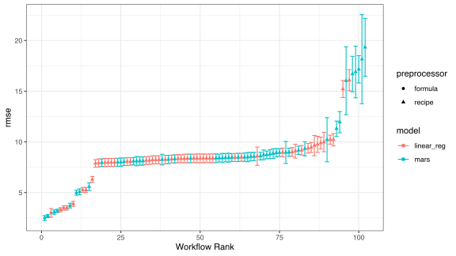
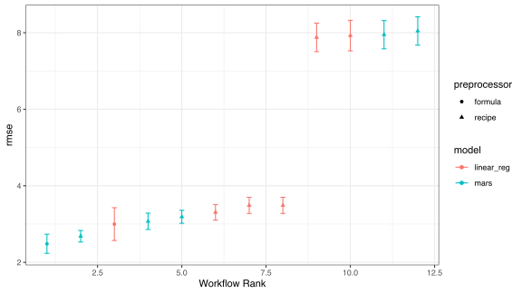
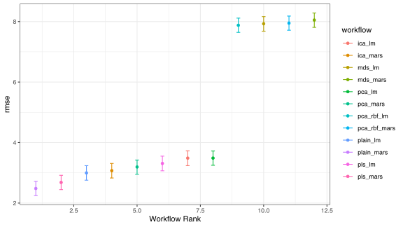
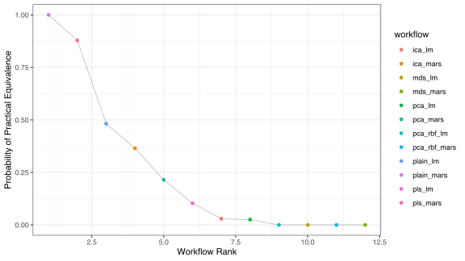

We're well pleased to announce the first release of [workflowsets](https://workflowsets.tidymodels.org). workflowsets  creates a collection of model/preprocessor combinations at once. This enables users to quickly screen a wide variety of methodologies for their data sets. 

You can install it from CRAN with:


```r
install.packages("workflowsets")
```

In this blog post, we'll demonstrate the utility of the package using a dimension reduction example. A new version of the tidyposterior package is paired with workflowsets and we'll also show how they can work together. 

The examples below will use a few of the tidymodels packages. If these are unfamiliar, take a look at [`tidymodels.org`](https://www.tidymodels.org/) or the _Tidy Models with R_ [website](https://www.tmwr.org). 

## A Dimension Reduction Example

When a data set is very wide (i.e., many columns), a dimension reduction procedure may be able to represent the data as a smaller subset of new, artificial variables. The most common method for dimensional reduction is principal component analysis (PCA) but there are many others. [Kuhn and Johnson (2018)](https://bookdown.org/max/FES/numeric-many-to-many.html#linear-projection-methods) give an overview of several other techniques that will be used below. 


There are at least two practical uses of dimension reduction: 

* When assessing the quality of the data, it may be difficult to view it in high dimensions. Reducing the number of columns to a more manageable set helps the user understand and identify problematic data points. 

* Some models are less effective with a large number of predictors (relative to the number of data points). This is especially true when the predictors have a high degree of correlation with one another (e.g., multicolinearity). 

As an example, the [Tecator data](https://modeldata.tidymodels.org/reference/meats.html) set uses spectrography to predict the percentage of fat, protein, and water in meat samples. They measured 100 channels of the spectum for 215 samples. The _average_ correlation between predictors is 98.6%. These data might greatly benefit from dimension reduction. We'll evaluate a few different approaches to find a smaller representation of the predictors when the _percentage of water_ is being predicted. 

We'll load the packages and data, then define a resampling scheme that is used to evaluate the models.


```r
library(tidymodels)
library(workflowsets)
library(tidyposterior)

data(meats, package= "modeldata")

# Keep only the water outcome
meats <- select(meats, -fat, -protein)

set.seed(1)
meat_split <- initial_split(meats)
meat_train <- training(meat_split)
meat_test <- testing(meat_split)

set.seed(2)
meat_folds <- vfold_cv(meat_train, repeats = 3)
```

Workflow sets take a set of **preprocessors** and **models** and combinatorially combine them into a series of workflow objects. The package has some nice convenience functions to tune and/or evaluate each workflow. 

What is a "preprocessor"? That can be one of three things: 

 1. A traditional R model formula.
 1. A recipe.
 1. A specification of column names (using [`workflows::workflow_variables()`](https://workflows.tidymodels.org//reference/add_variables.html)). 

As an example, we'll create a set of recipes for dimension reduction for preprocessing the data along with a simple formula. 

The dimension reduction methods that we'll try are a few different flavors of PCA, partial least squares (PLS), independent component analysis (ICA), and multi-dimensional scaling (MDS). With the exception of PLS, these are unsupervised procedures since they do not take into account the outcome data. 


```r
base_recipe <- 
  recipe(water ~ ., data = meat_train) %>% 
  step_zv(all_predictors()) %>% 
  step_YeoJohnson(all_predictors()) %>% 
  step_normalize(all_predictors())

pca_recipe <- 
  base_recipe %>% 
  step_pca(all_predictors(), num_comp = tune())

pca_kernel_recipe <- 
  base_recipe %>% 
  step_kpca_rbf(all_predictors(), num_comp = tune(), sigma = tune())

pls_recipe <- 
  base_recipe %>% 
  step_pls(all_predictors(), outcome = vars(water), num_comp = tune())

ica_recipe <- 
  base_recipe %>% 
  step_ica(all_predictors(), num_comp = tune())

mds_recipe <-
  base_recipe %>%
  step_isomap(
    all_predictors(),
    num_terms = tune(),
    neighbors = tune()
  )
```

Note that several methods have tuning parameters that need to be optimized. For our application, we'll feed the new features into a model and use the root mean squared error (RMSE) as the metric to determine good values of these parameters. 

The input into a workflow set is a named list of preprocessors and parsnip model specifications. We'll could the [parsnip RStudio add-in](https://parsnip.tidymodels.org/reference/parsnip_addin.html) to write out the model code. Linear regression and multivariate adaptive regression spline (MARS) models will be combined with the different preprocessors. 


```r
lm_spec <- linear_reg() %>% set_engine("lm")
mars_spec <- mars() %>% set_engine("earth") %>% set_mode("regression")
```

Finally, to make the workflow set, named lists are created and given as inputs into [`workflow_set()`](https://workflowsets.tidymodels.org/reference/workflow_set.html). Note that we added the original data as-is using a "plain" R formula. 


```r
preprocessors <-
  list(
    plain = water ~ .,
    pca = pca_recipe,
    pca_rbf = pca_kernel_recipe,
    pls = pls_recipe,
    ica = ica_recipe,
    mds = mds_recipe
  )

models <- list(lm = lm_spec, mars = mars_spec)

meat_wflow_set <- workflow_set(preprocessors, models, cross = TRUE)
meat_wflow_set
```

```
## # A workflow set/tibble: 12 x 4
##    wflow_id     info                 option    result    
##    <chr>        <list>               <list>    <list>    
##  1 plain_lm     <tibble[,4] [1 × 4]> <opts[0]> <list [0]>
##  2 plain_mars   <tibble[,4] [1 × 4]> <opts[0]> <list [0]>
##  3 pca_lm       <tibble[,4] [1 × 4]> <opts[0]> <list [0]>
##  4 pca_mars     <tibble[,4] [1 × 4]> <opts[0]> <list [0]>
##  5 pca_rbf_lm   <tibble[,4] [1 × 4]> <opts[0]> <list [0]>
##  6 pca_rbf_mars <tibble[,4] [1 × 4]> <opts[0]> <list [0]>
##  7 pls_lm       <tibble[,4] [1 × 4]> <opts[0]> <list [0]>
##  8 pls_mars     <tibble[,4] [1 × 4]> <opts[0]> <list [0]>
##  9 ica_lm       <tibble[,4] [1 × 4]> <opts[0]> <list [0]>
## 10 ica_mars     <tibble[,4] [1 × 4]> <opts[0]> <list [0]>
## 11 mds_lm       <tibble[,4] [1 × 4]> <opts[0]> <list [0]>
## 12 mds_mars     <tibble[,4] [1 × 4]> <opts[0]> <list [0]>
```

The 12 rows are the different combinations of preprocessors and models.  As will be shown below, we can evaluate them via resampling using the [`workflow_map()`](https://workflowsets.tidymodels.org/reference/workflow_map.html) function. 

However, a few of these recipes have tuning parameters that are somewhat difficult to optimize. We might want to have specific tuning parameter ranges for the kernel PCA and MDS recipes. We can accomplish that in the usual way (via `parameters()` and `update()`) then update the workflow set with these options so that they are used later. 


```r
mds_param <- 
  mds_recipe %>% 
  parameters() %>%
  # Look at a larger neighbor size than the default range. 
  update(neighbors = neighbors(c(20, 70)))

rbf_param <- 
  pca_kernel_recipe %>% 
  parameters() %>%
  # A smaller range than the default.
  update(sigma = rbf_sigma(c(-5, 0)))
```

The [`option_add()`](https://workflowsets.tidymodels.org/reference/option_add.html) function can add these to the `option` column in the workflow set for the appropriate workflows: 


```r
meat_wflow_set <- 
  meat_wflow_set %>% 
  option_add(param_info = rbf_param, id = "pca_rbf_lm")  %>% 
  option_add(param_info = rbf_param, id = "pca_rbf_mars") %>% 
  option_add(param_info = mds_param, id = "mds_lm") %>% 
  option_add(param_info = mds_param, id = "mds_mars")
meat_wflow_set
```

```
## # A workflow set/tibble: 12 x 4
##    wflow_id     info                 option    result    
##    <chr>        <list>               <list>    <list>    
##  1 plain_lm     <tibble[,4] [1 × 4]> <opts[0]> <list [0]>
##  2 plain_mars   <tibble[,4] [1 × 4]> <opts[0]> <list [0]>
##  3 pca_lm       <tibble[,4] [1 × 4]> <opts[0]> <list [0]>
##  4 pca_mars     <tibble[,4] [1 × 4]> <opts[0]> <list [0]>
##  5 pca_rbf_lm   <tibble[,4] [1 × 4]> <opts[1]> <list [0]>
##  6 pca_rbf_mars <tibble[,4] [1 × 4]> <opts[1]> <list [0]>
##  7 pls_lm       <tibble[,4] [1 × 4]> <opts[0]> <list [0]>
##  8 pls_mars     <tibble[,4] [1 × 4]> <opts[0]> <list [0]>
##  9 ica_lm       <tibble[,4] [1 × 4]> <opts[0]> <list [0]>
## 10 ica_mars     <tibble[,4] [1 × 4]> <opts[0]> <list [0]>
## 11 mds_lm       <tibble[,4] [1 × 4]> <opts[1]> <list [0]>
## 12 mds_mars     <tibble[,4] [1 × 4]> <opts[1]> <list [0]>
```

Note that some of the entries in the `option` column have changed to `<opts[1]>`. 

We can finally tune these models using `workflow_map()`. By default, it uses a basic grid search but any evaluation function from the `tune` and `finetune` packages can be used. We'll also pass more global options here for the resamples, grid points, and performance metric. The `seed` option resets the random number seed for each pass through the workflow set so that the results are reproducible. 


```r
meat_wflow_set <-
  meat_wflow_set %>%
  workflow_map(
    # Options to `tune_grid()`
    resamples = meat_folds,
    grid = 20,
    metrics = metric_set(rmse),
    # Options to `workflow_map()`
    seed = 3,
    verbose = TRUE
  )
meat_wflow_set
```
```
i	No tuning parameters. `fit_resamples()` will be attempted
i  1 of 12 resampling: plain_lm
✓  1 of 12 resampling: plain_lm (2.3s)
i	No tuning parameters. `fit_resamples()` will be attempted
i  2 of 12 resampling: plain_mars
✓  2 of 12 resampling: plain_mars (2.6s)
i  3 of 12 tuning:     pca_lm
✓  3 of 12 tuning:     pca_lm (8.1s)
i  4 of 12 tuning:     pca_mars
✓  4 of 12 tuning:     pca_mars (8.4s)
i  5 of 12 tuning:     pca_rbf_lm
✓  5 of 12 tuning:     pca_rbf_lm (36.9s)
i  6 of 12 tuning:     pca_rbf_mars
✓  6 of 12 tuning:     pca_rbf_mars (34.1s)
i  7 of 12 tuning:     pls_lm
✓  7 of 12 tuning:     pls_lm (8.6s)
i  8 of 12 tuning:     pls_mars
✓  8 of 12 tuning:     pls_mars (8.6s)
i  9 of 12 tuning:     ica_lm
✓  9 of 12 tuning:     ica_lm (8.4s)
i 10 of 12 tuning:     ica_mars
✓ 10 of 12 tuning:     ica_mars (8.4s)
i 11 of 12 tuning:     mds_lm
✓ 11 of 12 tuning:     mds_lm (39.3s)
i 12 of 12 tuning:     mds_mars
✓ 12 of 12 tuning:     mds_mars (40s)
```


The `result` column contains the results of `tune_grid()` (or `fit_resamples()` for the "plain" models). 

There are a few convenience functions for ranking the results. To get the rankings of the models (and their tuning parameter sub-models) as a data frame: 


```r
rank_results(meat_wflow_set) %>% 
  # To fit on the page:
  select(-.metric, -std_err, -n) %>% 
  relocate(rank, mean)
```

```
## # A tibble: 102 x 6
##     rank  mean wflow_id   .config              preprocessor model     
##    <int> <dbl> <chr>      <chr>                <chr>        <chr>     
##  1     1  2.48 plain_mars Preprocessor1_Model1 formula      mars      
##  2     2  2.68 pls_mars   Preprocessor3_Model1 recipe       mars      
##  3     3  3.00 plain_lm   Preprocessor1_Model1 formula      linear_reg
##  4     4  3.07 ica_mars   Preprocessor3_Model1 recipe       mars      
##  5     5  3.19 pca_mars   Preprocessor3_Model1 recipe       mars      
##  6     6  3.31 pls_lm     Preprocessor3_Model1 recipe       linear_reg
##  7     7  3.49 ica_lm     Preprocessor3_Model1 recipe       linear_reg
##  8     8  3.49 pca_lm     Preprocessor3_Model1 recipe       linear_reg
##  9     9  3.72 pls_mars   Preprocessor1_Model1 recipe       mars      
## 10    10  3.89 pls_lm     Preprocessor1_Model1 recipe       linear_reg
## # … with 92 more rows
```

or as a plot:


```r
autoplot(meat_wflow_set)
```


 
This shows the results for all tuning parameter combinations for each model. To get the best results _per model_:


```r
autoplot(meat_wflow_set, select_best = TRUE)
```



It seems like the MARS model is doing slightly better than ordinary linear regression. The original predictors do well in terms of the mean RMSE. However, the correlation between predictors can cause instability in the results and this is reflected in the larger error bars for those models; reducing the dimensions may still be a good idea. 

Once you decide on a model to keep, you can pull the workflow (or the tuning results) using [`pull_workflow()`](https://workflowsets.tidymodels.org/reference/pull_workflow_set_result.html) (or `pull_workflow_set_result()`). This can be finalized and fit on the training set as one normally would. 

## Contrasting Models Using Bayesian Analysis


Is there really a difference between the `plain_mars` and `pls_mars` models? The [tidyposterior package can help answer this question](https://www.tmwr.org/compare.html). We can fit a meta-model for the RMSE results for the best configuration within each model using the `perf_mod()` function: 


```r
rmse_mod <-
  perf_mod(
    meat_wflow_set,
    # Model different variability per workflow:
    hetero_var = TRUE,
    # Options to `rstanarm::stan_glm()`
    seed = 4,
    iter = 5000,
    refresh = 0
  )
```

The `autoplot()` method for these results are a **model-based** version of the previous `autoplot()` results for the workflow set: 


```r
autoplot(rmse_mod)
```



The tidyposterior package enables the user to look at _practical significance_ that incorporates an effect size that is important to the user. We usually set this value prior to the analysis. It reflects the size of a RMSE change between models that is a realistic difference (this is obviously subjective). We can compute the probability that each model is _practically significant_ when compared to the numerically best model. Recall that the outcome is in units of percent water. We'll use a 0.5% difference as an effect size: 


```r
autoplot(rmse_mod, size = 0.5, type = "ROPE")
```



The top two models are pretty practically equivalent while the others are less likely to be considered the same. 

## Acknowledgements

Thanks to the contributors to workflowsets: 

[&#x0040;DavisVaughan](https://github.com/DavisVaughan), [&#x0040;hfrick](https://github.com/hfrick), [&#x0040;hnagaty](https://github.com/hnagaty), [&#x0040;juliasilge](https://github.com/juliasilge), and [&#x0040;topepo](https://github.com/topepo)

as well as the latest release of tidyposterior:

[&#x0040;hfrick](https://github.com/hfrick), [&#x0040;juliasilge](https://github.com/juliasilge), [&#x0040;robyjos](https://github.com/robyjos), and [&#x0040;topepo](https://github.com/topepo)

